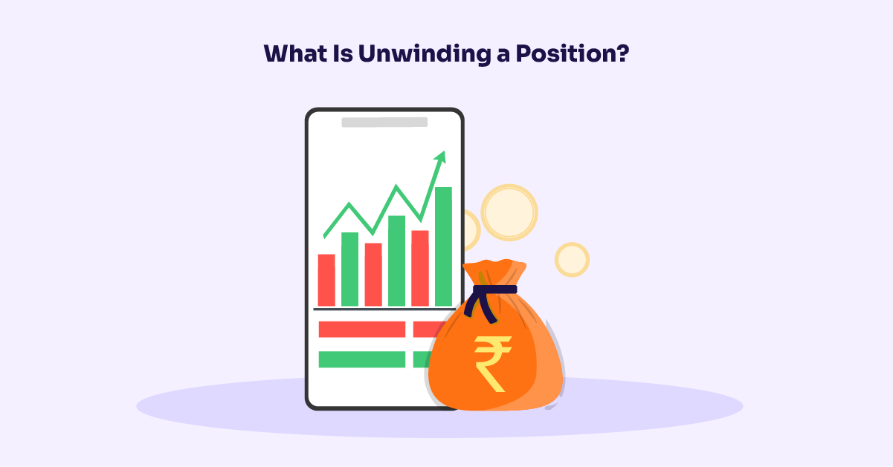

The financial markets present a diverse array of opportunities for participants. Whether an individual is new to trading or an experienced investor, successfully navigating these markets requires employing sound strategies and possessing a deep understanding of market mechanics. This article focuses on financial unwinding, closing a position, investment strategies, and algorithmic trading—all crucial components for traders seeking to optimize their market interactions.

Financial unwinding is a process that involves methodically concluding investment positions, particularly those that are large or complex. It is more than just realizing profits or curtailing losses; unwinding also plays a significant role in correcting errors and mitigating market risks. As financial markets grow increasingly complicated, the ability to unwind strategically becomes more important for traders.



Closing a position, a vital activity in trading, entails eliminating exposure to a particular market risk. This can be done through various strategies, which may be employed for different reasons, such as realizing a profit, minimizing a loss, or aligning with broader portfolio objectives. Market conditions, associated costs, and timing are key factors that traders must consider when closing positions.

Investment strategies guide how traders navigate financial markets, determining when and how positions should be opened and closed. These strategies are diverse and may range from fixed threshold methods to those based on technical indicators. Effective risk management, incorporating stop-loss and take-profit orders, is integral to these strategies, helping traders manage potential market downturns.

Algorithmic trading has revolutionized the way traders execute their strategies, leveraging pre-programmed rules to facilitate trading with unparalleled precision and speed. By reducing human errors and emotional biases, algorithmic trading improves the effectiveness of strategy execution. Algorithms, often equipped with machine learning capabilities, are also able to adapt to shifting market conditions, enhancing decision-making processes.

Understanding these elements of financial trading not only improves a trader's chance of success but also helps in managing risks. Traders who can merge traditional strategies with advanced algorithmic tools are more likely to yield optimal results. As we explore these key areas, the role of algorithmic trading in contemporary trading environments becomes clear, providing a glimpse into the future of financial markets.

## Table of Contents

## Understanding Financial Unwinding

Financial unwinding involves closing out investment positions in a methodical and strategic manner. This process is particularly critical for large or complex trades, requiring a sequence of transactions to mitigate potential market disruptions and price impacts. Unwinding is not solely about realizing financial gains or losses; it also plays a crucial role in correcting errors that may have occurred during trading and managing the inherent risks associated with market exposure.

In a practical sense, the process of financial unwinding may involve the sale of held assets or the repurchase of shorted securities. For instance, an investor who anticipates the decline of a stock's price might short-sell the security. To unwind this position, the investor would buy back the stock when the price drops, thereby closing the short position and hopefully realizing a profit. Conversely, if the market moves against the position, timely unwinding can curtail further losses.

Complex trades, such as those involving derivatives or structured products, require even more nuanced unwinding strategies. These strategies might involve decomposing the trade into smaller, manageable parts and executing them over time to minimize adverse market reactions. Moreover, traders must consider factors such as [liquidity](/wiki/liquidity-risk-premium), [volatility](/wiki/volatility-trading-strategies), and transaction costs, as these can significantly influence the effectiveness and cost of unwinding.

The strategic nature of financial unwinding cannot be overstated, as improper or delayed execution can exacerbate losses or expose the trader to unwanted risks. An effective unwinding approach considers both the tactical aspects of individual trade closures and the broader strategic implications for the entire portfolio. As such, understanding the mechanics and implications of unwinding is essential for managing trading activities prudently and effectively.

## Closing a Position: Strategies and Considerations

Closing a position is a fundamental trading activity that is essential for effectively managing and eliminating exposure to market risk. This process involves various strategies, each tailored to achieve specific financial objectives. Key strategies include selling long positions and buying back assets that were initially sold short. These actions are not purely mechanical; they require careful consideration of several pivotal factors to optimize outcomes.

One primary reason for closing a position is profit realization. Traders may decide to liquidate positions to lock in gains. Conversely, closing a position can also serve to curtail losses, particularly when market movements oppose the trader's initial expectations. This forms part of a broader portfolio strategy, whereby traders continuously adjust their holdings to align with investment goals and risk tolerance.

Market conditions play a critical role in this decision-making process. Traders must evaluate factors such as volatility, liquidity, and underlying trends. During periods of high volatility, for instance, the timing of closing a position can significantly impact the realized value of the trade. Market liquidity also influences the ability to execute transactions smoothly without adversely affecting asset prices.

Transaction costs are another vital consideration. These costs, which encompass brokerage fees, taxes, and the bid-ask spread, can erode trading profits or exacerbate losses. Therefore, traders must assess whether the anticipated benefits of closing a position outweigh the associated costs. Efficient trade execution becomes paramount in minimizing these expenses and thereby maximizing net returns.

Timing is an additional element that requires strategic deliberation. Traders often use technical analysis and market indicators to determine optimal [exit](/wiki/exit-strategy) points. The use of stop-loss and take-profit orders provides a systematic approach to mitigating risk and securing profits. For instance, a stop-loss order automatically triggers a sale when prices fall below a predefined level, helping to prevent substantial losses.

In summary, closing a position should be aligned with an investor's overall strategy and informed by comprehensive analysis of market conditions, costs, and timing. Employing a nuanced approach to closing positions allows traders to enhance their financial performance and effectively manage market risks.

## Investment Strategies in Financial Markets

Investment strategies are essential for effectively navigating financial markets, dictating decisions on when to open and close positions. These strategies can be broadly categorized into several types, each with its distinct approach and application.

One common strategy is the fixed threshold method, where traders establish predetermined price levels at which they will either enter or exit a position. This method is straightforward and helps in maintaining discipline in trading, preventing emotional decision-making.

Trailing stops are another popular strategy, providing a dynamic approach to risk management. Unlike fixed thresholds, trailing stops allow for a flexible exit strategy by setting a stop order that adjusts with the market price. As the market moves in the trader's favor, the trailing stop moves accordingly, thus locking in profits while still capitalizing on potential gains.

Technical indicator-based approaches are also widely utilized. These strategies employ mathematical calculations based on historical price data to forecast future market movements. Some commonly used indicators include moving averages, Relative Strength Index (RSI), and MACD (Moving Average Convergence Divergence). These tools help traders identify trends, [momentum](/wiki/momentum), and potential reversal points in the market.

Risk management is a crucial component of any investment strategy. Stop-loss orders are designed to limit potential losses by automatically closing a position once the market reaches a specified unfavorable level. Conversely, take-profit orders lock in gains by closing a position when a favorable price target is reached. These tools are essential for protecting capital and ensuring a consistent trading approach.

Algorithmic strategies have revolutionized investment strategies, significantly enhancing precision and efficiency. Algorithms execute trades based on pre-determined criteria, minimizing human error and emotional bias. Algorithmic trading also allows for the rapid analysis of vast data sets and the execution of trades at speeds unattainable by manual trading. This is particularly beneficial for strategies like high-frequency trading, where market opportunities can exist for mere fractions of a second.

Python, for instance, is a popular language for developing trading algorithms. Here's a simplified example of how a moving average crossover strategy could be implemented:

```python
import pandas as pd
import numpy as np

def moving_average_crossover(data, short_window=40, long_window=100):
    signals = pd.DataFrame(index=data.index)
    signals['price'] = data['price']
    signals['short_mavg'] = data['price'].rolling(window=short_window, min_periods=1).mean()
    signals['long_mavg'] = data['price'].rolling(window=long_window, min_periods=1).mean()
    signals['signal'] = 0.0
    signals['signal'][short_window:] = np.where(signals['short_mavg'][short_window:] > signals['long_mavg'][short_window:], 1.0, 0.0)
    signals['positions'] = signals['signal'].diff()
    return signals

# Example usage:
# data = pd.read_csv("market_data.csv")
# signals = moving_average_crossover(data)
```

This code would calculate the moving averages for a specified short and long window and generate buy (1) or sell (0) signals based on their crossover.

In summary, effective investment strategies combine a variety of methods tailored to specific market conditions and risk appetites. An emphasis on risk management and the integration of [algorithmic trading](/wiki/algorithmic-trading) can dramatically improve the execution and outcome of these strategies. Understanding and applying these tools correctly is vital for success in financial markets.

## Algorithmic Trading: A Game Changer

Algorithmic trading has revolutionized how financial markets operate by utilizing pre-programmed trading rules to execute strategies with remarkable speed and precision. This technological advancement significantly reduces human errors and minimizes the emotional biases that can cloud judgment in trading decisions. By adhering to systematic rules, algorithms enhance the stability and efficiency of trading operations.

In recent developments, [machine learning](/wiki/machine-learning) algorithms have become increasingly prominent in algorithmic trading, enabling traders to adapt more dynamically to evolving market conditions. These algorithms can process vast amounts of market data, recognizing patterns and making predictions that enhance trading effectiveness. For instance, they can incorporate neural networks to anticipate price changes or volatility based on historical data patterns.

A popular example of an algorithmic strategy is the moving average crossover, which involves using short-term and long-term moving averages to signal buy or sell opportunities. For instance, a common implementation involves a strategy where a short-term moving average (e.g., 50 days) crosses above a long-term moving average (e.g., 200 days), indicating a buy signal. Conversely, when the short-term moving average crosses below the long-term moving average, a sell signal is indicated.

```python
import pandas as pd

def moving_average_crossover(data, short_window=50, long_window=200):
    data['Short_MA'] = data['Close'].rolling(window=short_window, min_periods=1).mean()
    data['Long_MA'] = data['Close'].rolling(window=long_window, min_periods=1).mean()
    data['Signal'] = 0
    data['Signal'][short_window:] = np.where(data['Short_MA'][short_window:] > data['Long_MA'][short_window:], 1, -1)
    return data

# Assume 'market_data' is a DataFrame with daily closing prices
market_data = pd.DataFrame({'Close': [/* closing prices */]})
signals = moving_average_crossover(market_data)
```

Another vital component of algorithmic trading includes automated stop-loss settings, which protect portfolio value by automatically executing sell orders based on predetermined loss thresholds. This reduces the risk of human hesitation during unfavorable market conditions.

Algorithmic trading's influence continues to grow as technological advancements in machine learning and data processing capabilities expand. These tools provide traders with powerful means to remain agile and competitive in rapidly changing markets.

## Common Mistakes and Pitfalls in Position Strategies

Over-reliance on algorithms without proper oversight can lead to overlooking subtle market nuances that may not be captured in automated systems. Algorithms execute predefined rules, which often cannot account for sudden market changes or anomalies. Regular human intervention is necessary to recognize and interpret these market shifts.

One common oversight involves transaction costs and slippage, both of which significantly affect profitability. Transaction costs refer to the fees and charges incurred during the buying and selling of financial instruments, while slippage represents the difference between the expected price of a trade and the actual price. These factors, if not accounted for, can erode trading gains. A precise calculation considering these elements is essential:

$$
\text{Net Gain} = (\text{Selling Price} - \text{Buying Price}) \times \text{Number of Shares} - (\text{Transaction Costs} + \text{Slippage})
$$

Overfitting is another prevalent pitfall in algorithmic trading, where a model is too closely tailored to historical data. This can lead to poor real-world performance because the model may not generalize well to new market conditions. To mitigate overfitting, traders should employ cross-validation techniques and maintain a balance between bias and variance in their models.

Regular updates to algorithms are crucial, given evolving market conditions. Algorithms should adapt based on new data, incorporating robust risk management strategies to handle unexpected market dynamics. Utilizing machine learning techniques can enable algorithms to learn from recent data, improving their adaptiveness. For example, the following Python snippet illustrates how to update an algorithm using a simple moving average strategy:

```python
import pandas as pd

def update_moving_average(prices, window_size):
    return prices.rolling(window=window_size).mean()

# Simulated price data
prices = pd.Series([100, 102, 104, 103, 105])
updated_ma = update_moving_average(prices, window_size=3)

print(updated_ma)
```

By keeping these elements in check — thorough monitoring, accounting for all costs, avoiding overfitting, and ensuring regular updates — traders can enhance their algorithmic strategies and mitigate common pitfalls, thus optimizing their trading performance.

## Conclusion and Future Perspectives

Closing positions is a critical aspect of any trading strategy, as it directly impacts an investor's profitability. The decision to close a position involves various factors, such as market conditions, risk management, and trading objectives. These considerations underscore the importance of carefully planned exit strategies in trading.

Algorithmic trading, characterized by the use of pre-programmed rules and codes to execute trades, is poised for growth as advances in technology and data analysis capabilities continue. It offers significant advantages, such as the ability to process large datasets quickly and make rapid, precise trades without the emotional biases that often affect human decision-making. As computational power and machine learning technologies advance, algorithmic trading systems are becoming increasingly sophisticated, capable of analyzing real-time data and adapting to shifting market conditions.

For traders seeking optimal results, combining traditional strategies with algorithmic ones is advisable. While traditional trading methods bring the advantage of human judgment and experience, algorithmic trading provides speed and efficiency. By blending these approaches, traders can develop strategies that leverage the strengths of both methodologies, potentially improving profitability and risk management.

Moreover, staying informed about technological progress and market changes is vital for maintaining a competitive edge. As the financial markets constantly evolve, new innovations and trading platforms can alter the landscape. Traders who stay abreast of these developments are better equipped to adapt their strategies, capitalize on emerging opportunities, and mitigate potential risks.

In conclusion, closing positions should be seen as a dynamic process within any trading framework, heavily influenced by technological advancements and market shifts. By embracing both traditional and algorithmic strategies, while remaining vigilant to changes in the trading environment, traders can enhance their capabilities and maintain a competitive presence in the financial markets.

## References & Further Reading

### Books and Articles

1. **"Quantitative Trading: How to Build Your Own Algorithmic Trading Business" by Ernie Chan**  
   This book provides a comprehensive guide on developing and implementing algorithmic trading strategies. It offers insights into the practical aspects of starting an algorithmic trading business, covering topics such as [backtesting](/wiki/backtesting), execution, and risk management.

2. **"Algorithmic Trading: Winning Strategies and Their Rationale" by Ernie Chan**  
   A follow-up to Chan's first book, this text delves deeper into specific strategies used in algorithmic trading. It offers a rigorous overview of statistical [arbitrage](/wiki/arbitrage), market-making, and other advanced strategies.

3. **"Trading and Exchanges: Market Microstructure for Practitioners" by Larry Harris**  
   Focused on the microstructure of financial markets, this book details how different trading venues operate and how this affects price discovery and market behavior—an essential read for understanding the environment in which algorithmic trading occurs.

4. **"Risk Management for Trading" by Davis Edwards**  
   This book offers a practical approach to risk management strategies crucial for maintaining the stability and success of trading operations. It covers various risk types and how to mitigate them effectively.

### Tools and Software

1. **Python Libraries**  
   - **Pandas and NumPy**: Essential for data manipulation and analysis. These libraries provide powerful data structures and high-performance data processing tools crucial for backtesting trading strategies.
   - **TA-Lib**: This library provides tools for technical analysis of financial market data. It includes over 150 indicators like moving averages, RSI, MACD, and more.
   - **PyAlgoTrade**: A Python library for backtesting stock trading strategies. It is well-documented and supports paper trading and visualization.

2. **Trading Platforms**  
   - **QuantConnect**: An algorithmic trading platform integrated with a cloud-based IDE where traders can design, test, and deploy strategies using a wide array of datasets.
   - **MetaTrader 5**: A popular trading platform used widely for automated trading. It supports multiple asset classes and has a built-in language (MQL5) for coding trading strategies.

### Online Resources and Courses

1. **Coursera's "Introduction to Computational Investing"**  
   Offered by Georgia Institute of Technology, this [course](/wiki/best-algorithmic-trading-courses) introduces the basics of algorithmic trading, computational investing using Python, and the application of machine learning in trading strategies.

2. **Khan Academy's Finance and Capital Markets**  
   While broader in scope, certain modules focus on trading and investments, providing foundational knowledge beneficial for anyone interested in financial markets.

### Research Papers and Case Studies

1. **"Empirical Methods in Finance" by Campbell R. Harvey**  
   A collection of research papers focusing on the empirical analysis of financial markets, providing insights into the performance and viability of various trading strategies.

2. **Case Studies in Algorithmic Trading**  
   Numerous journals and online platforms offer case studies that dissect successful and failed algorithmic strategies, offering real-world insights into their application and effectiveness.

### Encouragement for Further Exploration

Engaging with these resources will broaden your understanding and competence in trading strategies and algorithmic trading. Whether you're a novice or experienced trader, expanding your knowledge through continuous learning and practical application is indispensable for success in the fast-evolving financial markets.

