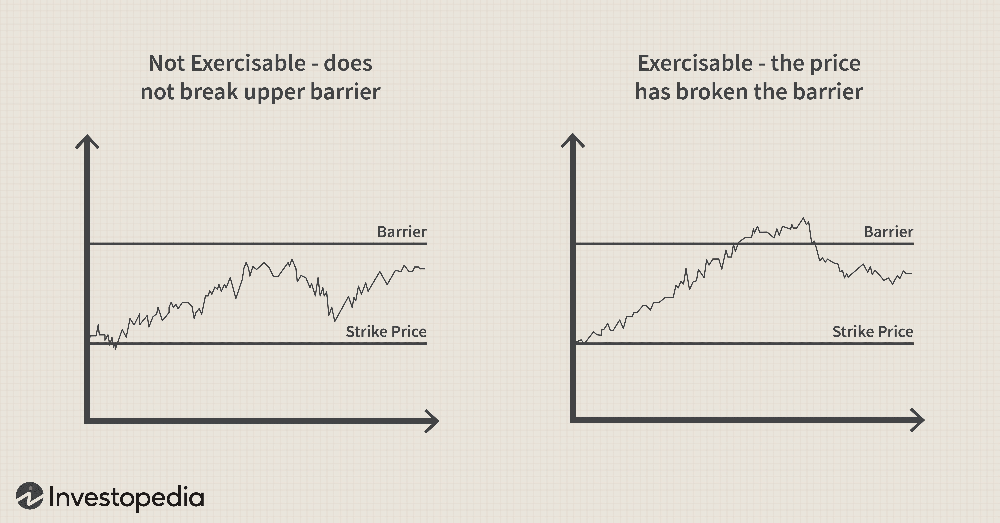

## Table of Contents

## What is an Up-and-In Option?

An Up-and-In Option is a type of exotic option that only becomes active if the price of the underlying asset reaches a certain level, called the barrier. If the price never reaches this barrier, the option expires worthless, and the buyer loses the premium they paid for it. This makes Up-and-In Options riskier than regular options because there's an extra condition that must be met for the option to have any value.

These options are often used by investors who have a specific prediction about the future price movement of an asset. For example, if an investor believes that a stock will rise significantly but only after it reaches a certain price, they might buy an Up-and-In Call Option. This way, they only pay the full cost of the option if their prediction about the stock reaching the barrier is correct. If the stock never hits the barrier, the investor's loss is limited to the premium they paid for the option.

## How does an Up-and-In Option differ from a standard option?

An Up-and-In Option is different from a standard option because it has an extra rule. With a standard option, you can use it or sell it as long as it's not expired. But with an Up-and-In Option, it only starts working if the price of the thing you're betting on reaches a special level called the barrier. If the price never gets to that level, the Up-and-In Option is worth nothing, no matter what happens after.

This makes Up-and-In Options trickier than regular options. They're for people who think the price will do something specific, like go up a lot but only after hitting a certain point. If you're wrong about the price reaching that point, you lose the money you paid for the option. But if you're right, then the option works just like a normal one, and you can use it to make money if the price keeps going the way you expected.

## What are the key components of an Up-and-In Option?

An Up-and-In Option has a few main parts that make it work. The first part is the barrier, which is a special price that the thing you're betting on, like a stock, has to reach. If the price never gets to this barrier, the option doesn't start working and you lose the money you paid for it. The second part is the premium, which is the price you pay to buy the option. This is the most you can lose if the option never activates.

The third part is the expiration date, which is when the option stops working if it hasn't been used yet. If the barrier is reached before this date, the option becomes active and works like a normal option. The last part is the strike price, which is the price at which you can buy or sell the thing you're betting on if the option is active. All these parts together make an Up-and-In Option different from a regular option because it has that extra rule about the barrier.

## Can you explain the barrier level in an Up-and-In Option?

The barrier level in an Up-and-In Option is a special price that the thing you're betting on, like a stock, has to reach before the option starts working. If the price of the stock never gets to this barrier level, the option stays inactive and you lose the money you paid for it. This makes the barrier level really important because it's the key to whether your option will be worth anything or not.

Think of the barrier level like a goal in a game. If the price of the stock reaches this goal before the option's time runs out, the option becomes active and you can use it like a normal option. But if the price doesn't make it to the goal, the option is like a ticket that never got used, and you don't get anything back except for losing the money you spent on it.

## What happens when the barrier is breached in an Up-and-In Option?

When the barrier is breached in an Up-and-In Option, it means the price of the thing you're betting on, like a stock, has finally reached the special level you were waiting for. Once this happens, the option starts working. It's like flipping a switch that turns the option from "off" to "on." Now, you can use the option just like a regular one, meaning you can buy or sell the stock at the strike price if you want to.

After the barrier is breached, the option stays active until it expires. This gives you time to decide what to do next, whether to use the option or sell it to someone else. But remember, if the barrier was never reached before the option's time ran out, you would have lost the money you paid for it. So, breaching the barrier is a big deal because it's what makes your option valuable.

## What are the potential benefits of using an Up-and-In Option?

Using an Up-and-In Option can be good if you think a stock will go up a lot but only after it hits a certain price. This kind of option lets you bet on that specific move without paying the full price of a regular option right away. If the stock never reaches that special price, you only lose the smaller amount you paid for the Up-and-In Option. This can save you money compared to buying a regular option that might not work out.

Another benefit is that Up-and-In Options can help you make more money if your guess about the stock's price is right. Once the stock hits the barrier, the option starts working and you can use it like a normal option. If the stock keeps going up, you can make a lot of money. It's like getting a chance to play a bigger game, but only if the first part of your plan works out.

## What are the risks associated with Up-and-In Options?

Up-and-In Options come with a big risk because they only start working if the price of the thing you're betting on reaches a special level called the barrier. If the price never gets to that level, you lose all the money you paid for the option. This means you could be wrong about the price hitting the barrier, and then you're out of luck and out of money.

Another risk is that even if the price does reach the barrier, the stock might not keep going up like you hoped. If the stock goes up just a little bit past the barrier and then goes down, you might not make any money or could even lose more. So, you need to be really sure about your guess on how the stock will move, or you could end up losing money even if the option starts working.

## How is the pricing of an Up-and-In Option determined?

The price of an Up-and-In Option, also called the premium, is figured out by looking at a few important things. One big thing is how likely it is that the price of the stock will reach the barrier before the option runs out of time. If it's very likely, the option will cost more because more people will want to buy it. Another thing is how much the stock's price moves around, called volatility. If the stock's price jumps around a lot, the option might be more expensive because there's a bigger chance it will hit the barrier.

Also, the time until the option expires matters. The longer you have until the option expires, the more time there is for the stock to reach the barrier, so the option might cost more. The strike price, which is the price at which you can buy or sell the stock if the option starts working, also affects the price. If the strike price is far away from where the stock is now, the option might be cheaper because it's less likely to be used. All these things together help decide how much you'll pay for an Up-and-In Option.

## What are some common strategies for trading Up-and-In Options?

One common strategy for trading Up-and-In Options is to use them when you think a stock will go up a lot but only after it reaches a certain price. You buy the option hoping the stock will hit the barrier, and then keep going up. This way, you only pay the full cost of the option if your guess about the stock reaching the barrier is right. If you're wrong and the stock never hits the barrier, you only lose the smaller amount you paid for the option. This can be a good way to bet on a big move without spending too much money upfront.

Another strategy is to use Up-and-In Options as part of a bigger plan with other options. For example, you might buy an Up-and-In Call Option and also sell a regular Call Option at the same time. This is called a spread. If the stock hits the barrier and goes up, the Up-and-In Option starts working and you can make money. But if the stock doesn't hit the barrier, you keep the money from selling the regular Call Option. This can help limit how much you might lose if things don't go as planned.

A third strategy is to use Up-and-In Options to protect other investments. If you own a stock and you're worried it might go down, you can buy an Up-and-In Put Option. This option will only start working if the stock goes up to the barrier first, but then it can help you sell the stock at a better price if it starts to fall. This way, you're betting that the stock will go up a bit before it goes down, and you can use the option to limit your losses if your guess is right.

## How do market conditions affect the performance of Up-and-In Options?

Market conditions can really change how well Up-and-In Options work. If the market is moving a lot, with prices going up and down quickly, it's more likely that the stock will hit the barrier and make the option start working. This is good for the person who bought the option because it means they have a better chance of making money. But if the market is calm and prices aren't moving much, it's harder for the stock to reach the barrier, and the option might not start working at all. This means the person who bought the option could lose the money they paid for it.

Also, the overall mood of the market matters. If everyone is feeling good about the market and thinks prices will go up, it's more likely that the stock will hit the barrier and keep going up. This can make Up-and-In Options more valuable because more people will want to buy them. But if the market is feeling bad and people think prices will go down, it's less likely that the stock will hit the barrier. This can make Up-and-In Options less valuable because fewer people will want to buy them, and the person who bought the option might lose money.

## Can you provide an example of a real-world scenario where an Up-and-In Option would be used?

Imagine you're an investor who thinks that a tech company's stock, currently at $100, will jump to $150 once it hits $120. You believe this because the company is about to release a new product that you think will be a big hit, but only if it gets good reviews. To bet on this, you buy an Up-and-In Call Option with a barrier at $120 and a strike price of $150. This option costs you $5. If the stock reaches $120 before the option expires, it starts working, and you can buy the stock at $150 if it goes even higher. If the stock never hits $120, you lose the $5 you paid for the option.

In this scenario, the Up-and-In Option helps you make a specific bet without spending too much money upfront. If the stock hits $120 and then goes up to $160, you can use your option to buy the stock at $150 and then sell it at $160, making a profit. But if the stock never reaches $120, you only lose the $5 you paid for the option, which is less than if you had bought a regular option that would have cost more. This way, you can take a chance on your prediction about the stock's price without risking a lot of money.

## What advanced mathematical models are used to value Up-and-In Options?

To figure out how much an Up-and-In Option is worth, people use fancy math models like the Black-Scholes model, but with some changes to fit the special rules of Up-and-In Options. The Black-Scholes model is usually used for regular options, but for Up-and-In Options, you need to add in the chance that the stock will hit the barrier. This is called a "barrier option pricing model." These models use things like how much the stock's price moves around, how long until the option runs out, and the difference between the stock's price now and the barrier and strike prices to guess how likely it is that the option will start working.

Another model that's used is the Monte Carlo simulation. This model works by pretending to play out the future many times to see how often the stock hits the barrier and what happens after. It's like running a bunch of different games to see what might happen. The Monte Carlo simulation takes into account the same things as the barrier option pricing model, but it uses a different way to guess the option's value. Both of these models help people decide if an Up-and-In Option is a good bet or not, based on how likely it is that the stock will do what they hope.

## References & Further Reading

[1]: ["Exotic Options Trading"](https://www.investopedia.com/terms/e/exoticoption.asp) by Frans de Weert

[2]: Derman, E., & Kani, I. (1994). ["Riding on a Smile."](https://www.researchgate.net/publication/239059413_Riding_on_a_Smile) Risk, January 1994.

[3]: Haug, E. G. (2007). ["The Complete Guide to Option Pricing Formulas."](https://www.amazon.com/Complete-Guide-Option-Pricing-Formulas/dp/0071389970) McGraw Hill Professional.

[4]: Rebonato, R. (1998). ["Volatility and Correlation: The Perfect Hedger and the Fox."](https://onlinelibrary.wiley.com/doi/book/10.1002/9781118673539) John Wiley & Sons.

[5]: Alexander, C. (2008). ["Market Risk Analysis, Volume III: Pricing, Hedging and Trading Financial Instruments."](https://archive.org/details/marketriskanalys0001alex) John Wiley & Sons.

[6]: Taleb, N. N. (1997). ["Dynamic Hedging: Managing Vanilla and Exotic Options."](https://archive.org/details/dynamichedgingma0000tale) John Wiley & Sons.