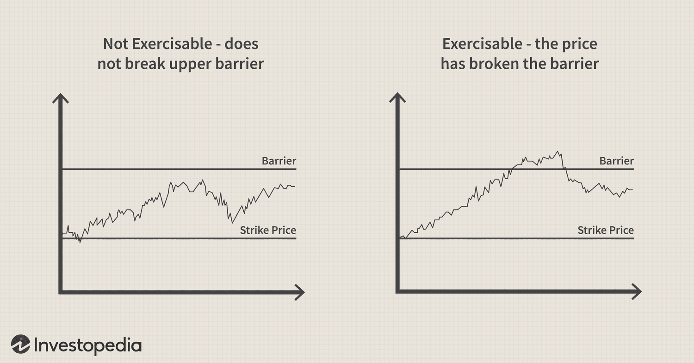

## Table of Contents

## What is an up-and-out option?

An up-and-out option is a type of exotic option that stops working if the price of the thing it's based on, like a stock, goes above a certain level. This level is called the barrier. If the price stays below this barrier, the option works like a normal option, and you can use it to buy or sell the stock at a set price, called the strike price, before it expires.

If the price of the stock goes above the barrier at any time before the option expires, the option becomes worthless. This makes up-and-out options riskier than regular options because there's a chance they could become useless. They are often used by investors who have a specific view on how the price of the stock will move, betting that it won't go too high.

## How does an up-and-out option work?

An up-and-out option is a special kind of option that stops working if the price of the thing it's tied to, like a stock, goes above a certain point. This point is called the barrier. If the stock price stays below this barrier, the option works just like a regular option. This means you can use it to buy or sell the stock at a set price, called the strike price, before the option expires.

If the stock price goes above the barrier at any time before the option expires, the option becomes worthless. This makes up-and-out options riskier than regular options because there's a chance they could become useless. People who use these options usually think the stock price won't go too high, and they're betting on that.

## What are the key features of an up-and-out option?

An up-and-out option is a type of option that stops working if the price of the thing it's tied to, like a stock, goes above a certain point. This point is called the barrier. If the stock price stays below this barrier, the option works just like a regular option. This means you can use it to buy or sell the stock at a set price, called the strike price, before the option expires.

If the stock price goes above the barrier at any time before the option expires, the option becomes worthless. This makes up-and-out options riskier than regular options because there's a chance they could become useless. People who use these options usually think the stock price won't go too high, and they're betting on that.

## What is the purpose of using an up-and-out option?

The main purpose of using an up-and-out option is to bet on the price of something, like a stock, staying within a certain range. If you think the stock won't go too high, you might choose an up-and-out option. This type of option can be cheaper than a regular option because it has a risk of becoming worthless if the stock price goes above the barrier.

Investors use up-and-out options when they want to save money on the option's cost but are willing to take on the risk that the option could become useless. This can be useful for people who have a specific view on how the stock will move and want to make a more targeted bet. By choosing an up-and-out option, they are essentially saying they believe the stock will stay below the barrier until the option expires.

## How is the barrier level determined in an up-and-out option?

The barrier level in an up-and-out option is set by the people who create the option, like banks or financial companies. They decide where to put the barrier based on what they think the price of the stock might do. They also look at what other people in the market are doing and what they think is likely to happen. The barrier level is important because it decides if the option will be worth something or not.

When someone wants to buy an up-and-out option, they can often pick from different barrier levels that the company offers. This lets them choose a barrier that fits with what they think will happen to the stock price. If they think the stock won't go too high, they might pick a lower barrier. If they think it might go a bit higher but not too much, they might pick a higher barrier. The barrier level is a big part of the option and can change how much it costs and how risky it is.

## What happens when the barrier is hit in an up-and-out option?

When the barrier is hit in an up-and-out option, the option stops working right away. This means if the price of the stock goes above the barrier at any time before the option expires, the option becomes worthless. You can't use it to buy or sell the stock at the strike price anymore.

This makes up-and-out options risky because there's a chance they could become useless. People who use these options are betting that the stock price won't go too high. If it does, they lose the money they paid for the option.

## What are the advantages of using up-and-out options?

One advantage of using up-and-out options is that they can be cheaper than regular options. Because they have a risk of becoming worthless if the stock price goes above the barrier, they usually cost less. This can be good for people who want to save money on the option's cost but are willing to take on the extra risk.

Another advantage is that up-and-out options allow investors to make more targeted bets. If you think the stock price won't go too high, you can use an up-and-out option to bet on that. This lets you focus on a specific price range and can be useful if you have a clear idea of what you think will happen to the stock price.

## What are the risks associated with up-and-out options?

The main risk of up-and-out options is that they can become worthless if the stock price goes above the barrier. If this happens, you lose all the money you paid for the option. This makes them riskier than regular options because there's a chance they could stop working before they expire. People who use these options need to be careful and think about whether the stock price might go too high.

Another risk is that up-and-out options can be hard to understand and predict. Because they have a barrier, you need to keep a close eye on the stock price. If you're not watching carefully, you might miss the moment when the barrier is hit, and your option becomes worthless. This can be stressful and requires more attention than regular options.

## How do up-and-out options compare to other types of exotic options?

Up-and-out options are one type of exotic option, but there are others like down-and-out options, up-and-in options, and down-and-in options. Each of these options works a bit differently. For example, a down-and-out option stops working if the stock price goes below a certain level, which is the opposite of an up-and-out option. Up-and-in options start working only if the stock price goes above a barrier, and down-and-in options start working if the stock price goes below a barrier. All these options are more complex than regular options and can be riskier or more rewarding depending on how the stock price moves.

Up-and-out options can be cheaper than regular options because they have a chance of becoming worthless if the stock price goes above the barrier. This makes them attractive to people who want to save money but are willing to take on more risk. Other exotic options, like down-and-out or up-and-in options, also have their own unique risks and rewards. For instance, down-and-out options might be good if you think the stock price won't go too low, while up-and-in options might be useful if you think the stock price will go above a certain level. Each type of exotic option lets investors make very specific bets on how a stock will move, but they all need careful watching and understanding.

## What are some real-world applications of up-and-out options?

Up-and-out options are used by investors who want to bet on a stock staying within a certain price range. For example, imagine a company that's about to release a new product. An investor might think the stock price will go up a bit but not too much. They could buy an up-and-out option with a barrier just above where they think the stock will peak. If the stock stays below the barrier, the option works like a normal option, and the investor can make money if the stock goes up to the strike price. But if the stock goes above the barrier, the option becomes worthless, and the investor loses the money they paid for it.

These options are also used by companies to manage risk. A company might use an up-and-out option to protect against a stock price going too high. For example, a company that's planning to buy back its own stock might use an up-and-out option to limit the cost if the stock price rises too much. If the stock stays below the barrier, the option helps the company buy back the stock at a set price. But if the stock goes above the barrier, the option becomes worthless, and the company doesn't have to pay for it. This can be a good way for companies to save money while still managing risk.

## How can one price an up-and-out option?

Pricing an up-and-out option can be tricky because it's more complex than a regular option. You need to think about the regular option's price, which depends on things like the stock's current price, the strike price, how long the option lasts, and how much the stock price might move around. But you also need to think about the barrier. The barrier makes the option cheaper because there's a chance it could become worthless if the stock price goes above it. To figure out the price, you can use special math models like the Black-Scholes model, but you have to change it to include the barrier.

To do this, you can use a method called Monte Carlo simulation. This method involves running a lot of pretend scenarios to see what might happen to the stock price. You see how often the stock price stays below the barrier and how often it goes above it. Then, you can figure out the average value of the option based on all these scenarios. This gives you a good idea of what the up-and-out option should cost. It's a bit more work than pricing a regular option, but it helps you understand the extra risk and reward that comes with the barrier.

## What advanced strategies can be employed with up-and-out options?

One advanced strategy with up-and-out options is to use them in a portfolio to manage risk. Imagine you own a stock and you're worried it might go up too much before you want to sell it. You could buy an up-and-out option with a barrier just above where you think the stock will peak. This way, if the stock stays below the barrier, you can still sell it at the strike price. But if it goes above the barrier, the option becomes worthless, and you don't have to worry about selling the stock at a high price. This can help you control how much you might lose if the stock goes up too fast.

Another strategy is to combine up-and-out options with other types of options to create a more complex bet. For example, you could buy an up-and-out call option and a down-and-out put option on the same stock. The up-and-out call option would let you buy the stock at a set price if it stays below the barrier, while the down-and-out put option would let you sell the stock at a set price if it stays above its barrier. This strategy can help you make money no matter which way the stock moves, as long as it doesn't go too far in either direction. It's a bit like betting on the stock staying in a certain range, which can be useful if you have a good idea of where the stock price might go.

## What are Up-and-Out Options and how do they work?

An up-and-out option is a type of knock-out barrier option in financial derivatives that becomes void when the price of the underlying asset exceeds a predetermined barrier level. This characteristic defines its behavior and pricing structure. These options provide the holder with the right, but not the obligation, to execute a call or put option, granted that the barrier level is not breached before the expiration of the contract. Therefore, an up-and-out option is a more conditional contract compared to plain vanilla options.

The fundamental appeal of up-and-out options lies in their cost-effectiveness. These options tend to be cheaper than standard options due to the likelihood that they may be nullified if the barrier condition is met. This potential reduction in cost is attributable to the risk that the option might never be exercised, providing a favorable premium price compared to conventional options. 

In mathematical terms, if $S_t$ represents the price of the underlying asset at time $t$, $K$ is the strike price, $B$ is the barrier level, and $T$ is the expiration time, the payoff for a European up-and-out call option is expressed as:

$$
\max(S_T - K, 0) \quad \text{if} \quad \max(S_t) < B \quad \text{for} \quad 0 \leq t \leq T
$$

This means that the holder can realize a profit equal to the difference between the asset price at expiration and the strike price, as long as the asset price remains below the barrier throughout the option's life.

For a put variant, the condition reverses, and the payoff will only be realized if the asset price stays below the barrier level without breaching it, making it worthless otherwise. Consequently, the intrinsic barrier feature of these options renders them attractive under specific market conditions where a trader anticipates limited price movements above a certain level but still wishes to capture the temporal market changes effectively.

The appeal of up-and-out options primarily resides in speculative trading strategies and hedging, offering an efficient way to address unique market views with potentially lower capital outlay compared to conventional options.

## What are the key features of up-and-out options?

Up-and-out options, recognized as exotic derivatives, are distinguished by their extra layers of complexity and specific payout contingencies. The main feature that sets these options apart is the knock-out condition, which nullifies the option if the underlying asset’s price surpasses a predetermined barrier during its lifespan. Here are the key aspects:

- **Call and Put Varieties**: Up-and-out options are available in both call and put types. A call option gives the holder the right to buy the underlying asset, while a put option grants the right to sell it. This flexibility allows traders to align their strategies with market expectations, whether they anticipate upward or downward price movements.

- **Knock-Out Mechanism**: The essence of up-and-out options lies in their knock-out mechanism. This condition implies that if the price of the underlying asset breaches the specified barrier level at any point before the expiration of the option, the option becomes void. This feature can significantly lower the cost of the option compared to standard (vanilla) options. However, it also presents a unique risk—the potential for the option to become worthless if the barrier is crossed, regardless of subsequent price movements.

Mathematically, the payoff of an up-and-out call option is:

$$
\text{Payoff} = \max(S_T - K, 0) \times 1_{\{S_t < B \, \forall\, t \leq T\}}
$$

where $S_T$ is the stock price at expiration, $K$ is the strike price, $B$ is the barrier, and $1_{\{S_t < B \, \forall\, t \leq T\}}$ is an indicator function that equals 1 if the price never exceeds the barrier level before expiration and 0 if it does.

The inclusion of these features makes up-and-out options appealing to traders who want to hedge against unfavorable price shifts while looking to capitalize on potential market movements. The lower premium cost due to the knock-out condition can be attractive, especially in situations where traders expect certain price behaviors but want to minimize upfront capital outlay.

## References & Further Reading

[1]: ["Options, Futures, and Other Derivatives"](https://www.amazon.com/Options-Futures-Other-Derivatives-11th/dp/B0B9JS99C2) by John C. Hull

[2]: Rebonato, R. (2004). ["Volatility and Correlation: The Perfect Hedger and the Fox"](https://onlinelibrary.wiley.com/doi/book/10.1002/9781118673539). John Wiley & Sons.

[3]: Derman, E. (1999). ["Barrier Options and Their Uses in Risk Management"](https://emanuelderman.com/ins-and-outs-of-barrier-options-part-11/) Risk Magazine, January issue.

[4]: Terry, S. (2009). ["Algorithmic and High-Frequency Trading"](https://assets.cambridge.org/97811070/91146/frontmatter/9781107091146_frontmatter.pdf) by Álvaro Cartea, Sébastien Jaimungal, and José Penalva

[5]: ["Dynamic Hedging: Managing Vanilla and Exotic Options"](https://www.amazon.com/Dynamic-Hedging-Managing-Vanilla-Options/dp/0471152803) by Nassim Nicholas Taleb