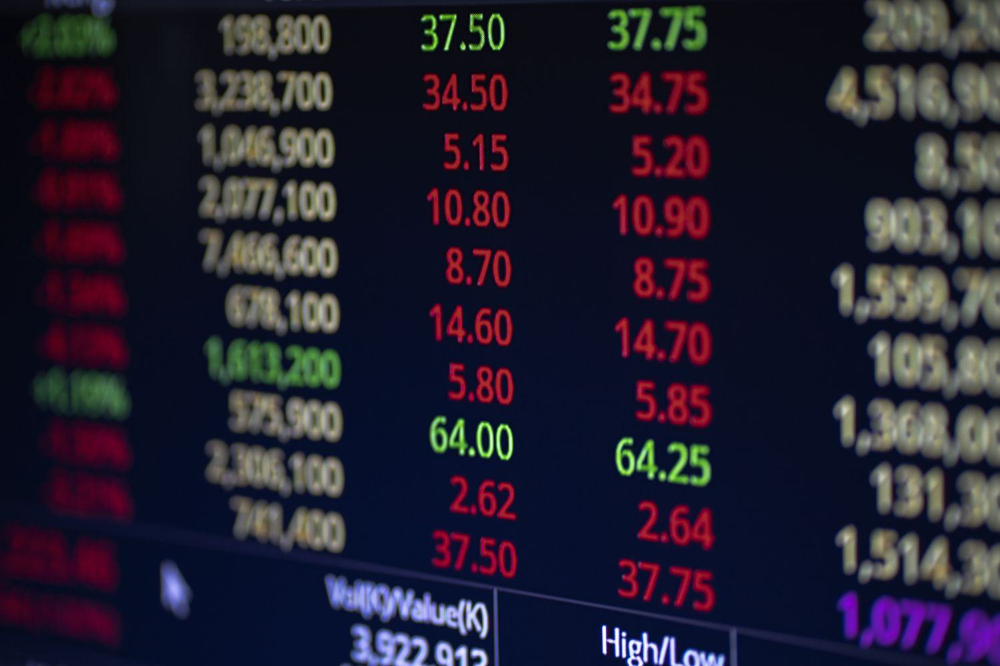

Financial derivatives are pivotal instruments in the landscape of modern finance, providing sophisticated mechanisms for managing risk and optimizing returns. These financial contracts derive their value from an underlying asset, which can range from stocks and bonds to currencies and interest rates. Derivatives are chiefly employed to hedge against price fluctuations, speculate on future movements, or access assets or markets that might otherwise be inaccessible. Among the various types of derivatives, barrier options, particularly up-and-out options, present unique opportunities and challenges.

Up-and-out options are a specific kind of barrier option that automatically expire worthless if the price of the underlying asset surpasses a predetermined barrier level. This characteristic provides a strategic element in derivative trading, where traders can benefit from reduced premiums compared to standard options. Such options offer traders the flexibility of choosing either call or put varieties, dependent on their forecast of market direction. While less costly, the risk lies in the potential for the option to become void if the barrier is breached, thereby requiring a nuanced understanding of market dynamics.



The strategic deployment of up-and-out options in trading can serve as a cost-efficient method for mitigating adverse price movements while maintaining the potential for gaining upside profits. These options are especially advantageous in volatile markets, where rapid price changes can significantly impact trading positions. Moreover, up-and-out options have a substantial role in algorithmic trading, where they can be incorporated into sophisticated trading algorithms. These algorithms, with pre-defined rules, optimize trading efficiencies by swiftly responding to market shifts and price thresholds.

Through this article, we aim to explore the function and utility of up-and-out options in derivative trading. We will investigate their strategic use cases and examine their relevance and application in algorithmic trading, providing a comprehensive insight into these complex yet powerful financial tools.

## Table of Contents

## Understanding Up-and-Out Options

An up-and-out option is a type of knock-out barrier option in financial derivatives that becomes void when the price of the underlying asset exceeds a predetermined barrier level. This characteristic defines its behavior and pricing structure. These options provide the holder with the right, but not the obligation, to execute a call or put option, granted that the barrier level is not breached before the expiration of the contract. Therefore, an up-and-out option is a more conditional contract compared to plain vanilla options.

The fundamental appeal of up-and-out options lies in their cost-effectiveness. These options tend to be cheaper than standard options due to the likelihood that they may be nullified if the barrier condition is met. This potential reduction in cost is attributable to the risk that the option might never be exercised, providing a favorable premium price compared to conventional options. 

In mathematical terms, if $S_t$ represents the price of the underlying asset at time $t$, $K$ is the strike price, $B$ is the barrier level, and $T$ is the expiration time, the payoff for a European up-and-out call option is expressed as:

$$
\max(S_T - K, 0) \quad \text{if} \quad \max(S_t) < B \quad \text{for} \quad 0 \leq t \leq T
$$

This means that the holder can realize a profit equal to the difference between the asset price at expiration and the strike price, as long as the asset price remains below the barrier throughout the option's life.

For a put variant, the condition reverses, and the payoff will only be realized if the asset price stays below the barrier level without breaching it, making it worthless otherwise. Consequently, the intrinsic barrier feature of these options renders them attractive under specific market conditions where a trader anticipates limited price movements above a certain level but still wishes to capture the temporal market changes effectively.

The appeal of up-and-out options primarily resides in speculative trading strategies and hedging, offering an efficient way to address unique market views with potentially lower capital outlay compared to conventional options.

## Key Features of Up-and-Out Options

Up-and-out options, recognized as exotic derivatives, are distinguished by their extra layers of complexity and specific payout contingencies. The main feature that sets these options apart is the knock-out condition, which nullifies the option if the underlying asset’s price surpasses a predetermined barrier during its lifespan. Here are the key aspects:

- **Call and Put Varieties**: Up-and-out options are available in both call and put types. A call option gives the holder the right to buy the underlying asset, while a put option grants the right to sell it. This flexibility allows traders to align their strategies with market expectations, whether they anticipate upward or downward price movements.

- **Knock-Out Mechanism**: The essence of up-and-out options lies in their knock-out mechanism. This condition implies that if the price of the underlying asset breaches the specified barrier level at any point before the expiration of the option, the option becomes void. This feature can significantly lower the cost of the option compared to standard (vanilla) options. However, it also presents a unique risk—the potential for the option to become worthless if the barrier is crossed, regardless of subsequent price movements.

Mathematically, the payoff of an up-and-out call option is:

$$
\text{Payoff} = \max(S_T - K, 0) \times 1_{\{S_t < B \, \forall\, t \leq T\}}
$$

where $S_T$ is the stock price at expiration, $K$ is the strike price, $B$ is the barrier, and $1_{\{S_t < B \, \forall\, t \leq T\}}$ is an indicator function that equals 1 if the price never exceeds the barrier level before expiration and 0 if it does.

The inclusion of these features makes up-and-out options appealing to traders who want to hedge against unfavorable price shifts while looking to capitalize on potential market movements. The lower premium cost due to the knock-out condition can be attractive, especially in situations where traders expect certain price behaviors but want to minimize upfront capital outlay.

## Strategic Uses in Trading

Up-and-out options are a strategic tool for traders seeking a cost-effective approach to hedging against unfavorable price movements while still maintaining the potential for upside profit. These options are particularly advantageous for traders engaged in speculative activities as they enable efficient exposure management and risk limitation. By utilizing up-and-out options, traders can specify a barrier level that, if reached, nullifies the option, thus providing an inherent risk-control mechanism.

In volatile markets characterized by rapid price fluctuations, up-and-out options offer distinct advantages. The barrier feature ensures that the option becomes void if the underlying asset's price exceeds a certain threshold, allowing traders to avoid excessive losses in cases of sharp upward price swings. This attribute makes these options especially useful for speculative traders who anticipate large price movements but wish to limit potential downsides.

The utilization of up-and-out options can be optimized through strategic selection of barrier levels. Traders might select lower barriers to minimize premiums, recognizing the trade-off between lower cost and the increased probability of nullification. Conversely, traders bullish on a particular asset may choose higher barriers, preserving the option's viability unless exceptionally high price levels are breached.

In terms of risk management, up-and-out options effectively limit exposure by confining potential losses to the premium paid, provided the barrier is not breached. This makes them an appealing choice for traders who prefer defined risk parameters and structured hedging strategies. Consequently, these options are often employed in strategies aiming to balance between protective hedging and speculative profit pursuit.

Overall, up-and-out options are indispensable for traders navigating volatile or high-risk environments where market positions are vulnerable to sudden price changes. Through thoughtful implementation and barrier level adjustment, these options offer flexibility and precision in managing financial strategies.

## Incorporating Up-and-Out Options in Algo Trading

Algorithmic trading employs predefined rules and algorithms to optimize the execution of trades by efficiently managing trading [volume](/wiki/volume-trading-strategy) and speed. Up-and-out options, a type of barrier option, can be effectively integrated into these algorithms to automate and enhance trading strategies. This integration allows traders to manage complex trading strategies and risk management with greater precision.

The use of up-and-out options in [algorithmic trading](/wiki/algorithmic-trading) involves the automation of buy and sell decisions based on the price movements of the underlying asset relative to the preset barrier level. By incorporating these options into algorithmic trading systems, traders can set specific parameters that trigger automated trades when certain market conditions are met.

For instance, a trading algorithm can be programmed to monitor the price of an underlying asset continuously. Once the asset approaches the barrier, the algorithm can execute a predefined strategy, such as closing the position to limit losses or adjusting the position to capitalize on favorable price movements. This ability to react swiftly to price thresholds greatly enhances trading efficiency and risk management.

Consider an algorithm designed in Python that automates the trading of up-and-out options. The algorithm could use financial data streaming to track the current price of the underlying asset. Here's a simplified example:

```python
import pandas as pd

# Parameters
barrier_level = 150
strike_price = 140
option_expiry = '2023-12-31'

# Mock-up function for getting the current asset price
def get_current_price():
    # This function would interface with a live data feed in practice
    return float(input("Enter the current price: "))

def check_option_viability():
    current_price = get_current_price()
    if current_price > barrier_level:
        print("Barrier breached. Option expires worthless.")
    elif current_price >= strike_price:
        print("Potential profit opportunity. Consider exercising the option.")
    else:
        print("Hold position for potential upside.")

# Simulate decision-making
check_option_viability()
```

This automation allows for the rapid execution of trading decisions as market conditions change, which is crucial in the fast-paced environment of financial markets. By integrating up-and-out options into algorithmic trading, traders gain the flexibility to adjust their strategies dynamically, maximizing potential returns while minimizing exposure to adverse price movements. This approach not only improves operational efficiency but also aids in the sophisticated management of financial risks inherent in barrier options.

## Practical Example of Up-and-Out Options

Consider an investor who anticipates a price increase in Apple's stock and wants to optimize their investment strategy by using an up-and-out call option. This type of option provides a unique opportunity to gain exposure to potential upside while managing costs.

The investor decides to purchase an up-and-out call option for Apple Inc. with certain parameters:

- **Strike Price**: $150
- **Barrier Level**: $160
- **Option Premium**: Lower than a standard call option due to the barrier feature 

By setting the barrier at $160, the investor anticipates that Apple's stock price will rise but not exceed $160, offering a cost-effective way to participate in the stock's price movements. The lower premium makes this option more appealing than a standard call option without a barrier, as long as the conditions are met.

### Outcome Scenarios

1. **Profitable Scenario**: If Apple's stock price increases above the strike price of $150 but remains below the barrier of $160 until expiration, the investor stands to gain. For example, if the stock price reaches $155 at expiration, the investor will exercise the option and profit from the difference, less the premium paid.

2. **Barrier Breach Scenario**: If the stock price touches or exceeds $160 at any point before expiration, the option becomes void. This event nullifies the option, meaning the investor loses the premium paid but avoids additional losses since the option is not exercised.

### Simplified Python Code for Scenario Analysis

To simulate this strategy, we can use Python to model potential outcomes:

```python
import random

def simulate_apple_stock_price(initial_price, days, daily_volatility):
    price = initial_price
    for _ in range(days):
        price_change = random.uniform(-1, 1) * daily_volatility
        price += price_change
        yield price

# Parameters
initial_price = 145  # Starting price
strike_price = 150   # Strike price of the option
barrier_level = 160  # Barrier level
option_premium = 5   # Cost of the option
days_to_expiry = 30  # Days until expiration

# Simulate stock prices
stock_prices = list(simulate_apple_stock_price(initial_price, days_to_expiry, daily_volatility=2))

# Check option outcome
option_expires_worthless = any(price >= barrier_level for price in stock_prices)
final_stock_price = stock_prices[-1]

if option_expires_worthless:
    print(f"Option is void; Stock hit the barrier of {barrier_level}. Loss: {option_premium}")
else:
    profit = max(0, final_stock_price - strike_price) - option_premium
    print(f"Final Stock Price: {final_stock_price}, Profit: {profit if profit > 0 else 'No gain, Loss: ' + str(option_premium)}")
```

This code illustrates a simple simulation of Apple's stock price over time and evaluates the outcomes based on the specified up-and-out option parameters. By understanding the trade-offs involved, investors can make more informed decisions about utilizing up-and-out options to enhance their investment strategies.

## Conclusion

Up-and-out options present a distinctive blend of opportunities and obstacles, making them well-suited for seasoned traders who prioritize customized strategies. As barrier options, they offer a cost-effective mechanism for hedging and leveraging market positions, particularly attractive when managing potential price [volatility](/wiki/volatility-trading-strategies). Their key appeal lies in the combination of risk mitigation and potential upsides, albeit at the risk of nullification should the asset price surpass the pre-set barrier.

Incorporating up-and-out options into algorithmic trading frameworks introduces an additional layer of sophistication, enhancing the ability to swiftly respond to evolving market conditions. Algorithms can be programmed to account for these barriers, ensuring that trading decisions are executed efficiently and that risk management adaptively responds to market dynamics. This automated approach not only increases precision in strategy deployment but also optimizes the timing and volume of trades, thereby maximizing potential returns while curbing risks efficiently.

However, investors and traders should carefully account for the complexities inherent in these derivatives. Due to their exotic nature, up-and-out options necessitate a thorough understanding of their knockout feature and the market conditions that might trigger such scenarios. Therefore, participants are encouraged to undertake comprehensive financial analyses and potentially consult with financial experts to align these instruments with their broader investment strategies. Beyond technical considerations, understanding the broader market context and the interplay between these options and other financial instruments is imperative for making informed decisions.

## References & Further Reading

[1]: ["Options, Futures, and Other Derivatives"](https://www.amazon.com/Options-Futures-Other-Derivatives-11th/dp/B0B9JS99C2) by John C. Hull

[2]: Rebonato, R. (2004). ["Volatility and Correlation: The Perfect Hedger and the Fox"](https://onlinelibrary.wiley.com/doi/book/10.1002/9781118673539). John Wiley & Sons.

[3]: Derman, E. (1999). ["Barrier Options and Their Uses in Risk Management"](https://emanuelderman.com/ins-and-outs-of-barrier-options-part-11/) Risk Magazine, January issue.

[4]: Terry, S. (2009). ["Algorithmic and High-Frequency Trading"](https://assets.cambridge.org/97811070/91146/frontmatter/9781107091146_frontmatter.pdf) by Álvaro Cartea, Sébastien Jaimungal, and José Penalva

[5]: ["Dynamic Hedging: Managing Vanilla and Exotic Options"](https://www.amazon.com/Dynamic-Hedging-Managing-Vanilla-Options/dp/0471152803) by Nassim Nicholas Taleb