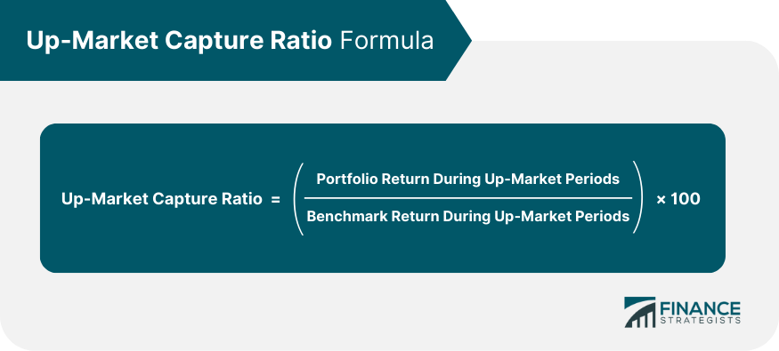

## Table of Contents

## What is Up-Market Capture Ratio and why is it important?

The Up-Market Capture Ratio is a measure used to understand how well an investment performs when the market is doing well. It compares the returns of an investment to the returns of a benchmark, like the S&P 500, during times when the market goes up. If an investment has an Up-Market Capture Ratio of more than 100%, it means the investment did better than the market during those good times. If it's less than 100%, the investment didn't do as well as the market.

This ratio is important because it helps investors see if an investment can take advantage of good market conditions. If you're looking for an investment that will grow quickly when the market is up, you'd want one with a high Up-Market Capture Ratio. It's a useful tool for comparing different investments and making choices based on how they perform during positive market periods.

## How is Up-Market Capture Ratio calculated?

To calculate the Up-Market Capture Ratio, you first need to find the periods when the market went up. You look at the returns of both the investment and the benchmark, like the S&P 500, during these times. For each up period, you divide the investment's return by the benchmark's return. This gives you a ratio for each up period.

Next, you average all these ratios to get the Up-Market Capture Ratio. If the average is more than 100%, it means the investment did better than the market during those up periods. If it's less than 100%, the investment didn't do as well as the market. This simple calculation helps investors understand how well an investment can grow when the market is doing well.

## What data is required to perform an Up-Market Capture Ratio analysis?

To do an Up-Market Capture Ratio analysis, you need to gather the returns of the investment you are looking at and the returns of a benchmark, like the S&P 500. You need this data for the same time periods so you can compare them. The time periods should be long enough to include several up markets, so you get a good idea of how the investment does when the market is doing well.

Once you have the data, you need to find the periods when the benchmark had positive returns. These are the up-market periods. For each of these periods, you need to know the return of both the investment and the benchmark. With this information, you can calculate the Up-Market Capture Ratio by comparing how the investment did to how the benchmark did during those good times.

## Can you provide a simple example of calculating the Up-Market Capture Ratio?

Let's say you're looking at how a mutual fund did compared to the S&P 500 over three months. In Month 1, the S&P 500 went up by 2%, and the mutual fund went up by 3%. In Month 2, the S&P 500 went up by 1%, and the mutual fund went up by 1%. In Month 3, the S&P 500 went down by 0.5%, so we don't use this month because it's not an up-market period.

To calculate the Up-Market Capture Ratio, we look at the two up-market months. For Month 1, the mutual fund's return (3%) divided by the S&P 500's return (2%) is 1.5, or 150%. For Month 2, the mutual fund's return (1%) divided by the S&P 500's return (1%) is 1, or 100%. We average these two ratios: (150% + 100%) / 2 = 125%. So, the Up-Market Capture Ratio is 125%, meaning the mutual fund did better than the S&P 500 during up-market periods.

## How does the Up-Market Capture Ratio differ from the Down-Market Capture Ratio?

The Up-Market Capture Ratio and the Down-Market Capture Ratio are two different ways to look at how an investment does compared to the market. The Up-Market Capture Ratio shows how well an investment does when the market is going up. It compares the returns of the investment to the returns of a benchmark like the S&P 500 during times when the market is doing well. If the ratio is over 100%, the investment did better than the market during those good times. If it's under 100%, the investment didn't do as well as the market.

The Down-Market Capture Ratio, on the other hand, looks at how an investment does when the market is going down. It compares the returns of the investment to the returns of the benchmark during times when the market is doing poorly. If the Down-Market Capture Ratio is over 100%, it means the investment lost more than the market during those bad times. If it's under 100%, the investment didn't lose as much as the market. Both ratios help investors see how an investment might behave in different market conditions, but they focus on different scenarios.

## What is a good Up-Market Capture Ratio and how should it be interpreted?

A good Up-Market Capture Ratio is usually one that is over 100%. This means that the investment did better than the market during times when the market was doing well. For example, if an investment has an Up-Market Capture Ratio of 120%, it means it grew 20% more than the market during up periods. Investors often look for investments with high Up-Market Capture Ratios if they want to make the most of good market times.

However, a very high Up-Market Capture Ratio can also mean the investment might be riskier. It could go up a lot when the market goes up, but it might also fall more when the market goes down. So, when looking at the Up-Market Capture Ratio, it's smart to also check the Down-Market Capture Ratio to get a full picture of how the investment behaves in different market conditions.

## How can Up-Market Capture Ratio be used in portfolio management?

In portfolio management, the Up-Market Capture Ratio helps investors pick investments that will do well when the market is doing well. If you want your portfolio to grow fast during good market times, you can choose investments with high Up-Market Capture Ratios. These investments will grow more than the market, helping your portfolio to do better when things are going well. This can be important for investors who are trying to beat the market and want to make the most of their money during up periods.

But, it's not just about [picking](/wiki/asset-class-picking) investments with high Up-Market Capture Ratios. You also need to look at the Down-Market Capture Ratio to see how those investments do when the market is not doing well. A high Up-Market Capture Ratio might mean the investment is riskier and could lose more when the market goes down. So, in portfolio management, you balance these ratios to create a mix of investments that can grow well during up markets but also protect your money during down markets. This way, you can manage your portfolio to fit your goals and how much risk you're willing to take.

## What are the limitations of using Up-Market Capture Ratio as a performance metric?

Using the Up-Market Capture Ratio as a performance metric has some limitations. It only looks at how an investment does when the market is going up. It doesn't tell you anything about how the investment does when the market goes down. So, if you only use this ratio, you might pick an investment that does well when things are good but loses a lot of money when things are bad. That's why it's important to look at other metrics, like the Down-Market Capture Ratio, to get a full picture.

Another limitation is that the Up-Market Capture Ratio can make an investment look better than it really is if you're only looking at a short time. If you only look at a few months or a year, the investment might seem like it does really well when the market is up. But over a longer time, like several years, it might not be as good. So, it's important to look at the ratio over a long period to see if the investment really does well consistently when the market is up.

## How does Up-Market Capture Ratio relate to other performance metrics like the Sharpe Ratio?

The Up-Market Capture Ratio and the Sharpe Ratio are both ways to measure how an investment does, but they look at different things. The Up-Market Capture Ratio tells you how well an investment does when the market is going up. It compares the investment's returns to the market's returns during good times. If the ratio is over 100%, the investment did better than the market. This helps investors pick investments that will grow a lot when the market is doing well. But it only looks at up times and doesn't tell you about down times.

The Sharpe Ratio, on the other hand, looks at how well an investment does compared to the risk it takes. It measures the extra return you get for taking on more risk. A higher Sharpe Ratio means the investment gives you more return for the risk you're taking. This ratio looks at all times, not just when the market is up. So, it gives you a bigger picture of how the investment does over time, including both good and bad market conditions. Both ratios are useful, but they give you different information to help you choose the best investments for your goals.

## Can Up-Market Capture Ratio be used for different asset classes, and if so, how does its application vary?

Yes, the Up-Market Capture Ratio can be used for different asset classes like stocks, bonds, and even commodities. It helps you see how well an investment in any asset class does when the market for that asset class is going up. For example, if you're looking at a stock fund, you would compare its returns to a stock market index like the S&P 500 during times when the stock market goes up. If you're looking at a bond fund, you might compare it to a bond index like the Bloomberg Barclays Aggregate Bond Index during times when bond prices are rising.

The way you use the Up-Market Capture Ratio can change a bit depending on the asset class. For stocks, which can be more volatile, a high Up-Market Capture Ratio might mean the investment could grow a lot during good times but could also fall a lot during bad times. For bonds, which are usually less risky, the ratio might be lower but still important to look at if you want to see how well your bond investments do when bond markets are doing well. So, while the basic idea of the ratio stays the same, you need to think about the different risks and behaviors of each asset class when you use it.

## What are some advanced techniques for enhancing the accuracy of Up-Market Capture Ratio calculations?

To make the Up-Market Capture Ratio more accurate, you can use a longer time period for your calculations. Instead of just looking at a few months, look at several years. This way, you can see how the investment does over many up-market periods, not just a few. It helps you get a better idea of how the investment does when the market is doing well over time. Also, you can use a rolling window approach. This means you keep moving the time period you're looking at, like looking at the last 12 months, then the next 12 months, and so on. This helps you see how the ratio changes over time and gives you a more complete picture.

Another way to make the Up-Market Capture Ratio more accurate is to use a more specific benchmark. Instead of using a broad market index like the S&P 500, you can use a benchmark that matches the investment more closely. For example, if you're looking at a tech stock fund, use a tech stock index as your benchmark. This makes the comparison more fair and accurate because it's more like comparing apples to apples. Also, you can adjust the ratio for risk. By looking at how much risk the investment takes to get its returns, you can see if a high Up-Market Capture Ratio is worth it or if it's too risky. This helps you understand the investment better and make smarter choices.

## How can statistical tools be applied to assess the reliability of Up-Market Capture Ratio results?

Statistical tools can help you see if the Up-Market Capture Ratio you calculated is reliable. One way to do this is by using something called a confidence interval. A confidence interval tells you how sure you can be about the ratio you found. If the confidence interval is small, it means you can be pretty sure about the ratio. If it's big, it means the ratio might not be as reliable because it could change a lot if you looked at different time periods. You can also use something called a t-test to see if the Up-Market Capture Ratio is really different from 100%. If it's not different from 100%, it means the investment did about the same as the market during up times, which might not be what you want.

Another useful tool is regression analysis. This helps you see if the Up-Market Capture Ratio is affected by other things, like how risky the investment is or how well the whole economy is doing. If the ratio changes a lot because of these other things, it might not be as reliable for making decisions. You can also look at the standard deviation of the Up-Market Capture Ratio over time. If the standard deviation is low, it means the ratio stays pretty steady, which makes it more reliable. But if the standard deviation is high, the ratio jumps around a lot, so it might not be as trustworthy for deciding which investments to pick.

## What is the Up-Market Capture Ratio and how can it be understood?

The up-market capture ratio is a vital metric for assessing how well an investment manager performs during periods of market growth. This ratio evaluates the ability of a portfolio to capitalize on positive market trends compared to a benchmark index. Specifically, the up-market capture ratio indicates the extent to which a portfolio can outperform the benchmark index during these favorable periods. An up-market capture ratio greater than 100% indicates that the portfolio has exceeded the index's gains, thereby capturing more of the market's upside.

To calculate the up-market capture ratio, one must consider the portfolio's returns during periods when the benchmark index experiences positive returns. The ratio is computed by dividing the portfolio's returns by the benchmark's returns during these market upswings and then multiplying by 100 to express it as a percentage. Mathematically, it can be represented as:

$$
\text{Up-Market Capture Ratio} = \left(\frac{\text{Portfolio Returns}}{\text{Benchmark Returns}}\right) \times 100
$$

This calculation provides a quantitative measure of how effectively a portfolio manager is translating market gains into actual returns. A portfolio with an up-market capture ratio exceeding 100% is considered to have outperformed the benchmark, suggesting skillful management and advantageous positioning during growth phases.

Understanding the up-market capture ratio is crucial for investors and analysts as it offers a straightforward method to evaluate an investment manager's ability to manage and benefit from market growth. By focusing on this metric, investors can make informed decisions about selecting investment managers and strategies that align with their growth-oriented objectives. By contrast, a lower ratio may indicate that the portfolio underperforms the market during these periods, potentially signaling a need for strategic adjustments.

## How do you calculate the Up-Market Capture Ratio?

The up-market capture ratio is an essential metric for evaluating how well a portfolio performs when the market is rising. Its calculation is straightforward: divide the portfolio's returns during periods of market gains by the returns of a benchmark index for the same periods, then multiply the result by 100 to express it as a percentage. Formally, this can be represented by the following formula:

$$
\text{Up-Market Capture Ratio} = \left( \frac{\text{Portfolio Return during Up-Market}}{\text{Benchmark Index Return during Up-Market}} \right) \times 100
$$

To illustrate, consider a portfolio that generated a 12% return during a market upswing, while its benchmark index, such as the S&P 500, increased by 10%. The up-market capture ratio is calculated as follows:

$$
\text{Up-Market Capture Ratio} = \left( \frac{12}{10} \right) \times 100 = 120\%
$$

A ratio of 120% indicates that the portfolio outperformed the benchmark index by capturing 20% more of the market's gains.

Investors can apply this calculation in various scenarios to assess performance accurately. For instance, during a quarterly evaluation, assume the benchmark rises by 8% and a portfolio earns a 6% return in the same period. The up-market capture ratio would be:

$$
\text{Up-Market Capture Ratio} = \left( \frac{6}{8} \right) \times 100 = 75\%
$$

A ratio of 75% suggests that the portfolio underperformed the benchmark, capturing only 75% of the market’s appreciation.

To facilitate this calculation in Python, you can use the following code snippet:

```python
def calculate_up_market_capture_ratio(portfolio_return, benchmark_return):
    if benchmark_return == 0:
        return "Benchmark return cannot be zero."
    up_market_capture_ratio = (portfolio_return / benchmark_return) * 100
    return up_market_capture_ratio

# Example usage
portfolio_return = 0.12  # 12%
benchmark_return = 0.10  # 10%
ratio = calculate_up_market_capture_ratio(portfolio_return, benchmark_return)
print(f"Up-Market Capture Ratio: {ratio}%")
```

Understanding and correctly calculating the up-market capture ratio is pivotal for investors. It provides insights into whether an investment manager is effectively capitalizing on market gains and assists in making informed decisions about maintaining, altering, or selecting investment strategies.

## What are the Key Performance Metrics in Algorithmic Trading?

When assessing [algorithmic trading](/wiki/algorithmic-trading) strategies, certain key performance metrics stand out for their ability to provide insights into the effectiveness and risk-adjusted returns of a trading system. 

### Sharpe Ratio

The Sharpe Ratio is a prevalent metric used to evaluate the risk-adjusted return of an investment. It is defined as:

$$
\text{Sharpe Ratio} = \frac{R_p - R_f}{\sigma_p}
$$

where $R_p$ is the expected portfolio return, $R_f$ is the risk-free rate, and $\sigma_p$ is the standard deviation of the portfolio's excess return. A higher Sharpe Ratio indicates a more favorable risk/reward balance, suggesting that the algorithmic strategy provides higher returns for a given level of risk.

### Maximum Drawdown

Maximum Drawdown (MDD) is another critical metric, representing the largest peak-to-trough decline in the value of a portfolio. It quantifies the worst possible loss over a specific period, highlighting the risk of significant downturns in trading performance.

$$
\text{MDD} = \min \left( \frac{\text{Trough Value} - \text{Peak Value}}{\text{Peak Value}} \right)
$$

This measure is crucial for understanding the downside risk inherent in a trading strategy, providing information about the depth and duration of losses.

### Profit Factor

The Profit Factor is a straightforward metric that calculates the ratio of gross profits to gross losses:

$$
\text{Profit Factor} = \frac{\text{Total Profits}}{\text{Total Losses}}
$$

A Profit Factor greater than one indicates profitability, as the trading strategy makes more money than it loses. This metric offers a clear snapshot of the strategy's historical profitability.

### Comparative Analysis with Up-Market Capture Ratio

Comparing these metrics with the up-market capture ratio provides comprehensive insight into a strategy's performance under different market conditions. While the up-market capture ratio specifically focuses on an investment's ability to capitalize on market gains, the Sharpe Ratio, Maximum Drawdown, and Profit Factor offer a broader perspective by incorporating elements of risk, loss potential, and profitability.

The combination of these metrics allows traders to optimize their algorithmic strategies by balancing the pursuit of returns with the management of risks. By using the up-market capture ratio alongside broader measures of performance, investors can make informed decisions about the viability of their trading systems across varying market environments. This integration helps in achieving an ideal balance between return maximization and risk mitigation.

## References & Further Reading

[1]: Bergstra, J., Bardenet, R., Bengio, Y., & Kégl, B. (2011). ["Algorithms for Hyper-Parameter Optimization."](https://dl.acm.org/doi/10.5555/2986459.2986743) Advances in Neural Information Processing Systems 24.

[2]: ["Advances in Financial Machine Learning"](https://www.amazon.com/Advances-Financial-Machine-Learning-Marcos/dp/1119482089) by Marcos Lopez de Prado

[3]: ["Evidence-Based Technical Analysis: Applying the Scientific Method and Statistical Inference to Trading Signals"](https://www.amazon.com/Evidence-Based-Technical-Analysis-Scientific-Statistical/dp/0470008741) by David Aronson

[4]: ["Machine Learning for Algorithmic Trading"](https://github.com/stefan-jansen/machine-learning-for-trading) by Stefan Jansen

[5]: ["Quantitative Trading: How to Build Your Own Algorithmic Trading Business"](https://github.com/LucindaYa/quant-resources/blob/master/Quantitative%20Trading%20How%20to%20Build%20Your%20Own%20Algorithmic%20Trading%20Business.pdf) by Ernest P. Chan