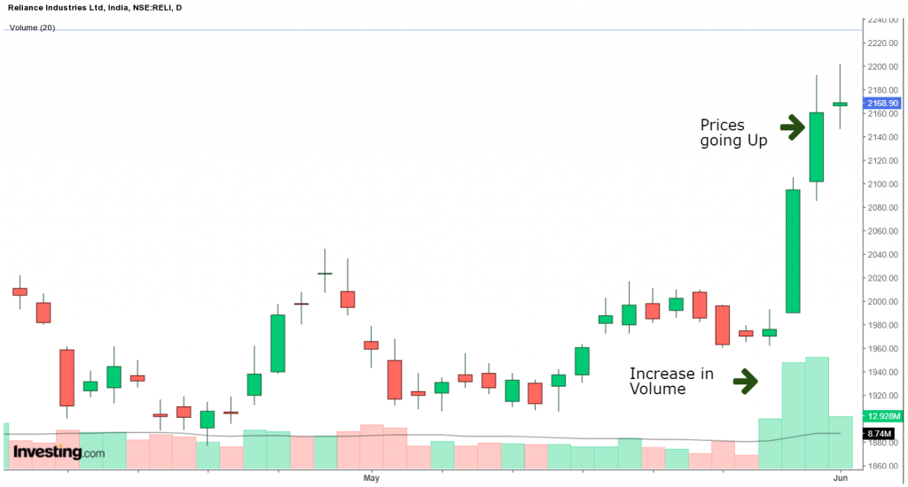

## Table of Contents

## What is Up Volume and how is it defined in stock market analysis?

Up Volume is a term used in stock market analysis to describe the total volume of shares traded when the price of a stock goes up during a trading day. It's a way to measure how much trading activity is happening when the stock price is increasing. For example, if a stock's price rises throughout the day and 1 million shares are traded, then the Up Volume for that stock would be 1 million shares.

This measure is important because it can give investors an idea about the strength of a price movement. If a stock's price is going up and the Up Volume is high, it might mean that many people are buying the stock and the upward trend could be strong. On the other hand, if the price goes up but the Up Volume is low, it might suggest that the upward movement is not as strong and could be less reliable. By looking at Up Volume, investors can make better decisions about whether to buy or sell a stock.

## How can beginners identify Up Volume on a stock chart?

To find Up Volume on a stock chart, beginners should look for a bar or line on the chart that shows the total number of shares traded when the stock price went up. Most stock charts have a section at the bottom where you can see the volume of shares traded each day. If the stock price went up on a certain day, the volume bar for that day will be colored differently, often in green or another bright color, to show that it's Up Volume.

It's helpful to compare the Up Volume to the Down Volume, which is the volume of shares traded when the stock price goes down. By looking at these two together, you can get a sense of whether the stock is being bought or sold more actively. If you see more green bars (Up Volume) than red bars (Down Volume), it means more people are buying the stock when the price is going up, which could be a good sign for the stock's future performance.

## What does Up Volume indicate about market sentiment?

Up Volume shows how many shares of a stock were traded when its price went up. It helps us understand if people feel good about the stock. If the Up Volume is high, it means a lot of people are buying the stock when the price is going up. This can show that people are feeling positive and think the stock will keep doing well.

On the other hand, if the Up Volume is low even when the price is going up, it might mean that not many people are buying the stock. This can show that people are not as sure about the stock's future. By looking at Up Volume, beginners can get a simple idea of how people feel about a stock and if they think it will go up or down in the future.

## How does Up Volume differ from Down Volume and Total Volume?

Up Volume is the number of shares traded when a stock's price goes up during a trading day. It shows how many people are buying the stock when its price is increasing. Down Volume, on the other hand, is the number of shares traded when the stock's price goes down. It shows how many people are selling the stock when its price is decreasing. Both Up Volume and Down Volume help us understand if people feel good or bad about the stock.

Total Volume is different because it is the sum of Up Volume and Down Volume. It tells us the total number of shares traded in a day, no matter if the price went up or down. By looking at Total Volume, we can see how active the trading is for a stock. But by looking at Up Volume and Down Volume separately, we can get a better idea of whether people are buying or selling more of the stock.

## Can Up Volume be used to predict future price movements?

Up Volume can give us clues about what might happen to a stock's price in the future, but it's not a perfect way to predict it. If you see a lot of Up Volume, it means many people are buying the stock when its price is going up. This can be a sign that people feel good about the stock and think its price will keep going up. But just because a lot of people are buying now doesn't mean the price will definitely go up later. Other things like news about the company or changes in the economy can also affect the stock's price.

It's important to look at Up Volume along with other information to make better guesses about future price movements. For example, if the Up Volume is high and the stock's price has been going up for a while, it might be more likely to keep going up. But if the Up Volume is high one day and then goes back to normal, it might not mean much. So, while Up Volume can be a helpful tool, it's best to use it with other signs and not rely on it alone to predict what will happen next.

## What are the common volume indexes that incorporate Up Volume?

Two common volume indexes that use Up Volume are the On-Balance Volume (OBV) and the Accumulation/Distribution Line (A/D Line). The OBV adds the day's volume to a running total when the stock price goes up and subtracts the volume when the price goes down. This helps show if the stock is being bought or sold more over time. If the OBV is going up, it means more people are buying the stock when the price is going up, which can be a good sign for the stock's future.

The Accumulation/Distribution Line is another index that uses Up Volume. It looks at where the stock's price closes within its daily range and then uses the volume to see if the stock is being bought or sold. If the stock closes near the top of its range, more of the day's volume is considered Up Volume, and it's added to the A/D Line. If it closes near the bottom, more volume is considered Down Volume, and it's subtracted. This index helps show if the stock is being accumulated (bought) or distributed (sold) over time.

## How do volume indexes like the On-Balance Volume (OBV) use Up Volume?

The On-Balance Volume (OBV) uses Up Volume to help show if a stock is being bought or sold more over time. It works by adding the day's volume to a running total when the stock's price goes up. This means that if a lot of shares are traded on a day when the price goes up, all those shares are counted as Up Volume and added to the OBV. If the stock's price goes down, the volume for that day is subtracted from the OBV. By looking at the OBV, you can see if it's going up or down. If it's going up, it means more people are buying the stock when the price is going up, which can be a good sign.

The OBV is useful because it gives a simple way to see if the stock is being bought more than it's being sold. If the OBV line is going up over time, it suggests that the stock is being accumulated, meaning more people are buying it. On the other hand, if the OBV line is going down, it means the stock might be being distributed, or sold off. By comparing the OBV with the stock's price, you can get a better idea of whether the stock's price movements are strong or weak. If the price is going up and the OBV is also going up, it's a good sign that the upward trend might continue.

## What are the limitations of relying solely on Up Volume for investment decisions?

Relying only on Up Volume for making investment choices can be risky because it doesn't tell the whole story. Up Volume just shows how many shares were traded when the stock's price went up, but it doesn't consider other important things like the company's news, the economy, or what other investors are thinking. For example, a stock might have high Up Volume one day because of some good news, but if the news turns out to be not as good as people thought, the stock's price could still go down later.

Also, Up Volume can be misleading if you don't look at it with other information. Sometimes, a stock might have high Up Volume but the price doesn't go up much, which means the buying might not be strong enough to keep the price going up. It's better to use Up Volume along with other signs like the stock's price trends, other volume measures, and what's happening in the market to make smarter investment decisions.

## How can advanced traders combine Up Volume with other technical indicators for better analysis?

Advanced traders can combine Up Volume with other technical indicators to get a more complete picture of a stock's health and potential future movements. One common way is to use Up Volume with the Relative Strength Index (RSI). The RSI measures how fast and how much a stock's price has changed recently. If the RSI shows that a stock is overbought (meaning its price has gone up a lot very quickly) and the Up Volume is also high, it might mean the stock's price could soon go down because it's been pushed up too fast. On the other hand, if the RSI shows the stock is oversold (meaning its price has gone down a lot) and the Up Volume is starting to increase, it could be a good time to buy because the stock might be ready to go back up.

Another useful combination is Up Volume with moving averages. Moving averages smooth out price data to show the stock's trend over time. If a stock's price is above its moving average and the Up Volume is high, it can be a strong sign that the stock's upward trend is solid and might continue. Traders often look at the 50-day and 200-day moving averages. If the Up Volume is high when the stock's price crosses above these moving averages, it can be a good signal to buy. By using Up Volume along with these other indicators, traders can make better decisions based on a fuller understanding of the stock's behavior.

## What are some case studies or historical examples where Up Volume significantly influenced market trends?

In 2009, after the financial crisis, the stock market started to recover. One example where Up Volume played a big role was with Apple Inc. In early 2009, Apple's stock price began to rise, and the Up Volume was very high. This showed that a lot of people were buying Apple's stock when its price was going up. The high Up Volume, along with good news about new products like the iPhone, helped push Apple's stock price higher. Investors who saw the high Up Volume and believed in Apple's future were rewarded as the stock kept going up over the next few years.

Another example is from the cryptocurrency market in 2017. Bitcoin saw a huge increase in its price, and the Up Volume was very high during this time. Many people were buying Bitcoin when its price was going up, which made the Up Volume go even higher. This high Up Volume, combined with a lot of excitement and news about cryptocurrencies, helped drive Bitcoin's price to new highs. However, after the peak, the Up Volume started to drop, and so did the price. This showed that the high Up Volume was a good sign of the trend while it lasted, but it couldn't keep the price going up forever without other factors supporting it.

## How do different markets (e.g., forex, commodities) interpret Up Volume differently?

In the forex market, Up Volume means more people are buying a currency when its price is going up. This can show that traders think the currency will keep getting stronger. But forex is different because it's always open and has a lot of trading happening all the time. So, the Up Volume in forex might not be as clear as in the stock market. Traders in forex often look at Up Volume with other things like the news and economic reports to understand why a currency's price is moving.

In the commodities market, Up Volume shows how many contracts are being bought when the price of a commodity, like gold or oil, goes up. High Up Volume can mean that a lot of people think the price of the commodity will keep going up. But commodities can be affected a lot by things like weather, politics, and big changes in supply and demand. So, traders in the commodities market use Up Volume along with other signs to guess what might happen to prices next.

## What are the latest research findings or emerging theories on the effectiveness of Up Volume in modern trading strategies?

Recent research has shown that Up Volume can still be a useful tool in modern trading strategies, but it works best when used with other indicators. Some studies suggest that combining Up Volume with machine learning models can help predict stock price movements more accurately. These models can look at lots of data, like Up Volume, and find patterns that are hard for people to see. This means traders can make better guesses about where a stock's price might go next by using both Up Volume and these smart computer models.

There are also new theories that say Up Volume can be more important in certain situations, like when the market is very active or when there's a lot of news about a stock. For example, if a company announces good news and the Up Volume goes up a lot, it might mean the stock's price will keep going up because more people are buying it. But, if the Up Volume is high without any clear reason, it might not be a good sign for the stock's future. So, traders need to think about why the Up Volume is high and use it with other information to make the best choices.

## What are Volume Indexes: PVI and NVI?

The Positive Volume Index (PVI) and Negative Volume Index (NVI) are important tools for understanding market movements based on volume fluctuations. 

The PVI is designed to measure price changes on days when trading volume is higher than the previous day. A rising PVI is often interpreted as a signal of bullish sentiment, as it suggests that increasing volumes accompany price increases, indicating stronger market interest and potential upward momentum. The calculation of the PVI can be formalized as follows: 

$$

\text{If } V_t > V_{t-1}, \text{ then } \text{PVI}_t = \text{PVI}_{t-1} + \left( \frac{P_t - P_{t-1}}{P_{t-1}} \right) \times \text{PVI}_{t-1} 
$$

where $V_t$ is the volume on day $t$, and $P_t$ is the price on day $t$.

In contrast, the NVI focuses on scenarios where trading volume decreases from the previous day, providing insight into price actions during quieter market conditions. The NVI is useful for traders valuing price movement information when accompanied by less market noise. The calculation of the NVI follows this formula:

$$

\text{If } V_t < V_{t-1}, \text{ then } \text{NVI}_t = \text{NVI}_{t-1} + \left( \frac{P_t - P_{t-1}}{P_{t-1}} \right) \times \text{NVI}_{t-1} 
$$

By utilizing both indices, traders can more effectively discern the influence of volume on market conditions and better predict future price movements. These indices facilitate a more nuanced understanding of how buying and selling activities align with or contradict price trends, thus helping traders to adjust their strategies based on perceived market dynamics.

## What is the relationship between Algorithmic Trading and Volume?

Algorithmic trading utilizes volume indicators as a core component in the development of automated and data-driven strategies. Volume indicators such as On-Balance Volume (OBV) and Volume-Weighted Average Price (VWAP) are particularly significant in these systems due to their ability to provide critical insights into market trends and dynamics.

On-Balance Volume (OBV) is a momentum indicator that relates volume to price change. OBV adds volume on up days and subtracts it on down days, thus reflecting whether the volume is flowing into or out of a particular asset. This helps traders confirm trends, as a rising OBV suggests an upward price movement, while a declining OBV may indicate potential reversals.

$$
OBV_t = OBV_{t-1} + \begin{cases} 
  V_t, & \text{if } P_t > P_{t-1} \\
  -V_t, & \text{if } P_t < P_{t-1} \\
  0, & \text{if } P_t = P_{t-1} 
\end{cases}
$$

where $OBV_t$ is the OBV at time $t$, $V_t$ is the volume at time $t$, and $P_t$ is the price at time $t$.

The Volume-Weighted Average Price (VWAP) is another critical indicator that reflects the average price a security has traded at throughout the day, taking into account both volume and price. VWAP serves as a benchmark that helps traders assess the value of a security over the trading session, confirming entry and exit points.

$$
VWAP = \frac{\sum (P_i \times V_i)}{\sum V_i}
$$

where $P_i$ and $V_i$ are the price and volume of each trade respectively.

Incorporating these volume indicators into algorithmic trading enhances decision-making processes and trading accuracy. Algorithms use these indicators to generate trading signals that reflect the market's current conditions, helping to identify opportunities for entry or exit and validate other indicators within the system. By analyzing volume in real-time, these algorithms can swiftly adapt to market changes, capitalize on emerging trends, and manage risks effectively, thus maximizing the potential for profitable outcomes.

## What are the practical applications of volume indicators in trading?

Volume indicators play a significant role in refining trading strategies, particularly in trend-following and mean-reversion approaches. By analyzing volume data, traders can identify potential points of support and resistance that inform their buying and selling decisions, enhancing the precision of entry and exit points. This dynamic application of volume data minimizes the risk of adverse market movements and maximizes opportunities for profit.

One of the primary functions of volume analysis is identifying [liquidity](/wiki/liquidity-risk-premium). High liquidity implies that an asset can be traded quickly without causing a significant impact on its price, while low liquidity may result in slippage, where the execution price differs from the intended price. Volumes ensure that strategic orders can be placed efficiently and executed without detrimental price shifts, thereby preserving potential gains and reducing risks.

On-Balance Volume (OBV) is an influential volume indicator used by traders to confirm trends. OBV is calculated by adding the day's volume when the security closes higher than the previous day's close and subtracting it when the security closes lower. This cumulative total reflects buying and selling pressure and can be represented mathematically as:

$$
OBV_{today} = OBV_{yesterday} + \begin{cases} 
\text{Volume} & \text{if } \text{Close}_{today} > \text{Close}_{yesterday} \\
-\text{Volume} & \text{if } \text{Close}_{today} < \text{Close}_{yesterday} \\
0 & \text{otherwise}
\end{cases}
$$

When OBV follows the trend of the price, it confirms that the trend is likely to continue. Divergences between OBV and price can signal a potential reversal, offering traders a chance to adjust their positions accordingly.

Volume-Weighted Average Price (VWAP) is another critical volume indicator, especially in intraday trading. VWAP provides an average price a security has traded at throughout the day, calculated by summing the total dollar amount traded and dividing by the total shares traded:

$$
VWAP = \frac{\sum_{i=1}^{n} (\text{Price}_i \times \text{Volume}_i)}{\sum_{i=1}^{n} \text{Volume}_i}
$$

VWAP serves as an effective benchmark for intraday trades, indicating whether a stock is trading above or below its average price, thus informing about potential shifts in buying or selling pressure.

Implementing volume indicators like OBV and VWAP in trading strategies not only confirms price trends but also enhances strategic decision-making by providing robust, data-driven insights. These tools enable traders to evaluate market behavior intricately, fostering better alignment with evolving trends and increasing the probability of profitable trades.

## References & Further Reading

[1]: Achelis, S. B. (2001). ["Technical Analysis from A to Z"](https://archive.org/details/technicalanalysi00ache). McGraw-Hill.

[2]: Murphy, J. J. (1999). ["Technical Analysis of the Financial Markets"](https://archive.org/details/technicalanalysi0000murp). New York Institute of Finance.

[3]: Pring, M. J. (2002). ["Technical Analysis Explained: The Successful Investor's Guide to Spotting Investment Trends and Turning Points"](https://www.amazon.com/Technical-Analysis-Explained-Fifth-Successful/dp/0071825177). McGraw-Hill.

[4]: Granville, J. (1976). ["New Key to Stock Market Profits"](https://www.amazon.com/Granvilles-New-Stock-Market-Profits/dp/125802649X). Prentice Hall.

[5]: Elder, A. (2002). ["Come Into My Trading Room: A Complete Guide to Trading"](https://www.amazon.com/Come-Into-My-Trading-Room/dp/0471225347). Wiley Trading.