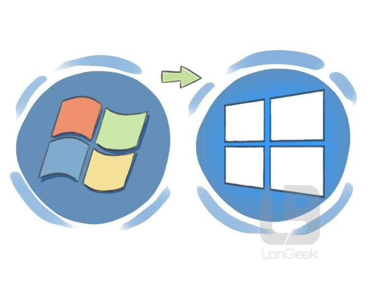

## Table of Contents

## What is the basic definition of an upgrade?

An upgrade is when you make something better or newer than it was before. It can be like getting a new version of a computer program, or adding new parts to a machine to make it work better. People often upgrade things like phones, computers, or even cars to get the latest features or to fix problems.

Upgrades can happen in many different areas of life. For example, a company might upgrade its office by getting new furniture or equipment. Or, a city might upgrade its roads by fixing potholes or adding new lanes. Upgrades usually make things more efficient, safer, or more enjoyable to use.

## Why might someone or a company consider an upgrade?

Someone or a company might consider an upgrade because it can make things work better. For example, if a computer is slow, upgrading it with more memory or a faster processor can make it run programs more quickly. This can save time and help people get more done. Companies often upgrade their equipment to keep up with new technology and stay competitive. If they don't upgrade, they might fall behind other companies that have newer, better tools.

Another reason to upgrade is to fix problems. If a machine is always breaking down, upgrading it with new parts can make it more reliable. This can save money in the long run because the company won't have to pay for as many repairs. Upgrades can also make things safer. For example, upgrading old electrical systems in a building can prevent fires and keep people safe. 

Finally, upgrades can make things more enjoyable to use. For instance, upgrading a phone to a newer model can give someone better cameras, longer battery life, and more features. This can make their daily life more fun and convenient. Companies might upgrade their offices to make them more comfortable for employees, which can make them happier and more productive.

## What are common types of upgrades in technology?

In technology, one common type of upgrade is a software upgrade. This happens when a company releases a new version of a program or app. The new version might fix bugs, add new features, or make the program run faster. People often get these upgrades for free, but sometimes they have to pay for them. For example, when a phone's operating system gets an update, it can make the phone work better and add new things to do.

Another common type of upgrade is a hardware upgrade. This means changing or adding physical parts to a device. For example, someone might add more memory to their computer to make it run faster. Or they might replace an old hard drive with a new, faster one. Hardware upgrades can make a big difference in how well a device works, but they usually cost money and might need someone with special skills to do them.

Sometimes, people upgrade their whole device instead of just parts. For instance, someone might buy a new smartphone because their old one is slow or doesn't work well anymore. Companies release new models of devices like phones, laptops, and tablets regularly, and these new models often have better features and performance. Upgrading to a new device can be expensive, but it can also make things easier and more enjoyable to use.

## How does an upgrade differ from a replacement?

An upgrade means making something better by adding new parts or updating it to a newer version. For example, if you add more memory to your computer, that's an upgrade. It makes your computer work better without getting a whole new one. Upgrades can be done to both software and hardware. When you update a program to a newer version, that's a software upgrade. If you put in a new, faster hard drive, that's a hardware upgrade.

A replacement, on the other hand, means getting rid of the old thing completely and getting a new one. For example, if your phone is too slow and you buy a new one, that's a replacement. You're not keeping any part of the old phone. Replacements are often more expensive than upgrades because you're buying a whole new item. But sometimes, a replacement is necessary if the old item is too broken or outdated to fix or improve.

In summary, an upgrade improves what you already have, while a replacement involves getting something entirely new. Both can make things work better, but they are different ways to achieve that goal.

## Can you provide examples of software upgrades?

A software upgrade is when you get a new version of a program or app. For example, if you use a smartphone, you might get a notification that there's an update for the operating system. When you install this update, your phone might get new features, like better ways to organize your apps or improved security. This makes your phone work better and can fix problems that were in the old version.

Another example of a software upgrade is when you update a computer program. Let's say you use a program to edit photos. The company that makes the program might release a new version that has tools to remove backgrounds or add special effects. When you upgrade to this new version, you can do more with your photos without having to buy a new program. Upgrades like these can make your work easier and more fun.

## What are the potential benefits of upgrading hardware?

Upgrading hardware can make your devices work much better. For example, if you add more memory to your computer, it can run programs faster and handle more tasks at once. This can save you time and make your work easier. Upgrading to a faster hard drive or a solid-state drive (SSD) can also make your computer start up quicker and open files faster. These upgrades can make a big difference in how well your device performs without needing to buy a whole new one.

Another benefit of upgrading hardware is that it can make your devices last longer. Instead of getting a new computer every few years, you can keep your old one running well by upgrading parts like the processor or graphics card. This can save you money because new computers can be expensive. Upgrading can also help you keep up with new technology without having to replace everything. For example, if a new game needs a better graphics card, you can just upgrade that part instead of buying a whole new gaming system.

## How do upgrades impact system performance?

Upgrades can make a big difference in how well a system works. When you upgrade hardware like adding more memory or a faster hard drive, your computer can run programs faster and handle more tasks at the same time. This means you can do your work quicker and your computer won't slow down as much. Software upgrades also help by fixing problems in old versions and adding new features that can make things easier to use. For example, an update to your phone's operating system might make it run smoother and add new ways to use your apps.

Upgrades can also make your system last longer. Instead of buying a new computer every few years, you can keep your old one working well by upgrading parts like the processor or graphics card. This saves you money because new computers can be expensive. Upgrades can help you keep up with new technology too. For instance, if a new game needs a better graphics card, you can just upgrade that part instead of buying a whole new gaming system. This way, you can enjoy the latest technology without spending a lot of money.

## What are the risks associated with performing an upgrade?

Upgrades can sometimes cause problems. If you're upgrading hardware, you might accidentally damage parts of your computer while trying to put in the new pieces. This can happen if you don't know what you're doing or if you're not careful. Also, if the new parts don't work well with the old ones, your computer might not work right. For example, if you put in a new graphics card but your power supply isn't strong enough, your computer might not turn on or might crash a lot.

Software upgrades can also have risks. Sometimes, a new version of a program might not work as well as the old one. It could have bugs that make it slow or cause it to crash. If you upgrade your phone's operating system, some of your old apps might not work anymore because they're not made for the new system. This can be frustrating if you rely on those apps. It's important to back up your data before you upgrade, just in case something goes wrong and you lose important files.

## How can one prepare for a successful upgrade?

Before you start an upgrade, it's a good idea to learn about what you're doing. If you're upgrading hardware, read the instructions that come with the new parts. You can also watch videos or read guides online to see how other people do it. Make sure you have all the tools you need, like screwdrivers or cables. If you're upgrading software, check if your computer meets the requirements for the new version. It's also smart to look at reviews or forums to see if other people have had problems with the upgrade.

Another important step is to back up your data. If something goes wrong during the upgrade, you don't want to lose important files or photos. You can back up your data to an external hard drive or use cloud storage. It's also a good idea to create a restore point on your computer, so you can go back to how things were before if the upgrade doesn't work out. Taking these steps can help make sure your upgrade goes smoothly and keeps your important stuff safe.

## What are some advanced upgrade strategies for IT infrastructure?

When thinking about advanced upgrade strategies for IT infrastructure, it's important to plan ahead. One strategy is to use virtualization. This means you can run multiple operating systems on one physical server. It can save money and make your system more flexible. Another strategy is to move to the cloud. Instead of having all your data and programs on your own servers, you can use services like Amazon Web Services or Microsoft Azure. This can make it easier to scale up or down as your needs change, and it can also be more secure because these companies have a lot of experience protecting data.

Another important strategy is to automate your upgrades. This means using software that can update your systems without you having to do it manually. Automation can save time and reduce the chance of mistakes. It's also smart to use a phased approach when upgrading. Instead of upgrading everything at once, you can do it in stages. This way, if something goes wrong, it won't affect your whole system. You can fix the problem in one part before moving on to the next. These strategies can help make sure your IT infrastructure stays up to date and runs smoothly.

## How do upgrades affect the lifecycle management of products?

Upgrades can make products last longer by keeping them up to date with new technology. When you upgrade a product, like adding more memory to a computer or updating its software, it can work better and do more things. This means you don't have to buy a new product as often. For example, if you upgrade your phone's operating system, it can keep up with new apps and features without needing to get a new phone. This helps save money and reduces waste because you're using the same product for a longer time.

On the other hand, upgrades can also make you want to buy new products sooner. Sometimes, when a new version of a product comes out, it can make your old one seem outdated or slow. Companies often release new models with better features to encourage people to buy them. For instance, if a new laptop has a much better screen and faster processor, you might decide to replace your old one even if it still works. This can shorten the lifecycle of products because people are more likely to upgrade to the latest and greatest.

## What are the latest trends in upgrade methodologies for enterprise systems?

In recent years, one of the big trends in upgrade methodologies for enterprise systems is moving to the cloud. Many companies are now using cloud services like Amazon Web Services, Microsoft Azure, or Google Cloud to upgrade their systems. This means they don't have to buy and maintain their own servers. Instead, they can use the cloud to easily scale up or down depending on their needs. This can save money and make it easier to keep systems up to date. Another trend is using automation to make upgrades easier. Software can now update systems without people having to do it manually. This saves time and reduces the chance of mistakes.

Another trend is using a phased approach for upgrades. Instead of upgrading everything at once, companies do it in stages. This way, if something goes wrong, it won't affect the whole system. They can fix the problem in one part before moving on to the next. This makes upgrades safer and more manageable. Also, many companies are now using virtualization, which means running multiple operating systems on one physical server. This can save money and make systems more flexible. These trends help companies keep their systems running smoothly and up to date with the latest technology.

## What is an Upgrade?

Upgrades represent positive changes in an analyst's perspective regarding the valuation of a security, driven by enhanced underlying fundamentals. These adjustments are often precipitated by an array of qualitative and quantitative information that collectively increase a security's financial valuation. The qualitative factors can include shifts in industry dynamics, improved management strategies, or advances in technology, while quantitative aspects might encompass better-than-expected earnings reports, increased revenue growth, or positive changes in key financial ratios.

Upgrades offer meaningful implications for companies, as they can facilitate lower costs of capital. When a security is upgraded, it typically signals to the market that the company's financial health and future performance projections are favorable. This perception can enhance investor confidence, thereby increasing demand for the company's stocks or bonds. A heightened demand can enable companies to access debt and equity markets more efficiently and at a reduced cost.

From a financial theory perspective, the impact of upgrades on a company's cost of capital is rooted in the Capital Asset Pricing Model (CAPM), which determines the expected return on an asset based on its systematic risk relative to the overall market. A well-regarded upgrade may result in a lower perceived risk ($\beta$) associated with holding the company's equity, consequently reducing the required rate of return. The formula used in CAPM is:

$$

E(R_i) = R_f + \beta_i (E(R_m) - R_f)
$$

where $E(R_i)$ is the expected return on the investment, $R_f$ represents the risk-free rate, $\beta_i$ is the beta of the investment, and $E(R_m)$ stands for the expected market return. By decreasing $\beta$, the expected return lowers, making it cheaper for companies to raise capital as investors are willing to accept a lower return due to decreased perceived risk.

In summary, upgrades signify an analyst's improved outlook on a security’s valuation, driven by better fundamentals. This perceived enhancement in valuation can lead to decreased capital costs, thus bolstering a company's capacity to engage with debt and equity markets on more favorable terms.

## References & Further Reading

[1]: Bergstra, J., Bardenet, R., Bengio, Y., & Kégl, B. (2011). ["Algorithms for Hyper-Parameter Optimization."](https://dl.acm.org/doi/10.5555/2986459.2986743) Advances in Neural Information Processing Systems 24.

[2]: ["Advances in Financial Machine Learning"](https://www.amazon.com/Advances-Financial-Machine-Learning-Marcos/dp/1119482089) by Marcos Lopez de Prado

[3]: ["Evidence-Based Technical Analysis: Applying the Scientific Method and Statistical Inference to Trading Signals"](https://www.amazon.com/Evidence-Based-Technical-Analysis-Scientific-Statistical/dp/0470008741) by David Aronson

[4]: ["Machine Learning for Algorithmic Trading"](https://github.com/stefan-jansen/machine-learning-for-trading) by Stefan Jansen

[5]: ["Quantitative Trading: How to Build Your Own Algorithmic Trading Business"](https://www.amazon.com/Quantitative-Trading-Build-Algorithmic-Business/dp/1119800064) by Ernest P. Chan