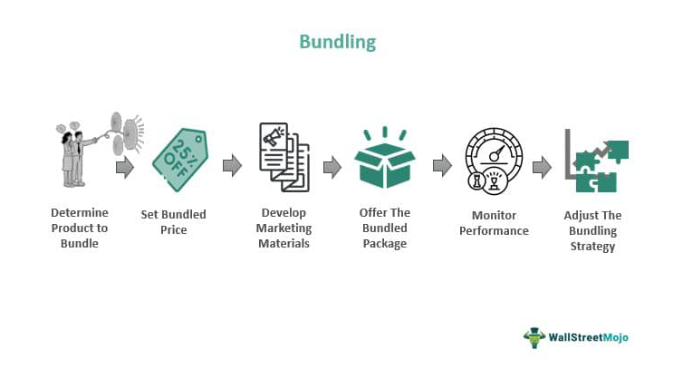

In the fast-paced world of financial markets, upgrades are a significant factor in shaping investment decisions. These changes in the evaluation of securities stem from an analyst's improved outlook, influenced by advancements in a company’s fundamentals. Upgrades are pivotal in guiding investors and traders through volatile market environments, presenting new opportunities for reallocation of portfolios.

The concept of upgrades encompasses a broad spectrum of financial instruments, where an improved rating or valuation indicates a security's better health. These upgrades may result from positive shifts in financial metrics, operational efficiency, or market conditions. As a result, they can lower a company's cost of capital and enhance its ability to secure funding through debt and equity markets. This, in turn, piques investor interest and can lead to tangible movements in stock prices and other securities.



In algorithmic trading, upgrades are integral components that inform trading strategies. Algorithms leverage upgrade information to adjust investment positions in real-time, optimizing portfolio performance. By analyzing patterns in upgrade announcements, algorithmic systems predict market trends, allowing traders to stay ahead in competitive trading arenas. 

This article will explore the intricacies of upgrades, detailing their mechanisms and influence on financial markets, particularly in the context of algorithmic trading. We will examine real-world examples, highlighting the importance of upgrades for both traditional and algorithmic traders. By understanding the dynamics of upgrades, investors can make informed decisions that harness these changes for profitable outcomes.

## Table of Contents

## What is an Upgrade?

Upgrades represent positive changes in an analyst's perspective regarding the valuation of a security, driven by enhanced underlying fundamentals. These adjustments are often precipitated by an array of qualitative and quantitative information that collectively increase a security's financial valuation. The qualitative factors can include shifts in industry dynamics, improved management strategies, or advances in technology, while quantitative aspects might encompass better-than-expected earnings reports, increased revenue growth, or positive changes in key financial ratios.

Upgrades offer meaningful implications for companies, as they can facilitate lower costs of capital. When a security is upgraded, it typically signals to the market that the company's financial health and future performance projections are favorable. This perception can enhance investor confidence, thereby increasing demand for the company's stocks or bonds. A heightened demand can enable companies to access debt and equity markets more efficiently and at a reduced cost.

From a financial theory perspective, the impact of upgrades on a company's cost of capital is rooted in the Capital Asset Pricing Model (CAPM), which determines the expected return on an asset based on its systematic risk relative to the overall market. A well-regarded upgrade may result in a lower perceived risk ($\beta$) associated with holding the company's equity, consequently reducing the required rate of return. The formula used in CAPM is:

$$

E(R_i) = R_f + \beta_i (E(R_m) - R_f)
$$

where $E(R_i)$ is the expected return on the investment, $R_f$ represents the risk-free rate, $\beta_i$ is the beta of the investment, and $E(R_m)$ stands for the expected market return. By decreasing $\beta$, the expected return lowers, making it cheaper for companies to raise capital as investors are willing to accept a lower return due to decreased perceived risk.

In summary, upgrades signify an analyst's improved outlook on a security’s valuation, driven by better fundamentals. This perceived enhancement in valuation can lead to decreased capital costs, thus bolstering a company's capacity to engage with debt and equity markets on more favorable terms.

## How Upgrades Work

An upgrade in the financial markets assigns a higher ranking to a security, such as a stock or bond, often resulting in increased investor confidence and demand. When a security receives an upgrade, it indicates a more favorable valuation based on quantitative and qualitative assessments of the issuer's performance, prospects, and market conditions. Analysts from research institutions, rating agencies, and financial institutions are typically responsible for issuing these upgrades after evaluating various financial indicators such as earnings growth, cash flow, and market position.

For instance, if a company's financial metrics, such as revenue or profit margins, show significant improvement, analysts might revise their outlook and change the security's rating from "hold" to "buy." This change signals to investors that the security may be undervalued and poised for growth, which can drive demand and potentially increase the security's price.

In [algorithmic trading](/wiki/algorithmic-trading), upgrades play a crucial role by serving as a signal for algorithms to adjust their strategies and asset allocations. Algorithms are designed to process large volumes of data rapidly, incorporating such upgrades into their decision-making processes to optimize trading outcomes. 

Consider a simple algorithmic trading strategy where an upgrade acts as a trigger to buy additional shares of a security. The algorithm might be programmed to reallocate portfolio resources based on the revised ratings, enhancing the portfolio's potential returns. Python pseudocode for such a strategy might look like this:

```python
def trading_strategy(security, upgrade_signal):
    if upgrade_signal:
        increase_allocation(security)
    else:
        maintain_allocation(security)

def increase_allocation(security):
    # Logic to calculate the percentage increase based on upgrade details
    additional_allocation = calculate_increase(security)
    execute_trade(security, additional_allocation)
```

In this way, upgrades not only influence investor behavior but also impact algorithmic strategies by triggering dynamic responses tailored to capitalize on the perceived new value of a security.

## Examples of Upgrades in Trading

Stock upgrades, like changing a rating from 'hold' to 'buy', hold significant influence over market dynamics. When an analyst or financial institution revises a stock's rating upward, it can lead to heightened investor interest and increased buying activity. This demand surge often results in noticeable stock price appreciation. For instance, if a technology company's stock is upgraded due to its robust growth prospects and innovative product pipeline, investors may react swiftly by purchasing shares, pushing the stock price higher. Such movements create opportunities for traders to realize gains through short-term market fluctuations.

Credit rating upgrades, such as moving a bond rating from BBB to A, indicate enhanced financial stability and reduced credit risk for the issuing entity. A higher credit rating implies that the issuer has better creditworthiness, potentially resulting in a lower cost of borrowing. This can lead to a positive market reaction as bond investors reassess the issuer's risk profile. The market may interpret this as a signal of stronger financial health, prompting increased demand for the bond and a subsequent rise in its price. As a result, traders who anticipate these upgrades can adjust their portfolios accordingly to capture the benefits.

Algorithmic traders leverage upgrades by integrating them into their trading algorithms to optimize portfolio performance. By utilizing advanced data analytics, algorithms can swiftly interpret and react to upgrade announcements. For example, a Python script might monitor real-time data feeds for stock or bond upgrades, analyze the historical impact of similar events, and execute trades that align with predicted market outcomes. Here's a simple example of how a Python script could function:

```python
import requests
from datetime import datetime
import pandas as pd

# Function to check for stock upgrades
def fetch_stock_upgrades(): 
    # Placeholder URL for a financial data provider's API
    url = "https://api.financialdata.com/upgrades"
    response = requests.get(url)
    return response.json()

# Function to execute trade based on upgrade signal
def execute_trade(stock, action):
    print(f"Executing {action} for {stock} at {datetime.now()}")

# Monitoring stock upgrades
upgrades = fetch_stock_upgrades()

# Analyzing and reacting to upgrades
for upgrade in upgrades:
    if upgrade['action'] == 'buy':
        execute_trade(upgrade['stock'], upgrade['action'])
```

This hypothetical example illustrates how algorithmic traders can systematically incorporate upgrade data into their trading activities. By promptly acting on upgrades, algorithmic traders aim to exploit inefficiencies and price movements, optimizing their portfolio's performance over time. However, such strategies require careful calibration, considering the nuances and potential overreactions of the market to ensure sustainable profitability.

## The Role of Upgrades in Algorithmic Trading

Algorithmic trading leverages various data inputs to make precise and timely trading decisions. Among these inputs, upgrades—an improvement in the analyst's outlook on a security's valuation—play a critical role. These upgrades can significantly influence the decision-making processes of algorithmic trading systems by providing crucial signals related to market potential and asset valuations.

AI and [machine learning](/wiki/machine-learning) algorithms are fundamental to the process of analyzing upgrade data to predict market trends and make adjustments to trading strategies. These algorithms can process vast amounts of data to identify patterns that might signal an opportunity. For instance, natural language processing (NLP) techniques can be utilized to analyze the sentiment and implications of upgrades from financial analyst reports and news articles.

Once upgrade data is collected and processed, algorithms can enhance their predictive power by integrating these signals into their trading models. This integration can be accomplished through different methodologies, such as supervised learning where models are trained on historical upgrade data and corresponding market reactions to predict future movements. The unique ability of machine learning models to adapt to changing market conditions makes them particularly useful for integrating upgrades into trading strategies.

Here is a simple conceptual Python example using scikit-learn to demonstrate how machine learning might be employed to utilize upgrade data for refining trading strategies:

```python
from sklearn.ensemble import RandomForestClassifier
from sklearn.model_selection import train_test_split

# Historical data: features include upgrade sentiments, prior stock movements, etc.
X = load_features()
y = load_target()  # target: positive/negative stock movement

# Split data into training and test sets
X_train, X_test, y_train, y_test = train_test_split(X, y, test_size=0.2, random_state=42)

# Create and train the model
model = RandomForestClassifier(n_estimators=100, random_state=42)
model.fit(X_train, y_train)

# Predict stock movements based on upgrades
predictions = model.predict(X_test)
```

Integrating upgrades into trading algorithms can also enhance responsiveness, allowing systems to execute trades at the optimal time. For algorithmic trading systems to remain competitive, they must quickly adjust their strategies when upgrades suggest a reevaluation of a security's potential. This immediacy can lead to capturing more favorable trading opportunities, thus maximizing returns while minimizing risks.

Overall, upgrades represent a valuable input for algorithmic trading, assisting these systems in maintaining accuracy and agility in dynamic financial markets. Their effective integration ensures that trading algorithms can predict market movements more effectively, thus securing performance advantages over less sophisticated trading approaches.

## Challenges and Considerations

Market reaction to upgrades can be complex and unpredictable, often resulting in overreactions that may distort the short-term pricing of securities. An upgrade, by its nature, signals improved prospects for a security, yet the extent of this impact can vary. For instance, when a reputable analyst or well-regarded rating agency issues an upgrade, it tends to [carry](/wiki/carry-trading) more weight in the market, potentially leading to more pronounced price movements. Conversely, upgrades from less credible sources may be met with skepticism, dampening their immediate market influence.

The impact of an upgrade is not uniform; factors such as the timing of the upgrade, the overall market conditions, and the specific asset class involved can all play significant roles. For example, an upgrade announced during a bull market may lead to sharper price increases as investor sentiment is already positive. In contrast, in a bear market, the same upgrade may be insufficient to overcome prevailing negative sentiments.

For algorithmic trading, these nuances present both opportunities and challenges. Algorithms must be designed to parse and evaluate the credibility and context of each upgrade. Advanced algorithms often incorporate natural language processing (NLP) techniques to assess textual data from analyst reports or news articles associated with upgrades. This approach can help algorithms differentiate between highly credible and less credible sources, thus refining trading decisions.

Moreover, algorithmic strategies must also account for the potential of market overreactions. An initial spike in price following an upgrade may not be sustainable, and algorithms should be equipped to identify and execute trades that take advantage of temporary mispricings. This requires real-time data processing capabilities and sophisticated models that estimate not only the direction but also the magnitude of price changes.

Here is a simple Python example demonstrating how one might set up a basic function to evaluate the credibility of an upgrade source:

```python
def evaluate_credibility(analyst, past_performance_metrics):
    """
    Evaluates the credibility of an analyst based on historical performance metrics.

    Parameters:
    analyst (str): The name or identifier for the analyst or rating agency.
    past_performance_metrics (dict): A dictionary containing historical data on accuracy, 
    market impact, etc.

    Returns:
    float: A credibility score ranging from 0 to 1.
    """
    # Example metrics
    accuracy = past_performance_metrics.get('accuracy', 0)
    influence = past_performance_metrics.get('market_influence', 0)

    # Simple credibility formula (for illustration purposes)
    credibility_score = (0.6 * accuracy + 0.4 * influence) / 100

    return credibility_score

# Example usage
analyst_performance = {'accuracy': 85, 'market_influence': 75}
credibility = evaluate_credibility('Analyst A', analyst_performance)
print(f"Credibility Score: {credibility:.2f}")
```

Incorporating such assessments into algorithmic trading strategies can significantly reduce the risk of erroneous trades based on unreliable upgrades. Traders and developers should ensure that algorithms remain adaptable, continuously learning from new data and market conditions to maintain robustness. This approach helps optimize the trading strategy’s performance over time and mitigates potential pitfalls associated with varying upgrade impacts.

## Conclusion

In the fast-paced domain of financial markets, understanding the significance of upgrades is pivotal for investors aiming to leverage market fluctuations effectively. Upgrades, which reflect positive changes in an analyst's view of a security's valuation, play a crucial role in shaping trading strategies and investment decisions. As financial markets become increasingly data-driven, the incorporation of upgrades into algorithmic trading frameworks becomes essential. These upgrades serve not just as indicators of improving fundamentals but also as signals that can trigger adjustments in trading models.

With the advancement of technology and the proliferation of algorithmic trading, staying abreast of upgrades can provide a significant competitive advantage. Algorithms that incorporate upgrade data can enhance their predictive power, making well-informed decisions based on changes in market valuations and price expectations. For example, an algorithm designed to respond to an upgrade might reallocate portfolio assets to maximize returns, relying on historical performance trends and market sentiment.

To maintain an edge in an ever-evolving trading landscape, traders must remain vigilant, continuously monitoring upgrades and adjusting their strategies accordingly. By doing so, they can capitalize on opportunities presented by changes in market sentiment and analyst outlooks. This proactive approach ensures that market participants are not merely reacting to market changes but are anticipating them and positioning themselves advantageously.

In summary, the integration of upgrades within trading methodologies is not just a matter of seizing opportunities; it is a fundamental component of a well-rounded trading strategy. As algorithmic trading continues to evolve, understanding and utilizing upgrades will remain a cornerstone for investors seeking to harness the dynamism of financial markets.

## References & Further Reading

[1]: Bergstra, J., Bardenet, R., Bengio, Y., & Kégl, B. (2011). ["Algorithms for Hyper-Parameter Optimization."](https://dl.acm.org/doi/10.5555/2986459.2986743) Advances in Neural Information Processing Systems 24.

[2]: ["Advances in Financial Machine Learning"](https://www.amazon.com/Advances-Financial-Machine-Learning-Marcos/dp/1119482089) by Marcos Lopez de Prado

[3]: ["Evidence-Based Technical Analysis: Applying the Scientific Method and Statistical Inference to Trading Signals"](https://www.amazon.com/Evidence-Based-Technical-Analysis-Scientific-Statistical/dp/0470008741) by David Aronson

[4]: ["Machine Learning for Algorithmic Trading"](https://github.com/stefan-jansen/machine-learning-for-trading) by Stefan Jansen

[5]: ["Quantitative Trading: How to Build Your Own Algorithmic Trading Business"](https://www.amazon.com/Quantitative-Trading-Build-Algorithmic-Business/dp/1119800064) by Ernest P. Chan