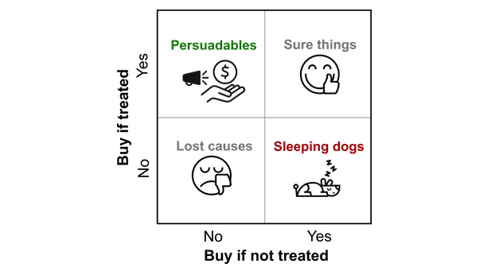

## Table of Contents

## What is Uplift Modeling in the context of machine learning?

Uplift modeling is a type of machine learning technique used to predict the effect of an action on an individual's behavior. Imagine you are a company wanting to send out promotional emails. Uplift modeling helps you figure out which customers are most likely to buy more because of the email, and which ones would buy the same amount even without it. This way, you can target your emails more effectively and save resources.

The main idea behind uplift modeling is to estimate the difference in outcomes with and without the treatment. For example, if you want to see if a discount will make someone spend more, you compare what they would spend with the discount to what they would spend without it. This difference, called the uplift, is what the model tries to predict. By focusing on this uplift, companies can make better decisions about where to spend their marketing efforts.

To build an uplift model, data scientists often use techniques like causal inference and machine learning algorithms. They might split their data into groups, some of which get the treatment (like the discount) and some of which do not. Then, they use this data to train a model that can predict the uplift for new customers. This approach helps businesses target their actions more precisely and improve their overall effectiveness.

## How does Uplift Modeling differ from traditional predictive modeling?

Uplift modeling and traditional predictive modeling have different goals. Traditional predictive modeling focuses on predicting an outcome, like whether a customer will buy a product. It uses data to guess what will happen based on what has happened before. For example, if you want to know if someone will buy a product, you might look at their past purchases and other information to make a prediction. The model tries to find patterns in the data that help it make accurate guesses.

On the other hand, uplift modeling tries to predict how an action, like sending a promotional email, will change someone's behavior. It's not just about guessing what will happen; it's about figuring out the impact of a specific action. For example, if you want to know if a discount will make someone buy more, uplift modeling looks at the difference between what they would buy with the discount and what they would buy without it. This difference, called the uplift, is what the model tries to predict. By focusing on this, companies can target their actions more effectively and see better results.

In summary, while traditional predictive modeling is about predicting an outcome based on existing data, uplift modeling is about predicting the change in an outcome due to a specific action. This makes uplift modeling particularly useful for marketing and other areas where understanding the impact of interventions is key.

## What are the main applications of Uplift Modeling?

Uplift modeling is widely used in marketing to make campaigns more effective. Companies use it to figure out which customers will buy more if they get a special offer or a discount. By sending offers only to those who will respond, companies save money and make their marketing efforts better. For example, a store might use uplift modeling to decide which customers to send a coupon to, so they can increase sales without wasting resources on people who won't use the coupon.

Another big use of uplift modeling is in healthcare. Doctors and researchers use it to see how different treatments affect patients. They can predict which patients will get better with a new medicine or a different kind of treatment. This helps them give the right treatment to the right people, making healthcare more personalized and effective. For instance, a hospital might use uplift modeling to decide which patients to include in a new treatment program, so they can improve patient outcomes.

Uplift modeling also finds applications in other fields like finance and education. In finance, banks might use it to decide which customers to offer a new credit card to, to increase the chances of acceptance. In education, schools might use it to see which students will benefit from extra tutoring. By focusing on the impact of specific actions, uplift modeling helps make decisions smarter and more targeted across various industries.

## Can you explain the basic concept of treatment and control groups in Uplift Modeling?

In uplift modeling, we use treatment and control groups to figure out how an action changes someone's behavior. The treatment group is the group of people who get the action, like a discount or a special offer. The control group is the group of people who don't get the action. By comparing what happens in these two groups, we can see the difference the action makes. This difference is called the uplift.

For example, if you want to know if sending a coupon will make people buy more, you would give the coupon to the treatment group but not to the control group. Then, you look at how much more the treatment group buys compared to the control group. If the treatment group buys a lot more, that means the coupon had a big uplift effect. By studying this, you can predict the uplift for new people and decide who to send the coupon to in the future.

## What are the common methods used to estimate uplift?

To estimate uplift, one common method is the Two-Model Approach. This method involves building two separate models: one for the treatment group and another for the control group. The first model predicts the outcome for people who receive the treatment, while the second model predicts the outcome for those who do not. The uplift is then calculated as the difference between the predicted outcomes of these two models. For example, if the treatment model predicts a customer will spend $100 with a coupon and the control model predicts they would spend $80 without it, the uplift is $20. This approach is simple but can be effective for understanding how an action changes behavior.

Another method is the Single-Model Approach, which uses one model to directly predict the uplift. This model is trained on data that includes both treatment and control groups, and it tries to estimate the difference in outcomes between the two. This can be done using various [machine learning](/wiki/machine-learning) algorithms that take into account the treatment variable. The advantage of this method is that it can be more accurate because it focuses directly on the uplift rather than on separate predictions for treated and untreated groups. However, it can be more complex to set up and requires careful consideration of how to represent the treatment effect in the model.

A third method is the Causal Inference Approach, which uses statistical techniques to estimate the causal effect of the treatment. This often involves methods like propensity score matching, where individuals in the treatment group are matched with similar individuals in the control group based on certain characteristics. The difference in outcomes between these matched pairs gives an estimate of the uplift. This method is particularly useful when you want to make sure that the estimated uplift is due to the treatment and not other factors. By carefully controlling for confounding variables, causal inference methods can provide a more reliable estimate of the true uplift effect.

## How do you measure the effectiveness of an Uplift Model?

To measure the effectiveness of an uplift model, you look at how well it predicts the difference in outcomes between the treatment and control groups. One common way to do this is by using a metric called the Qini coefficient. The Qini coefficient measures the uplift model's ability to identify people who will respond positively to the treatment. A higher Qini coefficient means the model is better at finding the right people to target. You can plot the Qini curve, which shows the cumulative uplift as you target more and more people, and compare it to a random targeting strategy to see how much better your model is.

Another way to measure the effectiveness of an uplift model is by looking at the actual impact on business outcomes. For example, if you're using the model to send out promotional emails, you can compare the increase in sales or customer engagement for those who received the email based on the model's recommendations versus those who received it randomly. If the model's group shows a higher increase, it means the model is working well. By tracking these real-world results, you can see if the model is helping you make better decisions and improve your marketing efforts.

## What challenges are typically encountered when implementing Uplift Modeling?

One of the main challenges in implementing uplift modeling is getting enough good data. You need data from both the treatment and control groups to train your model. This means you have to run experiments where some people get the treatment and others don't. Sometimes, it's hard to do this because it might not be fair or practical to leave some people out. Also, the data you collect needs to be clean and accurate, which can be a lot of work.

Another challenge is choosing the right method to estimate the uplift. There are different ways to do this, like the two-model approach, the single-model approach, or causal inference methods. Each method has its own pros and cons, and [picking](/wiki/asset-class-picking) the best one can be tricky. You need to think about what kind of data you have and what you want to achieve. If you choose the wrong method, your model might not work well, and you could end up making bad decisions.

Finally, measuring the effectiveness of an uplift model can be complicated. You need to use special metrics like the Qini coefficient to see how well your model is doing. But even then, it's hard to be sure that the model is really helping you make better decisions. You have to keep an eye on real-world results, like how much more people buy after getting a special offer. If the model isn't helping, you might need to go back and improve it, which takes time and effort.

## Can you describe the difference between a single-model and a two-model approach in Uplift Modeling?

The single-model approach in uplift modeling uses one model to directly predict the difference in outcomes between the treatment and control groups. This model is trained on data that includes both groups, and it tries to estimate the uplift by considering the treatment variable. The advantage of this method is that it can be more accurate because it focuses directly on the uplift, rather than on separate predictions for treated and untreated groups. However, setting up a single-model approach can be more complex, as you need to carefully design how the treatment effect is represented in the model. For example, you might use a model that includes an interaction term between the treatment and other features to capture the uplift effect.

The two-model approach, on the other hand, involves building two separate models: one for the treatment group and another for the control group. The first model predicts the outcome for people who receive the treatment, while the second model predicts the outcome for those who do not. The uplift is then calculated as the difference between the predicted outcomes of these two models. For instance, if the treatment model predicts a customer will spend $100 with a coupon and the control model predicts they would spend $80 without it, the uplift is $20. This approach is simpler to set up and understand but might be less accurate than a single-model approach because it relies on the difference between two separate predictions.

Both approaches have their strengths and weaknesses. The single-model approach can be more precise but requires more careful design and possibly more data. The two-model approach is easier to implement and interpret but might not capture the uplift as accurately. Choosing between them depends on your specific needs, the data you have, and the complexity you're willing to handle.

## What are some advanced techniques for improving the accuracy of Uplift Models?

One advanced technique for improving the accuracy of uplift models is using machine learning algorithms that can handle interactions between features and the treatment variable. For example, you can use tree-based models like Random Forests or Gradient Boosting Machines, which are good at capturing complex relationships. These models can include the treatment as a feature and use it to split the data, helping to identify how different groups of people respond to the treatment. This can lead to more accurate predictions of the uplift because the model can better understand how the treatment affects different types of people.

Another technique is to use [deep learning](/wiki/deep-learning) models, like neural networks, to estimate the uplift. Neural networks can learn very complex patterns in the data, which can be useful for finding subtle differences in how people respond to treatments. By including the treatment variable as an input, the [neural network](/wiki/neural-network) can learn to predict the uplift directly. This can be especially helpful when you have a lot of data and want to capture very detailed interactions between the treatment and other features. However, deep learning models can be harder to interpret and might need a lot of data to work well.

## How can Uplift Modeling be integrated with other machine learning techniques?

Uplift modeling can be combined with other machine learning techniques to make it even better. For example, you can use clustering to group people into different categories before you try to predict their uplift. This way, you can make separate uplift models for each group, which might work better because people in the same group are more similar. Another way to combine techniques is to use feature selection methods to pick the most important pieces of information to use in your uplift model. By choosing the right features, you can make your model more accurate and easier to understand.

Another way to integrate uplift modeling with other techniques is to use ensemble methods. This means you can combine the predictions from different uplift models to get a better overall prediction. For example, you could use a Random Forest model and a Gradient Boosting model to predict uplift, and then combine their predictions to get a final result. This can help because different models might be good at different things, and combining them can give you the best of both worlds. By working together with other machine learning techniques, uplift modeling can become more powerful and help you make even better decisions.

## What are the ethical considerations when using Uplift Modeling in marketing?

When using uplift modeling in marketing, it's important to think about ethics. One big issue is fairness. Uplift models might treat different people differently based on their predicted response to a marketing action. This could lead to some people getting better offers than others, which might not be fair. For example, if the model decides not to send a discount to certain groups of people because it thinks they won't respond, those people might miss out on good deals. Companies need to make sure their models don't unfairly leave some people out or give them worse treatment.

Another ethical consideration is privacy. Uplift models use a lot of personal data to make predictions. This data can include things like what people buy, where they live, and even their online behavior. Companies need to be careful about how they collect and use this data. They should make sure they have people's permission to use their information and keep it safe. If people feel their privacy is being invaded, they might not trust the company anymore. Balancing the need for good data with respecting people's privacy is a key challenge in using uplift modeling ethically.

## What future developments can we expect in the field of Uplift Modeling?

In the future, we can expect uplift modeling to become even more accurate and useful. As more data becomes available and technology improves, uplift models will be able to predict how people will respond to marketing actions even better. This means companies will be able to target their marketing efforts more precisely and save money by not wasting resources on people who won't respond. Also, new machine learning techniques, like advanced neural networks and ensemble methods, will help make uplift models smarter. These techniques can capture very complex patterns in the data, making the models more powerful and reliable.

Another big development we might see is the integration of uplift modeling with other technologies, like [artificial intelligence](/wiki/ai-artificial-intelligence) and big data analytics. This could lead to real-time uplift modeling, where companies can adjust their marketing strategies on the fly based on how people are responding. For example, if a company sees that a certain group of people is responding well to a new offer, it can quickly send that offer to more people in that group. Also, as people become more concerned about privacy and fairness, we'll see more focus on making sure uplift models are used in ethical ways. Companies will need to be careful about how they collect and use data, making sure they respect people's privacy and treat everyone fairly.

## References & Further Reading

[1]: Radcliffe, N. J., & Surry, P. D. (2011). ["Real-World Uplift Modelling with Significance-Based Uplift Trees."](https://www.stochasticsolutions.com/pdf/sig-based-up-trees.pdf) Stochastic Solutions.

[2]: Gutierrez, P., & Gérardy, J. Y. (2016). ["Causal Inference and Uplift Modelling: A Review of the Literature."](https://proceedings.mlr.press/v67/gutierrez17a/gutierrez17a.pdf) European Journal of Operational Research.

[3]: Kane, K., Lo, V. S. Y., & Zheng, J. L. (2014). ["Mining for the truly responsive customers and prospects using true-lift modeling: Comparison of new and existing methods."](https://link.springer.com/article/10.1057/jma.2014.18) Journal of Marketing Analytics.

[4]: Hansotia, B., & Rukstales, B. (2002). ["Incremental value modeling."](https://www.sciencedirect.com/science/article/pii/S1094996802701618) Journal of Advertising Research.

[5]: Zhao, Y., & Fang, X. (2018). ["Uplift Modeling: Everything You Wanted to Know but Were Afraid to Ask."](https://arxiv.org/abs/1705.08492) Harvard Business Review.