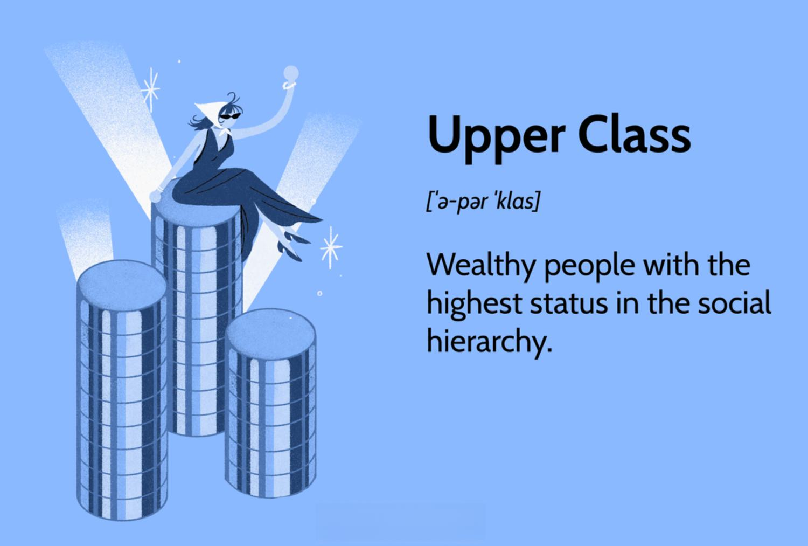

Income levels and social classes have long been pivotal elements in analyzing economic inequalities and societal dynamics. Traditionally, societies have been categorized into various social classes, each characterized by distinct economic statuses, roles, and influences. These classes often reflect disparities in wealth, living standards, and access to resources, thereby shaping the broader social structure.

With the advent of technological advancements, particularly algorithmic trading, the landscape of finance has experienced significant transformations. Algorithmic trading involves using computer algorithms to automatically execute trades based on predetermined criteria. This technology has become increasingly prevalent in financial markets, providing those with access the opportunity to generate substantial wealth swiftly. Consequently, this progress has further accentuated income distribution disparities and shifted the dynamics within social classes.



The upper class, historically defined by extensive wealth and influence, has demonstrated a pronounced capacity to shape financial markets. By leveraging algorithmic trading tools, this group has amplified its economic power, securing an advantageous position in financial markets. Their ability to influence market trends, combined with substantial resources, often leads to a reinforcement of existing economic hierarchies. 

Meanwhile, an overview of social classes reveals a spectrum ranging from the upper class to the middle and lower classes. Each class exhibits unique economic characteristics. The upper class is largely marked by significant wealth accumulation, high income, and influence over economic and political decisions. In contrast, the middle class, typically characterized by stable income and moderate wealth, plays a crucial role in consumption and economic growth. The lower class often faces challenges related to limited financial resources, leading to reduced economic mobility and access to opportunities.

As algorithmic trading continues to grow more sophisticated and prevalent, it raises important questions regarding its impact on income distribution and social dynamics. The integration of technology into trading amplifies existing inequalities by granting more significant advantages to those already in positions of wealth and power, often leaving others with limited access to these tools and benefits. 

Thus, the intersection of income levels, social classes, and algorithmic trading necessitates a comprehensive understanding of these elements and their implications for future socio-economic landscapes. Addressing these disparities is crucial to fostering a more equitable financial ecosystem, where technological advancements benefit society and reduce, rather than exacerbate, existing inequalities.

## Table of Contents

## Understanding Social Classes: A Brief Overview

Social classes represent hierarchical distinctions within a society, often categorized by economic, cultural, and social factors. Traditionally, social classes are divided into three main categories: upper, middle, and lower classes. Each category is characterized by its own distinct attributes, lifestyle patterns, and economic roles.

The upper class is typically defined by significant wealth, substantial income, and often, inherited assets. Members of this class usually wield considerable economic power and influence, frequently holding prominent positions in business or politics. Their wealth allows them to engage in luxurious consumption patterns, invest in a wide array of financial instruments, and often, partake in exclusive societal circles. The economic power of the upper class enables them to significantly influence market trends and policy decisions, thereby perpetuating their economic status and privilege.

In contrast, the middle class is generally associated with moderate levels of income and education. This class plays a crucial role in driving economic consumption and is often seen as the cornerstone of a stable and functional economy. The middle class typically enjoys a comfortable lifestyle, characterized by homeownership, access to higher education, and relative economic security. However, the middle class often faces vulnerabilities related to economic downturns and shifts in policy that may affect employment and income stability.

The lower class, often consisting of individuals with limited income or in precarious employment situations, faces various economic challenges. These may include inadequate access to education and healthcare, lower levels of job security, and restricted social mobility. Consequently, the lower class often experiences a disproportionate share of economic hardship, which is further exacerbated by systemic barriers and inequalities.

Social class significantly influences consumption patterns and wealth distribution within a society. For example, while the upper class spends a higher proportion of their income on luxury goods and investments, the middle and lower classes tend to allocate more towards basic necessities and essential services. This disparity in consumption contributes to broader patterns of wealth distribution, often leading to increased economic inequality.

In summary, social classes are defined by distinct economic characteristics that influence consumption habits and the distribution of wealth. The upper class holds considerable economic power and influence, shaping both market dynamics and policy, while the middle and lower classes exhibit differing levels of economic security and consumption patterns, which reflect and perpetuate existing socioeconomic disparities.

## Income Levels and Economic Disparities

Income distribution among different social classes remains a focal point in understanding economic disparities. According to the latest data from sources like the U.S. Census Bureau and the World Inequality Database, income inequality has been on the rise over the past few decades. The top 10% hold a disproportionate share of total income compared to the bottom 90%.

For instance, in the United States, the top 1% of earners captured nearly 20% of the total national income in recent years, showcasing a significant divide from their economic counterparts in the middle and lower classes. This growing income gap is also mirrored globally, emphasizing a common trend in many developed and developing countries.

Factors contributing to these economic disparities include globalization, technological advancements, educational attainment, and labor market policies. Technological advancements, particularly in automation and digital technologies, have led to greater demand for high-skilled labor while reducing the demand for routine manual jobs, negatively impacting lower-skilled workers. This shift has resulted in a premium on education and skills, creating a wage disparity based on educational attainment.

Globalization has enabled the integration of markets and economies, leading to increased competition and opportunities but also has resulted in job displacement in certain industries. Additionally, labor market policies and the decline in labor union power have contributed to stagnant wages for the middle and lower classes, further exacerbating income inequality.

Income plays a pivotal role in determining social class and status, often dictating one's access to resources, education, and opportunities. The upper class, despite being a smaller percentage of the population, holds significant economic power and influence. This economic clout enables them to leverage opportunities such as investments in financial markets, including [algorithmic trading](/wiki/algorithmic-trading), which can further enhance their wealth and solidify their social standing.

Understanding these income gaps and their underpinnings is crucial for developing effective policy measures aimed at reducing disparities and promoting a more balanced socio-economic structure. Addressing these issues involves not only economic reforms but also educational and social policies that aim to provide equitable access to opportunities for all social classes.

## Algorithmic Trading: A Modern Financial Tool

Algorithmic trading, also known as automated or black-box trading, refers to the use of computer algorithms to execute trades in financial markets. These algorithms, governed by predefined instructions and quantitative models, allow for high-frequency trading and are capable of processing vast amounts of financial data at speeds beyond human capability.

### Role in Wealth Creation for the Upper Class

Algorithmic trading has become a prominent tool in wealth augmentation for the upper class, characterized by significant resources and access to advanced technologies. Wealthier individuals and institutional investors, such as hedge funds and investment banks, typically have the financial means to develop sophisticated algorithms. These entities leverage complex mathematical models and vast historical data sets to optimize trading strategies, capitalize on market inefficiencies, and achieve returns that often surpass traditional trading methods.

For instance, hedge funds like Renaissance Technologies and Two Sigma deploy algorithmic trading at the core of their investment strategies, contributing to considerable profits. The technology provides a competitive edge by exploiting minute price discrepancies, [liquidity](/wiki/liquidity-risk-premium) conditions, and [volatility](/wiki/volatility-trading-strategies) patterns unknown to the general investing public.

### Technological Advancements

The popularity of algorithmic trading is driven by several technological advancements. High-speed internet and powerful computing systems enable swift data processing and trade execution. Furthermore, innovations in [artificial intelligence](/wiki/ai-artificial-intelligence), particularly [machine learning](/wiki/machine-learning), allow algorithms to evolve by learning from past trades and adapting to new market conditions. 

Python, due to its simplicity and extensive libraries, has become a preferred language for developing trading algorithms. Libraries like NumPy, pandas, and Scikit-learn facilitate data analysis and model building. Here's a basic example of a moving average crossover strategy, often used in algorithmic trading:

```python
import numpy as np 
import pandas as pd

# Load historical price data
data = pd.read_csv('historical_price_data.csv')

# Calculate moving averages
short_window = 40
long_window = 100

data['short_mavg'] = data['Close'].rolling(window=short_window, min_periods=1, center=False).mean()
data['long_mavg'] = data['Close'].rolling(window=long_window, min_periods=1, center=False).mean()

# Create trading signals
data['signal'] = 0.0
data['signal'][short_window:] = np.where(
    data['short_mavg'][short_window:] > data['long_mavg'][short_window:], 1.0, 0.0
)

# Generate trading orders
data['positions'] = data['signal'].diff()

print(data[['Close', 'short_mavg', 'long_mavg', 'signal', 'positions']])
```

### Influence on Global Financial Markets

Algorithmic trading holds a substantial sway over global financial markets. By facilitating rapid trade execution, it contributes to market liquidity and competitive pricing. However, it can also introduce systemic risks, as demonstrated during the Flash Crash of May 6, 2010, where an automated trading program triggered a massive sell-off, temporarily wiping out nearly $1 trillion in market value within minutes.

The increasing prevalence of algorithmic trading necessitates ongoing vigilance and regulation to prevent market disruptions and ensure a level playing field for all market participants. Regulators worldwide are continually seeking to balance the benefits of such technology against its potential pitfalls to maintain market integrity and investor confidence.

## Algorithmic Trading and Social Class Dynamics

Algorithmic trading, often characterized by its use of pre-programmed codes and high-speed computation, has become a transformative force in modern financial markets. Its accessibility, however, is largely skewed, creating potential for increased economic disparity, especially in its impact on social class dynamics.

The upper class, leveraging significant capital and resources, has distinct advantages in utilizing automated trading strategies. These advantages include access to more sophisticated algorithms and high-frequency trading ([HFT](/wiki/high-frequency-trading-strategies)) infrastructures, often housed within close proximity to exchange servers to maximize transaction speed. This proximity, known as co-location, offers millisecond advantages that can result in significant financial gains. Furthermore, the upper class can afford to employ skilled data scientists and financial experts to refine these trading algorithms continuously, ensuring sustained profitability.

Middle and lower classes, on the other hand, often lack these resources. While algorithmic trading platforms are available to retail investors, these platforms often lack the advanced capabilities and speed advantages accessible to wealthier investors and institutions. Middle-class investors may utilize basic algorithmic tools, but without similar access to cutting-edge technology and market data, they cannot compete effectively with professional setups. This disparity limits potential growth in wealth accumulation for the middle and lower classes, potentially exacerbating existing economic divides.

To address these inequities, potential policy implications and regulations must be considered. One approach could involve implementing regulations that democratize access to trading technology. This might include mandating more transparent pricing for co-location services and ensuring that high-frequency trading practices do not unfairly disadvantage retail investors. Additionally, educational initiatives aimed at enhancing financial literacy could empower a broader demographic to engage meaningfully with algorithmic trading technologies. Equally, tax policies targeting short-term gains from high-frequency trading could be structured to redistribute wealth more equitably.

In conclusion, while algorithmic trading is a catalyst for efficiency and market liquidity, its uneven accessibility emphasizes existing social class divisions. Addressing these through thoughtful policy and educational efforts might help mitigate the risk of widening economic disparities, promoting a more balanced financial ecosystem for all classes.

## Implications for the Future

### Implications for the Future

The evolution of algorithmic trading poses profound implications for future income inequality, with the potential to exacerbate existing economic divides. As automated systems increasingly dominate financial markets, they may disproportionately benefit individuals and institutions possessing the resources and technical knowledge to deploy sophisticated algorithms. This development could amplify the wealth of the upper class while limiting the financial advancement of other social groups.

#### Predictions on the Socioeconomic Landscape

In the future, income inequality could widen as technology continues to evolve. The upper class, with greater access to capital and technological expertise, may further consolidate their economic dominance. This scenario could create a financial ecosystem where wealth begets more wealth, driven by the returns generated from algorithmic trading. The middle class, traditionally reliant on manual trading and less sophisticated investment strategies, might struggle to keep pace with the growth of their wealthier counterparts. Meanwhile, the lower class remains largely disengaged from financial market participation due to limited resources and knowledge barriers.

#### Strategies for Equitable Access

To mitigate the deepening economic divide, it is essential to develop strategies that ensure equitable access to trading technologies. This can include the democratization of financial education, providing broader access to algorithmic trading platforms, and fostering environments where diverse market participants can thrive. Open-source algorithmic tools and community-based financial education initiatives could empower individuals from varied socioeconomic backgrounds to engage more effectively in the financial markets.

Furthermore, the creation of financial cooperatives or community investment funds can offer collaborative approaches to investment, allowing participants to pool resources and share the benefits derived from algorithmic trading innovation.

#### Education and Policy

Education will play a crucial role in bridging the economic divide, enabling individuals from all social classes to understand and engage with modern financial technologies. A curriculum that emphasizes financial literacy, coupled with practical training in technology, can equip individuals with the skills required to leverage algorithmic trading. Initiatives could focus on providing access to coding education and financial market analysis, fostering a new generation of informed investors with the capability to utilize automated tools effectively.

Policy measures are equally important in addressing inequality. Regulatory frameworks should aim to balance innovation with fairness, ensuring that financial technologies do not create insurmountable barriers to market entry. Policymakers might consider incentives for platforms that promote transparency and equitable access, as well as regulations that prevent the monopolization of algorithmic trading technologies by affluent entities.

In conclusion, while algorithmic trading has the potential to perpetuate income inequality, thoughtful strategies involving education, equitable access, and regulatory intervention can help shape a more inclusive financial future.

## Conclusion

In summarizing the key points regarding income levels, social classes, and algorithmic trading, it is essential to acknowledge the dynamic interplay between these elements in shaping the economic landscape. Traditional distinctions between social classes are significantly influenced by income levels, with the upper class wielding substantial economic power. They continue to leverage financial markets to their advantage, partly through the use of algorithmic trading. This technology has emerged as a modern financial tool, amplifying wealth creation for those with access while potentially exacerbating existing economic disparities.

Algorithmic trading provides significant advantages particularly to the upper class, increasing the economic divide by granting them superior investment opportunities and returns. The automation of trading processes, driven by technological advancements, allows those with access to sophisticated algorithms to execute trading strategies at a speed and efficiency unattainable for individual investors, particularly those from the lower and middle classes.

The disparities heightened by such technologies underscore an urgent need for policies aimed at minimizing economic inequality. Ensuring equitable access to emerging financial technologies is crucial to preventing further socio-economic stratification. This could involve proactive measures like enhanced regulation of financial markets or democratizing access to algorithmic trading tools.

Looking towards the future, fostering a more inclusive financial ecosystem involves not only technological and regulatory interventions but also education and policy reforms. Education can play a pivotal role in equipping a broader segment of the population with the skills necessary to engage with new financial technologies. Concurrently, policymakers must consider strategies that promote fair access and mitigate the risks of deepening inequality as algorithmic trading becomes increasingly prevalent.

By addressing these challenges, it is possible to create a financial system that offers equitable opportunities for wealth creation across all social classes, ensuring the benefits of technological advancements are shared more broadly throughout society.

## References & Further Reading

[1]: Bergstra, J., Bardenet, R., Bengio, Y., & Kégl, B. (2011). ["Algorithms for Hyper-Parameter Optimization."](https://papers.nips.cc/paper/4443-algorithms-for-hyper-parameter-optimization) Advances in Neural Information Processing Systems 24.

[2]: ["Advances in Financial Machine Learning"](https://www.amazon.com/Advances-Financial-Machine-Learning-Marcos/dp/1119482089) by Marcos Lopez de Prado

[3]: ["Evidence-Based Technical Analysis: Applying the Scientific Method and Statistical Inference to Trading Signals"](https://www.amazon.com/Evidence-Based-Technical-Analysis-Scientific-Statistical/dp/0470008741) by David Aronson

[4]: ["Machine Learning for Algorithmic Trading"](https://github.com/stefan-jansen/machine-learning-for-trading) by Stefan Jansen

[5]: ["Quantitative Trading: How to Build Your Own Algorithmic Trading Business"](https://www.amazon.com/Quantitative-Trading-Build-Algorithmic-Business/dp/1119800064) by Ernest P. Chan

[6]: U.S. Census Bureau. ["Income and Poverty in the United States"](https://www.census.gov/library/publications/2021/demo/p60-273.html). 

[7]: World Inequality Database. ["World Inequality Report"](https://wid.world/news-article/world-inequality-report-2022/).

[8]: Merritt, G. (2010). ["High Frequency Trading: Should Regulators do more?"](https://repository.law.umich.edu/mttlr/vol19/iss1/4/) Business Week.