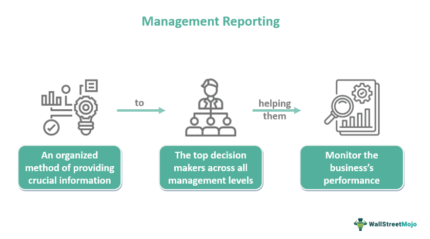

In the evolving landscape of financial markets, corporate leadership management in algorithmic trading is crucial. Algorithmic trading involves the use of computer algorithms to automate trading processes, allowing for rapid execution of orders and precise market analysis. This automation requires strategic oversight to ensure that these complex systems operate within the boundaries of regulatory compliance and align with company objectives.

Corporate executives and upper management play a pivotal role in overseeing and implementing algorithmic trading strategies. Their responsibilities include setting strategic goals that align with corporate interests, ensuring compliance with regulatory standards, and managing risks associated with high-frequency trading operations. Effective governance and control measures are paramount to mitigate potential risks, such as technological failures or unintended market impacts.



Executives must address the challenges posed by algorithmic trading, such as ensuring data integrity, maintaining system security, and aligning technological capabilities with strategic business goals. By fostering a robust governance framework, corporate leaders can safeguard against potential disruptions and enhance the firm's competitive edge in the financial markets.

The goal of this article is to provide comprehensive insights into how leadership roles are integrated into managing algorithmic trading. Understanding these roles and responsibilities is essential for navigating the complexities of algorithmic trading, ensuring market stability, and achieving sustainable growth in today's dynamic financial environment.

## Table of Contents

## Understanding Algorithmic Trading

Algorithmic trading is the process of using computer algorithms to automate the trading of financial instruments. These algorithms, which are based on predefined criteria such as timing, price, quantity, or a mathematical model, enable traders to execute orders with speed and efficiency that manual trading cannot match. In financial markets where seconds can impact profitability, algorithmic trading significantly enhances operational scalability and reduces transaction costs.

The evolution of algorithmic trading has been largely driven by advancements in technology, particularly in artificial intelligence (AI) and machine learning. These technologies enable the development of sophisticated models that can analyze large datasets, identify patterns, and make predictions on market movements. Such capabilities allow algorithms to refine their strategies in real-time, adapting to new data as it emerges. By leveraging machine learning techniques, algorithms can improve their accuracy and decision-making processes, thus providing competitive advantages to traders employing them.

An essential component of [algorithmic trading](/wiki/algorithmic-trading) is its application in creating strategies that optimize various aspects of trade execution. High-frequency trading ([HFT](/wiki/high-frequency-trading-strategies)), for example, seeks to profit from very small price discrepancies by executing a large [volume](/wiki/volume-trading-strategy) of trades at incredibly fast speeds. Another strategy might involve [arbitrage](/wiki/arbitrage), where algorithms exploit price differences of the same asset across different markets. The ability to execute these trades at lightning speeds can lead to cost efficiencies and reduced market impact, enabling traders to achieve better pricing and increased profitability.

In terms of its relevance in modern financial markets, algorithmic trading dominates trading volumes, particularly on major exchanges. Its adoption has reshaped market dynamics, enhancing [liquidity](/wiki/liquidity-risk-premium) and improving market efficiency. For institutional investors, such as hedge funds and investment banks, algorithms are integral in deploying and managing large-scale investment strategies. They allow for executing complex strategies that would be impossible to time manually, such as [statistical arbitrage](/wiki/statistical-arbitrage) or [momentum](/wiki/momentum) trading.

The primary incentives for adopting algorithmic trading revolve around cost efficiency, increased competitiveness, and operational advantages. Automated systems minimize human errors and the lag associated with manual order entry. This efficiency results in lower transaction costs and the ability to capitalize on market opportunities more effectively. Additionally, in a highly competitive market environment, the use of algorithms provides institutions with the necessary tools to remain ahead of competitors by reacting to market changes faster.

In summary, algorithmic trading, augmented by AI and [machine learning](/wiki/machine-learning), is transforming the landscape of modern financial markets by facilitating cost-efficient and strategic trade execution. With its ability to manage complex data and execute trades at unparalleled speeds, algorithmic trading remains a pivotal [factor](/wiki/factor-investing) for achieving competitiveness and optimizing financial operations.

## The Role of Corporate Leadership in Algorithmic Trading

Corporate leaders, particularly CEOs and CFOs, play a crucial role in algorithmic trading by shaping strategic decisions that align with the broader objectives of their organizations. These executives are tasked with ensuring that trading activities correspond to the company's strategic goals, improve performance, and adhere to regulatory compliance standards.

Firstly, effective leadership involves resource allocation, which is a critical component of any successful algorithmic trading strategy. CEOs and CFOs must allocate financial, technological, and human resources efficiently to support algorithmic trading initiatives. By investing in cutting-edge technologies and skilled personnel, companies can enhance their trading capabilities and remain competitive in the fast-paced financial market.

Moreover, corporate leaders are instrumental in setting and nurturing company culture. A culture that values innovation, risk management, and ethical trading can be fostered through leadership actions and policies. By promoting a culture that prioritizes these elements, CEOs and CFOs can create an environment conducive to the successful implementation of algorithmic trading strategies.

In addition to resource allocation and cultural influence, corporate executives are responsible for establishing robust governance frameworks. These frameworks are vital in mitigating risks associated with algorithmic trading and ensuring that operations are transparent and aligned with legal and ethical standards. Good governance promotes accountability, controls operational risks, and supports long-term strategic goals.

Through these efforts, corporate leaders act as stewards, guiding the organization’s algorithmic trading strategies towards success. By aligning trading activities with the overall strategic objectives, ensuring compliance, and fostering a supportive culture and governance framework, CEOs and CFOs can effectively steer the company towards achieving significant competitive advantages in the financial market.

## C-Suite Responsibilities and Governance

C-suite executives, particularly the Chief Information Officer (CIO) and Chief Technology Officer (CTO), are instrumental in the effective implementation and supervision of algorithmic trading systems. The responsibilities of these roles encompass not only the development and maintenance of technology infrastructure but also ensuring alignment with regulatory standards and strategic business objectives.

The CIO is often tasked with overseeing the IT architecture that supports algorithmic trading. This includes ensuring system resilience, data integrity, and the security of trading platforms. The CTO, on the other hand, focuses on the innovative deployment of technology strategies that enhance the trading activities and maintain a competitive edge in the market. These roles necessitate collaboration between technology teams and trading desks to formulate sophisticated algorithms that can process large volumes of data at high speeds.

A significant aspect of C-suite responsibilities is establishing governance models that prioritize risk management. The Three Lines of Defense (3LoD) model is pivotal in this context:

1. **First Line of Defense**: Managed by business and operational functions, it involves the day-to-day management of risk and control environments. This line is where trading operation teams assess and manage risks directly associated with trading activities.

2. **Second Line of Defense**: This is composed of risk management and compliance functions responsible for providing oversight, developing policies, and monitoring adherence to those policies. It includes enforcing compliance with regulatory requirements and implementing risk controls.

3. **Third Line of Defense**: This consists of internal audit functions that provide independent assurance to the board and senior management regarding the effectiveness of governance, risk management, and control processes. 

The application of the 3LoD model allows executives to maintain comprehensive oversight of trading systems, ensuring they operate within defined parameters and adhere to established risk thresholds.

Beyond governance structures, C-suite executives have the responsibility to cultivate robust control frameworks capable of mitigating potential failures in algorithmic trading systems. This involves regular stress testing and scenario analyses to ensure trading algorithms do not lead to systemic failures or contribute to market disruptions. For instance, measures can be coded in Python to simulate trading scenarios and analyze their potential impacts:

```python
import numpy as np

def simulate_trading_scenario(asset_prices, trading_strategy):
    # Simulate trading based on asset prices and a given trading strategy
    results = []
    for price in asset_prices:
        action = trading_strategy(price)
        outcome = execute_trade(action, price)
        results.append(outcome)
    return np.mean(results), np.std(results)

def trading_strategy(price):
    # Example strategy: buy if price is below threshold
    threshold = 100  # Set threshold value
    return "buy" if price < threshold else "hold"

def execute_trade(action, price):
    # Execute a trade and return the result
    if action == "buy":
        return price * 0.99  # Simulate a successful trade with 1% fee
    return 0  # No trade executed

# Example usage
prices = np.random.normal(100, 5, 1000)  # Generate random asset prices
mean_result, std_result = simulate_trading_scenario(prices, trading_strategy)
```

Through these responsibilities, C-suite executives ensure that algorithmic trading systems enhance the company's competitiveness while adhering to the strict governance and risk management standards required in financial markets.

## Challenges in Managing Algorithmic Trading

Algorithmic trading, with its reliance on complex algorithms and high-speed execution, presents several intrinsic challenges that corporate leaders must address to safeguard against potential risks and ensure compliance with relevant regulations. One of the primary challenges is the risk of technological failures, which can result in significant financial losses or market disruptions. Such failures may arise from system design flaws, coding errors, or hardware malfunctions. For example, a minor coding error in the algorithm could lead to erroneous trades, exacerbated by the high-speed nature of these systems. To mitigate this risk, it is crucial to implement robust testing and validation procedures prior to the deployment of any trading algorithm.

Regulatory compliance is another significant concern. Algorithmic trading activities are subject to stringent regulatory requirements to prevent market abuses, such as insider trading, front-running, and market manipulation. Compliance is further complicated by the fact that regulatory frameworks vary across jurisdictions. Executives must therefore ensure that their trading systems are designed with compliance in mind and incorporate features like trade logging and monitoring to provide a clear audit trail.

Market manipulation risks are inherently higher in algorithmic trading due to the speed at which orders can be executed. An algorithm could potentially be misused to create unfair advantages, intentionally or unintentionally affecting market prices. Implementing real-time monitoring tools and compliance checks can help detect and prevent manipulative behaviors.

System outages present another operational risk, where disruptions can hinder trading activities, lead to data loss, or cause significant downtime. Executives must invest in redundant systems and robust infrastructure to ensure high availability and continuity. Developing a comprehensive disaster recovery plan is also essential to minimize the impact of outages.

To address these challenges, corporate leaders should adopt a strategic approach that includes continuous risk assessment and the implementation of advanced safeguards. This involves not only regular system audits and algorithm reviews but also staying informed about technological advancements and evolving regulatory landscapes. Employing machine learning techniques might help in predicting and identifying potential system vulnerabilities. For instance, anomaly detection algorithms can be instrumental in pinpointing unusual trading patterns that might indicate malfunction or manipulation.

In summary, effectively managing the challenges associated with algorithmic trading necessitates a proactive stance on technology management, compliance, and risk mitigation. By integrating rigorous controls and fostering a culture of ongoing vigilance, corporate leaders can enhance the resilience of their algorithmic trading operations and support the integrity of financial markets.

## The Future of Executive Roles in Algorithmic Trading

As technology continues to evolve, the roles and responsibilities of corporate executives in managing algorithmic trading are also undergoing significant transformations. Advanced analytics and [artificial intelligence](/wiki/ai-artificial-intelligence) are increasingly being integrated into trading strategies, reshaping how decisions are made and trades are executed. This trend underscores a growing demand for executives who possess not only financial acumen but also a deep understanding of technology to effectively oversee such sophisticated systems.

Emerging trends highlight the importance of adopting advanced analytics and AI in trading strategies. According to research, advanced algorithms can process vast amounts of market data at unprecedented speeds, facilitating highly informed trading decisions. Such capabilities enable firms to maintain a competitive edge in increasingly complex markets. For instance, machine learning algorithms can adapt and refine trading strategies in real-time based on market feedback, thereby increasing the efficiency and effectiveness of trade executions. Consequently, executives must foster environments that encourage the adoption and refinement of these technologies.

Continuous leadership innovation is crucial for adapting to rapid technological advancements and shifting market demands. Executives are now required to not only keep pace with technological changes but also to anticipate future developments. Leadership teams must emphasize investing in research and development to pioneer novel trading solutions. Furthermore, nurturing talent with expertise in both finance and technology is essential, enabling organizations to develop robust, agile strategies in response to dynamic market conditions.

Predicting future governance and control mechanisms involves envisaging frameworks that ensure algorithmic trading practices are compliant with evolving regulatory standards while mitigating associated risks. A forward-looking approach to governance may involve incorporating enhanced risk assessment models and automated compliance monitoring systems. These mechanisms will likely include AI-driven analytics to detect and prevent fraudulent activities or unintended market impacts. Executives must lead initiatives to establish such innovative safeguards, ensuring sustainable trading operations.

Ultimately, the future of executive roles in algorithmic trading will demand a balanced synthesis of strategic foresight, technological prowess, and regulatory compliance. Embracing these elements will be key for corporate leaders to successfully navigate the complexities of algorithmic trading in the rapidly evolving financial landscape.

## Conclusion

Corporate leadership is pivotal in the successful implementation and oversight of algorithmic trading. Executives must fundamentally understand the challenges intrinsic to algorithmic trading. These challenges include technological failures, regulatory compliance issues, and the potential for market manipulation. Addressing these requires a thorough risk assessment and the development of strategies to mitigate such risks effectively.

Ensuring strong governance and control mechanisms is crucial. Executives must implement robust frameworks to safeguard against potential risks and disruptions within the market. This can include governance models like the three lines of defense (3LoD), which involves management control, risk oversight, and independent assurance to reinforce stability and compliance.

As technology continues to evolve, corporate leaders must also adapt. This necessitates strategic foresight and an ongoing commitment to innovation in leadership practices. With the rise of advanced analytics, artificial intelligence, and machine learning, executives are tasked with continuously updating their skill sets and operational strategies to harness these technologies effectively.

This article aims to provide valuable insights for executives managing the complexities of algorithmic trading today. By fostering an environment of strong governance and remaining agile amidst technological advancements, corporate leaders can navigate these challenges and contribute to sustainable market practices. Their role is instrumental in shaping the future landscape of financial markets, ensuring that algorithmic trading is conducted efficiently and ethically.

## References & Further Reading

[1]: Bergstra, J., Bardenet, R., Bengio, Y., & Kégl, B. (2011). ["Algorithms for Hyper-Parameter Optimization."](https://dl.acm.org/doi/10.5555/2986459.2986743) Advances in Neural Information Processing Systems 24.

[2]: ["Advances in Financial Machine Learning"](https://www.amazon.com/Advances-Financial-Machine-Learning-Marcos/dp/1119482089) by Marcos Lopez de Prado

[3]: ["Evidence-Based Technical Analysis: Applying the Scientific Method and Statistical Inference to Trading Signals"](https://www.amazon.com/Evidence-Based-Technical-Analysis-Scientific-Statistical/dp/0470008741) by David Aronson

[4]: ["Machine Learning for Algorithmic Trading"](https://github.com/stefan-jansen/machine-learning-for-trading) by Stefan Jansen

[5]: ["Quantitative Trading: How to Build Your Own Algorithmic Trading Business"](https://www.amazon.com/Quantitative-Trading-Build-Algorithmic-Business/dp/1119800064) by Ernest P. Chan