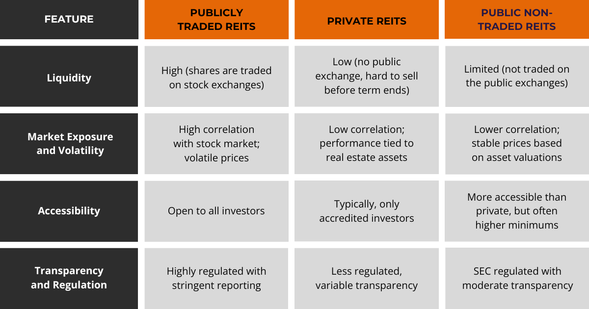

## Table of Contents

## What is an UPREIT and how does it work?

An UPREIT, or Umbrella Partnership Real Estate Investment Trust, is a type of real estate investment structure that allows property owners to exchange their real estate for shares in a partnership. This partnership then owns the real estate and is controlled by a REIT, which stands for Real Estate Investment Trust. The main benefit of an UPREIT is that it allows property owners to defer paying capital gains taxes on their property until they sell their shares in the partnership.

Here's how it works: A property owner who wants to join an UPREIT will contribute their property to the partnership in exchange for units called "operating partnership units" or OP units. These OP units are similar to shares in a company. The partnership, which now owns the contributed property, is managed by a REIT. The REIT itself does not own the properties directly but controls the partnership. When the property owner wants to cash out, they can convert their OP units into REIT shares, which they can then sell. This conversion from OP units to REIT shares is what triggers the capital gains tax, allowing the property owner to defer the tax until they decide to sell.

## What are the basic benefits of investing in an UPREIT?

Investing in an UPREIT can be a smart move for people who own property. One big benefit is that it lets you delay paying taxes on the money you make from selling your property. Instead of paying taxes right away, you can swap your property for units in the UPREIT's partnership. This means you can keep more of your money working for you until you decide to sell those units and turn them into shares of the REIT.

Another advantage is that UPREITs can help you diversify your investments. When you join an UPREIT, your property becomes part of a bigger group of properties managed by the REIT. This can spread out your risk because you're not just relying on one property to make money. Plus, being part of a larger, professionally managed group can give you access to better opportunities and resources that you might not have on your own.

## How does an UPREIT differ from a traditional REIT?

An UPREIT and a traditional REIT both deal with real estate, but they work a bit differently. A traditional REIT owns properties directly and manages them. People can buy shares in the REIT, and the REIT pays out most of its income as dividends to shareholders. This is a straightforward way for people to invest in real estate without having to buy properties themselves.

An UPREIT, on the other hand, uses a partnership structure. Instead of owning properties directly, the REIT controls a partnership that owns the properties. Property owners can swap their properties for units in this partnership, called OP units. This lets them delay paying taxes on their property's value until they convert those units into REIT shares and sell them. So, while a traditional REIT is simpler and more direct, an UPREIT offers a way for property owners to join a bigger group and delay taxes.

## What are the tax advantages of an UPREIT for investors?

One big tax advantage of an UPREIT for investors is that it lets them delay paying taxes on the money they make from selling their property. When someone swaps their property for units in the UPREIT's partnership, they don't have to pay capital gains tax right away. This is different from selling a property outright, where you'd have to pay taxes on your profit immediately. By delaying the tax, investors can keep more of their money working for them until they decide to sell their units and turn them into REIT shares.

Another tax benefit is that UPREITs can help investors manage their tax situation better. If an investor is worried about a big tax bill from selling a property, joining an UPREIT can spread out that tax over time. This can be really helpful for planning and managing finances. Plus, the income from the UPREIT, like dividends, might be taxed at a lower rate than regular income, which can save investors even more money.

## What qualifications are needed to participate in an UPREIT?

To participate in an UPREIT, you usually need to own a property that the UPREIT wants to add to its portfolio. This means your property should fit with what the UPREIT is looking for, like the type of property, its location, and how much it's worth. The UPREIT will have specific rules about what kinds of properties they accept, so you'll need to check those rules to see if your property qualifies.

Once your property is accepted, you'll need to agree to the terms of the UPREIT. This means understanding and signing the partnership agreement, which will explain how the UPREIT works and what you'll get in return for your property. You'll get units in the UPREIT's partnership, called OP units, which you can later turn into shares of the REIT if you want to. It's important to work with a financial advisor or lawyer to make sure you understand everything and that it's a good move for you.

## How can an UPREIT help in estate planning?

An UPREIT can be a smart tool for estate planning because it helps you pass on your wealth to your family in a tax-friendly way. When you swap your property for units in the UPREIT, you don't have to pay taxes on the profit right away. This means you can keep more of your money working for you and your family. When you pass away, your heirs can inherit the UPREIT units, and they might get a step-up in basis, which means they could pay less in taxes when they sell the units.

Another way an UPREIT helps with estate planning is by making it easier to manage and distribute your assets. Instead of dealing with multiple properties, your heirs will have units in a partnership that's managed by professionals. This can make things simpler and less stressful for your family. Plus, if your heirs want to turn the units into cash, they can convert them into REIT shares and sell them when it's a good time for them, giving them more control over their financial future.

## What are the potential risks associated with UPREIT investments?

One risk of investing in an UPREIT is that the value of your units can go up and down. This depends on how well the properties in the partnership are doing and what's happening in the real estate market. If the properties don't do well or if the market goes down, the value of your units could drop, and you might lose money. Also, since you're part of a bigger group, you don't have as much control over what happens with your property. The REIT that manages the partnership makes the big decisions, so you have to trust them to do a good job.

Another risk is that you might not be able to sell your units when you want to. If you need cash quickly, you might have to wait until you can convert your units into REIT shares and then sell those shares. This can take time, and if the market isn't good, you might not get as much money as you hoped. Plus, when you do sell, you'll have to pay taxes on the profit you made, which could be a big bill if the value of your units has gone up a lot.

## How does the structure of an UPREIT affect its liquidity?

The structure of an UPREIT can make it less liquid than other investments. When you join an UPREIT, you swap your property for units in the partnership. These units aren't as easy to sell as stocks or bonds. You have to wait until you can convert your units into shares of the REIT, and then you can sell those shares. This process can take time, so if you need money quickly, an UPREIT might not be the best choice.

Also, the value of your units depends on how well the properties in the UPREIT are doing and what's happening in the real estate market. If the market goes down or the properties don't do well, it might be harder to sell your units at a good price. This can make it tricky to turn your investment into cash when you want to. So, while an UPREIT can be a good long-term investment, it's not as liquid as some other options.

## What role do operating partnership units play in an UPREIT?

Operating partnership units, or OP units, are a key part of how an UPREIT works. When someone wants to join an UPREIT, they swap their property for these units. The UPREIT's partnership owns the property, and the person gets OP units in return. This lets them delay paying taxes on the money they make from their property until they decide to sell the units. It's a way to keep more of their money working for them instead of paying a big tax bill right away.

The OP units are important because they give people a way to be part of the UPREIT without directly owning the properties. The UPREIT is managed by a REIT, which makes the big decisions about the properties. If someone wants to turn their investment into cash, they can convert their OP units into shares of the REIT and then sell those shares. This process can take some time, but it gives people flexibility in when they want to pay taxes and get their money.

## How can an UPREIT be used as a strategy for portfolio diversification?

An UPREIT can help you spread out your investments by letting you join a bigger group of properties. When you swap your property for units in the UPREIT, your investment becomes part of a larger portfolio managed by professionals. This means you're not just relying on one property to make money. If one property doesn't do well, the others might still be doing okay, which can help balance out your risk. It's like not putting all your eggs in one basket.

Plus, being part of an UPREIT can give you access to different types of properties and locations that you might not be able to invest in on your own. This can make your investment portfolio more diverse and potentially more stable. Instead of just owning one kind of property in one place, you can be part of a mix of properties all over the country or even the world. This can help protect your money from big ups and downs in any one market.

## What are the advanced tax considerations for UPREIT investors?

When you invest in an UPREIT, there are some advanced tax things to think about. One big thing is the step-up in basis that your heirs might get when you pass away. This means that if your heirs inherit your UPREIT units, they could pay less in taxes when they sell them. The value of the units at the time you die becomes their new starting point for taxes, so they might not have to pay as much on any profit they make. This can be a big help in planning how to pass on your wealth to your family.

Another thing to consider is how the income from the UPREIT is taxed. The dividends you get from the UPREIT might be taxed at a lower rate than regular income, which can save you money. But you also need to think about the tax rules for when you convert your OP units into REIT shares and sell them. This is when you'll have to pay capital gains tax on the profit you made. It's a good idea to work with a tax advisor to plan when to do this to keep your taxes as low as possible.

## How do regulatory changes impact the operations and benefits of UPREITs?

Regulatory changes can have a big effect on how UPREITs work and the benefits they offer. If the government changes the rules about taxes, it could change how much money investors save by joining an UPREIT. For example, if the rules about capital gains taxes change, it might not be as good of a deal to delay paying taxes on your property. Also, if the rules about what kinds of properties can be in an UPREIT change, it could make it harder for some people to join or affect how much money the UPREIT can make.

Changes in regulations can also affect how UPREITs are managed and how they have to report their finances. If new rules come out about how REITs have to share information with investors or the government, it could make things more complicated for the people running the UPREIT. This might mean more work and costs for the UPREIT, which could affect how much money it makes and how much it can pay out to investors. Keeping up with these changes is important for anyone involved with an UPREIT.

## References & Further Reading

[1]: ["UPREIT Structure: A Favorable Arrangement for Tax-Deferred Real Estate Contributions."](https://cca-advisors.com/upreits-unique-real-estate-investment-structures/) National Association of Real Estate Investment Trusts (NAREIT).

[2]: Priftis, A., & Kendes, G. (2005). ["The Use of Umbrella Partnership REITs (UPREITs) in Real Estate."](https://cca-advisors.com/upreits-unique-real-estate-investment-structures/) Journal of Real Estate Taxation.

[3]: ["Introduction to Algorithmic Trading Strategies"](https://onlinelibrary.wiley.com/doi/epdf/10.1002/9781119206033.fmatter) by CFA Institute.

[4]: ["Advances in Financial Machine Learning"](https://www.amazon.com/Advances-Financial-Machine-Learning-Marcos/dp/1119482089) by Marcos Lopez de Prado.

[5]: Chan, E. P. (2009). ["Quantitative Trading: How to Build Your Own Algorithmic Trading Business."](https://github.com/ftvision/quant_trading_echan_book) John Wiley & Sons.