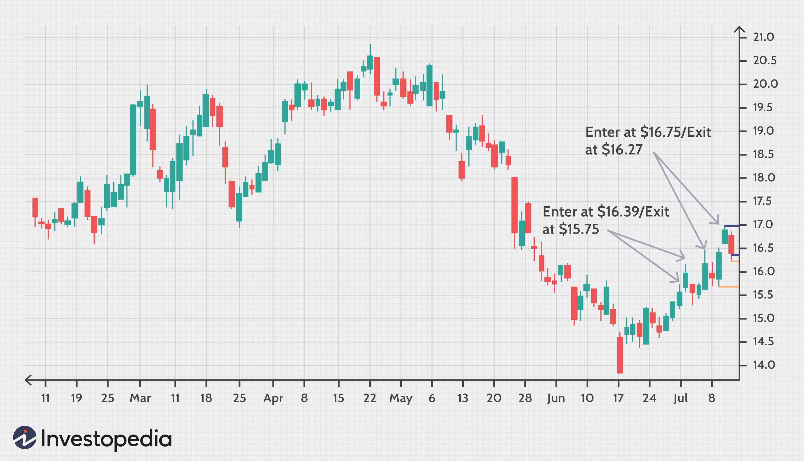

Investment ratios hold immense significance in the financial markets as tools that provide insights into the performance and risk of different investment opportunities. They help investors make informed decisions by evaluating potential investments in quantitative terms. Among these ratios, the upside/downside ratio plays a pivotal role in investment strategies, offering a nuanced view of market dynamics by measuring gains against losses over a particular period. This ratio allows investors to gauge the potential for profit relative to risk, thereby informing their buy, hold, or sell decisions.

The upside/downside ratio is particularly valuable in differentiating between market conditions by indicating when an asset demonstrates a higher tendency for upward price movement compared to downward movement, or vice versa. This characteristic makes it a critical tool for identifying momentum shifts and potential reversals in market trends.



Algorithmic trading, another significant contributor to modern financial strategies, has revolutionized how investments are made by utilizing computer algorithms to execute trades at speeds and frequencies beyond human capability. This advancement allows for the real-time analysis of massive data sets and the execution of complex trading strategies, integrating investment ratios into trading algorithms to enhance decision-making efficiency and effectiveness. Algorithmic trading has minimized human error and emotion in trading, offering more precise and systematic approaches to capturing market opportunities.

Together, the upside/downside ratio and algorithmic trading provide a powerful foundation for crafting investment strategies. The utility of the upside/downside ratio can be maximized when combined with advanced algo-trading techniques, paving the way for more sophisticated and adaptive investment strategies. These tools enable investors to navigate the complexities of the financial markets with a greater level of precision and confidence, setting the stage for exploring diverse strategies that leverage these insights for competitive advantage.

## Table of Contents

## Understanding Investment Ratios

Investment ratios are quantitative tools essential for evaluating the performance, risk, and potential return of investments. They provide insights into the viability and efficiency of investment options, making them crucial for investors aiming to maximize returns while managing risk.

Investment ratios encompass various metrics that allow investors to assess different facets of investment judgments. Some key investment ratios include:

1. **Sharpe Ratio**: This ratio measures the risk-adjusted return of an investment. It is calculated by subtracting the risk-free rate from the investment's return and dividing the result by the investment's standard deviation. The formula is:
$$
   \text{Sharpe Ratio} = \frac{R - R_f}{\sigma}

$$

   where $R$ is the expected return of the portfolio, $R_f$ is the risk-free rate, and $\sigma$ is the standard deviation of the portfolio's excess return. A higher Sharpe Ratio indicates a more favorable risk-adjusted return.

2. **Sortino Ratio**: A variant of the Sharpe Ratio, the Sortino Ratio differentiates harmful volatility from total volatility by using the downside deviation instead of the standard deviation. The formula is:
$$
   \text{Sortino Ratio} = \frac{R - R_f}{\sigma_d}

$$

   where $\sigma_d$ is the standard deviation of negative asset returns. This ratio provides a clearer picture of an investment’s risk by focusing on downside risk alone.

3. **Upside/Downside Ratio**: This ratio is crucial in understanding market breadth and is used to evaluate an investment’s potential reward compared to its risk. It is calculated by dividing the average of upward price movements by the average of downward price movements over a specific period. The formula is:
$$
   \text{Upside/Downside Ratio} = \frac{\text{Average Upward Price Movements}}{\text{Average Downward Price Movements}}

$$

Understanding this ratio helps investors measure the balance between the potential for gains against the risk of losses and assess market [momentum](/wiki/momentum). It’s particularly useful for determining the overall health and direction of a market, thereby assisting in the identification of prevailing trends and reversals. By providing a clearer picture of the potential returns relative to risks, such ratios guide more informed investment decisions, paving the way for creating strategies that align with investor risk appetites and financial goals.

## The Upside/Downside Ratio Explained

The upside/downside ratio is an important financial metric used to evaluate market performance by comparing the relative amount of positive movement (upside) and negative movement (downside) in asset prices over a specific period. This ratio helps investors and analysts assess the strength and consistency of an upward or downward trend, providing insight into market momentum and potential reversals.

The formula for the upside/downside ratio is typically expressed as:

$$
\text{Upside/Downside Ratio} = \frac{\text{Average of Upside Changes}}{\text{Average of Downside Changes}}
$$

where average upside changes reflect the mean of all positive price movements, while average downside changes consider the mean of all negative price movements over the measured timeframe.

A ratio greater than one suggests that the market is experiencing stronger upward momentum, indicating buyer dominance and potentially a bullish market environment. Conversely, a ratio less than one indicates stronger downward movements, suggesting seller strength and a possible bearish trend.

The upside/downside ratio is akin to the advance-decline ratio, which also helps measure market breadth and strength. However, the advance-decline ratio focuses on the number of advancing and declining securities, while the upside/downside ratio emphasizes the magnitude of price movements. This fundamental difference allows the upside/downside ratio to provide more granular information about market momentum, since it captures the intensity of price changes rather than just the count of advancing or declining issues.

Using the upside/downside ratio, investors can gain a deeper understanding of market dynamics beyond simple price changes, enabling better-informed trading and investment decisions. This ratio's ability to present both the extent and direction of market moves makes it a valuable tool in identifying trend continuations or reversals.

## Investment Strategies Using the Upside/Downside Ratio

Investment strategies utilizing the upside/downside ratio often leverage the insights gained from this metric to make informed decisions in various market conditions. This ratio, which measures the comparison of positive price movements (upside) to negative ones (downside), becomes crucial in formulating tactics that take advantage of market trends and reversals.

**Contrarian Strategies**

Contrarian strategies focus on going against prevailing market trends, based on the belief that markets tend to overreact in the short term. When the upside/downside ratio is notably high, it may indicate that the market is overbought, and a downward correction might be imminent. Conversely, a low ratio could suggest that the market is oversold, opening opportunities for a bullish reversal. Investors implementing contrarian strategies will monitor these extreme values to initiate trades that capitalize on potential market corrections.

**Trend Following**

Trend following is another strategy that can benefit significantly from the use of the upside/downside ratio. By analyzing the ratio over a specific time frame, traders can gauge market momentum and trend strength. A consistently high ratio in an uptrend corroborates the strength of the upward movement, suggesting robust buying opportunities. Conversely, in a downtrend, a high upside/downside ratio might indicate a weakening trend, urging investors to reassess their positions. This strategy can be powerful when automated trading systems use the ratio to make real-time adjustments to portfolios.

**Integration with Other Indicators**

The upside/downside ratio is not typically used in isolation; it is often combined with other indicators to formulate robust trading strategies. For instance, integrating it with moving averages can enhance the context provided by trend direction over various time frames. Here is a simple Python snippet that incorporates the upside/downside ratio with a moving average strategy:

```python
import pandas as pd

# Sample data
data = {'Close': [100, 102, 101, 105, 107, 110]}
df = pd.DataFrame(data)

# Calculate moving average
df['MA20'] = df['Close'].rolling(window=20).mean()

# Example calculation of Upside/Downside Ratio
# Using hypothetical upside/downside movement data
upside_movement = 5  # hypothetical data
downside_movement = 3  # hypothetical data

upside_downside_ratio = upside_movement / downside_movement

# Example decision making
if upside_downside_ratio > 1.5 and df['Close'].iloc[-1] > df['MA20'].iloc[-1]:
    print("Consider entering a long position")
elif upside_downside_ratio < 0.5 and df['Close'].iloc[-1] < df['MA20'].iloc[-1]:
    print("Consider entering a short position")
else:
    print("Hold position")
```

Incorporating the [volatility](/wiki/volatility-trading-strategies) index (VIX) is another example: a high VIX might suggest that a high upside/downside ratio reflects significant market fear, indicating potential overvaluation. Similarly, Relative Strength Index (RSI) can be paired with the ratio to better predict reversals—RSI above 70 combined with a high upside/downside ratio might be viewed as a strong overbought signal.

Combining insights from multiple indicators along these lines helps build a more comprehensive picture of market dynamics, thus optimizing the deployment of the upside/downside ratio in complex trading strategies.

## Algorithmic Trading in Modern Investment

Algorithmic trading, often referred to as algo trading, involves the use of computer algorithms to automate trading strategies. These algorithms are programmed to operate at high speed and efficiency, executing trades at precise times to capitalize on market opportunities. By analyzing vast amounts of market data in real-time, algorithms can make rapid decisions based on predefined criteria, effectively removing the emotional aspect from trading. This method has become increasingly significant in the financial markets, where speed and accuracy are crucial determinants of success.

The impact of [algorithmic trading](/wiki/algorithmic-trading) on financial markets has been profound. It has increased market [liquidity](/wiki/liquidity-risk-premium), reduced transaction costs, and enhanced the efficiency of price discovery. However, it also brings challenges, such as the potential for market volatility, exemplified by phenomena like flash crashes. Despite these risks, the advantages of algorithmic trading for long-term investment strategies are noteworthy.

In a long-term context, algo trading aids investors by ensuring consistency and discipline in their trading strategies. Algorithms can systematically execute strategies over extended periods without deviation, thereby avoiding human errors such as impulsive decision-making influenced by market fluctuations. For example, in a long-term investment strategy like portfolio rebalancing, algorithms can automatically adjust the composition of assets based on market conditions, ensuring optimal asset allocation aligned with the investor's risk tolerance and investment goals.

Furthermore, algorithmic trading allows for the [backtesting](/wiki/backtesting) of strategies using historical data, providing a data-driven approach to refine investment strategies. This capability enables developers to simulate how a strategy would have performed in the past, offering valuable insights for strategy improvement before applying it to live markets. For instance, a Python-based backtesting framework can be written to evaluate a moving average crossover strategy as follows:

```python
import pandas as pd
import numpy as np

def moving_average_strategy(data, short_window, long_window):
    signals = pd.DataFrame(index=data.index)
    signals['price'] = data['price']
    signals['short_mavg'] = data['price'].rolling(window=short_window, min_periods=1).mean()
    signals['long_mavg'] = data['price'].rolling(window=long_window, min_periods=1).mean()
    signals['signal'] = 0.0
    signals['signal'][short_window:] = np.where(signals['short_mavg'][short_window:] > signals['long_mavg'][short_window:], 1.0, 0.0)
    signals['positions'] = signals['signal'].diff()

    return signals

# Example data (in practice, you'd use market data)
data = pd.DataFrame({'price': [100, 101, 102, 101, 98, 99, 104, 105, 107, 106]})
result = moving_average_strategy(data, short_window=3, long_window=5)
print(result)
```

Moreover, the application of [machine learning](/wiki/machine-learning) and [artificial intelligence](/wiki/ai-artificial-intelligence) to algorithmic trading has opened new possibilities for recognizing complex patterns and predictive analysis. Machine learning models can learn from vast datasets to detect subtle signals that traditional statistical methods might overlook, making them well-suited for long-term investment strategies that require adaptive learning and robust forecasting.

In conclusion, algorithmic trading represents a paradigm shift towards more systematic and scientific approaches in investment. By leveraging technology, investors can harness its power not only to execute short-term trades but also to structure and maintain sound long-term investment strategies.

## Algorithmic Trading Strategies with a Focus on Investment Ratios

Algorithmic trading has profoundly reshaped the landscape of financial markets, providing traders with tools to automate decision-making processes based on quantitative data. Among the various strategies employed in algorithmic trading, three stand out: mean reversion, [trend following](/wiki/trend-following), and momentum investing. Each strategy harnesses the power of investment ratios to gauge the market's condition and set trading signals effectively.

**Mean Reversion Strategy** assumes that asset prices will revert to their mean over time. This strategy capitalizes on short-term price extremes by predicting a correction towards the historical average. Investment ratios, such as the price-to-earnings ratio or the upside/downside ratio, are used to determine the extent of deviation from the norm. For instance, a significantly high upside/downside ratio might suggest overbought conditions, prompting traders to expect a reversal.

**Python Example:**

```python
import pandas as pd
import numpy as np

def mean_reversion_strategy(prices, window=20):
    rolling_mean = prices.rolling(window=window).mean()
    signal = prices - rolling_mean
    return signal

# Example usage with hypothetical price data
price_data = pd.Series([...])  # replace with actual data
signals = mean_reversion_strategy(price_data)
```

**Trend Following Strategy** aims to identify and capitalize on emerging trends in financial markets. By using indicators like moving averages or investment ratios such as the Sharpe Ratio, traders can determine the direction of the market trend. The upside/downside ratio serves as a critical metric in ascertaining trend strength, guiding buy or sell decisions based on if more securities are advancing than declining.

**Momentum Investing** focuses on the continuation of existing market trends. This strategy relies heavily on historical performance indicators, including ratios evaluating past returns relative to risks taken. The upside/downside ratio helps in assessing market momentum by providing a snapshot of current market sentiment. A high ratio would imply strong positive momentum, suggesting a potential continuation of the trend.

The integration of **machine learning** and other advanced technologies further enhances these algorithms. Machine learning models can identify complex patterns in large datasets that traditional methods might overlook. Techniques such as [reinforcement learning](/wiki/reinforcement-learning) enable systems to improve over time, adapting to changing market dynamics. Utilizing large amounts of historical and real-time data, machine learning algorithms can continuously refine investment strategies and improve accuracy.

**Python Example with Machine Learning:**

```python
from sklearn.ensemble import RandomForestRegressor

def train_ml_strategy(features, target):
    model = RandomForestRegressor(n_estimators=100, random_state=42)
    model.fit(features, target)
    return model

# Example usage with hypothetical features and target
features = np.array([...])  # replace with actual feature data
target = np.array([...])  # replace with actual target data
trained_model = train_ml_strategy(features, target)
```

By leveraging these algorithmic strategies and investment ratios, traders can execute informed trades, anticipate market movements, and optimize their financial strategies. The incorporation of machine learning further amplifies the capability of algorithmic trading, facilitating adaptive and predictive systems that contribute to improved trading outcomes.

## Conclusion

Understanding and utilizing investment ratios is crucial for developing effective investment strategies. These ratios, like the upside/downside ratio, provide valuable insights into market dynamics and help investors assess potential risks and returns. By interpreting these metrics correctly, investors can make more informed decisions, leading to better portfolio performance.

Algorithmic trading has become a transformative force in modern portfolio management. It allows for the rapid execution of trades and the processing of large datasets, providing a competitive edge in the financial markets. The integration of algorithmic trading with investment ratios enhances the decision-making process by combining quantitative analysis with qualitative insights. This synergy enables the dynamic adaptation of strategies to market changes, optimizing returns while managing risks.

Investors are encouraged to incorporate advanced indicators, such as the upside/downside ratio, into their trading strategies to gain better insights into market trends. These indicators are particularly useful in algorithmic trading, where precision and speed are paramount. By leveraging the capabilities of technology and deep analysis of investment ratios, investors can better navigate market complexities and enhance their strategic outcomes.

## References & Further Reading

[1]: Bergstra, J., Bardenet, R., Bengio, Y., & Kégl, B. (2011). ["Algorithms for Hyper-Parameter Optimization."](https://dl.acm.org/doi/10.5555/2986459.2986743) Advances in Neural Information Processing Systems 24.

[2]: ["Advances in Financial Machine Learning"](https://www.amazon.com/Advances-Financial-Machine-Learning-Marcos/dp/1119482089) by Marcos Lopez de Prado

[3]: ["Evidence-Based Technical Analysis: Applying the Scientific Method and Statistical Inference to Trading Signals"](https://www.amazon.com/Evidence-Based-Technical-Analysis-Scientific-Statistical/dp/0470008741) by David Aronson

[4]: ["Machine Learning for Algorithmic Trading"](https://github.com/stefan-jansen/machine-learning-for-trading) by Stefan Jansen

[5]: ["Quantitative Trading: How to Build Your Own Algorithmic Trading Business"](https://github.com/LucindaYa/quant-resources/blob/master/Quantitative%20Trading%20How%20to%20Build%20Your%20Own%20Algorithmic%20Trading%20Business.pdf) by Ernest P. Chan