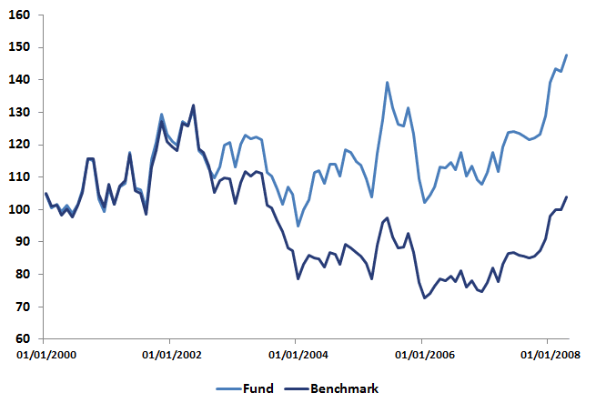

## Table of Contents

## What is the Upside/Downside Ratio in investment analysis?

The Upside/Downside Ratio is a tool used in investment analysis to understand how a stock or an investment might perform. It compares the potential gains (upside) to the potential losses (downside). By looking at this ratio, investors can get an idea of the risk versus reward of an investment. A higher ratio means that the potential gains are much larger than the potential losses, which might make the investment more attractive.

This ratio is calculated by dividing the average gain of an investment during periods when it rises by the average loss during periods when it falls. For example, if a stock typically gains 10% when it goes up and loses 5% when it goes down, the Upside/Downside Ratio would be 2 (10% divided by 5%). Investors use this information to help decide if the potential rewards of an investment are worth the risks involved. It's a simple yet effective way to gauge the balance between potential profit and potential loss.

## How is the Upside/Downside Ratio calculated?

The Upside/Downside Ratio is calculated by comparing the average gain of an investment during its up periods to the average loss during its down periods. To find the average gain, you add up all the positive returns and divide by the number of up periods. Similarly, to find the average loss, you add up all the negative returns and divide by the number of down periods. Once you have these two averages, you divide the average gain by the average loss to get the Upside/Downside Ratio.

For example, if a stock goes up by 5%, 10%, and 15% in three different up periods, the average gain would be (5 + 10 + 15) divided by 3, which equals 10%. If the same stock goes down by 2%, 4%, and 6% in three different down periods, the average loss would be (2 + 4 + 6) divided by 3, which equals 4%. The Upside/Downside Ratio would then be 10% divided by 4%, resulting in a ratio of 2.5. This means the stock's potential gains are 2.5 times larger than its potential losses, on average.

## Why is the Upside/Downside Ratio important for investors?

The Upside/Downside Ratio is important for investors because it helps them understand the risk and reward of an investment. It tells them how much they might gain compared to how much they might lose. This is useful because it gives a clear number that shows if the potential reward is worth the risk. If the ratio is high, it means the investment could make a lot more money than it might lose, which can make it more attractive.

Investors use this ratio to make better choices about where to put their money. By looking at the Upside/Downside Ratio, they can compare different investments and see which ones have a better balance of potential gains and losses. This helps them build a portfolio that matches their comfort with risk and their goals for making money.

## What does a high Upside/Downside Ratio indicate?

A high Upside/Downside Ratio means that the investment has a lot more potential to go up than to go down. It shows that when the investment does well, it can make a lot more money than it might lose when it does badly. This can make the investment look more attractive because the possible rewards are much bigger than the possible risks.

Investors like to see a high Upside/Downside Ratio because it suggests that the investment could be a good choice if they are looking for big gains. However, it's important to remember that this ratio is just one tool and doesn't tell the whole story. Other things like how stable the investment is and what's happening in the market can also affect whether it's a good choice.

## What does a low Upside/Downside Ratio suggest?

A low Upside/Downside Ratio means that the investment might not gain as much as it could lose. It shows that when the investment goes up, it doesn't go up by much, but when it goes down, it can lose a lot. This can make the investment less appealing because the possible losses are bigger than the possible gains.

Even though a low ratio might make an investment seem risky, it's not the only thing to look at. Other factors like how stable the investment is and what's happening in the market are also important. Investors need to think about all these things to decide if an investment is right for them, even if the Upside/Downside Ratio is low.

## How can the Upside/Downside Ratio be used in portfolio management?

The Upside/Downside Ratio can help people who manage portfolios decide which investments to pick. They look at the ratio to see if an investment has a good balance between the money it might make and the money it might lose. If the ratio is high, it means the investment could make a lot more money than it might lose, which can make it a good choice for the portfolio. But if the ratio is low, it means the investment might not make much money and could lose a lot, so they might not want to include it.

Portfolio managers use this ratio to compare different investments and build a mix of investments that fits their goals and how much risk they are okay with. They might choose some investments with high ratios for big gains and some with lower ratios for more safety. By looking at the Upside/Downside Ratio, they can make better choices about how to spread their money around to get the best results while keeping risks under control.

## What are the limitations of using the Upside/Downside Ratio as a sole indicator?

The Upside/Downside Ratio is a helpful tool, but it has some limits if you use it by itself. It only looks at how much an investment might go up or down, but it doesn't tell you how often these ups and downs happen. An investment might have a high ratio because it has a few big gains, but if it goes down a lot more often, it might still lose money overall. Also, the ratio doesn't consider other important things like how the whole market is doing or special events that could affect the investment.

Another problem is that the Upside/Downside Ratio doesn't show how risky an investment is in other ways. For example, it doesn't tell you about how much the price of the investment can change in a short time, which is called volatility. An investment could have a good ratio but still be very up and down, which might not be good for someone who doesn't like a lot of risk. So, while the ratio can give you some good information, it's best to use it along with other tools and information to make smart choices about investments.

## How does the Upside/Downside Ratio compare to other risk/reward metrics like the Sharpe Ratio?

The Upside/Downside Ratio and the Sharpe Ratio both help investors understand the balance between risk and reward, but they do it in different ways. The Upside/Downside Ratio looks at how much an investment might go up compared to how much it might go down. It's calculated by dividing the average gain during up periods by the average loss during down periods. This ratio is simple and focuses only on the size of gains and losses, not how often they happen or how the investment moves compared to the market.

The Sharpe Ratio, on the other hand, measures how much return an investment gives for each unit of risk it takes. It's calculated by taking the return of the investment, subtracting the risk-free rate (like what you'd get from a safe investment like a government bond), and then dividing that by the standard deviation of the investment's returns. The Sharpe Ratio gives a broader view because it considers the investment's performance compared to a risk-free option and how much the investment's returns move around, which is called volatility. While the Upside/Downside Ratio is easier to understand and use for comparing potential gains and losses, the Sharpe Ratio gives a more complete picture of risk-adjusted performance.

## Can the Upside/Downside Ratio be applied to different asset classes?

Yes, the Upside/Downside Ratio can be used for different kinds of investments, not just stocks. It can help you look at how much you might gain or lose with things like bonds, real estate, or even cryptocurrencies. The way you figure out the ratio stays the same: you find the average gain when the investment goes up and the average loss when it goes down, then you divide the gain by the loss. This can help you see if the possible rewards of investing in something are worth the risks, no matter what kind of investment it is.

But remember, the Upside/Downside Ratio might work a bit differently for each type of investment. For example, stocks can go up and down a lot, so the ratio might be more useful for them. Bonds usually don't change as much, so the ratio might not show big differences in gains and losses. And with things like real estate or cryptocurrencies, other things like how easy it is to buy or sell them, or special rules and taxes, can also affect how useful the ratio is. So, while the Upside/Downside Ratio can be used for all kinds of investments, you need to think about what else might affect those investments too.

## How frequently should the Upside/Downside Ratio be recalculated to remain relevant?

The Upside/Downside Ratio should be recalculated often to stay useful. How often you do it depends on what you're investing in and what's happening in the market. For things like stocks that can change a lot day to day, you might want to look at the ratio every month or even every week. This way, you can see if the possible gains and losses are changing and make decisions based on the newest information.

For investments that don't change as much, like bonds, you might not need to check the ratio as often. Maybe every three months or even once a year could be enough. The important thing is to keep an eye on the ratio and update it whenever there are big changes in the market or in how your investment is doing. This helps you make sure your investment choices are still good ones.

## What advanced techniques can be used to enhance the predictive power of the Upside/Downside Ratio?

To make the Upside/Downside Ratio better at predicting how an investment might do, you can use other tools and methods along with it. One way is to use something called moving averages. This means you look at the average gains and losses over different periods of time, like the last 30 days or the last year. By doing this, you can see if the ratio is changing over time, which can help you predict if the investment will keep doing well or start doing worse. Another technique is to use statistical models that look at how often the investment goes up or down, not just how much. This can give you a fuller picture of the risks and rewards.

Another advanced technique is to combine the Upside/Downside Ratio with other risk and reward measures, like the Sharpe Ratio or the Sortino Ratio. The Sharpe Ratio looks at how much return you get for the risk you take, while the Sortino Ratio focuses on the bad kind of risk, the risk of losing money. By using these ratios together, you can get a better idea of how an investment might perform. Also, you can use something called backtesting, where you look at how the Upside/Downside Ratio would have worked in the past to see if it can help predict the future. This can help you see if the ratio is really useful for your investment choices.

## How can historical data analysis of the Upside/Downside Ratio inform future investment strategies?

Looking at the Upside/Downside Ratio from the past can help you make better choices about where to put your money in the future. By studying how the ratio has changed over time for different investments, you can see patterns and trends. For example, if an investment usually has a high Upside/Downside Ratio during certain times of the year, you might want to buy it then to take advantage of those good times. Or if the ratio often drops after certain events, you might decide to sell or avoid the investment during those times to protect your money.

Using historical data also lets you compare how different investments have done in the past. This can help you pick the ones that have a good balance of potential gains and losses. If you see that one investment has consistently had a better Upside/Downside Ratio than others, you might want to include more of it in your portfolio. But remember, past performance doesn't always mean the same thing will happen in the future. So, it's smart to use this information along with other tools and keep an eye on how things are changing now.

## What are Investment Ratios and How Can We Understand Them?

Investment ratios are quantitative tools essential for evaluating the performance, risk, and potential return of investments. They provide insights into the viability and efficiency of investment options, making them crucial for investors aiming to maximize returns while managing risk.

Investment ratios encompass various metrics that allow investors to assess different facets of investment judgments. Some key investment ratios include:

1. **Sharpe Ratio**: This ratio measures the risk-adjusted return of an investment. It is calculated by subtracting the risk-free rate from the investment's return and dividing the result by the investment's standard deviation. The formula is:
$$
   \text{Sharpe Ratio} = \frac{R - R_f}{\sigma}

$$

   where $R$ is the expected return of the portfolio, $R_f$ is the risk-free rate, and $\sigma$ is the standard deviation of the portfolio's excess return. A higher Sharpe Ratio indicates a more favorable risk-adjusted return.

2. **Sortino Ratio**: A variant of the Sharpe Ratio, the Sortino Ratio differentiates harmful volatility from total volatility by using the downside deviation instead of the standard deviation. The formula is:
$$
   \text{Sortino Ratio} = \frac{R - R_f}{\sigma_d}

$$

   where $\sigma_d$ is the standard deviation of negative asset returns. This ratio provides a clearer picture of an investment’s risk by focusing on downside risk alone.

3. **Upside/Downside Ratio**: This ratio is crucial in understanding market breadth and is used to evaluate an investment’s potential reward compared to its risk. It is calculated by dividing the average of upward price movements by the average of downward price movements over a specific period. The formula is:
$$
   \text{Upside/Downside Ratio} = \frac{\text{Average Upward Price Movements}}{\text{Average Downward Price Movements}}

$$

Understanding this ratio helps investors measure the balance between the potential for gains against the risk of losses and assess market [momentum](/wiki/momentum). It’s particularly useful for determining the overall health and direction of a market, thereby assisting in the identification of prevailing trends and reversals. By providing a clearer picture of the potential returns relative to risks, such ratios guide more informed investment decisions, paving the way for creating strategies that align with investor risk appetites and financial goals.

## What is the Upside/Downside Ratio and How is it Explained?

The upside/downside ratio is an important financial metric used to evaluate market performance by comparing the relative amount of positive movement (upside) and negative movement (downside) in asset prices over a specific period. This ratio helps investors and analysts assess the strength and consistency of an upward or downward trend, providing insight into market momentum and potential reversals.

The formula for the upside/downside ratio is typically expressed as:

$$
\text{Upside/Downside Ratio} = \frac{\text{Average of Upside Changes}}{\text{Average of Downside Changes}}
$$

where average upside changes reflect the mean of all positive price movements, while average downside changes consider the mean of all negative price movements over the measured timeframe.

A ratio greater than one suggests that the market is experiencing stronger upward momentum, indicating buyer dominance and potentially a bullish market environment. Conversely, a ratio less than one indicates stronger downward movements, suggesting seller strength and a possible bearish trend.

The upside/downside ratio is akin to the advance-decline ratio, which also helps measure market breadth and strength. However, the advance-decline ratio focuses on the number of advancing and declining securities, while the upside/downside ratio emphasizes the magnitude of price movements. This fundamental difference allows the upside/downside ratio to provide more granular information about market momentum, since it captures the intensity of price changes rather than just the count of advancing or declining issues.

Using the upside/downside ratio, investors can gain a deeper understanding of market dynamics beyond simple price changes, enabling better-informed trading and investment decisions. This ratio's ability to present both the extent and direction of market moves makes it a valuable tool in identifying trend continuations or reversals.

## References & Further Reading

[1]: Bergstra, J., Bardenet, R., Bengio, Y., & Kégl, B. (2011). ["Algorithms for Hyper-Parameter Optimization."](https://dl.acm.org/doi/10.5555/2986459.2986743) Advances in Neural Information Processing Systems 24.

[2]: ["Advances in Financial Machine Learning"](https://www.amazon.com/Advances-Financial-Machine-Learning-Marcos/dp/1119482089) by Marcos Lopez de Prado

[3]: ["Evidence-Based Technical Analysis: Applying the Scientific Method and Statistical Inference to Trading Signals"](https://www.amazon.com/Evidence-Based-Technical-Analysis-Scientific-Statistical/dp/0470008741) by David Aronson

[4]: ["Machine Learning for Algorithmic Trading"](https://github.com/stefan-jansen/machine-learning-for-trading) by Stefan Jansen

[5]: ["Quantitative Trading: How to Build Your Own Algorithmic Trading Business"](https://github.com/LucindaYa/quant-resources/blob/master/Quantitative%20Trading%20How%20to%20Build%20Your%20Own%20Algorithmic%20Trading%20Business.pdf) by Ernest P. Chan