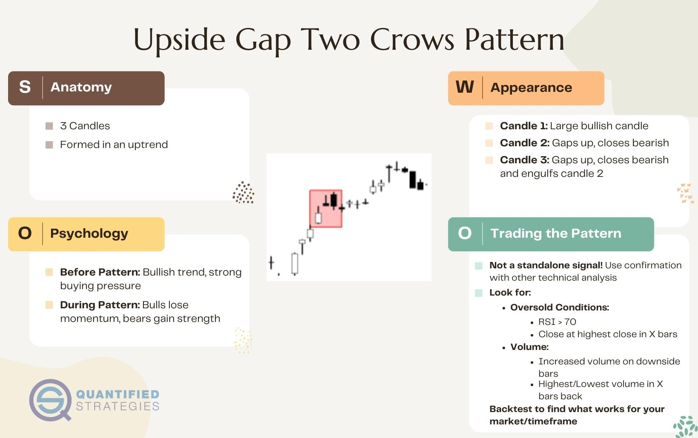

## Table of Contents

## What is the Upside Gap Two Crows pattern?

The Upside Gap Two Crows is a bearish reversal candlestick pattern that appears in an uptrend. It is made up of three candles. The first candle is a long white one, showing that the price went up a lot. The second candle gaps up and opens above the first candle's close, but it is a black candle, meaning the price went down by the end of the day. The third candle is also black and opens within the body of the second candle, then closes within the body of the first white candle.

This pattern suggests that the uptrend might be ending because the two black candles show that sellers are starting to take control. The gap up at the start of the second candle shows that buyers were still strong at first, but they couldn't keep the price up. When the third candle closes within the first candle's body, it confirms that the buyers are losing power and the sellers are gaining it. Traders watch for this pattern to decide when to sell or short a stock.

## How does the Upside Gap Two Crows pattern form on a chart?

The Upside Gap Two Crows pattern starts with a long white candle on a chart. This candle shows that the price of the stock went up a lot during that day. It means buyers were strong and in control of the market. The white candle is the first part of the pattern and it happens during an uptrend, which means the price has been going up for a while.

Next, a second candle appears, but this one is black and it gaps up. This means it starts higher than where the first white candle ended. Even though it starts high, the price goes down by the end of the day, so the candle is black. This shows that sellers are starting to take over from the buyers. The third candle is also black and it opens within the body of the second black candle. By the end of the day, this third candle closes within the body of the first white candle. This shows that the sellers are now in control and the uptrend might be over.

## What does the Upside Gap Two Crows indicate about market trends?

The Upside Gap Two Crows pattern tells us that a trend that was going up might be about to change and go down. It starts with a big white candle that shows the price went up a lot, meaning buyers were strong. Then, the next day, the price jumps up even more at the start but ends up going down by the end of the day, making a black candle. This shows that sellers are starting to take over from the buyers.

The third day, another black candle appears, and it opens within the body of the second black candle. By the end of the day, this third candle closes within the body of the first white candle. This tells us that the sellers are now in control, and the trend that was going up might be over. So, if you see this pattern on a chart, it's a sign that the market might start going down soon.

## Can you explain the psychology behind the Upside Gap Two Crows pattern?

The Upside Gap Two Crows pattern shows us what traders are thinking and feeling during a change in the market. It starts with a big white candle, which means the price went up a lot. This shows that buyers were feeling strong and confident, pushing the price higher. They thought the trend would keep going up, so they kept buying.

Then, the next day, the price jumps up even more at the start, but it ends up going down by the end of the day, making a black candle. This tells us that some sellers started to think the price was too high and decided to sell. Even though the price gapped up at the start, showing some optimism, the sellers took over by the end of the day. This change shows that the confidence of the buyers is starting to weaken.

On the third day, another black candle appears, and it opens within the body of the second black candle. By the end of the day, this third candle closes within the body of the first white candle. This shows that the sellers are now in control, and the buyers are losing hope. The pattern tells us that the market might be about to go down because the sellers are getting stronger and the buyers are getting weaker.

## What are the key components that make up the Upside Gap Two Crows pattern?

The Upside Gap Two Crows pattern has three main parts. The first part is a long white candle. This candle shows that the price went up a lot during that day. It means buyers were strong and in control of the market. The white candle happens during an uptrend, which means the price has been going up for a while.

The second part is a black candle that gaps up. This means it starts higher than where the first white candle ended. Even though it starts high, the price goes down by the end of the day, so the candle is black. This shows that sellers are starting to take over from the buyers. The third part is another black candle. It opens within the body of the second black candle and by the end of the day, it closes within the body of the first white candle. This shows that the sellers are now in control and the uptrend might be over.

## How reliable is the Upside Gap Two Crows pattern in predicting market reversals?

The Upside Gap Two Crows pattern can be a helpful sign that the market might be about to change direction, but it's not always right. It's like a warning that the price might start going down after going up for a while. Traders look at this pattern to decide if they should sell or short a stock. But, like any pattern, it doesn't work every time. Sometimes the market keeps going up even after this pattern shows up.

How well the Upside Gap Two Crows pattern works can depend on other things too. Things like how strong the overall market trend is, what other patterns are happening at the same time, and how much people are trading can all affect if the pattern's prediction comes true. So, while it's a good tool to use, traders usually look at more than just this one pattern before making big decisions.

## What are the common limitations of using the Upside Gap Two Crows pattern in trading?

The Upside Gap Two Crows pattern can be a useful sign that the market might change direction, but it has some limits. One big limit is that it doesn't always predict the market correctly. Sometimes, even after you see this pattern, the market might keep going up instead of going down. This means traders can't just rely on this pattern alone to make their trading choices. They need to look at other things too, like how strong the overall market trend is and what other patterns are happening at the same time.

Another limit is that the pattern can be affected by how much people are trading. If there's not a lot of trading happening, the pattern might not be as strong or reliable. Also, the pattern might look different on different time frames, like daily or weekly charts, which can make it harder to use. Traders need to be careful and use other tools and information to make sure they're making the best decisions.

## How can the Upside Gap Two Crows pattern be confirmed using other technical indicators?

To make sure the Upside Gap Two Crows pattern is a good sign that the market might change direction, traders can use other technical indicators to confirm it. One way is to look at the Relative Strength Index (RSI). If the RSI is over 70, it means the market might be overbought, which can support the idea that the price might go down soon. Another way is to check the Moving Average Convergence Divergence (MACD). If the MACD line crosses below the signal line after the pattern appears, it can be a sign that the trend is really changing to a downward one.

Another useful indicator is the [volume](/wiki/volume-trading-strategy). If the volume goes up a lot during the second and third black candles of the pattern, it shows that more people are selling, which can make the pattern's prediction stronger. Traders can also look at support and resistance levels. If the third black candle closes below a key support level, it adds more proof that the price might keep going down. By using these other indicators, traders can feel more sure about the Upside Gap Two Crows pattern and make better trading choices.

## What are some real-world examples where the Upside Gap Two Crows pattern successfully predicted a market reversal?

One real-world example of the Upside Gap Two Crows pattern successfully predicting a market reversal happened with the stock of Apple Inc. in early 2020. The stock had been on an uptrend for several months, and then a long white candle appeared on the chart, showing strong buying pressure. The next day, the stock gapped up at the open but closed lower, forming a black candle. On the third day, another black candle opened within the body of the second candle and closed within the body of the first white candle. This pattern signaled a potential reversal, and indeed, the stock price started to decline shortly after, confirming the bearish signal.

Another example can be seen in the S&P 500 index during the summer of 2018. The index was in a steady uptrend when a long white candle appeared, followed by a gap up and a black candle the next day. The third day completed the Upside Gap Two Crows pattern with another black candle closing within the body of the first white candle. This pattern indicated that the bullish trend might be ending. True to the pattern's prediction, the S&P 500 began to reverse and trend downward in the following weeks, validating the bearish reversal signal given by the Upside Gap Two Crows pattern.

## How does the Upside Gap Two Crows pattern differ from other bearish reversal patterns?

The Upside Gap Two Crows pattern is different from other bearish reversal patterns because it has a specific way of forming. It starts with a long white candle showing a strong uptrend, followed by a black candle that gaps up but closes lower. The third candle is also black and closes within the body of the first white candle. This pattern is unique because it includes a gap up between the first and second candles, which shows that the market was still bullish at the start of the second day but turned bearish by the end. Other bearish reversal patterns, like the Evening Star or Bearish Engulfing, don't have this gap up feature.

Another way the Upside Gap Two Crows pattern differs is in its psychology. It shows a clear shift from bullish to bearish sentiment over three days. The gap up at the start of the second day shows that buyers were still hopeful, but the black candles that follow show that sellers took over quickly. This quick change in sentiment is not as clearly shown in other patterns. For example, the Bearish Engulfing pattern shows a strong bearish move in just two days, but it doesn't have the same gradual shift seen in the Upside Gap Two Crows. This makes the Upside Gap Two Crows a more nuanced indicator of a potential reversal.

## What are the statistical probabilities of the Upside Gap Two Crows pattern leading to a significant price drop?

The Upside Gap Two Crows pattern can be a good sign that the price might go down, but it doesn't always happen. Studies show that this pattern leads to a significant price drop about 60% to 70% of the time. This means that if you see this pattern, there's a better chance than not that the price will go down, but it's not a sure thing.

The success of the pattern can depend on other things too. For example, if the market is very strong and going up a lot, the pattern might not work as well. Also, if there's not a lot of trading happening, the pattern might not be as reliable. So, while the Upside Gap Two Crows pattern can be a helpful tool, traders should look at other signs and information to make the best choices.

## How can traders adjust their strategies to account for the limitations of the Upside Gap Two Crows pattern?

Traders can adjust their strategies to account for the limitations of the Upside Gap Two Crows pattern by not relying on it alone. They should use other technical indicators to confirm the pattern's signal. For example, they can look at the Relative Strength Index (RSI) to see if the market is overbought, or check the Moving Average Convergence Divergence (MACD) to see if the trend is really changing. They can also pay attention to the trading volume. If the volume is high during the second and third black candles, it makes the pattern's prediction stronger. By using these other tools, traders can feel more confident about the pattern's signal and make better trading decisions.

Another way traders can adjust their strategies is by considering the overall market trend and other patterns happening at the same time. If the market is very strong and going up a lot, the Upside Gap Two Crows pattern might not work as well. Traders should also look at support and resistance levels. If the third black candle closes below a key support level, it adds more proof that the price might keep going down. By taking all these things into account, traders can better understand the pattern's limitations and use it more effectively in their trading.

## References & Further Reading

[1]: Bergstra, J., Bardenet, R., Bengio, Y., & Kégl, B. (2011). ["Algorithms for Hyper-Parameter Optimization."](https://dl.acm.org/doi/10.5555/2986459.2986743) Advances in Neural Information Processing Systems 24.

[2]: ["Advances in Financial Machine Learning"](https://www.amazon.com/Advances-Financial-Machine-Learning-Marcos/dp/1119482089) by Marcos Lopez de Prado

[3]: ["Evidence-Based Technical Analysis: Applying the Scientific Method and Statistical Inference to Trading Signals"](https://www.amazon.com/Evidence-Based-Technical-Analysis-Scientific-Statistical/dp/0470008741) by David Aronson

[4]: ["Machine Learning for Algorithmic Trading"](https://github.com/stefan-jansen/machine-learning-for-trading) by Stefan Jansen

[5]: ["Quantitative Trading: How to Build Your Own Algorithmic Trading Business"](https://www.amazon.com/Quantitative-Trading-Build-Algorithmic-Business/dp/1119800064) by Ernest P. Chan