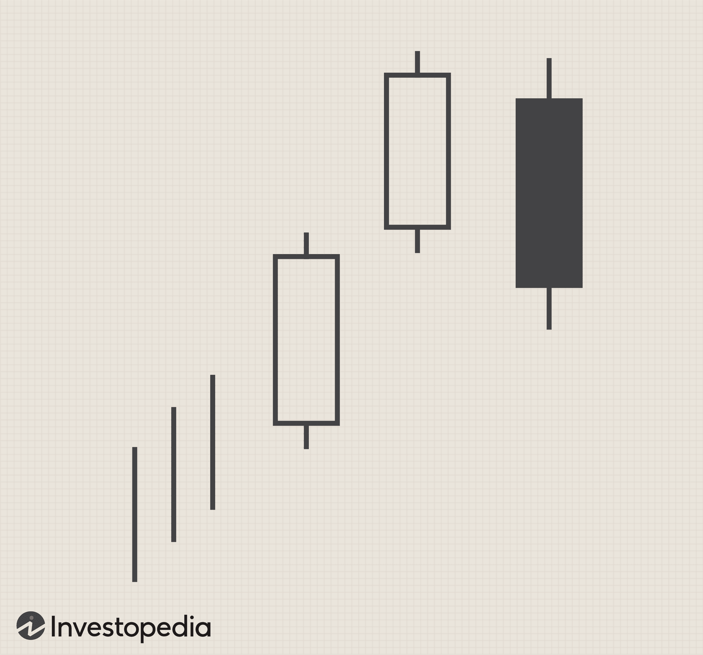

The Upside Tasuki Gap is a frequently observed candlestick pattern in stock market trading, primarily valued for its role in signaling a continuation of an ongoing trend. This pattern is characterized by a specific arrangement of candlesticks that traders analyze to make informed decisions about potential price movements. Its clear indication of trend persistence makes it particularly beneficial for algorithmic trading, where systems rely on distinct patterns to execute trades efficiently.

Understanding this pattern's characteristics and implications can significantly enhance trading strategies by providing insights into market sentiment and potential future price actions. Effective use of the Upside Tasuki Gap not only aids in identifying strategic entry and exit points but also assists in risk management, crucial for maintaining profitable positions.



In this article, we will examine the definition of the Upside Tasuki Gap, how to accurately identify it, and the various trading strategies that can be employed. Additionally, we will discuss how integrating this pattern into algorithmic trading setups can potentially lead to improved trading outcomes. By analyzing this pattern, traders can refine their strategies and enhance their analysis for better market performance.

## Table of Contents

## Understanding the Upside Tasuki Gap

The Upside Tasuki Gap is a notable candlestick pattern that appears predominantly within a bullish trend, carrying significant implications for traders seeking to anticipate market movements. This pattern is typified by a sequence of three specific candlesticks, which include two bullish candles followed by a bearish candle. The essence of this pattern lies in its configuration and what it signifies for traders analyzing price action.

Initially, the sequence begins with two consecutive bullish candlesticks. The first bullish candlestick marks the continuation of the existing upward trend. The second bullish candlestick opens with a noticeable gap above the close of the first candle, reinforcing the strength of the bullish sentiment in the market.

Subsequently, the bearish candlestick that follows plays a crucial role in this setup. It opens within the body of the second bullish candlestick and partially fills the preceding gap. This behavior indicates a temporary correction or a minor pullback in the market sentiments. However, the inability of this bearish candlestick to completely fill the gap signifies that the underlying bullish trend remains intact. This partial gap fill is interpreted as a brief pause rather than a reversal, showcasing the resilience of market bulls.

The pattern implicitly suggests that, despite the minor retreat indicated by the bearish candlestick, the bullish forces are likely to regain control, forecasting a continuation of the upward trend. The bears' failure to entirely close the gap underscores the strength and prevailing dominance of the bulls in the market. By recognizing this formation, traders are able to infer potential continuation signals, thereby leveraging the pattern to make informed trading decisions.

Understanding the dynamics of the Upside Tasuki Gap is critical for traders aiming to align their strategies with market trends. Identifying this pattern allows for better anticipation of future price movements, where the persistence of bullish pressure can lead to further price escalation.

## Importance of the Upside Tasuki Gap in Trading

The Upside Tasuki Gap is a critical candlestick pattern for traders seeking confirmation of bullish trends in the stock market. This pattern's ability to suggest the continuation of upward [momentum](/wiki/momentum) is invaluable for both traditional and algorithmic traders.

The partial closing of the gap in the Upside Tasuki Gap pattern is a key signal that the initial bullish momentum may persist. When the bearish candlestick does not completely fill the gap created by the preceding bullish candles, it indicates that the bulls maintain control, and the upward trend is likely to continue. This characteristic reassures traders of the sustainability of the trend, thus providing confidence in their trading strategies.

Understanding the Upside Tasuki Gap allows traders to establish effective stop-loss and take-profit levels. By identifying the pattern accurately, traders can place stop-loss orders beneath the low of the third candlestick to protect against potential reversals. Simultaneously, setting take-profit levels at logical points ensures that traders can optimize their gains while managing their risk exposure efficiently. This risk management is crucial for maintaining profitability and minimizing potential losses in volatile markets.

For algorithmic traders, the Upside Tasuki Gap serves as an actionable signal for automating buying decisions. When integrated into trading algorithms, the identification of this pattern can trigger automatic buy orders, allowing traders to respond swiftly to market movements. This automation not only enhances efficiency but also reduces the likelihood of emotional trading, thereby fostering disciplined trading practices.

Furthermore, the occurrence of the Upside Tasuki Gap underscores strong market sentiments that traders can leverage. The pattern reflects the resilience and enthusiasm of buyers in the current market conditions, providing traders with insights into the prevailing sentiment. By recognizing and acting on these signals, traders can align their strategies with the broader market outlook, thereby capitalizing on potential opportunities for profit.

In conclusion, the Upside Tasuki Gap's significance in trading lies in its ability to confirm bullish trends, enhance risk management, and provide actionable signals for [algorithmic trading](/wiki/algorithmic-trading). By understanding and applying the insights gained from this pattern, traders can improve their market analysis, refine their strategies, and ultimately achieve better trading outcomes.

## Identifying the Upside Tasuki Gap

To accurately identify the Upside Tasuki Gap, traders should focus on recognizing a distinct three-candlestick formation within a prevailing bullish market trend. The pattern begins with two robust bullish candlesticks, which indicate strong buying momentum. These initial candlesticks create a visible price gap—a crucial element of the pattern—where the closing price of the first candlestick is below the opening price of the second candlestick. This gap suggests a continuation of the bullish sentiment as buyers are eager to purchase at higher prices than those of the previous session.

Following the gap, a bearish candlestick emerges. It is important that this third candlestick only partially fills the gap between the first two bullish candlesticks. The partial gap fill is significant as it demonstrates that despite a temporary retreat by buyers, selling pressure is not strong enough to close the gap entirely. This inability of the bears to fill the gap reinforces the bulls' dominance in the market and suggests a continuation of the upward trend.

Attention to detail in observing these candlestick formations is crucial. Misidentifying the pattern due to overlooking the precise nature of the gap or the extent of its filling can lead to erroneous trading decisions. Traders might find it beneficial to use chart pattern recognition tools or software designed to identify candlestick formations efficiently. These tools, often integrated into modern trading platforms, can assist in spotting patterns by scanning extensive historical data to highlight possible occurrences of the Upside Tasuki Gap and other candlestick patterns. This technological aid not only saves time but also improves the accuracy of pattern identification, allowing traders to act promptly on reliable signals.

## Trading Strategies Using the Upside Tasuki Gap

The Upside Tasuki Gap pattern, identified by a specific formation of candlesticks in a bullish trend, offers explicit signals for traders to make informed decisions. One effective strategy is to enter a trade after confirming that the gap closure between the second and third candlesticks is partial, suggesting the continuation of the initial bullish momentum.

### Entry Strategy

To capitalize on the Upside Tasuki Gap, traders should place a buy order slightly above the high of the second bullish candlestick. This positions the trader to participate in the projected upward movement, should the market continue its bullish path. The confirmed high of the second candlestick acts as a critical threshold reinforcing buyer confidence.

### Utilizing Technical Indicators

In addition to observing the candlestick patterns, incorporating technical indicators can provide further assurance and precision. Moving averages, particularly the Simple Moving Average (SMA) or Exponential Moving Average (EMA), can be used to gauge the overall trend. When the moving averages confirm an upward trend, the probability of success for a trade based on the Upside Tasuki Gap increases.

### Risk Management

Risk management is a critical component of any trading strategy. To this end, it is advisable to set stop-loss orders below the low of the identified pattern. This precautionary measure serves to protect the trading position from unexpected market reversals and to limit potential losses.

### Fibonacci Retracement for Precision

Fibonacci retracement levels can be leveraged to refine entry and [exit](/wiki/exit-strategy) points. By identifying key levels of potential support and resistance, traders can adjust their buy and sell orders for optimal timing. This method is particularly useful when markets experience temporary pullbacks, offering a mechanism to join the trend at advantageous price points.

#### Example Python Snippet

A simplified approach to automate the above strategies using Python could involve using a library like `TA-Lib` to detect the pattern and calculate moving averages:

```python
import talib
import numpy as np

# Assuming 'close_prices' is a numpy array of closing prices
# 'high_prices' and 'low_prices' for the respective highs and lows

# Calculate moving averages
sma = talib.SMA(close_prices, timeperiod=30)

# Identify potential Upside Tasuki Gap
# 'is_tasuki_gap' is a placeholder for the pattern recognition logic
is_tasuki_gap = some_tasuki_gap_function(close_prices, high_prices, low_prices)

for i in range(len(close_prices)):
    if is_tasuki_gap[i] and close_prices[i] > sma[i]:
        # Code to place buy order
        buy_order = high_prices[i] * 1.01  # Slightly above the second candle
        print(f"Buy order placed at: {buy_order}")

        # Stop-loss placement
        stop_loss = low_prices[i] * 0.99  # Below the low of the pattern
        print(f"Stop-loss order at: {stop_loss}")
```

This example highlights how traders can combine technical insights with algorithmic solutions to enhance decision-making, ensuring trades are based on robust pattern recognition and strategic positioning in the financial markets.

## Integrating the Upside Tasuki Gap in Algorithmic Trading

Algorithmic trading programs can significantly benefit from the integration of the Upside Tasuki Gap pattern, particularly in automating trade execution. By incorporating pattern recognition software, traders can enhance their decision-making processes, ensuring that trades are executed promptly and effectively when the pattern is identified. Machine learning models, such as neural networks, can be trained to recognize the specific formations of the Upside Tasuki Gap by analyzing vast quantities of historical data. This data-driven approach allows algorithms to ascertain the statistical validity and future profitability of this pattern across various market conditions.

To further refine the strategy, additional filters such as [volume](/wiki/volume-trading-strategy) and [volatility](/wiki/volatility-trading-strategies) can be implemented. Volume filters can help ensure that price movements are supported by sufficient market participation, thus increasing the reliability of the Upside Tasuki Gap as a bullish continuation signal. Volatility filters, on the other hand, can gauge the strength of the pattern within different market environments, preventing false signals in low volatility markets from misleading trade decisions.

Backtesting is a crucial step in algorithmic trading strategy development. By using historical market data, traders can assess how the presence of the Upside Tasuki Gap would have impacted past trading scenarios. This involves simulating trades using Python libraries such as [backtrader](/wiki/backtrader) or zipline. For example, [backtesting](/wiki/backtesting) could be performed with the following Python snippet:

```python
import backtrader as bt

class UpsideTasukiGap(bt.Strategy):
    def __init__(self):
        self.gap_identified = False

    def next(self):
        if not self.gap_identified and self.data.close[0] > self.data.open[-1] + 'gap_value':
            self.gap_identified = True
            self.buy()

cerebro = bt.Cerebro()
cerebro.addstrategy(UpsideTasukiGap)
cerebro.run()
```

Regular updates to algorithmic models are necessary to adapt to changing market dynamics and optimize performance. Markets evolve due to varying macroeconomic factors and trader behavior, necessitating continuous refinement of algorithms to maintain their efficacy. Employing adaptive learning techniques where algorithms learn from new data autonomously can be critical in keeping trading strategies relevant and profitable. By systematically employing these methodologies, traders can leverage the Upside Tasuki Gap pattern effectively within their algorithmic trading frameworks.

## Conclusion

Mastering the Upside Tasuki Gap can provide a competitive edge in stock market trading by allowing traders to anticipate and act on potential price continuations within bullish trends. This particular candlestick pattern proves useful across both manual and algorithmic trading frameworks due to its ability to signal enduring upward momentum after a brief market correction represented by the partial gap closure. Understanding the nuances of the pattern's formation and leveraging it effectively requires ongoing strategy enhancement, allowing traders to refine and adapt their systems to better align with this specific market indicator.

The reliability of the Upside Tasuki Gap to predict price movements hinges on its precise identification and integration into broader trading strategies. Traders are encouraged to utilize a comprehensive approach that might include combining this pattern with other technical analysis tools such as moving averages or Fibonacci retracement levels to reinforce their trading decisions. 

Moreover, those integrating this pattern into algorithmic trading can benefit from automating the identification and application of the Upside Tasuki Gap through advanced software solutions. By continuously analyzing historical data and updating their algorithms to reflect current market conditions, traders can optimize their performance and maintain a competitive edge.

Ultimately, success in using the Upside Tasuki Gap requires vigilance towards evolving market dynamics. By staying informed and adapting strategies as needed, traders can maximize the pattern's potential to enhance market analysis and achieve better trading outcomes in a rapidly changing trading environment.

## References & Further Reading

[1]: Nison, S. (1991). ["Japanese Candlestick Charting Techniques: A Contemporary Guide to the Ancient Investment Techniques of the Far East"](https://archive.org/details/japanesecandlest0000niso). Prentice Hall Press.

[2]: Bulkowski, T. (2008). ["Encyclopedia of Candlestick Charts"](https://onlinelibrary.wiley.com/doi/book/10.1002/9781119202288). Wiley.

[3]: Murphy, J. J. (1999). ["Technical Analysis of the Financial Markets: A Comprehensive Guide to Trading Methods and Applications"](https://archive.org/details/technicalanalysi0000murp). New York Institute of Finance.

[4]: Chan, E. (2013). ["Algorithmic Trading: Winning Strategies and Their Rationale"](https://github.com/ftvision/quant_trading_echan_book). Wiley.

[5]: Pring, M. J. (2002). ["Technical Analysis Explained: The Successful Investor's Guide to Spotting Investment Trends and Turning Points"](https://www.amazon.com/Technical-Analysis-Explained-Fifth-Successful/dp/0071825177). McGraw-Hill Education.