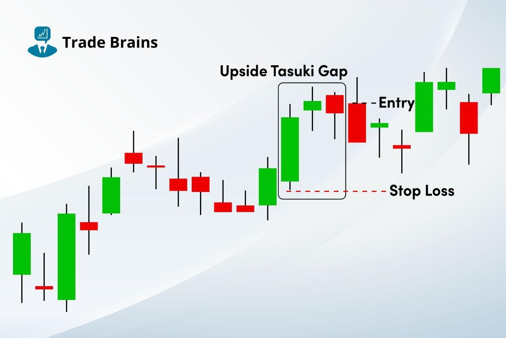

## Table of Contents

## What is the Upside Tasuki Gap?

The Upside Tasuki Gap is a pattern you might see when looking at stock charts. It happens when a stock's price goes up a lot one day, leaving a gap between that day's price and the previous day's price. The next day, the price stays about the same or goes up a little bit, but it doesn't fill the gap from the day before. This pattern can be a sign that the stock might keep going up.

This pattern is called "Tasuki" because it looks a bit like a traditional Japanese belt called a tasuki. If you see an Upside Tasuki Gap, it might mean that the people buying the stock are still in control and the price could keep rising. But, it's always a good idea to look at other things too, not just this one pattern, before deciding to buy or sell a stock.

## How does the Upside Tasuki Gap pattern form?

The Upside Tasuki Gap pattern starts when a stock's price jumps up a lot in one day. This jump creates a gap on the chart because the lowest price of the new day is higher than the highest price of the day before. This big jump shows that a lot of people want to buy the stock, and it's a sign that the price might keep going up.

After the big jump, the next day's price doesn't go down to fill the gap. Instead, it stays about the same or goes up a little bit. This means the stock is still strong, and the people buying it are still in control. If you see this pattern, it might mean the stock's price will keep rising, but it's always good to check other things too before making a decision.

## What are the key components of an Upside Tasuki Gap?

The Upside Tasuki Gap pattern has two main parts. The first part is a big jump in the stock's price on one day. This jump creates a gap on the chart because the lowest price of that day is higher than the highest price of the day before. This big jump shows that a lot of people want to buy the stock, and it's a sign that the price might keep going up.

The second part happens the next day. Instead of the price going down to fill the gap, it stays about the same or goes up a little bit. This means the stock is still strong, and the people buying it are still in control. If you see this pattern, it might mean the stock's price will keep rising, but it's always good to check other things too before making a decision.

## Can you explain the significance of the gap in the Upside Tasuki Gap pattern?

The gap in the Upside Tasuki Gap pattern is really important. It happens when the stock's price jumps up a lot in one day, leaving a space on the chart between that day's lowest price and the highest price of the day before. This gap shows that a lot of people suddenly wanted to buy the stock, and it's a sign that the price might keep going up.

The next day, if the price doesn't go down to fill the gap, it means the stock is still strong. The gap staying open shows that the people buying the stock are still in control and the price might keep rising. So, the gap is a big clue that helps traders decide if the stock's price will keep going up.

## What does the Upside Tasuki Gap indicate about market trends?

The Upside Tasuki Gap pattern tells us that the market might keep going up. It starts when the price of a stock jumps a lot in one day, leaving a gap on the chart. This big jump shows that a lot of people suddenly wanted to buy the stock, which is a sign that the price might keep rising.

The next day, if the price doesn't go down to fill the gap, it means the stock is still strong. The gap staying open shows that the people buying the stock are still in control. So, seeing an Upside Tasuki Gap can make traders think that the market trend will continue to go up.

## How reliable is the Upside Tasuki Gap as a bullish signal?

The Upside Tasuki Gap is seen as a good sign that a stock's price might keep going up. It happens when the price jumps a lot one day, leaving a gap, and then stays strong the next day without filling that gap. This pattern shows that people buying the stock are still in control and the price might keep rising.

But, it's not perfect. Sometimes, even if you see an Upside Tasuki Gap, the stock's price might not go up as expected. It's always a good idea to look at other things too, like the overall market and other patterns, before deciding to buy or sell a stock. So, while the Upside Tasuki Gap can be a helpful sign, it's best to use it along with other information.

## What are the steps to identify an Upside Tasuki Gap on a chart?

To spot an Upside Tasuki Gap on a chart, first look for a big jump in the stock's price on one day. This jump will leave a gap on the chart because the lowest price of that day is higher than the highest price of the day before. This big jump shows that a lot of people suddenly wanted to buy the stock, and it's a sign that the price might keep going up.

Next, check what happens the day after the big jump. If the price stays about the same or goes up a little bit without filling the gap, you've found an Upside Tasuki Gap. This means the stock is still strong, and the people buying it are still in control. Seeing this pattern can make you think that the stock's price will keep rising.

## Are there any common mistakes to avoid when using the Upside Tasuki Gap for trading?

When using the Upside Tasuki Gap for trading, one common mistake is relying on it too much. Just because you see this pattern, it doesn't mean the stock will always go up. It's a good sign, but it's not perfect. You should always look at other things too, like the overall market and other patterns, before deciding to buy or sell.

Another mistake is not waiting long enough to see if the pattern really works. Sometimes, the stock's price might go up right away, but other times it might take a few days. If you sell too soon, you might miss out on more gains. So, it's important to be patient and watch the stock for a bit after you see the Upside Tasuki Gap.

## How does the Upside Tasuki Gap differ from other bullish continuation patterns?

The Upside Tasuki Gap is a special kind of bullish continuation pattern that you can spot on a stock chart. It happens when the stock's price jumps up a lot one day, leaving a gap, and then stays strong the next day without filling that gap. This pattern is different from other bullish continuation patterns because it has this clear gap that shows a lot of people suddenly wanted to buy the stock. Other patterns, like the Bullish Flag or the Ascending Triangle, don't have this gap. They show the stock's price moving in a certain way over time, but they don't have that sudden jump and gap.

Another way the Upside Tasuki Gap is different is that it's a quick sign that the stock might keep going up. Patterns like the Bullish Flag or the Ascending Triangle can take longer to form and might need more time to show that the stock's price will keep rising. The Upside Tasuki Gap gives you a faster clue because it happens over just two days. But, like with any pattern, it's always a good idea to look at other things too before deciding to buy or sell a stock.

## What are some real-world examples of the Upside Tasuki Gap in stock market history?

One real-world example of the Upside Tasuki Gap happened with Apple Inc. in early 2019. On January 29, 2019, Apple's stock price jumped from a high of $157.92 to a low of $162.94 the next day, leaving a gap. The following day, on January 30, the stock price stayed strong and didn't fill the gap, closing at $164.94. This Upside Tasuki Gap pattern showed that buyers were still in control, and indeed, Apple's stock continued to rise in the following weeks.

Another example can be seen with Tesla Inc. in late 2020. On November 16, 2020, Tesla's stock price surged from a high of $408.09 to a low of $422.64 the next day, creating a gap. On November 17, the stock price held steady and closed at $427.20 without filling the gap. This pattern indicated strong buying interest, and Tesla's stock price continued its upward trend in the subsequent days. These examples show how the Upside Tasuki Gap can signal a continuing bullish trend in the stock market.

## How can traders use the Upside Tasuki Gap in conjunction with other technical indicators?

Traders can use the Upside Tasuki Gap along with other technical indicators to make better decisions. For example, they can look at the Relative Strength Index (RSI) to see if a stock is overbought or oversold. If the RSI shows the stock is not overbought when an Upside Tasuki Gap appears, it can be a stronger sign that the price might keep going up. Another useful indicator is the Moving Average Convergence Divergence (MACD). If the MACD line crosses above the signal line at the same time as the Upside Tasuki Gap, it can confirm that the stock's trend is bullish.

Using these indicators together helps traders get a fuller picture of what's happening with the stock. The Upside Tasuki Gap shows a sudden jump in buying interest and a gap that stays open, but adding RSI and MACD can help confirm if the trend is likely to continue. By combining these tools, traders can feel more confident in their decisions and avoid relying too much on just one pattern or indicator.

## What advanced strategies can be employed to maximize the effectiveness of trading based on the Upside Tasuki Gap?

To make the most out of trading with the Upside Tasuki Gap, traders can use a strategy called position sizing. This means deciding how much of their money to put into a trade based on how sure they are about the pattern. If the Upside Tasuki Gap looks strong and other indicators like the RSI and MACD also show a bullish trend, a trader might decide to put more money into the trade. But if they're not as sure, they might put in less money to be safer. This way, they can make bigger profits when they're right and lose less when they're wrong.

Another advanced strategy is to use stop-loss orders. A stop-loss order is like a safety net that automatically sells the stock if its price drops to a certain level. When trading based on the Upside Tasuki Gap, a trader can set a stop-loss just below the gap. This helps protect their money if the stock's price suddenly goes down instead of up. By combining the Upside Tasuki Gap with position sizing and stop-loss orders, traders can be smarter about their trades and manage their risks better.

## References & Further Reading

[1]: Nison, S. (1991). ["Japanese Candlestick Charting Techniques: A Contemporary Guide to the Ancient Investment Techniques of the Far East"](https://archive.org/details/japanesecandlest0000niso). Prentice Hall Press.

[2]: Bulkowski, T. (2008). ["Encyclopedia of Candlestick Charts"](https://onlinelibrary.wiley.com/doi/book/10.1002/9781119202288). Wiley.

[3]: Murphy, J. J. (1999). ["Technical Analysis of the Financial Markets: A Comprehensive Guide to Trading Methods and Applications"](https://archive.org/details/technicalanalysi0000murp). New York Institute of Finance.

[4]: Chan, E. (2013). ["Algorithmic Trading: Winning Strategies and Their Rationale"](https://github.com/ftvision/quant_trading_echan_book). Wiley.

[5]: Pring, M. J. (2002). ["Technical Analysis Explained: The Successful Investor's Guide to Spotting Investment Trends and Turning Points"](https://www.amazon.com/Technical-Analysis-Explained-Fifth-Successful/dp/0071825177). McGraw-Hill Education.