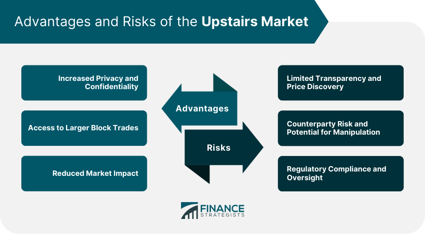

## Table of Contents

## What is the Upstairs Market?

The Upstairs Market is a part of the stock market where big trades happen away from the main trading floor. It's called "upstairs" because these trades used to happen in offices above the main trading area. Big investors, like banks and big funds, use the Upstairs Market to buy and sell large amounts of stocks without affecting the stock's price too much on the main market.

In the Upstairs Market, traders can negotiate prices directly with each other. This helps them get better deals and avoid the quick price changes that can happen on the main market when big trades are made. It's a bit like shopping in a private room instead of a busy store, where you can take your time and make a deal that works for everyone involved.

## How does the Upstairs Market differ from the downstairs market?

The Upstairs Market and the downstairs market, also known as the main market, are two different parts of the stock market. The Upstairs Market is where big investors, like banks and big funds, make large trades away from the main trading floor. They do this in a more private setting, often in offices above the main trading area, which is why it's called "upstairs." This allows them to buy and sell big amounts of stocks without causing big price changes on the main market.

On the other hand, the downstairs market is the main trading floor where most trading happens. It's open to everyone, and trades are made quickly and publicly. Prices can change fast because there are so many people buying and selling at the same time. The downstairs market is like a busy store where everyone can see what's happening, while the Upstairs Market is more like a private room where big deals can be made quietly.

## What types of securities are typically traded in the Upstairs Market?

In the Upstairs Market, you'll mostly find big trades of stocks. These are shares in companies that big investors, like banks and big funds, want to buy or sell in large amounts. They choose the Upstairs Market because it lets them make these big trades without causing big price changes on the main market. It's like they're shopping in a private room where they can take their time and make deals that work for everyone involved.

Sometimes, other types of securities are traded in the Upstairs Market too. These can include bonds, which are like loans to companies or governments, and options, which are agreements to buy or sell stocks at a certain price in the future. But stocks are the most common because they're what big investors usually want to trade in large amounts. The Upstairs Market helps them do this without making a big fuss on the main market.

## Who are the main participants in the Upstairs Market?

The main participants in the Upstairs Market are big investors like banks, big funds, and other large financial institutions. These are the folks who want to buy or sell a lot of stocks at once. They use the Upstairs Market because it lets them make these big trades without causing big price changes on the main market. It's like they're shopping in a private room where they can take their time and make deals that work for everyone involved.

Sometimes, you might also see other types of big investors in the Upstairs Market. These could be big companies or wealthy individuals who want to trade large amounts of stocks or other securities like bonds and options. But mostly, it's the big banks and funds that you'll find here, because they're the ones who usually need to make these big trades. The Upstairs Market helps them do this quietly and smoothly.

## How does the trading process work in the Upstairs Market?

In the Upstairs Market, big investors like banks and funds make large trades away from the main market. They do this by talking directly to each other, often in private offices. This lets them negotiate the price and size of the trade without causing big price changes on the main market. It's like shopping in a private room where you can take your time and make a deal that works for everyone.

Once they agree on the price and size of the trade, they send the details to the main market to be recorded. This way, the trade is official and everyone knows it happened. But because the trade was made quietly in the Upstairs Market, it doesn't cause a big fuss on the main market. It's a smooth way for big investors to buy and sell a lot of stocks without making a big impact.

## What are the advantages of trading in the Upstairs Market for large investors?

Trading in the Upstairs Market gives big investors like banks and funds a few key advantages. One big plus is that they can make large trades without causing big price changes on the main market. When a big investor buys or sells a lot of stocks all at once on the main market, it can make the stock's price go up or down a lot. But in the Upstairs Market, they can talk directly to other big investors and agree on a price quietly. This helps them get a better deal and keeps the main market from getting too excited.

Another advantage is that the Upstairs Market lets big investors take their time to make a deal. On the main market, trades happen fast and everyone can see what's going on. But in the Upstairs Market, they can negotiate in private offices, like shopping in a quiet room. This gives them more control over the trade and lets them make sure the deal works for everyone involved. It's a smoother way to handle big trades without causing a big fuss.

## What role do brokers and dealers play in the Upstairs Market?

Brokers and dealers are really important in the Upstairs Market. They help big investors like banks and funds make their big trades. Brokers act like middlemen, finding other big investors who want to buy or sell the same stocks. They talk to these investors and help them agree on a price and size for the trade. This way, the big investors can make their deals without causing big price changes on the main market.

Dealers also play a key role. They can buy stocks from one big investor and then sell them to another. This helps keep the trading smooth and makes sure the big trades happen without too much fuss. Both brokers and dealers work in the private offices of the Upstairs Market, helping big investors get the best deals and keep things quiet on the main market.

## How does the Upstairs Market contribute to market liquidity?

The Upstairs Market helps make the market more liquid by letting big investors trade large amounts of stocks without causing big price changes on the main market. When big investors want to buy or sell a lot of stocks, it can be hard to find someone on the main market who wants to trade that much at once. But in the Upstairs Market, brokers and dealers help them find other big investors who are ready to make the trade. This makes it easier for big trades to happen, which adds more liquidity to the market.

By keeping big trades quiet and smooth, the Upstairs Market also helps keep the main market stable. If big trades happened on the main market, they could make stock prices go up or down a lot, which could scare other investors away. But because the Upstairs Market lets big investors trade in private, it keeps the main market from getting too excited. This helps keep the market calm and makes it easier for everyone to buy and sell stocks, which is another way the Upstairs Market adds to market liquidity.

## What are the regulatory considerations for trading in the Upstairs Market?

Trading in the Upstairs Market has to follow rules to make sure everything is fair and open. The main rule is that all trades made in the Upstairs Market need to be reported to the main market. This way, everyone knows what trades happened, even if they were made quietly in private offices. The rules also say that the prices in the Upstairs Market can't be too different from the prices on the main market. This stops big investors from making secret deals that could hurt other investors.

Regulators also keep an eye on the Upstairs Market to make sure no one is doing anything wrong. They check to see if big investors are following the rules and not using the Upstairs Market to trick other people. If someone breaks the rules, they can get in big trouble. The goal is to keep the market fair for everyone, even when big trades are happening away from the main market.

## How does technology impact trading in the Upstairs Market?

Technology has made a big difference in how trading happens in the Upstairs Market. Before, big investors had to talk to each other in person or over the phone to make deals. Now, they can use computers and special software to talk to each other and make trades faster and easier. This technology helps them find other big investors who want to buy or sell the same stocks, and it lets them agree on prices and sizes of trades without having to meet face-to-face.

This change has made the Upstairs Market more efficient. Big investors can now make their big trades even quicker and with less chance of messing up the main market's prices. The technology also helps keep track of all the trades and makes sure they follow the rules. It's like having a super smart helper that makes everything smoother and more organized.

## What are the potential risks associated with trading in the Upstairs Market?

Trading in the Upstairs Market can be risky because it's not as open as the main market. When big investors make deals in private, it can be hard for other people to know what's going on. This lack of openness can make some investors worried that they might miss out on important information or that the prices might not be fair. If big investors can make secret deals, it could hurt smaller investors who don't have the same access to the Upstairs Market.

Another risk is that even though the Upstairs Market is meant to keep big trades from causing big price changes, sometimes it might not work perfectly. If a big trade in the Upstairs Market gets reported to the main market and the price is very different, it could still cause some excitement and make the stock's price move a lot. This can be risky for investors who are not ready for sudden price changes. So, while the Upstairs Market helps big investors make big trades smoothly, there's always a chance that things might not go as planned.

## How can an investor access the Upstairs Market and what are the entry requirements?

To access the Upstairs Market, an investor usually needs to be a big player in the financial world, like a bank or a big fund. These big investors have special relationships with brokers and dealers who work in the Upstairs Market. They can talk to these brokers and dealers to find other big investors who want to make big trades. It's not something that regular people can just walk into because it's meant for big trades that need to happen quietly and smoothly.

The entry requirements for the Upstairs Market are pretty strict. You need to have a lot of money to trade there because the trades are usually for big amounts of stocks. Also, you need to be working with a broker or dealer who knows how to navigate the Upstairs Market. They help you find the right people to trade with and make sure everything follows the rules. So, if you're a big investor looking to make big trades without causing a fuss on the main market, the Upstairs Market might be the place for you, but you'll need the right connections and a lot of cash.

## References & Further Reading

[1]: Hasbrouck, J. (2003). ["Intraday Price Formation in U.S. Equity Market"](https://onlinelibrary.wiley.com/doi/10.1046/j.1540-6261.2003.00609.x). The Review of Financial Studies, 16(2), 353-384.

[2]: O’Hara, M. (1995). ["Market Microstructure Theory"](https://www.wiley.com/en-us/Market+Microstructure+Theory-p-9780631207610). Blackwell Publishing.

[3]: Easley, D., & O’Hara, M. (1987). ["Price, Trade Size, and Information in Securities Markets"](https://www.sciencedirect.com/science/article/pii/0304405X87900298). Journal of Financial Economics, 19(1), 69-90.

[4]: Hendershott, T., Jones, C. M., & Menkveld, A. J. (2011). ["Does Algorithmic Trading Improve Liquidity?"](https://onlinelibrary.wiley.com/doi/full/10.1111/j.1540-6261.2010.01624.x) Journal of Finance, 66(1), 1-33.

[5]: Aldridge, I. (2013). ["High-Frequency Trading: A Practical Guide to Algorithmic Strategies and Trading Systems"](https://www.amazon.com/High-Frequency-Trading-Practical-Algorithmic-Strategies/dp/1118343506). Wiley Trading.

[6]: Kissell, R. (2013). ["The Science of Algorithmic Trading and Portfolio Management"](https://www.sciencedirect.com/book/9780124016897/the-science-of-algorithmic-trading-and-portfolio-management). Academic Press.

[7]: Bouchaud, J. P., Farmer, J. D., & Lillo, F. (2009). ["How Markets Slowly Digest Changes in Supply and Demand"](https://arxiv.org/abs/0809.0822). Handbook of Financial Markets: Dynamics and Evolution.