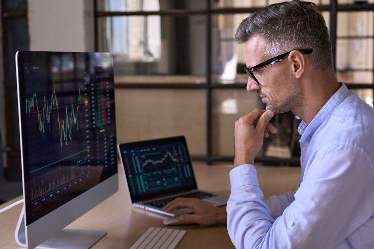

The financial markets have always been a complex and ever-evolving ecosystem, characterized by a dynamic interplay of economic forces, technological advancements, and regulatory frameworks. Two significant segments that have gained prominence over recent years are upstairs market trading and algorithmic trading (algo trading). These segments are noteworthy for their substantial impact on trading strategies, market liquidity, and operational efficiencies.

Upstairs market trading involves private transactions of large stock blocks executed away from public exchanges. This privately negotiated market is crucial for institutional investors and large firms, aiming to conduct substantial buy or sell orders without causing significant price fluctuations or alerting competitive market participants. The primary advantage of the upstairs market is the minimization of market impact, reduced transaction costs, and enhanced trade confidentiality. However, this trading method raises concerns regarding transparency, as transactions are not immediately visible to the open market. 

On the other hand, algorithmic trading represents a technological leap in executing trades using computer algorithms that follow predefined instructions. These algorithms are designed to execute orders at speeds and frequencies that are impossible for human traders, making them adept at capturing profitable opportunities through various strategies such as trend following, statistical arbitrage, and mean reversion. The advent of algo trading has revolutionized financial markets by increasing efficiency, reducing emotional biases, and enabling real-time adjustment of orders.

This article aims to demystify the concepts around upstairs market trading and algo trading, exploring their mechanics, differences, roles, and future in financial markets. By understanding these sophisticated trading methods, market participants can better navigate the complexities of modern financial systems and harness the opportunities presented by these advanced trading segments.

## Table of Contents

## Understanding Upstairs Market Trading

The upstairs market is characterized by private transactions of large trading blocks carried out away from the public exchanges. This approach allows institutional investors and large firms to execute significant buy or sell orders with minimized impact on market prices. When large transactions are executed publicly on major exchanges, they can lead to noticeable price fluctuations. To mitigate this, participants leverage the upstairs market, which offers the discretion necessary to avoid influencing the market adversely.

Key players in this system include professional brokers and financial institutions. Brokers act as intermediaries, matching buyers and sellers for large block trades. Financial institutions such as mutual funds, pension funds, and hedge funds frequently participate, often seeking to buy or sell substantial quantities of securities without drawing unnecessary attention that might adversely affect the security's price.

The upstairs market provides several advantages. Primarily, it reduces market impact by letting traders sidestep the typical supply-demand dynamics that might otherwise cause significant price shifts in an open, competitive market environment. Furthermore, conducting private transactions can also result in lower transaction costs compared to public exchanges, where the process might incur higher fees due to multiple intermediaries or require additional time to find a counterparty for a large order.

Despite these benefits, the upstairs market raises concerns regarding transparency. Since trades are conducted privately, the visibility of these transactions to the wider market is limited, potentially giving rise to fairness issues and information asymmetry. Regulators often scrutinize these transactions to ensure that they do not undermine the integrity of financial markets or disadvantage retail investors. As such, balancing the unique benefits of the upstairs market with the need for transparency remains a key consideration in financial regulations.

## Exploring Algo Trading

Algorithmic trading, commonly referred to as algo trading, utilizes computer algorithms to automate trading processes based on predefined rules. This form of trading allows for the execution of trades with precision and at significantly enhanced speeds. Algo trading systems are capable of adjusting orders in real-time, which is a substantial advantage in the fast-paced environment of modern financial markets.

The foundation of [algorithmic trading](/wiki/algorithmic-trading) lies in its ability to leverage multiple strategies to optimize trading outcomes. Among these strategies, trend-following is a popular approach. It is based on the analysis of historical market data and attempts to predict future movements by identifying persistent price trends. Algorithms utilizing trend-following strategies can automatically execute buy or sell orders when certain market conditions are met, such as moving average crossovers.

Another common strategy within algo trading is [arbitrage](/wiki/arbitrage), which involves taking advantage of price discrepancies between different markets or financial instruments. For instance, an algorithm might be programmed to buy a security in one market where it is undervalued and simultaneously sell it in another market where it is overvalued, locking in risk-free profit. Real-time data feeds and rapid execution capabilities are essential for successful arbitrage strategies, as these opportunities can disappear in fractions of a second.

Mean reversion is a further strategy employed in algorithmic trading. This strategy is predicated on the idea that prices and returns eventually revert to their mean or average level. An algorithm might be set to identify securities that have deviated from their historical average and place trades that capitalize on the anticipated return to the mean.

Despite these benefits, algorithmic trading also presents challenges. Technical failures can occur, which might result in significant financial loss. These failures could be due to software bugs, hardware malfunctions, or connectivity issues, and thus require robust risk management protocols. Moreover, the increased speed and [volume](/wiki/volume-trading-strategy) of algo trading can lead to potential market impacts, such as increased [volatility](/wiki/volatility-trading-strategies). Rapid and large-scale automated trades have the potential to exacerbate market swings if not carefully managed.

Algorithmic trading, while offering efficiencies and reducing emotional bias associated with human decision-making, necessitates careful consideration of both its advantageous properties and inherent risks. Its reliance on sophisticated software, algorithms, and large data sets underscores the importance of technological robustness and strategic precision. As financial markets continue to evolve, the role of algorithmic trading is anticipated to expand, reinforcing the need for ongoing adaptation and innovation.

## Comparing Upstairs Market and Algo Trading

Both upstairs market trading and algorithmic trading (algo trading) occupy significant niches in the broader financial market structure, each serving distinct roles that cater to varying investor needs and trading environments.

Upstairs market trading primarily centers around the execution of large trade blocks through private channels, primarily involving institutional investors and professional brokers. This method ensures confidentiality and reduces the likelihood of substantial market impact, a common risk when executing sizable transactions on public exchanges. Consequently, upstairs market trading is particularly beneficial in mitigating price disruption. When a large order is placed on a public exchange, the sheer volume can shift demand and supply dynamics, leading to significant price movements. The private nature of upstairs market transactions alleviates this issue, providing a mechanism for discreetly handling large trades without alarming the general market populace.

In contrast, algorithmic trading capitalizes on speed and precision through automation. Utilizing sophisticated algorithms, this method a) processes vast amounts of data, b) executes trades in fractions of a second, and c) constantly adjusts trade parameters to optimize outcomes. The primary advantage of algo trading is its ability to increase trading efficiency across various market segments. By analyzing patterns, identifying arbitrage opportunities, and executing trades without emotional interference, algo trading enhances the transaction process to levels beyond what human traders can achieve.

Despite their efficiencies, both approaches have unique limitations. Upstairs market trading, while minimizing price impact and maintaining confidentiality, faces criticism over transparency. The private nature of these transactions can obscure important market signals, potentially disadvantaging retail investors and smaller market participants. Conversely, while algo trading boasts impressive speed and efficiency, it also presents challenges related to its reliance on technological infrastructure. System failures, coding errors, and unintended algorithmic behaviors could lead to substantial, unintended market consequences.

Evaluating these factors helps in recognizing the distinct positions both trading methodologies hold within the modern trading ecosystem. By balancing confidentiality and market impact considerations with speed and data-driven strategies, upstairs market and algo trading collectively enrich trading dynamics, each supporting a segment of the market that benefits from their particular strengths. Understanding the interplay between these strategies is crucial for stakeholders aiming to optimize their trading approaches in increasingly complex financial landscapes.

## The Role of Technology in Trading

Technological advancements have profoundly influenced both upstairs market and algorithmic trading, driving efficiency and discretion in diverse trading environments. In upstairs markets, technology facilitates the execution of large trades discretely, minimizing the potential for market impact that might otherwise arise from significant order volumes. This is primarily achieved through the use of sophisticated communication networks and trading platforms that allow institutional investors and brokers to negotiate and finalize trades outside the public eye. These tools help maintain market stability by preventing abrupt price movements that could occur if such trades were executed on public exchanges.

Algorithmic trading, on the other hand, is heavily reliant on intricate software systems, complex algorithms, and extensive data analysis. Algorithms can swiftly process vast amounts of market data to make real-time trading decisions based on pre-defined parameters. This automation enhances the speed and accuracy of trade execution while reducing the influence of human emotions and potential errors. Common strategies employed in algorithmic trading include trend-following, exploiting arbitrage opportunities, and implementing mean reversion techniques, all relying on precise instructions derived from complex algorithms.

Emerging technologies, particularly [artificial intelligence](/wiki/ai-artificial-intelligence) (AI) and blockchain, are anticipated to further revolutionize trading practices. AI can enhance algorithmic trading by offering predictive insights and adaptive learning capabilities, enabling algorithms to adjust to new data patterns without direct human intervention. Consequently, AI-driven algorithms can potentially outperform static trading models, adapting to changing market dynamics with greater agility.

Blockchain technology, with its secure and decentralized nature, promises to transform trade settlements and transparency. Implementing blockchain could lead to more efficient clearing and settlement processes, reducing the time and cost associated with traditional methods. Additionally, blockchain's immutable ledger system enhances transparency, making it easier to verify transactions and mitigate fraud.

Collectively, these technological advancements are poised to redefine traditional trading paradigms, offering new opportunities and efficiencies in both upstairs market and algorithmic trading. As these technologies continue to evolve, they will likely necessitate changes in regulatory frameworks to ensure that they enhance market integrity and fairness while maintaining the benefits of technological innovation.

## Regulation and Challenges

Regulation is essential to maintaining fairness and preventing manipulation in trading, particularly in less transparent segments such as upstairs trading and algorithmic trading. The Financial Industry Regulatory Authority (FINRA) and the Securities and Exchange Commission (SEC) play pivotal roles in implementing measures to uphold market integrity and ensure transparency.

FINRA, a self-regulatory organization, oversees brokerage firms and exchange markets, ensuring that firms adhere to ethical standards and regulations. It has established rules requiring firms to report large trades and disclose information pertinent to market activities. This ensures that market participants are well-informed and that market manipulation is mitigated. For instance, FINRA's Trade Reporting and Compliance Engine (TRACE) is used to regularly report bond market transactions, thereby improving transparency.

The SEC, as the primary federal regulatory body, enforces securities laws to protect investors. It regulates the broader securities market, addressing issues like insider trading and fraudulent practices. By mandating public disclosure, the SEC fosters investor confidence and accountability within financial markets. Its rules require firms to reveal conflicts of interest and substantial ownership stakes, preventing unfair advantages.

Despite robust regulations, challenges persist. One significant issue is the presence of dark pools, private financial forums or exchanges used for trading securities. While dark pools offer the benefit of anonymity and minimized market impact for large trades, they also contribute to reduced transparency. This opacity can disadvantage retail investors who may not have access to the same information as institutional players, potentially resulting in an uneven playing field.

Ensuring that retail investors are not disadvantaged is an ongoing challenge. The disparity in access to information and trading technology between retail and institutional investors can lead to an unfair trading environment. Regulatory bodies are continuously working to address these disparities through initiatives that enhance market transparency and access.

Overall, regulation is a balancing act, aiming to foster a fair trading environment while accommodating the evolving landscape of financial markets. It requires constant adaptation to technological advancements and market developments to ensure that all market participants operate under equitable conditions.

## The Future of Trading

The future of trading, particularly concerning upstairs market trading and algorithmic trading, is set to be intricately linked with advancements in technology and refined regulatory measures. As trading algorithms continue to become more advanced, there is notable potential for developing strategies that effectively balance the demand for speed with the necessity of maintaining fairness in the markets. These algorithms are increasingly capable of processing vast amounts of data at exceptional speeds, leading to more informed and efficient trading decisions. The integration of artificial intelligence and [machine learning](/wiki/machine-learning) is expected to further enhance these capabilities, offering complex pattern recognition and predictive analytics.

Technological progress will also drive innovation in trading platforms. Emerging technologies such as blockchain could offer new levels of transparency and security for transactions, potentially transforming how trades are recorded and verified. The use of smart contracts within blockchain technologies may facilitate automatized transactions, reducing the need for intermediaries and increasing the efficiency of trading processes.

However, with these technological advancements, the role of regulation becomes increasingly vital. To maintain a fair and competitive trading environment, regulatory bodies will need to continually adapt their frameworks to address the challenges posed by these emerging technologies. This could include enhanced surveillance mechanisms to detect and prevent manipulative practices, ensuring market integrity is upheld.

The challenge will be to implement regulatory measures that do not stifle innovation but instead encourage the responsible evolution of trading practices. Balancing the rapid pace of technological change with the need for robust regulation will require collaborative efforts between market participants and regulatory authorities. The ultimate goal is to create a sustainable trading ecosystem where technology enhances efficiency and transparency while protecting against unfair market practices.

In conclusion, the progression of upstairs market trading and algorithmic trading towards greater technological integration and regulatory oversight will necessitate continuous adaptation. Participants in financial markets will need to stay abreast of technological trends and regulatory changes to capitalize on opportunities and mitigate associated risks.

## Conclusion

Upstairs market trading and algorithmic trading are pivotal in shaping the dynamics of financial markets. These methods facilitate the execution of large orders and enable automation in trades, catering to different segments and needs within the market ecosystem.

Understanding the mechanics of both trading strategies is crucial for all market participants, from institutional investors to individual traders. Upstairs market trading allows for the discreet handling of large transactions, thereby minimizing market impact and maintaining confidentiality. In contrast, algorithmic trading leverages advanced technology to execute trades with high precision and speed, utilizing complex algorithms and data analytics to optimize trading decisions.

Both trading strategies present significant benefits, such as enhanced efficiency and reduced transaction costs. Yet, they also pose risks, including issues related to market transparency and the potential for technical failures. For instance, while upstairs market trading can obscure significant trades from public view, algorithmic trading might contribute to unintended market volatility if not properly managed.

Looking to the future, the integration of cutting-edge technology, especially artificial intelligence and blockchain, holds promise for further refining these trading strategies. These technologies could introduce more sophisticated trading algorithms and offer new ways to secure and verify transaction data.

Moreover, balanced regulatory oversight will be essential in addressing concerns about fairness and transparency. Regulators are likely to continue evolving their frameworks to ensure that both trading methods contribute positively to market integrity and fairness.

Ultimately, the continued evolution of upstairs market trading and algorithmic trading will play a critical role in enhancing market efficiency and fairness. Participants in the financial ecosystem must stay informed about these developments to navigate the complexities of modern financial markets effectively.

## References & Further Reading

[1]: Hasbrouck, J. (2003). ["Intraday Price Formation in U.S. Equity Market"](https://onlinelibrary.wiley.com/doi/10.1046/j.1540-6261.2003.00609.x). The Review of Financial Studies, 16(2), 353-384.

[2]: O’Hara, M. (1995). ["Market Microstructure Theory"](https://www.wiley.com/en-us/Market+Microstructure+Theory-p-9780631207610). Blackwell Publishing.

[3]: Easley, D., & O’Hara, M. (1987). ["Price, Trade Size, and Information in Securities Markets"](https://www.sciencedirect.com/science/article/pii/0304405X87900298). Journal of Financial Economics, 19(1), 69-90.

[4]: Hendershott, T., Jones, C. M., & Menkveld, A. J. (2011). ["Does Algorithmic Trading Improve Liquidity?"](https://onlinelibrary.wiley.com/doi/full/10.1111/j.1540-6261.2010.01624.x) Journal of Finance, 66(1), 1-33.

[5]: Aldridge, I. (2013). ["High-Frequency Trading: A Practical Guide to Algorithmic Strategies and Trading Systems"](https://www.amazon.com/High-Frequency-Trading-Practical-Algorithmic-Strategies/dp/1118343506). Wiley Trading.

[6]: Kissell, R. (2013). ["The Science of Algorithmic Trading and Portfolio Management"](https://www.sciencedirect.com/book/9780124016897/the-science-of-algorithmic-trading-and-portfolio-management). Academic Press.

[7]: Bouchaud, J. P., Farmer, J. D., & Lillo, F. (2009). ["How Markets Slowly Digest Changes in Supply and Demand"](https://arxiv.org/abs/0809.0822). Handbook of Financial Markets: Dynamics and Evolution.