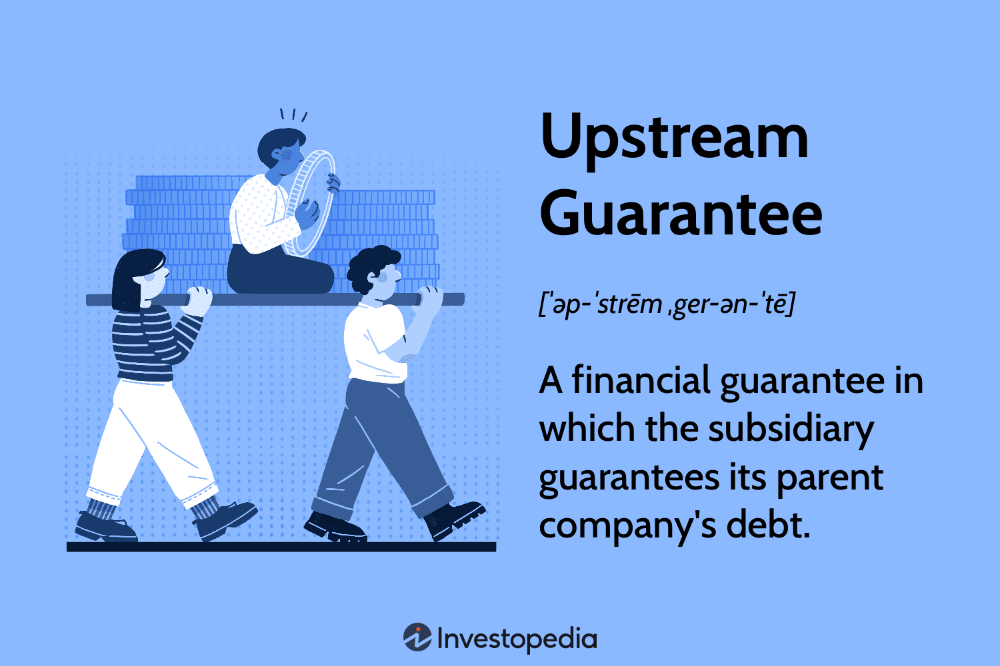

In the rapidly evolving world of finance, risk management is indispensable for successfully navigating complex systems like algorithmic trading. Algorithmic trading leverages sophisticated algorithms to execute trades at speeds and efficiencies unattainable by human traders, offering significant advantages such as faster execution and reduced human error. However, these benefits inherently come with risks that require strategic management to ensure stability and success.

Algorithmic trading systems operate autonomously, making them susceptible to a range of risks. These include market risks due to volatile price movements, systemic risks from technological failures or outages, and operational risks from incorrect algorithmic logic or unexpected market conditions. Effective risk management is therefore crucial to mitigating these vulnerabilities and maintaining robust trading operations.



Innovative techniques like upstream guarantees and financial assurance have emerged as integral components in managing these risks. Upstream guarantees involve a subsidiary backing the debt of its parent company, hence expanding the available collateral. This financial mechanism is particularly beneficial when the parent company lacks sufficient assets to secure a loan. However, the adoption of upstream guarantees requires a thorough understanding of potential exposure to risks like fraudulent conveyance if the guarantor becomes insolvent.

Financial assurance mechanisms are equally vital, ensuring that algorithmic trading systems remain within safe operational boundaries. By employing strategies such as real-time monitoring, compliance checks, and adherence to regulatory standards, financial assurance seeks to minimize potential losses while safeguarding investments.

Understanding these essential components—risk management, upstream guarantees, and financial assurance—within the context of algorithmic trading is imperative for financial professionals. This article explores these concepts comprehensively, discussing their roles, benefits, and the integration of advanced technologies and regulatory compliance in fostering a secure and effective trading environment.

## Table of Contents

## Understanding Upstream Guarantees

An upstream guarantee involves a scenario where a subsidiary company guarantees the debt obligations of its parent company. This setup effectively expands the collateral base available to lenders, thereby potentially improving the financing conditions available to the parent entity. The underlying principle is that the subsidiary, often with its own assets and cash flow, backs the parent company's loans, thereby providing additional financial assurance to creditors.

This financial mechanism finds its necessity particularly when the parent company lacks adequate assets to secure the required loan independently. By channeling the subsidiary’s resources as a contingent asset, the overall risk profile of the borrowing entity becomes more attractive to lenders. An upstream guarantee can lead to more favorable loan terms, such as lower interest rates or higher borrowing limits, given the strengthened financial backing.

Despite the significant benefits, there are inherent risks involved. One of the primary concerns is the risk of fraudulent conveyance. This situation occurs if the subsidiary providing the guarantee becomes insolvent, raising legal and financial complications. Creditors may challenge the guarantee, arguing that it was made without proper compensation or against the subsidiary's interests, potentially rendering the guarantee void.

Within the context of [algorithmic trading](/wiki/algorithmic-trading), understanding upstream guarantees is crucial because they can significantly influence the financial structuring of trading companies. By potentially bolstering the financial credibility of parent entities, these guarantees can stabilize financial commitments. For algorithmic trading firms that usually operate with significant leverage and quick capital turnover, upstream guarantees might offer a valuable tool to secure necessary funding without solely relying on the assets directly under the parent company’s control. This aspect underscores the importance of robust risk management strategies in both financial settings and trading operations.

## Financial Assurance in Algo Trading

Algorithmic trading systems require robust financial assurance mechanisms to mitigate potential losses and ensure smooth operations. Financial assurance involves a variety of strategies aimed at keeping trading algorithms within safe operational boundaries. This approach is critical in maintaining the stability and efficiency of these systems.

One of the core components of financial assurance is the implementation of real-time monitoring technologies. Real-time monitoring allows for the continuous assessment of trading algorithms, ensuring they function as expected and within pre-defined limits. By employing sophisticated algorithms and [machine learning](/wiki/machine-learning) techniques, real-time monitoring can quickly identify anomalies or deviations from expected behavior, enabling swift corrective measures.

Moreover, these systems often incorporate compliance checks to adhere to various legal and regulatory standards. Compliance monitoring involves validating that all trading activities are conducted according to the regulatory frameworks in place. This not only ensures adherence to legal standards but also minimizes regulatory risks, safeguarding investments from potential penalties and sanctions. An effective compliance mechanism can include automated checks that align trading practices with legal requirements, reducing manual oversight and potential human error.

For example, consider a trading algorithm designed to capitalize on market inefficiencies. By setting pre-defined risk parameters, the algorithm can automatically halt operations when these thresholds are breached, thereby preventing undue exposure. In Python, such a function could be implemented as follows:

```python
def monitor_trades(trades, risk_limit):
    for trade in trades:
        if trade['risk'] > risk_limit:
            halt_operations()
            break

def halt_operations():
    print("Trading operations halted due to risk threshold breach.")
```

This simple function monitors a trade portfolio, comparing each trade's risk against a defined limit, and halts operations if the risk exceeds this limit.

In summary, financial assurance in algorithmic trading encompasses strategies that promote the safe and efficient functioning of trading algorithms. By employing real-time monitoring and compliance systems, these strategies not only enhance stability and operational efficiency but also ensure legal and regulatory adherence, thus safeguarding investments and fostering sustainable trading environments.

## Key Risks in Algorithmic Trading

Algorithmic trading, while offering substantial advantages like rapid execution and minimized human error, is fraught with a variety of risks which necessitate strategic management. Key risks in this domain include system failures, market risks, and cybersecurity threats.

System failures in algorithmic trading can stem from technical issues such as software bugs, hardware malfunctions, connectivity problems, and latency issues. These failures can disrupt trading processes, potentially leading to unintended transactions or missed opportunities. For instance, if a trading algorithm is dependent on real-time data feeds and there is a delay in receiving market data, the algorithm may execute trades based on outdated information, resulting in financial losses.

Market risks are another significant concern in algorithmic trading. These risks involve adverse price movements that can lead to losses. Algo trading strategies, often relying on high-frequency trading, are highly sensitive to market [volatility](/wiki/volatility-trading-strategies) and [liquidity](/wiki/liquidity-risk-premium). Rapid changes in market conditions can cause algorithms to behave unpredictably or exacerbate losses if the algorithms are not adequately programmed to respond to such fluctuations.

Cybersecurity threats pose a growing risk in the digital landscape of algorithmic trading. Trading systems are exposed to potential cyber-attacks, including hacking, data breaches, and other malicious activities that can compromise sensitive financial data and disrupt trading operations. An unauthorized intrusion could alter algorithm parameters or trading signals, leading to erroneous trades and financial sabotage.

Algorithmic errors also represent a distinct risk category. These errors can be as a result of faulty logic, incorrect data inputs, or flawed assumptions in the algorithmic models. For example, a minor error in code, such as an incorrect conditional statement, could have significant financial repercussions if it leads to the execution of a large [volume](/wiki/volume-trading-strategy) of unintended trades.

To effectively manage these risks, there is a pressing need to integrate robust risk management practices within algorithmic trading systems. This includes employing real-time monitoring tools to swiftly detect and rectify system anomalies, conducting rigorous algorithm testing to preemptively identify and correct logical errors, and implementing comprehensive cybersecurity measures to safeguard against attacks. Additionally, establishing contingency plans and performing regular risk assessments can help mitigate potential impacts and ensure the stability of trading operations. Ultimately, the adoption of proactive risk management strategies is crucial in minimizing financial losses and maintaining the integrity and resilience of algorithmic trading activities.

## Essential Risk Management Strategies

In algorithmic trading, effectively managing risk is essential to ensure the stability and profitability of trading activities. Key risk management strategies encompass diversification, setting risk limits, and advanced monitoring, each serving to protect against potential financial adversities.

Diversification is a fundamental approach to mitigating risk by spreading investments across various assets and trading algorithms. The primary goal of diversification is to reduce the impact of a poor-performing asset on the overall portfolio. By allocating resources across different markets or asset classes, traders can balance potential losses from one investment with gains from others, stabilizing overall returns. This approach is mathematically supported by modern portfolio theory, which suggests that diversification can lower a portfolio's overall volatility.

Regular stress testing is vital for assessing the resilience of trading algorithms. Stress testing involves simulating extreme market conditions to evaluate how algorithms perform under duress. This practice helps identify potential vulnerabilities and ensures that the system can withstand adverse events. Employing dynamic position sizing further enhances this process by adjusting the size of trades based on real-time market conditions and risk appetite. Dynamic position sizing can be implemented through algorithms that automatically recalibrate positions according to pre-set risk metrics, optimizing risk exposure.

Implementing stop-loss orders is another crucial strategy in the risk management toolkit. A stop-loss order is a predefined point at which a trader will [exit](/wiki/exit-strategy) a position to prevent further losses. By setting these thresholds, traders can cap potential losses and maintain control over their financial exposure. For instance, one might use a simple Python script to automate stop-loss orders for a trading system:

```python
def check_stop_loss(current_price, stop_loss_price):
    if current_price <= stop_loss_price:
        return "Exit Position"
    else:
        return "Hold Position"

# Example usage
current_price = 95
stop_loss_price = 100
action = check_stop_loss(current_price, stop_loss_price)
```

Additionally, AI-enhanced market risk management significantly bolsters the mitigation of adverse impacts. Machine learning algorithms can analyze vast datasets to identify hidden patterns and predict potential market movements, enabling preemptive adjustments to trading strategies. These intelligent systems enhance decision-making by providing insightful data analytics and forecasting capabilities, ultimately fortifying the risk management framework.

By integrating these essential strategies, traders can better navigate the complexities of algorithmic trading, reducing exposure to potential financial losses and enhancing overall trading outcomes.

## Advanced Tools and Technologies

Modern technologies such as machine learning and blockchain provide sophisticated solutions to manage risks in algorithmic trading systems. These technologies enhance the precision and reliability of trading strategies, addressing various challenges that traders face.

Machine learning algorithms play a pivotal role in predictive analytics by identifying patterns in large data sets that may indicate emerging risks. This capability is crucial for preemptively managing risks before they materialize. For example, machine learning models can analyze historical price data and identify anomalies that suggest potential market shifts. These insights help traders make informed decisions, reducing the likelihood of substantial losses.

A practical implementation of machine learning in this context is using a Random Forest algorithm for predictive modeling. Here's a basic example in Python:

```python
from sklearn.ensemble import RandomForestClassifier
from sklearn.model_selection import train_test_split
import pandas as pd

# Assume df is a DataFrame containing historical trading data
# Features: technical indicators; Target: market movement (1: up, 0: down)
X = df[['indicator1', 'indicator2', 'indicator3']]
y = df['market_movement']

# Split the data into training and testing sets
X_train, X_test, y_train, y_test = train_test_split(X, y, test_size=0.2, random_state=42)

# Initialize and train the Random Forest model
model = RandomForestClassifier(n_estimators=100, random_state=42)
model.fit(X_train, y_train)

# Evaluate the model
accuracy = model.score(X_test, y_test)
print(f"Model accuracy: {accuracy}")
```

Blockchain technology augments algorithmic trading by providing transparency and an immutable audit trail. This is vital for compliance purposes and risk assessments. The decentralized nature of blockchain ensures that all data, including transactions and algorithmic decisions, are recorded in a tamper-proof manner. This not only aids in tracking transactions but also corroborates the authenticity of data used in trading decisions, thus enhancing trust and reducing fraudulent activities.

Incorporating blockchain in trading systems involves recording transaction logs and trading algorithms on a blockchain ledger. This approach ensures that all operations are transparent and can be audited efficiently.

Utilizing machine learning and blockchain technologies significantly enhances the robustness and reliability of algorithmic trading systems. By integrating these technologies, traders can achieve a higher degree of risk management and compliance, positioning themselves better in dynamic financial markets.

## Regulatory Compliance and Risk Management

Regulatory compliance constitutes a vital component of risk management in algorithmic trading. Adherence to legal and regulatory standards is essential not only to avoid penalties and legal repercussions but also to foster trust within the financial markets. Given the sophisticated nature of algorithmic trading systems, traders must navigate a complex landscape of regulations that govern financial transactions and market practices.

Understanding regulatory frameworks is the first step towards compliance. These frameworks often include mandates from financial regulatory bodies, such as the U.S. Securities and Exchange Commission (SEC) and the Commodity Futures Trading Commission (CFTC) in the United States, or the European Securities and Markets Authority (ESMA) in Europe. Regulatory parameters typically encompass guidelines on market conduct, reporting obligations, and the use of technology in trading operations. Compliance with these frameworks ensures that algorithmic trading practices are transparent and equitable, thereby minimizing systemic risks.

Implementing effective compliance monitoring systems is crucial for aligning trading operations with legal standards. These systems often employ automated tools that track trading activities and detect non-compliance issues in real-time. For instance, algorithms can be programmed to flag trades that exceed predefined risk thresholds or fail to adhere to regulatory reporting requirements. This proactive approach enables traders to quickly address potential violations and maintain regulatory standards.

Beyond legal adherence, regulatory compliance in algorithmic trading embodies ethical trading practices. Ethical considerations involve ensuring fair market conditions and avoiding manipulative tactics such as spoofing or layering, which can distort market prices. Trading firms often embed ethical guidelines within their compliance protocols, emphasizing the importance of integrity and responsibility in trading activities.

In summary, regulatory compliance aligns algorithmic trading with both legal standards and ethical expectations, serving as a foundational element of risk management strategies. By integrating comprehensive compliance frameworks and monitoring mechanisms, trading firms can not only avert legal liabilities but also contribute to a more stable and fair financial market environment.

## Conclusion

Risk management serves as the backbone of sustainable algorithmic trading, integrating upstream guarantees and financial assurance strategies to enhance the resilience of trading operations. In an environment where trading decisions are executed at extraordinary speeds, effective risk management practices are indispensable to safeguarding against various threats, including market volatility, technological failures, and cybersecurity breaches. By implementing comprehensive strategies that cover these aspects, traders can not only protect their portfolios but also ensure the longevity and prosperity of their trading activities.

Understanding the intricacies of risk management in algorithmic trading enables traders to deploy systems that can withstand dynamic market conditions. A critical component of this understanding involves continuously updating risk management protocols to reflect the latest developments in trading technologies and regulatory landscapes. This adaptability is essential as new risks and opportunities emerge with the advancement of financial technologies and changes in regulatory frameworks.

In essence, the success of algorithmic trading hinges not just on the sophistication of the algorithms themselves but also on the robustness of the associated risk management strategies. Traders who invest in learning these techniques and apply them judiciously are better positioned to achieve long-term success. They must remain vigilant and proactive in adopting innovative solutions that align with evolving market demands and technological progress, thereby ensuring their trading strategies remain resilient and effective over time.

## References & Further Reading

[1]: Bergstra, J., Bardenet, R., Bengio, Y., & Kégl, B. (2011). ["Algorithms for Hyper-Parameter Optimization."](https://dl.acm.org/doi/10.5555/2986459.2986743) Advances in Neural Information Processing Systems 24.

[2]: ["Advances in Financial Machine Learning"](https://www.amazon.com/Advances-Financial-Machine-Learning-Marcos/dp/1119482089) by Marcos Lopez de Prado

[3]: ["Evidence-Based Technical Analysis: Applying the Scientific Method and Statistical Inference to Trading Signals"](https://www.amazon.com/Evidence-Based-Technical-Analysis-Scientific-Statistical/dp/0470008741) by David Aronson

[4]: ["Machine Learning for Algorithmic Trading"](https://github.com/stefan-jansen/machine-learning-for-trading) by Stefan Jansen

[5]: ["Quantitative Trading: How to Build Your Own Algorithmic Trading Business"](https://www.amazon.com/Quantitative-Trading-Build-Algorithmic-Business/dp/1119800064) by Ernest P. Chan