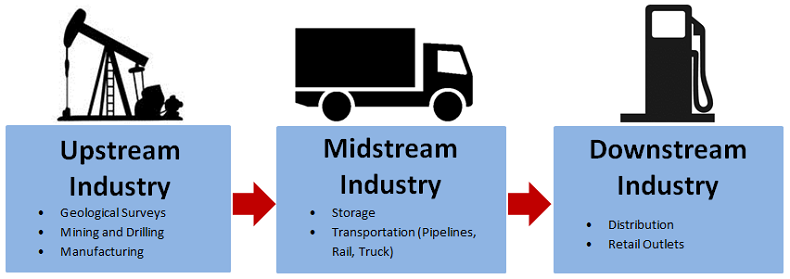

## Table of Contents

## What is the upstream sector in the oil and gas industry?

The upstream sector in the oil and gas industry is all about finding and getting oil and gas out of the ground. It includes searching for oil and gas deposits, drilling wells, and bringing the oil and gas to the surface. This part of the industry is also called exploration and production, or E&P for short. Companies in the upstream sector use tools like seismic surveys to find where the oil and gas might be, and then they drill wells to see if they can get it out.

Once the oil and gas are found and brought up, the upstream sector's job is mostly done. The oil and gas then go to the midstream sector, which moves them to refineries or storage places. The upstream sector is very important because without it, there would be no oil or gas to use. It can be risky and expensive, but when companies find big deposits, it can be very rewarding too.

## What are the main activities involved in the upstream sector?

The upstream sector of the oil and gas industry involves two main activities: exploration and production. Exploration is all about finding where the oil and gas are hidden underground. Companies use special tools like seismic surveys, which are like taking x-rays of the earth, to see where the oil and gas might be. They look for places where the rock layers are just right to hold oil and gas. Once they think they've found a good spot, they drill a test well to see if there really is oil or gas there.

If the test well shows that there is oil or gas, the next step is production. This means setting up more wells to bring the oil and gas up to the surface. Companies use big drilling rigs to drill deep into the earth. Once the oil and gas start flowing, they need to be separated from water and other stuff that comes up with them. Then, the oil and gas are ready to be sent to the midstream sector, which takes them to refineries or storage places.

The upstream sector is important because it's the start of the whole oil and gas process. It can be risky because not every well will have oil or gas, and it can be expensive to drill and set up wells. But when companies find big deposits, it can be very rewarding. This part of the industry is always looking for new technology to find oil and gas more easily and to get it out of the ground more efficiently.

## How does exploration in the upstream sector work?

Exploration in the upstream sector is all about finding oil and gas hidden deep underground. Companies start by doing a lot of research to figure out where oil and gas might be. They look at maps and old data to see where oil and gas have been found before. Then, they use special tools like seismic surveys. These surveys send sound waves into the ground and listen to the echoes to see what's down there. It's like taking an x-ray of the earth. The data from these surveys help scientists make pictures of the underground rock layers. They look for places where the rock layers are just right to hold oil and gas.

Once they think they've found a good spot, companies drill a test well. This is like taking a small sample to see if there's really oil or gas there. They use a drilling rig to make a hole deep into the earth. If the test well shows oil or gas, it's a big success. But if it doesn't, they have to start over and look for another spot. Exploration can be risky and expensive, but it's very important. Without it, we wouldn't know where to drill to get oil and gas out of the ground.

## What technologies are commonly used in upstream oil and gas operations?

In the upstream oil and gas industry, companies use a lot of cool technology to find and get oil and gas out of the ground. One big technology they use is seismic surveys. These surveys send sound waves into the earth and listen to the echoes to see what's down there. It's like taking a picture of the underground rock layers. This helps them find places where oil and gas might be hiding. Another important technology is drilling rigs. These big machines drill deep holes into the earth to reach the oil and gas. They can drill miles down and even sideways to get to the oil and gas.

Once they start drilling, companies use other technologies to make sure everything goes smoothly. They use sensors and computers to keep an eye on the well and make sure it's safe. These tools can tell them if there's a problem, like if the well is starting to leak. They also use special tools to steer the drill bit and make sure it goes where they want it to. This is called directional drilling. It helps them reach oil and gas that's not right under the drill site. All these technologies help make finding and getting oil and gas out of the ground easier and safer.

## What are the environmental impacts of upstream activities?

Upstream activities in the oil and gas industry can have big effects on the environment. When companies drill for oil and gas, they can harm the land and water around the drilling sites. Drilling can cause oil spills, which can pollute rivers, lakes, and oceans. This can hurt fish and other animals that live in the water. Also, drilling can take up a lot of space, which can destroy forests and other natural areas. This can make it hard for animals to find food and a place to live.

Another big problem is that drilling for oil and gas can release greenhouse gases into the air. These gases, like methane, can make the earth warmer, which is called climate change. Climate change can cause more storms, hotter temperatures, and other problems that can hurt people and animals. Companies try to use new technology to make drilling safer and less harmful to the environment, but it's still a big challenge.

## How do companies manage the risks associated with upstream operations?

Companies in the upstream oil and gas industry work hard to manage the risks that come with drilling for oil and gas. They use special tools and technology to make sure their operations are safe. For example, they use sensors and computers to watch over the wells and make sure there are no leaks or other problems. They also have strict rules and safety checks to follow. If something goes wrong, they have plans ready to fix it quickly and safely. This helps to prevent accidents and keep people and the environment safe.

Another way companies manage risks is by planning carefully before they start drilling. They study the area where they want to drill to understand what might go wrong. They also use technology like seismic surveys to find the best places to drill, which can reduce the chance of drilling a dry well. Companies also buy insurance to help cover the costs if something bad happens. By being prepared and using the right technology, companies can lower the risks of upstream operations and make sure they can keep finding and producing oil and gas safely.

## What is the role of seismic surveys in the upstream sector?

Seismic surveys are a big part of the upstream sector in the oil and gas industry. They help companies find where oil and gas might be hiding underground. Companies use special machines to send sound waves into the earth. These sound waves bounce back, and the machines listen to the echoes. By studying these echoes, scientists can make pictures of the rock layers underground. They look for places where the rock layers are just right to hold oil and gas. This helps them decide where to drill test wells to see if there really is oil or gas there.

Using seismic surveys is important because it makes finding oil and gas easier and less risky. Without these surveys, companies would be guessing where to drill, which could waste a lot of time and money. Seismic surveys help them be more sure about where to drill, which can save a lot of money and make the whole process more efficient. Even though seismic surveys don't guarantee that they'll find oil or gas, they give companies a much better chance of success.

## How does the upstream sector contribute to the overall economy?

The upstream sector is a big part of the economy because it finds and gets oil and gas out of the ground. This oil and gas is used for many things like making gasoline for cars, heating homes, and making plastics. When companies find oil and gas, they create jobs for people who work in drilling, engineering, and other jobs. These jobs help people earn money and spend it in their communities, which helps the economy grow. Also, when companies sell the oil and gas they find, they make money that can be used to invest in more projects or pay taxes, which helps the government provide services like schools and roads.

The upstream sector also helps the economy by bringing in money from other countries. When a country has a lot of oil and gas, other countries might want to buy it. This can make the country's money stronger and help its economy grow. But, the upstream sector can also be risky because it costs a lot of money to drill for oil and gas, and sometimes companies don't find any. When they do find oil and gas, it can be very good for the economy, but when they don't, it can be bad. So, the upstream sector is important for the economy, but it can also be a bit of a gamble.

## What are the key differences between onshore and offshore upstream operations?

Onshore upstream operations happen on land. Companies drill for oil and gas in places like deserts, forests, or fields. It's usually easier and cheaper to drill on land because they don't need special equipment to work in water. But, onshore drilling can still be hard because they have to move big drilling rigs and other equipment to the site. Also, onshore drilling can affect the land and the people who live nearby. Companies have to be careful to not harm the environment or bother the people who live close to the drilling sites.

Offshore upstream operations happen in the ocean. Companies use big platforms or ships to drill for oil and gas under the sea. Offshore drilling is harder and more expensive because they need special equipment that can work in deep water. They also have to deal with rough seas and bad weather, which can make drilling dangerous. But, offshore drilling can find big oil and gas deposits that are not on land. This can be very good for the companies, but it can also harm the ocean and the animals that live there if there's an oil spill or other problem.

## How has the upstream sector evolved with the advent of unconventional oil and gas resources?

The upstream sector has changed a lot because of unconventional oil and gas resources like shale oil and gas. These resources are harder to get out of the ground than traditional oil and gas. To reach them, companies use new technologies like hydraulic fracturing, or "fracking," and horizontal drilling. Fracking involves pumping water, sand, and chemicals into the rock to break it and let the oil and gas flow out. Horizontal drilling lets companies drill down and then sideways to reach more of the oil and gas. These new ways of drilling have made it possible to get oil and gas from places that were too hard to reach before.

Because of these new technologies, the upstream sector has grown a lot. More companies are drilling for unconventional oil and gas, which has made the United States and other countries produce more oil and gas than ever before. This has changed the energy market and made countries less dependent on oil and gas from other places. But, using these new technologies can also be bad for the environment. Fracking can use a lot of water and can pollute the air and water if it's not done carefully. So, the upstream sector has to find ways to use these new technologies safely and responsibly.

## What are the current trends and future challenges facing the upstream sector?

The upstream sector is always changing, and right now, one big trend is the use of new technology to find and get oil and gas out of the ground. Companies are using things like [artificial intelligence](/wiki/ai-artificial-intelligence) and big data to make drilling safer and more efficient. They're also looking for ways to drill in places that were too hard to reach before, like deep under the ocean or in the Arctic. Another trend is the focus on sustainability. Companies are trying to find ways to drill for oil and gas that are less harmful to the environment. They're using new methods to reduce greenhouse gas emissions and protect the land and water around their drilling sites.

In the future, the upstream sector will face some big challenges. One challenge is the growing demand for cleaner energy. More and more people want to use energy from the sun, wind, and other sources that don't harm the environment. This means the upstream sector will have to compete with these new energy sources. Another challenge is the need to keep finding new oil and gas deposits. As the easy-to-reach oil and gas run out, companies will have to drill in harder and more expensive places. They'll need to keep using new technology to make this possible. Finally, the upstream sector will have to deal with stricter rules about protecting the environment. Governments are making new laws to reduce pollution and protect the earth, and companies will have to follow these rules while still trying to make money.

## How do regulatory frameworks affect operations in the upstream sector?

Regulatory frameworks have a big impact on the upstream sector because they set the rules that companies have to follow when they drill for oil and gas. These rules can be about safety, the environment, or how companies should work with the people who live near their drilling sites. For example, governments might make laws to stop oil spills or to limit how much pollution companies can make. These rules help protect people and the environment, but they can also make it harder and more expensive for companies to drill for oil and gas. Companies have to spend time and money to make sure they follow all the rules, which can slow down their work and make it cost more.

In some places, the rules can be very strict, which can make it hard for companies to start new projects. They might have to do a lot of studies and get special permits before they can start drilling. This can take a long time and cost a lot of money. On the other hand, in places where the rules are not so strict, it might be easier for companies to start drilling, but they might not be as careful about protecting the environment or keeping people safe. So, regulatory frameworks are important because they help balance the need for oil and gas with the need to protect people and the environment.

## References & Further Reading

[1]: Bergstra, J., Bardenet, R., Bengio, Y., & Kégl, B. (2011). ["Algorithms for Hyper-Parameter Optimization."](https://papers.nips.cc/paper/4443-algorithms-for-hyper-parameter-optimization) Advances in Neural Information Processing Systems 24.

[2]: ["Advances in Financial Machine Learning"](https://www.amazon.com/Advances-Financial-Machine-Learning-Marcos/dp/1119482089) by Marcos Lopez de Prado

[3]: ["Evidence-Based Technical Analysis: Applying the Scientific Method and Statistical Inference to Trading Signals"](https://www.amazon.com/Evidence-Based-Technical-Analysis-Scientific-Statistical/dp/0470008741) by David Aronson

[4]: ["Machine Learning for Algorithmic Trading"](https://github.com/stefan-jansen/machine-learning-for-trading) by Stefan Jansen

[5]: ["Quantitative Trading: How to Build Your Own Algorithmic Trading Business"](https://www.amazon.com/Quantitative-Trading-Build-Algorithmic-Business/dp/1119800064) by Ernest P. Chan