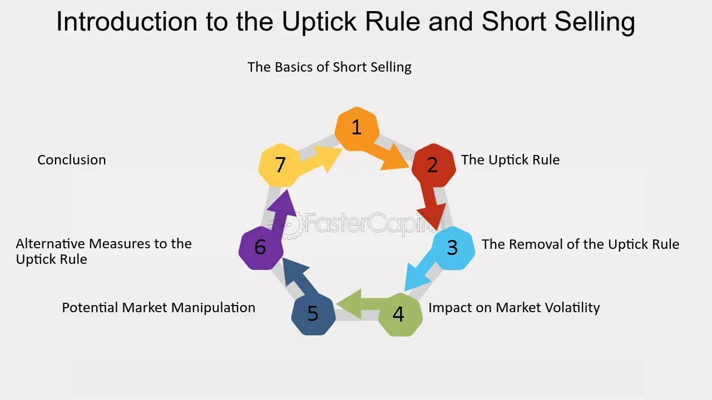

## Table of Contents

## What is an uptick in financial terms?

An uptick in financial terms means a small increase in the price of a stock or security. It happens when the current price is higher than the last price it was traded at. Traders and investors watch upticks closely because they can show that a stock is becoming more popular or valuable.

Upticks are important in trading rules too. For example, there's a rule called the uptick rule that stops people from selling a stock short unless it goes up first. This rule helps keep the market fair and stops prices from falling too fast. So, upticks not only show price changes but also affect how people can trade.

## How does an uptick differ from a downtick?

An uptick and a downtick are opposite movements in the price of a stock or security. An uptick happens when the current price of a stock is higher than the price it was last traded at. This means the stock's price is going up, even if it's just a little bit. Traders and investors pay attention to upticks because they can signal that more people want to buy the stock, which might mean the stock is becoming more valuable.

On the other hand, a downtick occurs when the current price of a stock is lower than the price it was last traded at. This means the stock's price is going down. Downticks can show that more people are selling the stock, which might mean the stock is becoming less valuable. Both upticks and downticks are important because they help traders and investors understand the direction in which a stock's price is moving.

## What is the significance of an uptick in stock trading?

An uptick in stock trading is important because it shows that the price of a stock is going up, even if it's just a little bit. When a stock has an uptick, it means that the last trade happened at a higher price than the one before it. This can be a sign that more people want to buy the stock, which can make it more valuable. Traders and investors watch upticks closely because they help them decide when to buy or sell a stock.

Upticks also matter because they can affect trading rules. For example, there's a rule called the uptick rule that says you can't sell a stock short unless its price goes up first. This rule helps keep the market fair and stops prices from dropping too fast. So, upticks not only tell us about price changes but also play a role in how people can trade stocks.

## Can you explain the mechanism behind an uptick?

An uptick happens when the price of a stock goes up a little bit from the last time it was traded. Imagine you're at a store and the price of a toy goes up from $5 to $5.01. That small increase is like an uptick. In the stock market, when someone buys a stock for more than the last price it was sold for, that's an uptick. It shows that people are willing to pay more for the stock, which can mean it's getting more popular or valuable.

Upticks are important because they help traders and investors see which way a stock's price is moving. If a stock keeps having upticks, it might mean more people want to buy it, pushing the price up. Traders use this information to decide if they should buy or sell the stock. Also, there's a rule called the uptick rule that says you can only sell a stock short if its price goes up first. This rule helps keep the market fair and stops prices from falling too fast. So, upticks are a big deal in the stock market because they show price changes and affect how people can trade.

## How is an uptick used in the context of the uptick rule?

The uptick rule is a special rule in the stock market that stops people from selling a stock short unless its price goes up first. Selling short means borrowing a stock and selling it, hoping to buy it back later at a lower price to make a profit. The uptick rule helps keep the market fair by making sure that short sellers can't make the stock price fall too quickly. When a stock has an uptick, it means the last trade happened at a higher price than the one before it. This small increase is what the uptick rule waits for before allowing short selling.

Upticks are important for the uptick rule because they show that the stock's price is going up, even if it's just a little bit. If a stock keeps having upticks, it might mean more people want to buy it, which can push the price up. The uptick rule uses these small increases to make sure that short selling happens in a way that doesn't hurt the stock's price too much. This helps keep the market stable and protects investors from big, sudden drops in stock prices.

## What are the historical origins of the uptick rule?

The uptick rule started a long time ago, back in 1938. It was made by the U.S. Securities and Exchange Commission (SEC) to help keep the stock market fair. Before this rule, people could sell stocks short whenever they wanted, which sometimes made stock prices fall too fast. The SEC saw that this was a problem, so they made the uptick rule to stop short selling from making prices drop too quickly. The rule said that you could only sell a stock short if its price went up first. This small change helped to keep the market more stable and protect people who owned stocks.

Over the years, the uptick rule changed a few times. In 2007, the SEC decided to get rid of the rule because they thought it wasn't needed anymore. But then, in 2010, after a big drop in the stock market called the "Flash Crash," the SEC brought back a version of the rule. They made a new rule called the "alternative uptick rule," which is a bit different but still tries to do the same thing: stop short selling from making stock prices fall too fast. Today, the alternative uptick rule is still used to help keep the stock market fair and stable.

## How does an uptick affect short selling?

An uptick is important for short selling because it helps control when people can sell stocks short. Short selling is when someone borrows a stock and sells it, hoping to buy it back later at a lower price to make money. The uptick rule says that you can only do this if the stock's price goes up a little bit first. This rule stops people from selling short too much and making the stock's price fall too fast.

The uptick rule makes sure that short selling happens in a fair way. When a stock has an uptick, it means the last trade was at a higher price than the one before. This small increase lets short sellers know it's okay to sell the stock short. By waiting for an uptick, the rule helps keep the market stable and protects other people who own the stock from big, sudden price drops.

## Can you provide a real-world example of an uptick?

Imagine you're watching the price of a company called ABC Inc. on the stock market. At 10:00 AM, the last trade for ABC Inc. was at $50 per share. At 10:01 AM, someone buys a share of ABC Inc. for $50.01. That small increase from $50 to $50.01 is an uptick. It shows that someone was willing to pay a little more for the stock, which might mean they think the stock is getting more valuable.

Upticks are important because they help traders and investors see if a stock's price is going up. If ABC Inc. keeps having upticks, more people might want to buy it, pushing the price higher. Traders watch for these upticks to decide when to buy or sell. Also, the uptick rule says that if someone wants to sell ABC Inc. short, they have to wait for an uptick first. This rule helps keep the market fair and stops the stock's price from falling too fast.

## What are the implications of an uptick for market trends?

An uptick in a stock's price can tell us a lot about what's happening in the market. When a stock has an uptick, it means someone bought it for a little more than the last time it was sold. This small increase can show that more people want to buy the stock, which might mean it's getting more popular or valuable. If a stock keeps having upticks, it could be a sign that the stock's price is going to keep going up. Traders and investors watch for these upticks to help them decide when to buy or sell stocks.

Upticks also help us understand bigger market trends. If lots of stocks are having upticks, it might mean the whole market is doing well. This can show that people are feeling good about the economy and are willing to spend more money on stocks. On the other hand, if upticks are rare, it might mean the market is not doing so well. So, watching upticks can help us see if the market is going up or down, and help people make better choices about their investments.

## How do traders and investors utilize upticks in their strategies?

Traders and investors use upticks to help them make choices about buying and selling stocks. When they see a stock having an uptick, it means someone bought it for a little more than the last time it was sold. This can tell them that more people might want to buy the stock, so its price could go up. Traders might decide to buy the stock right away to get in on the action, hoping to sell it later for a higher price. Investors, who often hold onto stocks for a longer time, might see upticks as a good sign that the stock is getting more valuable and decide to keep or add to their investment.

Upticks are also important for short selling. The uptick rule says that if someone wants to sell a stock short, they have to wait for an uptick first. This rule stops short sellers from making the stock's price fall too fast. Traders who want to short sell a stock will watch for upticks so they know when it's okay to do it. This way, they can make sure they're following the rules and not causing big, sudden drops in the stock's price. By using upticks in their strategies, traders and investors can make smarter choices about when to buy, sell, or short sell stocks.

## What are the potential risks associated with trading based on upticks?

Trading based on upticks can be risky because small price changes can be tricky. An uptick might make it look like a stock's price is going up, but it doesn't always mean the stock will keep going up. Sometimes, an uptick can just be a short-term thing, and the stock's price might go down again soon. If traders buy a stock just because of an uptick, they might end up losing money if the price doesn't keep going up like they hoped.

Another risk is that trading on upticks can make people trade too much. When traders see a lot of upticks, they might start buying and selling stocks really fast, trying to make quick profits. This kind of fast trading can lead to big losses if the market suddenly changes. Plus, if everyone is trading based on upticks, it can make the market more unpredictable and harder to understand. So, while upticks can be helpful, traders need to be careful and not rely on them too much.

## How have regulatory changes impacted the use of upticks in modern trading?

Regulatory changes have had a big impact on how upticks are used in modern trading. Back in 2007, the U.S. Securities and Exchange Commission (SEC) got rid of the original uptick rule. This meant that traders could sell stocks short whenever they wanted, without waiting for an uptick. Some people thought this made the market more free, but it also made it easier for stock prices to fall really fast. Then, in 2010, after a big drop in the market called the "Flash Crash," the SEC brought back a version of the rule. They made a new rule called the "alternative uptick rule," which is a bit different but still tries to stop short selling from making stock prices fall too fast.

The alternative uptick rule changed how traders use upticks. Now, traders have to wait for a stock's price to go up a little bit before they can sell it short. This rule helps keep the market more stable and fair. Traders still watch for upticks to decide when to buy or sell stocks, but they have to be more careful about short selling. The rule makes sure that short selling doesn't hurt the stock's price too much, which helps protect investors. So, regulatory changes have made upticks a key part of modern trading, helping to keep the market safe and stable.

## What are Financial Investment Strategies?

Financial investment strategies are influenced by various market signals, with "upticks" being one of the pivotal indicators. An uptick signifies a trade executed at a higher price than the previous one, offering insights into market sentiment and guiding investment strategies across a range of financial instruments, including stocks and bonds.

Uptick trends impact investment decisions by reflecting investor confidence or concern. Analyzing uptick patterns allows investors to gauge [momentum](/wiki/momentum), determining whether a security is experiencing sustained buying interest. For instance, consistent upticks in a stock may suggest positive sentiment and potential for price appreciation. Conversely, a lack of upticks might indicate dwindling interest or potential downturns.

Traditional investment strategies involving upticks often rely on technical analysis, where traders study price charts and trading volumes to predict future movements. Moving averages, support and resistance levels, and momentum indicators are commonly used tools. A Moving Average (MA) strategy might involve buying a stock when its price shows an uptick crossing above the MA line, signifying a potential bullish trend:

$$
\text{MA}(t) = \frac{1}{N} \sum_{i=t-N+1}^{t} P(i)
$$

where $N$ is the number of periods and $P(i)$ is the price at time $i$.

Modern tactics integrate uptick data with [algorithmic trading](/wiki/algorithmic-trading), automating decisions using sophisticated models. High-frequency trading ([HFT](/wiki/high-frequency-trading-strategies)) systems, for instance, utilize algorithms to capitalize on uptick patterns, executing trades at lightning speed to exploit short-term market inefficiencies. These strategies rely heavily on [machine learning](/wiki/machine-learning) models that process vast amounts of data to discern subtle uptick patterns.

Real-world examples demonstrate the efficacy of uptick analysis in crafting successful investment strategies. An illustrative case is that of mutual funds employing momentum-based strategies, which capitalize on upticks by allocating assets towards securities demonstrating positive price momentum. This approach has historically yielded notable returns, such as with the Momentum Fund reported in the Journal of Finance, which showed that stocks with higher uptick ratios tend to outperform those with negative or neutral trends over the medium term.

In conclusion, integrating uptick analysis into investment strategies enhances decision-making processes, offering insights into market dynamics and potential price movements. This approach, when combined with traditional and algorithmic strategies, can significantly bolster the potential for favorable investment outcomes. Investors are encouraged to incorporate uptick data in their analyses, leveraging both historical data and modern computational tools to optimize investment performance.

## References & Further Reading

[1]: Ernest P. Chan. ["Algorithmic Trading: Winning Strategies and Their Rationale"](https://www.wiley.com/en-us/Algorithmic+Trading%3A+Winning+Strategies+and+Their+Rationale-p-9781118460146). Wiley Finance.

[2]: Marcos Lopez de Prado. ["Advances in Financial Machine Learning"](https://www.amazon.com/Advances-Financial-Machine-Learning-Marcos/dp/1119482089). Wiley.

[3]: David Aronson. ["Evidence-Based Technical Analysis: Applying the Scientific Method and Statistical Inference to Trading Signals"](https://www.amazon.com/Evidence-Based-Technical-Analysis-Scientific-Statistical/dp/0470008741). Wiley.

[4]: Stefan Jansen. ["Machine Learning for Algorithmic Trading"](https://github.com/stefan-jansen/machine-learning-for-trading). Packt Publishing.

[5]: Jean-Philippe Bouchaud and Marc Potters. ["Trades, Quotes and Prices: Financial Markets Under the Microscope"](https://books.google.com/books/about/Trades_Quotes_and_Prices.html?id=u45LDwAAQBAJ). Cambridge University Press.

[6]: Investopedia. ["The Basics of Algorithmic Trading"](https://www.investopedia.com/articles/active-trading/101014/basics-algorithmic-trading-concepts-and-examples.asp).

[7]: Ernest P. Chan. ["Quantitative Trading: How to Build Your Own Algorithmic Trading Business"](https://www.wiley.com/en-us/Quantitative+Trading%3A+How+to+Build+Your+Own+Algorithmic+Trading+Business+-p-9781119203377). Wiley.