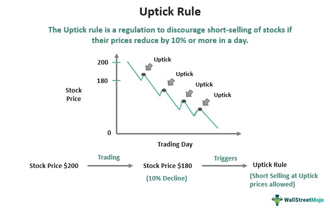

## Table of Contents

## What is the Uptick Rule?

The Uptick Rule is a rule that the stock market follows. It says that if you want to sell a stock short, you can only do it when the stock's price is going up a little bit. Selling short means you borrow a stock, sell it, and then buy it back later, hoping the price will be lower so you can make a profit. The Uptick Rule helps stop the stock price from falling too fast.

This rule started after the big stock market crash in 1929. People thought that short selling made the crash worse, so they made the Uptick Rule to slow down how fast stocks could fall. The rule was used for a long time, but it was taken away in 2007. After another big drop in the market in 2008, they brought back a new version of the rule in 2010. This new rule is a bit different but still tries to keep the market stable.

## Why was the Uptick Rule originally implemented by the SEC?

The Uptick Rule was first put in place by the SEC after the big stock market crash in 1929. People thought that short selling made the crash worse because it pushed stock prices down even more. The rule was meant to slow down how fast stock prices could fall. By only allowing short sales when the stock price was going up a little bit, the rule helped keep the market from getting too wild and out of control.

The rule stayed in place for a long time because it helped keep the market stable. But in 2007, the SEC decided to get rid of it. They thought the market had changed and the rule wasn't needed anymore. However, after another big drop in the market in 2008, they realized that the rule might have been helpful after all. So, in 2010, they brought back a new version of the Uptick Rule to help keep the market steady and prevent big, sudden drops in stock prices.

## How does the Uptick Rule affect short selling?

The Uptick Rule makes it harder to do short selling. Short selling is when you borrow a stock, sell it, and then buy it back later hoping the price will be lower so you can make money. The Uptick Rule says you can only do this when the stock's price is going up a little bit. This means you can't keep selling the stock if its price is going down fast. It slows down how fast the stock price can fall.

The rule was made to stop the stock market from getting too wild. After the big crash in 1929, people thought short selling made things worse. So, the Uptick Rule was put in place to help keep the market stable. It was taken away in 2007 but brought back in a new way in 2010 after another big drop in the market. The new rule still tries to keep the market from falling too fast by controlling short selling.

## What is the difference between an uptick and a downtick?

An uptick is when the price of a stock goes up a little bit from the last trade. For example, if a stock was last traded at $10 and the next trade is at $10.01, that's an uptick. The Uptick Rule uses this idea to control short selling. It says you can only sell a stock short when it's on an uptick. This helps stop the stock price from falling too fast.

A downtick is the opposite. It's when the price of a stock goes down a little bit from the last trade. If a stock was last traded at $10 and the next trade is at $9.99, that's a downtick. The Uptick Rule doesn't let you sell a stock short on a downtick. This rule was made to keep the stock market from getting too wild and to help keep prices stable.

## When was the Uptick Rule first introduced, and how has it evolved?

The Uptick Rule was first introduced by the SEC in 1938, after the big stock market crash in 1929. People thought that short selling made the crash worse, so they made this rule to slow down how fast stock prices could fall. The rule said that you could only sell a stock short when its price was going up a little bit. This helped keep the market from getting too wild and out of control. The rule worked well for a long time and helped keep the market stable.

In 2007, the SEC decided to get rid of the Uptick Rule. They thought the market had changed and the rule wasn't needed anymore. But after another big drop in the market in 2008, they realized that the rule might have been helpful after all. So, in 2010, they brought back a new version of the Uptick Rule. This new rule is called the "Alternative Uptick Rule" or Rule 201. It's a bit different but still tries to keep the market steady by controlling short selling. The new rule says that if a stock's price falls a lot in one day, short selling is only allowed on an uptick or a zero uptick until the end of the day. This helps stop big, sudden drops in stock prices.

## What are the specific conditions under which the Uptick Rule applies?

The Uptick Rule, also known as Rule 201, applies when a stock's price falls a lot in one day. Specifically, if a stock's price drops by 10% or more from the last day's closing price, the rule kicks in. Once this happens, short selling of that stock is only allowed on an uptick or a zero uptick for the rest of the day. An uptick is when the stock's price goes up a little bit from the last trade, and a zero uptick is when the price stays the same as the last trade.

This rule helps stop big, sudden drops in stock prices. It slows down how fast the price can fall by controlling short selling. Short selling is when someone borrows a stock, sells it, and then buys it back later hoping the price will be lower so they can make money. The Uptick Rule makes sure that short selling can't keep pushing the price down when it's already falling a lot. This helps keep the stock market stable and prevents it from getting too wild.

## How does the alternative uptick rule (Rule 201) work?

The alternative uptick rule, or Rule 201, is a rule that helps keep the stock market stable. It starts working when a stock's price drops by 10% or more from the last day's closing price. When this happens, the rule says that short selling of that stock can only happen on an uptick or a zero uptick for the rest of the day. An uptick is when the stock's price goes up a little bit from the last trade, and a zero uptick is when the price stays the same as the last trade.

This rule helps stop big, sudden drops in stock prices. It slows down how fast the price can fall by controlling short selling. Short selling is when someone borrows a stock, sells it, and then buys it back later hoping the price will be lower so they can make money. The alternative uptick rule makes sure that short selling can't keep pushing the price down when it's already falling a lot. This helps keep the stock market from getting too wild and out of control.

## What are the criticisms and controversies surrounding the Uptick Rule?

Some people don't like the Uptick Rule because they think it makes the market less fair. They say it stops people from making money by short selling when they think a stock's price is going to go down. They also think the rule makes the market less able to find the right price for stocks quickly. Critics say that the rule can make the market less clear and less good at showing what stocks are really worth.

Others argue that the Uptick Rule is good because it helps keep the market stable. They say it stops big, sudden drops in stock prices that can scare people and make them lose trust in the market. But some people think the rule doesn't work well enough. They say that even with the rule, the market can still have big drops. There's also a worry that the rule might make people less likely to trade, which could make the market less active and less good at finding the right prices for stocks.

## How do market participants comply with the Uptick Rule?

Market participants comply with the Uptick Rule by checking the price of a stock before they do a short sale. If the stock's price has gone down a lot in one day, they have to wait for an uptick or a zero uptick before they can sell the stock short. An uptick is when the price goes up a little bit from the last trade, and a zero uptick is when the price stays the same. This means they can't keep selling the stock short if its price is going down fast. They need to use special tools and systems to watch the stock's price closely and make sure they follow the rule.

Some stock exchanges and brokers have systems that help traders follow the Uptick Rule automatically. These systems can stop short sales if they don't meet the rule's conditions. Traders also need to keep good records to show they followed the rule. If they don't follow it, they could get in trouble with the SEC. So, it's important for everyone in the market to know the rule and use the right tools to make sure they do things the right way.

## What impact does the Uptick Rule have on market stability and investor confidence?

The Uptick Rule helps keep the stock market stable by slowing down how fast stock prices can fall. When a stock's price drops a lot in one day, the rule says you can only sell it short if the price goes up a little bit or stays the same. This stops people from selling the stock short over and over when the price is going down fast. By doing this, the rule helps keep the market from getting too wild and out of control. It makes big, sudden drops in stock prices less likely, which can help keep the market calm.

The rule also helps make investors feel more confident. When people see that the market has rules to stop big drops, they might feel safer about putting their money in stocks. They know that the market has ways to keep things stable, which can make them trust the market more. But some people think the rule can make the market less fair or less good at finding the right price for stocks. Even with these worries, many believe the Uptick Rule is good for keeping the market steady and helping investors feel more secure.

## How is the effectiveness of the Uptick Rule measured and evaluated?

The effectiveness of the Uptick Rule is measured by looking at how well it keeps the stock market stable. Researchers and market experts study how often big, sudden drops in stock prices happen when the rule is in place. They compare these drops to times when the rule wasn't used. They also look at how much the market goes up and down each day. If the market is less wild and has fewer big drops with the rule, people say it's working well.

Another way to evaluate the Uptick Rule is by seeing how it affects investor confidence. Surveys and studies can ask investors if they feel safer about putting their money in the stock market because of the rule. If more people trust the market and are willing to invest, it's a sign that the rule is helping. But some people also look at how the rule might make the market less fair or less good at finding the right price for stocks. They think about these things when deciding if the rule is really effective.

## What are the potential future changes or alternatives to the Uptick Rule being discussed by regulators?

Regulators are always looking at ways to make the stock market better and safer. Some people think the Uptick Rule could be changed to work even better. One idea is to make the rule apply to more stocks, not just the ones that drop a lot in one day. This could help stop big drops in more stocks and make the whole market more stable. Another idea is to change how much a stock's price needs to drop before the rule starts working. Some people think it should be more than 10% to focus on the really big drops, while others think it should be less to catch more drops early.

There are also talks about other ways to keep the market stable without using the Uptick Rule. One idea is to use something called a "circuit breaker." This is a rule that stops trading for a short time if a stock's price drops a lot. It gives everyone a chance to calm down and think before they keep trading. Another idea is to make rules about how much short selling people can do. This could stop too much short selling from making stock prices fall too fast. Regulators are thinking about all these ideas to find the best way to keep the market stable and make investors feel safe.

## References & Further Reading

[1]: The U.S. Securities and Exchange Commission. ["Short Sale Restrictions and Rule 201 - Regulation SHO"](https://www.sec.gov/investor/pubs/regsho.htm).

[2]: Lofton, W.R., & Fusaro, M.A. (2018). ["The Uptick Rule and Its Effect on Stock Price Volatility."](https://www.semanticscholar.org/paper/Volatility%2C-price-resolution%2C-and-the-effectiveness-Ma-Rao/cb72e64f0ae23c23e3da37fd512f5a7cc8c77855) Financial Analysts Journal, 54(2), 65-72.

[3]: Brunnermeier, M. K., & Pedersen, L. H. (2005). ["Predatory Trading."](https://onlinelibrary.wiley.com/doi/abs/10.1111/j.1540-6261.2005.00781.x) The Journal of Finance, 60(4), 1825-1863.

[4]: Harris, L. (1989). ["The October 1987 Stock Market Crash: The Role of Stock and Stock Index Futures Markets."](https://onlinelibrary.wiley.com/doi/10.1111/j.1540-6261.1989.tb02405.x) Journal of Applied Corporate Finance, 1(1), 45-56.

[5]: Nofsinger, J.R. (2005). ["Social Mood and Financial Economics."](https://www.tandfonline.com/doi/abs/10.1207/s15427579jpfm0603_4) Journal of Behavioral Finance, 6(3), 144-160.