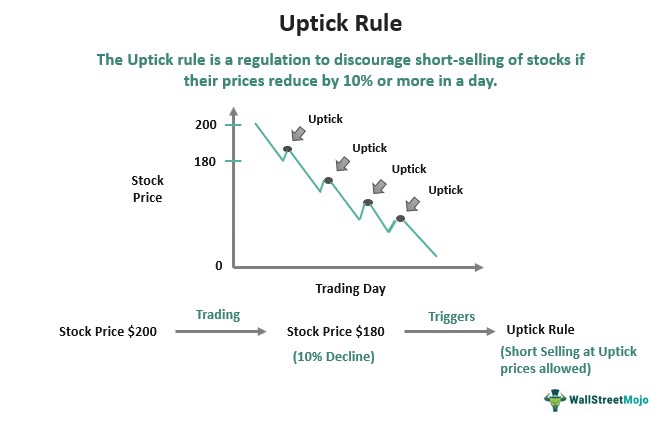

## Table of Contents

## What is the uptick rule?

The uptick rule is a rule that the stock market uses to stop prices from falling too fast. It says that if a stock's price is going down, you can only sell it short if the last price it traded at was higher than the one before it. This is called an "uptick." The rule helps keep the market stable by slowing down how quickly people can sell stocks when prices are dropping.

The uptick rule was first used after the big stock market crash in 1929. It was meant to stop people from making the market fall even more by selling stocks they didn't own, which is called short selling. The rule was taken away in 2007 but brought back in a different form in 2010. Now, it's called the alternative uptick rule, and it works a bit differently but still tries to keep the market from crashing too fast.

## Why was the uptick rule originally implemented?

The uptick rule was first put in place after the big stock market crash in 1929. People thought that short selling made the crash worse. Short selling is when someone sells a stock they don't own, hoping to buy it back later at a lower price. The rule was made to stop people from selling stocks short when the price was already going down fast. This was supposed to help keep the market from falling too quickly.

The idea behind the uptick rule was to slow down the speed at which stock prices could drop. By only allowing short sales on an uptick, it made it harder for people to keep pushing the price down. This was meant to give the market a chance to stabilize and prevent panic selling. The rule was seen as a way to protect investors and keep the stock market from crashing too fast.

## How does the uptick rule affect short selling?

The uptick rule makes it harder to do short selling when a stock's price is going down. Short selling is when someone sells a stock they don't own, hoping to buy it back later at a lower price. The rule says you can only short sell if the last price the stock traded at was higher than the one before it. This is called an uptick. So, if the stock's price is falling, you have to wait for it to go up a little bit before you can short sell.

This rule slows down how fast the stock's price can drop. When a stock's price is falling, people might want to short sell to make money from the falling price. But the uptick rule stops them from doing this right away. It makes them wait for a small increase in the price before they can short sell. This can help keep the market from crashing too fast by giving it time to calm down.

## When was the uptick rule first introduced in the United States?

The uptick rule was first introduced in the United States in 1938. This was after the big stock market crash in 1929. People thought that short selling made the crash worse. Short selling is when someone sells a stock they don't own, hoping to buy it back later at a lower price. The rule was made to stop people from selling stocks short when the price was already going down fast.

The idea behind the uptick rule was to slow down the speed at which stock prices could drop. By only allowing short sales on an uptick, it made it harder for people to keep pushing the price down. This was meant to give the market a chance to stabilize and prevent panic selling. The rule was seen as a way to protect investors and keep the stock market from crashing too fast.

## What changes were made to the uptick rule in 2007?

In 2007, the uptick rule was taken away. Before that, the rule said you could only short sell a stock if its last trade was at a higher price than the one before it. This was meant to stop the stock price from falling too fast. But in 2007, the rule was removed because some people thought it wasn't needed anymore and might even make the market less fair.

After the uptick rule was taken away, people could short sell whenever they wanted, no matter if the stock price was going up or down. This change made it easier for people to short sell, but it also made some people worry that it could lead to big drops in stock prices. The rule was gone for a few years until a new version, called the alternative uptick rule, was brought back in 2010 to help keep the market stable.

## How did the financial crisis of 2008 influence the uptick rule?

The financial crisis of 2008 made people think a lot about the uptick rule. When the rule was taken away in 2007, it was easier for people to short sell stocks. This meant they could sell stocks they didn't own whenever they wanted, even if the price was going down fast. During the 2008 crisis, many people thought that this made the stock market fall even more because short selling can push prices down faster.

Because of the big problems in 2008, the government decided to bring back a rule like the uptick rule in 2010. They called it the alternative uptick rule. This new rule was meant to stop the market from crashing too fast by making it harder to short sell when a stock's price was dropping quickly. The financial crisis showed that having some rules to slow down short selling could help keep the market more stable.

## What is the alternative uptick rule and how does it differ from the original?

The alternative uptick rule is a newer version of the original uptick rule. It was put in place in 2010 after the big financial crisis in 2008. The main idea is still the same: to stop stock prices from falling too fast by making it harder to short sell when prices are dropping. But the way it works is a bit different. Instead of needing an uptick for every short sale, the alternative rule only kicks in when a stock's price has dropped a lot in one day. If a stock falls more than 10% in a day, then short sellers have to wait for an uptick before they can sell.

The big difference between the original uptick rule and the alternative uptick rule is when they apply. The original rule was always on, meaning you always needed an uptick to short sell. The alternative rule only turns on when a stock is falling fast. This means that most of the time, people can short sell without waiting for an uptick. But when the market gets really shaky and a stock's price drops a lot, the rule helps slow things down. This way, it tries to keep the market stable without making it too hard to short sell all the time.

## In what ways does the uptick rule impact market stability?

The uptick rule helps keep the stock market stable by slowing down how fast stock prices can fall. When a stock's price is dropping, the rule says you can only sell it short if the last trade was at a higher price than the one before it. This stops people from making the price fall even faster by short selling. Short selling is when someone sells a stock they don't own, hoping to buy it back later at a lower price. By making short sellers wait for a small price increase, the rule gives the market time to calm down and stop falling so quickly.

The alternative uptick rule, which was introduced in 2010, works a bit differently but still aims to keep the market stable. This rule only kicks in when a stock's price has dropped a lot in one day, more than 10%. When this happens, short sellers have to wait for an uptick before they can sell. This way, the rule doesn't always stop short selling, but it does help slow down big drops in stock prices. By only applying when the market is really shaky, the alternative rule tries to balance letting people short sell with keeping the market from crashing too fast.

## Can you explain the specific conditions under which the uptick rule applies?

The original uptick rule says you can only short sell a stock if the last price it traded at was higher than the one before it. This is called an uptick. So, if a stock's price is going down, you have to wait for it to go up a little bit before you can short sell. This rule is always on, no matter what the stock's price is doing. It was made to stop people from making the stock price fall even faster by short selling when the price is already dropping.

The alternative uptick rule, which came in 2010, works a bit differently. It only turns on when a stock's price has dropped a lot in one day, more than 10%. When this happens, short sellers have to wait for an uptick before they can sell. This means that most of the time, people can short sell without waiting for an uptick. But when the market gets really shaky and a stock's price drops a lot, the rule helps slow things down. This way, it tries to keep the market stable without making it too hard to short sell all the time.

## How do different countries implement variations of the uptick rule?

Different countries have their own ways of using rules like the uptick rule to keep their stock markets stable. In the United States, they use the alternative uptick rule, which only kicks in when a stock's price drops a lot in one day. This means that if a stock falls more than 10% in a day, short sellers have to wait for a small price increase before they can sell. This rule helps slow down big drops in stock prices and keeps the market from crashing too fast.

In other countries, the rules can be different. For example, in South Korea, they have a rule that stops short selling completely during certain times to keep the market stable. In Europe, some countries use a rule that is similar to the original uptick rule, where you always need an uptick to short sell. These different rules show that countries try to find the best way to balance letting people short sell with keeping their stock markets from falling too fast.

## What are the arguments for and against reinstating the uptick rule?

People who want to bring back the uptick rule say it helps keep the stock market from falling too fast. They think that without the rule, short sellers can make stock prices drop even more quickly. This can cause panic and make the market unstable. The uptick rule makes short sellers wait for a small price increase before they can sell, which gives the market time to calm down. This can stop big crashes and protect investors from losing a lot of money all at once.

On the other hand, people who are against bringing back the uptick rule say it can make the market less fair. They think the rule stops people from short selling when they should be able to. Short selling can help the market work better by showing when a stock's price is too high. Without the uptick rule, the market can be more open and let people make money in different ways. They also say that the alternative uptick rule, which only turns on when a stock's price drops a lot, is enough to keep the market stable without making it too hard to short sell.

## How has the uptick rule's effectiveness been measured and evaluated by financial researchers?

Financial researchers have looked at the uptick rule to see if it really helps keep the stock market stable. They study how stock prices move when the rule is in place and when it's not. Some researchers look at how often stocks fall a lot in one day with and without the rule. They also check if the rule stops short sellers from making prices drop even faster. By comparing these things, researchers can see if the uptick rule makes a difference in keeping the market calm.

There are different opinions about how well the uptick rule works. Some studies say it does help stop big drops in stock prices. They find that when the rule is on, stocks don't fall as fast as when it's off. But other studies say the rule doesn't make much difference. They think other things, like how much people are buying and selling, matter more than the uptick rule. So, while some researchers think the rule is good for the market, others believe it doesn't help much and might even make the market less fair.

## References & Further Reading

[1]: ["Short Sales and the U.S. Securities Laws"](https://natlawreview.com/article/sec-extends-compliance-date-short-sale-reporting-rule-2026) - A guide on short sale regulations by the SEC

[2]: Stoll, H. R. (2000). ["Friction"](https://onlinelibrary.wiley.com/doi/abs/10.1111/0022-1082.00259) The Journal of Finance, 55(4), 1479-1512.

[3]: Gomber, P., Arndt, B., Lutat, M., & Uhle, T. (2011). ["High-Frequency Trading"](https://papers.ssrn.com/sol3/papers.cfm?abstract_id=1858626) In: Low-Latency Trading, Algorithmic Trading and Ultra-Fast Moves. Risk Books.

[4]: Bajgrowicz, P., & Scaillet, O. (2012). ["Technical Trading Revisited: False Discoveries, Persistence Tests, and Transaction Costs."](https://www.sciencedirect.com/science/article/pii/S0304405X1200116X) Journal of Financial Economics, 106(3), 473-491.

[5]: Jones, C. M. (2013). ["What Do We Know About High-Frequency Trading?"](https://papers.ssrn.com/sol3/papers.cfm?abstract_id=2236201) Columbia Business School Research Paper No. 13-11.

[6]: Kirilenko, A. A., Kyle, A. S., Samadi, M., & Tuzun, T. (2017). ["The Flash Crash: High-Frequency Trading in an Electronic Market."](https://www.jstor.org/stable/26652722) Journal of Finance, 72(3), 967-998.

[7]: ["Regulation NMS and the National Market System"](https://www.ecfr.gov/current/title-17/chapter-II/part-242/subject-group-ECFRac68bdd026a46db) by the U.S. Securities and Exchange Commission.