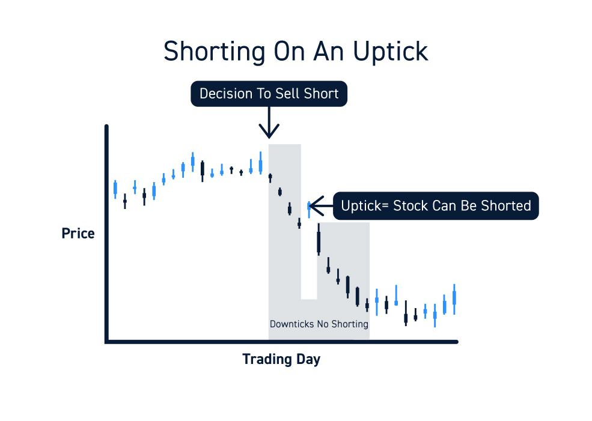

Algorithmic trading has significantly reshaped financial markets by allowing transactions to occur at lightning-fast speeds. This evolution, while enhancing market efficiency and liquidity, has also introduced concerns regarding market stability and susceptibility to manipulation. One such concern arises from how easily high-frequency trading can exacerbate market swings, potentially leading to events like flash crashes. To address these issues, regulations such as the Uptick Rule have been implemented, directly influencing trading strategies and execution methods within algorithmic trading systems.

The Uptick Rule is a crucial regulatory measure designed to prevent the destabilizing effects of unrestricted short selling, which can accelerate declining stock prices. This rule affects how algorithms are programmed to execute trades, ensuring that short selling occurs only under specific conditions to maintain market stability. Understanding the intricacies of the Uptick Rule—its history, implications, and the ongoing debate about its effectiveness—is essential for traders and financial professionals operating in today’s fast-paced markets.



This article aims to provide a comprehensive exploration of the Uptick Rule's historical context, its functional role within algorithmic trading, its impact on market dynamics, and the contemporary discussions about its relevance and application. Through this analysis, readers will gain insight into how regulatory frameworks strive to balance the benefits of algorithmic trading with the need for stable and orderly financial markets.

## Table of Contents

## The History and Purpose of the Uptick Rule

The Uptick Rule, often referred to as the 'plus tick rule', was established in the aftermath of the Great Depression as a safeguard against the potential for stock price collapses resulting from aggressive short selling. The rule was implemented by the U.S. Securities and Exchange Commission (SEC) in 1938, a time marked by significant economic recovery efforts. This regulation required that any short sale transaction be executed at a price higher than the last traded price, essentially allowing short selling only during positive price movements. This mechanism was designed to curb the downward momentum that could be exacerbated by unrestricted short selling, thereby providing a stabilizing effect on declining stocks.

Over the years, the Uptick Rule has been the subject of considerable debate, particularly as financial markets evolved with the introduction of digital trading platforms and algorithmic strategies. Despite its initial promise, the rule was repealed in 2007, a decision largely influenced by studies suggesting that the rule was redundant in modern, highly liquid markets. However, the 2010 Flash Crash highlighted vulnerabilities in the financial system, leading to renewed scrutiny of regulatory measures intended to maintain market stability.

In response to ongoing concerns about market volatility and manipulation, a modified version of the Uptick Rule, known as the "Alternative Uptick Rule" or Rule 201, was introduced in 2010. This updated regulation only triggers when a stock's price decreases by 10% or more from the previous day's close, placing restrictions similar to the original rule under these specific conditions. This iterative approach to regulation underscores the complexities of maintaining order in an era dominated by high-frequency and algorithmic trading. The persistence of debates surrounding its necessity reflects the delicate balance regulators must strike between allowing market efficiencies and preventing potential abuses.

## Definition and Functionality

Algorithmic trading, commonly referred to as algo trading, employs computer algorithms to automate the process of executing trades at high speeds and with precise accuracy, based on a set of predetermined criteria. This method leverages advanced mathematical models and high-frequency data analysis, facilitating trades that respond instantaneously to market signals and conditions. The primary aim of [algorithmic trading](/wiki/algorithmic-trading) is to capitalize on market inefficiencies and optimize the execution of large transactions by minimizing the market impact and transaction costs.

The efficiency and speed that characterize algorithmic trading contribute significantly to enhancing market [liquidity](/wiki/liquidity-risk-premium) and pricing efficiency. By enabling rapid transactions across multiple markets and asset classes, algorithmic trading helps tighten bid-ask spreads and ensures more accurate price discovery. However, these benefits come with the risk of amplified market [volatility](/wiki/volatility-trading-strategies), as the speed of execution can sometimes lead to erratic price movements. This dual nature — fostering efficiency while potentially introducing volatility — underscores the necessity of regulatory measures like the Uptick Rule to maintain market stability.

The Uptick Rule, which originally required that short sales of a stock be conducted at a price higher than the last trade price (an "uptick"), serves as a protective measure against excessive downward pressure on stock prices. In the context of algorithmic trading, compliance with the Uptick Rule necessitates that algorithms include logic to assess the eligibility of executing a short sell. This involves real-time monitoring of transaction prices to ensure that any short sale order aligns with regulatory requirements, especially during downtrends or in a volatile trading environment.

To implement compliance with the Uptick Rule in an algorithmic trading system, an algorithm might be structured to include a price-checking mechanism before executing a short sale. In Python, this could involve a simple check such as:

```python
def can_short_sell(last_trade_price, current_bid_price):
    return current_bid_price > last_trade_price

# Example usage:
last_trade_price = 100.50
current_bid_price = 100.60

if can_short_sell(last_trade_price, current_bid_price):
    # Execute short sell order
    pass
else:
    # Modify or cancel order
    pass
```

This function assesses whether the current bid price meets the criteria for an uptick compared to the last trade price, ensuring that the trading algorithm respects the rule.

The incorporation of the Uptick Rule into algorithmic trading systems is essential not only from a compliance standpoint but also as a stabilizing [factor](/wiki/factor-investing) in maintaining fair market conditions. It exemplifies how trading systems are required to adapt their operation to align with regulatory landscapes, ensuring the security of financial markets against potential manipulations that could arise due to the rapid technological advancements in trading methodologies.

## The Impact of Algorithmic Trading on Market Efficiency

Algorithmic trading has significantly transformed the landscape of financial markets by enhancing market efficiency. One of its most notable contributions is the reduction of transaction costs. By deploying sophisticated algorithms, traders can execute bulk transactions with minimal human intervention, thus reducing the costs associated with manual trading. This efficiency is particularly advantageous for large institutional investors who would otherwise incur substantial expenses due to the sheer [volume](/wiki/volume-trading-strategy) of trades.

Beyond cost reduction, algorithmic trading substantially increases market liquidity. Algorithms acting as market makers constantly disseminate buy and sell orders, narrowing bid-ask spreads and enabling smoother transaction flows. This liquidity boost is beneficial for all market participants, making it easier to enter and [exit](/wiki/exit-strategy) positions without causing significant price impacts.

However, algorithmic trading's role in market dynamics is not without its challenges. The unprecedented speed at which these algorithms operate brings with it a propensity for heightened market volatility. Rapid trading can often react to minute market signals or news, resulting in exaggerated price movements. One of the most infamous consequences of such volatility is the phenomenon known as flash crashes, where extreme price dips occur within an incredibly short timeframe and are quickly corrected.

To illustrate, consider an algorithm that triggers automated sell orders when a stock price drops by a certain percentage. If multiple algorithms deploy similar strategies, a minor downward price movement could cascade into a significant decline as algorithms relentlessly sell off shares, exacerbating the original movement. This reaction is facilitated by the absence of bi-directional checks, as algorithms operate based on pre-programmed criteria rather than situational judgment.

The inherent volatility rooted in algorithmic trading underscores a vital concern within financial markets: the need to harmonize trading speed with market stability. Over-reliance on speed can undermine the market's structural integrity. Thus, while algorithmic trading supports efficient market operation, it is crucial to implement safeguards to prevent excessive volatility and its potentially destabilizing effects.

In summary, although algorithmic trading enhances market efficiency by lowering transaction costs and increasing liquidity, it can also foster volatility through swift responses to micro market changes. By acknowledging and managing the potential for such volatility, a balance can be achieved that preserves both market stability and the efficiencies algorithmic trading offers.

## The Uptick Rule and Its Effects on Automated Systems

Automated trading systems are a cornerstone of modern financial markets, executing trades with speed and precision far beyond human capability. However, these systems must adapt to regulatory frameworks such as the Uptick Rule to ensure their operations do not exacerbate market instability. The Uptick Rule, designed to prevent aggressive short selling, mandates that a short sale can only occur at a price higher than the last sale price, contributing to a check against excessive downward pressure on stock prices during declining markets. 

While the theoretical underpinnings of the rule aim to stabilize market conditions, its practical implementation has sparked debate. Proponents argue that the Uptick Rule plays a critical role in curbing market manipulation and cushioning stocks during downtrends, thus preserving market integrity. By obliging algorithms to respect price directionality during short selling, the rule ostensibly safeguards against the mechanical and potentially destabilizing effects of automated systems engaging in unchecked short selling.

Critics, however, contend that the Uptick Rule may impose unnecessary constraints on market operations, potentially hindering liquidity and efficiency. Automated systems, which rely on the ability to react swiftly to market signals, might find their effectiveness somewhat diminished under the rule's restrictions. In high-frequency trading environments, where latency and liquidity are paramount, the requirement to await an uptick before executing a short sale could result in missed opportunities, potentially diminishing the overall market efficiency.

The debate extends to considerations of the rule's necessity in contemporary markets, where trading dynamics have evolved significantly since its inception. While the rule aims to mitigate the destabilizing effects of automated trading systems, it may also introduce complexities that can deter the market's natural self-correcting mechanisms. The balance between maintaining trading freedom and imposing regulatory safeguards reflects the nuanced and multifaceted landscape of trading legislation.

As the discussion around the Uptick Rule and automated systems continues, it highlights the ongoing challenge of regulating a rapidly advancing technological environment without stifling innovation or efficiency. Decisions on the rule's implementation and potential modifications must weigh these considerations carefully, ensuring that safeguards enhance, rather than detract from, the market's overall stability and function.

## Evaluating the Pros and Cons of the Uptick Rule in Algorithmic Trading

The Uptick Rule, established to mitigate excessive short selling, has both advantages and disadvantages when applied to the modern landscape of algorithmic trading. Its primary advantage lies in its ability to reduce market manipulation and enhance overall stability. By mandating that a short sale can only be executed at a price higher than the last sale price, the Uptick Rule acts as a protective measure for individual investors, shielding them from the rapid and potentially destabilizing effects of aggressive short selling.

However, critics argue that the Uptick Rule is outdated, particularly in the context of today's high-frequency trading ([HFT](/wiki/high-frequency-trading-strategies)) environment. The restriction on short selling can hinder liquidity, as it limits the ability of traders to rapidly respond to market changes. This can introduce inefficiencies, as the constriction on short selling may prevent the market from fully reflecting true price levels in a timely manner.

In comparing alternate strategies that could balance manipulation prevention with efficient market operation, several approaches are considered. One possibility is the implementation of circuit breakers, temporary halts in trading that occur when a stock or index experiences extreme price movements. Circuit breakers can prevent the kind of rapid sell-offs that the Uptick Rule aims to mitigate, without imposing ongoing constraints on short selling activity.

Additionally, enhanced market surveillance and monitoring can serve as a modern complement to the Uptick Rule, ensuring that suspicious trading patterns are quickly identified and investigated. This can maintain market integrity while allowing greater freedom for algorithmic trades.

Algorithmic trading and its capacity for swift decision-making entail the need for adaptable regulations. As technology evolves, the challenge is to ensure that regulations like the Uptick Rule remain relevant and effective, balancing the necessity for market stability with the benefits of trading efficiency and liquidity.

## Repeal and Reinstatement of the Uptick Rule

The Uptick Rule, originally implemented in 1938, was designed to prevent the downward spiral of stock prices due to aggressive short selling. Its significance became especially apparent during market downturns when unchecked short selling could exacerbate plummeting stock prices. However, by 2007, shifts in trading practices, particularly the rise of electronic and algorithmic trading, prompted the U.S. Securities and Exchange Commission (SEC) to repeal the rule. The repeal was influenced by arguments that modern markets had evolved significantly, with improvements in transparency and trading technology perceived to reduce the necessity for such restrictions.

The 2007 repeal was justified by a belief that the rule was obsolete, as the SEC posited that advancements in technology and the introduction of other regulations and market changes provided sufficient safeguards against manipulative short selling. Critics of the rule argued that it hampered market efficiency and liquidity, while its defenders highlighted its role in market stabilization. However, the onset of the financial crisis in 2008 and events such as the 2010 Flash Crash led to a reevaluation of the rule's importance. The financial instability during this period underscored vulnerabilities in market structures and intensified scrutiny over trading practices.

In response, the SEC introduced a modified version of the Uptick Rule, termed the Alternative Uptick Rule, in 2010. This new version was not a direct reinstatement but imposed restrictions on short selling in a more targeted manner. It allowed short selling unless a stock's price had declined by 10% or more from the prior day's close, at which point short sales would be limited to prices above the national best bid. This targeted approach aimed to strike a balance, providing protection against significant stock price declines while minimizing unnecessary constraints on market liquidity.

These regulatory shifts illustrate the continuous need for adaptation in trading strategies and technologies. Algorithmic trading systems had to adjust their models to comply with the new regulatory environment, incorporating changes to ensure adherence to the Alternative Uptick Rule's criteria. The cyclical nature of regulatory changes, demonstrated by the repeal and subsequent reinstatement, reflects the dynamic interaction between financial innovation and regulatory responses. As financial markets evolve, participants must remain vigilant and adaptable to the regulatory landscape, ensuring they mitigate risks while capitalizing on opportunities presented by technological advancements in trading systems.

## Examining the Relationship between Algorithmic Trading and Market Volatility

Algorithmic trading, characterized by its rapid execution of trades using computational algorithms, has significantly altered the landscape of financial markets. While it introduces enhanced efficiency and increased liquidity, it possesses the capacity to amplify market volatility. Such amplification was prominently witnessed during the 2010 Flash Crash, where high-frequency trading contributed to abrupt and severe swings in stock prices.

The mechanism by which algorithmic trading exacerbates volatility lies in its responsive nature to micro market data. Algorithms are programmed to react instantaneously to market signals, often executing large volumes of trades within milliseconds based on minimal price movements. This can lead to a cascade effect where trades executed in rapid succession magnify existing market trends, whether upward or downward, culminating in exaggerated market fluctuations. The 2010 Flash Crash demonstrated how these rapid trades, prompted by algorithms reacting to one another, led to a temporary yet dramatic dip and recovery of market indices within minutes.

To mitigate such volatility while retaining the inherent benefits of algorithmic trading, various measures have been proposed and implemented. One notable strategy involves the introduction of circuit breakers, which temporarily halt trading if a stock's price experiences significant movement within a short time frame. Circuit breakers provide a cooling-off period to prevent further panic-driven trades that could exacerbate market instability.

Another approach is enhancing market surveillance to detect and penalize manipulative trading behaviors swiftly. Advanced analytical tools and [machine learning](/wiki/machine-learning) algorithms can monitor trading patterns in real-time, identifying aberrations from typical trading behaviors that could signify potential market manipulation.

Market participants are encouraged to adopt diversified trading strategies to prevent systemic risks associated with algorithmic trading. Diversification can mitigate the concentration of trading activities around particular stocks or sectors, reducing the likelihood of widespread volatility emanating from localized disturbances.

Moreover, adaptive learning algorithms can be designed to incorporate volatility forecasting models, enabling them to modulate trading intensity based on predicted market stability. By calibrating the sensitivity of algorithms to real-time market volatility metrics, it is possible to adjust trading volumes dynamically, reducing the potential for causing further disturbances during high-volatility periods.

In conclusion, while algorithmic trading introduces new dynamics to financial markets, thoughtful implementation of regulatory measures and advanced trading strategies can balance the advantages of efficiency and liquidity with the need for market stability. As technology continues to evolve, ongoing adaptations in trading practices and regulations are necessary to ensure that the benefits of algorithmic trading are harnessed without compromising overall market integrity.

## Balancing the Uptick Rule and Algorithmic Trading for a Stable Market

Finding an appropriate equilibrium between regulatory measures such as the Uptick Rule and the dynamic nature of algorithmic trading is essential for maintaining a stable and efficient financial market. With the rapid evolution of trading technologies, regulators and market participants face the challenge of adapting rules that ensure market integrity without stifling innovation.

### Enhanced Surveillance

One critical recommendation for achieving this balance is the implementation of enhanced surveillance mechanisms. The increasing complexity and speed of trading activities necessitate more sophisticated monitoring systems. Advanced surveillance can detect patterns indicative of market manipulation or excessive volatility triggered by high-frequency trading algorithms. By employing machine learning and [artificial intelligence](/wiki/ai-artificial-intelligence), financial authorities can more effectively identify anomalies and take proactive measures to mitigate potential disruptions.

```python
import pandas as pd
import numpy as np

def detect_anomalies(trading_data):
    """ Simple anomaly detection using rolling z-score """
    rolling_mean = trading_data['price'].rolling(window=20).mean()
    rolling_std = trading_data['price'].rolling(window=20).std()
    z_scores = (trading_data['price'] - rolling_mean) / rolling_std
    anomalies = trading_data[z_scores > 3]
    return anomalies

# Example usage with dummy data
trading_data = pd.DataFrame({
    'time': pd.date_range(start='1/1/2023', periods=100, freq='T'),
    'price': np.random.normal(100, 1, size=100)
})

anomalies = detect_anomalies(trading_data)
print(anomalies)
```

### Modified Regulations

The financial industry can benefit from modifying existing regulations to better suit the current trading environment. For example, adjustments could be made to the Uptick Rule to incorporate criteria more relevant to high-frequency trading scenarios. Flexibility in regulatory approaches can help mitigate unintended consequences such as reduced liquidity while ensuring that market stability is preserved.

### Incorporation of Circuit Breakers

Circuit breakers are another effective tool for maintaining stability in fast-paced markets. When market index fluctuations exceed predefined thresholds, trading pauses allow market participants to assimilate information and make more informed decisions. This break can prevent panic-selling during volatile periods and provide a cooling-off period to stabilize prices. Dynamic adjustments to these thresholds, accounting for different asset classes and market environments, can optimize their effectiveness.

### Continuous Adaptation

As financial markets evolve, continuous adaptation of strategies and regulations is imperative. Collaborative efforts among regulators, financial institutions, and technology providers can facilitate the ongoing development of trading systems and rules that address emerging challenges. Regular reviews and updates to regulatory frameworks, informed by empirical data and advanced analytics, will ensure that they remain effective in safeguarding market stability.

In summary, maintaining a stable and efficient market in the face of rapid technological advancement requires a delicate balance between regulation and innovation. Enhanced surveillance, modified regulatory frameworks, and strategic use of circuit breakers can collectively contribute to this goal. As markets and technologies evolve, adaptive strategies will be essential to navigate the complex landscape of modern trading environments.

## References & Further Reading

[1]: ["Short Sales and the U.S. Securities Laws"](https://natlawreview.com/article/sec-extends-compliance-date-short-sale-reporting-rule-2026) - A guide on short sale regulations by the SEC

[2]: Stoll, H. R. (2000). ["Friction"](https://onlinelibrary.wiley.com/doi/abs/10.1111/0022-1082.00259) The Journal of Finance, 55(4), 1479-1512.

[3]: Gomber, P., Arndt, B., Lutat, M., & Uhle, T. (2011). ["High-Frequency Trading"](https://papers.ssrn.com/sol3/papers.cfm?abstract_id=1858626) In: Low-Latency Trading, Algorithmic Trading and Ultra-Fast Moves. Risk Books.

[4]: Bajgrowicz, P., & Scaillet, O. (2012). ["Technical Trading Revisited: False Discoveries, Persistence Tests, and Transaction Costs."](https://www.sciencedirect.com/science/article/pii/S0304405X1200116X) Journal of Financial Economics, 106(3), 473-491.

[5]: Jones, C. M. (2013). ["What Do We Know About High-Frequency Trading?"](https://papers.ssrn.com/sol3/papers.cfm?abstract_id=2236201) Columbia Business School Research Paper No. 13-11.

[6]: Kirilenko, A. A., Kyle, A. S., Samadi, M., & Tuzun, T. (2017). ["The Flash Crash: High-Frequency Trading in an Electronic Market."](https://www.jstor.org/stable/26652722) Journal of Finance, 72(3), 967-998.

[7]: ["Regulation NMS and the National Market System"](https://www.ecfr.gov/current/title-17/chapter-II/part-242/subject-group-ECFRac68bdd026a46db) by the U.S. Securities and Exchange Commission.