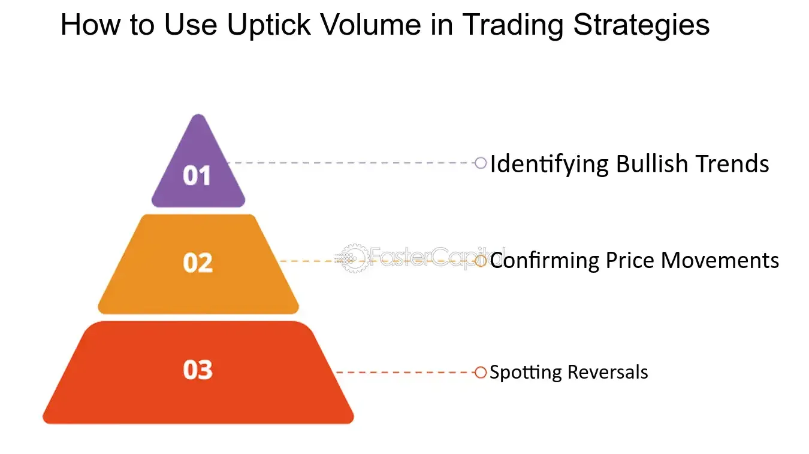

## Table of Contents

## What is uptick volume in stock trading?

Uptick volume in stock trading refers to the total number of shares traded when the price of a stock increases. When a stock's price goes up from one trade to the next, it is called an uptick. The volume during these upticks is important because it shows how many shares were bought at higher prices, which can indicate strong buying interest in the stock.

This measure is often used by investors and traders to gauge the strength of a price movement. If the uptick volume is high, it suggests that many people are willing to buy the stock at increasing prices, which could mean the stock's price might continue to rise. On the other hand, if the uptick volume is low, it might indicate weaker buying interest, suggesting that the price increase might not last long.

## How is uptick volume different from downtick volume?

Uptick volume and downtick volume are two ways to look at how stocks are traded. Uptick volume is the total number of shares traded when the price of a stock goes up. Imagine you're watching the price of a stock, and it moves from $10 to $10.01. The shares traded during that small increase are part of the uptick volume. This can show how much interest there is in buying the stock at a higher price.

Downtick volume, on the other hand, is the total number of shares traded when the price of a stock goes down. If the price drops from $10.01 back to $10, the shares traded during that drop are part of the downtick volume. This can tell you how much people are selling the stock at a lower price. By comparing uptick and downtick volumes, you can get a sense of whether the stock is being bought more often at higher prices or sold more often at lower prices.

## Why is uptick volume important for traders?

Uptick volume is important for traders because it shows how much interest there is in buying a stock at higher prices. When a lot of shares are traded during upticks, it means many people want to buy the stock even as its price goes up. This can be a sign that the stock's price might keep going up, which is good news for traders who are thinking about buying it.

Traders use uptick volume to understand the strength of a stock's price movement. If the uptick volume is high, it suggests that the stock is in demand and the price increase is strong. On the other hand, if the uptick volume is low, it might mean that the price increase is weak and could reverse soon. By looking at uptick volume, traders can make better decisions about when to buy or sell a stock.

## How can uptick volume be used to identify market trends?

Uptick volume can help traders see if a stock is becoming more popular. When a lot of shares are traded during upticks, it means many people want to buy the stock at a higher price. This can be a sign that the stock's price might keep going up. Traders can watch for times when the uptick volume is high to figure out if more people are starting to like the stock. If this happens over a few days or weeks, it might mean the start of a new upward trend for the stock.

On the other hand, if the uptick volume is low even when the stock price is going up, it might mean that not many people are excited about the stock. This could be a warning sign that the price increase might not last long. By comparing the uptick volume with the downtick volume, traders can get a better idea of whether the market is moving up or down. If uptick volume is consistently higher than downtick volume, it's a good sign that the market trend is going up.

## What are the common tools or indicators used to measure uptick volume?

Traders often use a tool called the Tick Index to measure uptick volume. This index shows the difference between the number of stocks that have an uptick and the number of stocks that have a downtick at any given time. When the Tick Index is positive, it means more stocks are going up than down, which can show strong buying interest. Many trading platforms have this tool built-in, making it easy for traders to see uptick volume in real-time.

Another common indicator is the Volume Weighted Average Price (VWAP). VWAP takes into account both the price and the volume of trades to give a more complete picture of market trends. If the stock price is above the VWAP, and the uptick volume is high, it can be a sign that the stock is in a strong upward trend. Traders use VWAP to see if the current price is a good deal compared to the average price throughout the day, helping them decide when to buy or sell.

## Can uptick volume predict stock price movements?

Uptick volume can give traders hints about where a stock's price might go next. When a lot of shares are traded during upticks, it means many people are buying the stock even as its price goes up. This can be a sign that the stock's price might keep going up because there is strong demand for it. Traders look at uptick volume to see if the price increase is strong or if it might not last long.

However, uptick volume alone can't predict stock price movements perfectly. It's just one piece of the puzzle. Other things like news about the company, the overall market, and how much people are selling the stock (downtick volume) also affect the price. By looking at uptick volume along with other information, traders can make better guesses about where the stock price might go, but there are no guarantees in the stock market.

## How does uptick volume relate to market sentiment?

Uptick volume is a good way to see how people feel about a stock. When a lot of shares are traded during upticks, it means many people want to buy the stock at a higher price. This shows that people are feeling good about the stock and think its price might go up even more. Traders look at uptick volume to understand if the market sentiment is positive, which means people are excited and hopeful about the stock.

However, uptick volume is just one part of the story. If the uptick volume is low, it might mean that not many people are excited about the stock, even if its price is going up a little. This can show that the market sentiment is not as strong as it seems. By looking at uptick volume along with other signs, traders can get a better idea of how people really feel about a stock and whether that feeling might change the price in the future.

## What are the limitations of relying solely on uptick volume for trading decisions?

Relying only on uptick volume for trading decisions can be risky because it doesn't tell the whole story. Uptick volume shows how many shares are traded when the stock price goes up, which can be a sign of strong buying interest. But, it doesn't take into account other important things like news about the company, the overall market mood, or how much people are selling the stock. If a trader only looks at uptick volume, they might miss out on important information that could change the stock's price.

Another problem with relying just on uptick volume is that it can be misleading at times. For example, a high uptick volume might happen because of a big trade by one person or a group, not because lots of people are buying the stock. Also, uptick volume doesn't tell you about the stock's long-term trends or how it might react to future events. Traders need to use uptick volume along with other tools and information to make smart trading decisions.

## How has the regulation of uptick volume changed over time?

The regulation of uptick volume has changed a lot over the years, especially in the United States. A long time ago, the U.S. had a rule called the "uptick rule" that was made to stop stocks from falling too fast. This rule said that you could only sell a stock short if the last trade was at a higher price than the one before it. This was meant to make sure that people couldn't keep pushing the price down by selling short all the time. The uptick rule was used from 1938 until 2007, when it was taken away because people thought it wasn't needed anymore.

But then, after the big stock market drop in 2008, people started to think the uptick rule might be a good idea again. So, in 2010, the U.S. brought back a new version of the rule called the "alternative uptick rule." This new rule says that if a stock's price goes down a lot in one day, you can't sell it short unless the last trade was at a higher price than the one before it. This is meant to slow down big price drops and keep the market stable. The rules about uptick volume keep changing to make sure the stock market works well and stays fair for everyone.

## What are some advanced strategies that incorporate uptick volume?

One advanced strategy that uses uptick volume is called "momentum trading." Momentum traders look for stocks that are moving up quickly and have high uptick volume. They think that if a lot of people are buying a stock at higher prices, it might keep going up. So, they buy the stock when they see a lot of uptick volume and then sell it when they think the price has reached its peak. This strategy can make money if the stock keeps going up, but it can also be risky if the price suddenly drops.

Another strategy is called "volume analysis." Traders using this method look at both uptick and downtick volume to understand the strength of a stock's price movement. If a stock's price is going up and the uptick volume is much higher than the downtick volume, it might mean the stock has strong buying interest and could keep going up. Traders might buy the stock when they see this pattern and hold onto it until the uptick volume starts to go down or the downtick volume gets higher. This helps them decide when to buy and sell based on how much people are trading the stock at different prices.

## How does uptick volume data vary across different stock exchanges?

Uptick volume data can be different across various stock exchanges because each exchange has its own rules and ways of doing things. For example, the New York Stock Exchange (NYSE) and the NASDAQ might show different uptick volumes for the same stock because they have different trading systems and types of traders. Also, some exchanges might be more popular with certain kinds of investors, which can change how much uptick volume is seen on that exchange. This means that traders need to look at uptick volume data from the specific exchange they are interested in to make the best decisions.

Another reason uptick volume data can vary is because of time differences and trading hours. Stock exchanges around the world operate in different time zones, so the uptick volume data might not be the same at any given time. For example, the Tokyo Stock Exchange might show a lot of uptick volume during its trading hours, but that data might look different when compared to the uptick volume on the London Stock Exchange, which operates in a different time zone. Traders who work with stocks from different exchanges need to keep these differences in mind to understand the full picture of a stock's performance.

## What role does uptick volume play in algorithmic trading?

Uptick volume is really important in algorithmic trading because it helps computers make smart choices about buying and selling stocks. These computers, or algorithms, look at uptick volume to see if a stock is getting more popular. If a lot of shares are traded when the price goes up, the algorithm might think it's a good time to buy the stock because other people are buying it too. This can help the algorithm make money if the stock keeps going up.

But, uptick volume is just one thing the algorithms look at. They also check other stuff like how much the stock's price has changed, what's happening in the news, and what other stocks are doing. By using uptick volume along with all this other information, the algorithms can make better guesses about where the stock price might go next. This helps them decide when to buy or sell to make the most money.

## What is Understanding Uptick Volume?

Uptick volume is a pivotal concept in the analysis of stock market movements, specifically referring to the volume of shares traded at an increasing price level. It is an essential metric employed by technical analysts to discern market sentiment and anticipate potential price trajectories. Understanding uptick volume necessitates an exploration of its calculation and implications within stock trading environments.

The calculation of uptick volume is straightforward. It involves summing the volume of trades that occur at a price higher than the previous trade. Mathematically, this can be expressed as:

$$
V_{\text{uptick}} = \sum_{i=1}^{n} v_i
$$

where $V_{\text{uptick}}$ is the total uptick volume, and $v_i$ is the volume of each trade at a higher price than the preceding trade. This summation provides a quantitative measure of demand pressure, reflecting the intensity with which market participants are buying at progressively higher prices.

In terms of implications, uptick [volume](/wiki/volume-trading-strategy) is a vital indicator for evaluating the balance between demand and supply. High uptick volume often signifies strong buying interest and is generally interpreted as a bullish signal, indicating potential upward [momentum](/wiki/momentum) in stock prices. Conversely, low uptick volume may suggest weakening demand and possible stagnation or reversal of price movement. 

Traders and analysts use uptick volume in conjunction with other indicators to validate trading signals and enhance decision-making accuracy. For example, integrating uptick volume with price action analysis helps to confirm [breakout](/wiki/breakout-trading) patterns or trend continuations. In contrast, divergence between price movement and uptick volume can signal potential reversals or false breakouts.

In summary, uptick volume offers traders a nuanced view of market dynamics, providing insights into investor behavior and facilitating more informed trading decisions. Understanding how to calculate and interpret this metric enables analysts to better predict market trends and enhance their overall trading strategies.

## References & Further Reading

[1]: Bergstra, J., Bardenet, R., Bengio, Y., & Kégl, B. (2011). ["Algorithms for Hyper-Parameter Optimization."](https://dl.acm.org/doi/10.5555/2986459.2986743) Advances in Neural Information Processing Systems 24.

[2]: ["Advances in Financial Machine Learning"](https://www.amazon.com/Advances-Financial-Machine-Learning-Marcos/dp/1119482089) by Marcos Lopez de Prado

[3]: ["Evidence-Based Technical Analysis: Applying the Scientific Method and Statistical Inference to Trading Signals"](https://www.amazon.com/Evidence-Based-Technical-Analysis-Scientific-Statistical/dp/0470008741) by David Aronson

[4]: ["Machine Learning for Algorithmic Trading"](https://github.com/stefan-jansen/machine-learning-for-trading) by Stefan Jansen

[5]: ["Quantitative Trading: How to Build Your Own Algorithmic Trading Business"](https://www.amazon.com/Quantitative-Trading-Build-Algorithmic-Business/dp/1119800064) by Ernest P. Chan