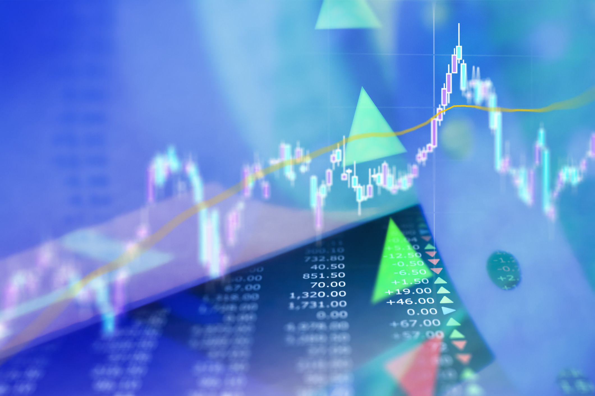

The world of stock trading is continuously evolving, driven by technological advancements and the increasing dominance of algorithmic trading. Algorithmic trading leverages computer algorithms to execute trades at speeds and frequencies that are impossible for human traders. This has not only streamlined the trading process but has also changed the dynamics of market analysis. Among the various metrics employed by traders, uptick volume stands out as a crucial indicator for assessing market direction and sentiment.

Uptick volume is the volume of shares traded when a stock's price is ticking upward. This metric provides insights into market demand and potential price movements, assisting traders in making informed decisions. In the context of algorithmic trading, uptick volume is particularly significant, as algorithms can process vast amounts of trading data, including uptick volume, in real-time. This capability allows for the rapid assessment of market conditions and facilitates more precise trading strategies.



This article explores the complexities of stock trading by emphasizing the importance of uptick volume in market analysis. The discussion will extend to how traders and automated systems utilize uptick volume to gauge market trends and execute strategic trades efficiently. As algorithmic trading continues to expand, understanding and leveraging such indicators becomes increasingly critical for success in the stock market.

## Table of Contents

## Understanding Uptick Volume

Uptick volume is a pivotal concept in the analysis of stock market movements, specifically referring to the volume of shares traded at an increasing price level. It is an essential metric employed by technical analysts to discern market sentiment and anticipate potential price trajectories. Understanding uptick volume necessitates an exploration of its calculation and implications within stock trading environments.

The calculation of uptick volume is straightforward. It involves summing the volume of trades that occur at a price higher than the previous trade. Mathematically, this can be expressed as:

$$
V_{\text{uptick}} = \sum_{i=1}^{n} v_i
$$

where $V_{\text{uptick}}$ is the total uptick volume, and $v_i$ is the volume of each trade at a higher price than the preceding trade. This summation provides a quantitative measure of demand pressure, reflecting the intensity with which market participants are buying at progressively higher prices.

In terms of implications, uptick [volume](/wiki/volume-trading-strategy) is a vital indicator for evaluating the balance between demand and supply. High uptick volume often signifies strong buying interest and is generally interpreted as a bullish signal, indicating potential upward [momentum](/wiki/momentum) in stock prices. Conversely, low uptick volume may suggest weakening demand and possible stagnation or reversal of price movement. 

Traders and analysts use uptick volume in conjunction with other indicators to validate trading signals and enhance decision-making accuracy. For example, integrating uptick volume with price action analysis helps to confirm [breakout](/wiki/breakout-trading) patterns or trend continuations. In contrast, divergence between price movement and uptick volume can signal potential reversals or false breakouts.

In summary, uptick volume offers traders a nuanced view of market dynamics, providing insights into investor behavior and facilitating more informed trading decisions. Understanding how to calculate and interpret this metric enables analysts to better predict market trends and enhance their overall trading strategies.

## The Role of Uptick Volume in Market Analysis

Market analysis necessitates a thorough comprehension of several metrics, with uptick volume holding a significant position in highlighting bullish trends. Uptick volume, the aggregate measure of shares exchanged at an increasing price, serves as a robust indicator of market sentiment and potential price trajectories. By examining this metric, traders and investors can validate the strength and sustainability of upward market movements.

Investors routinely rely on uptick volume to substantiate bullish trends. When the uptick volume is high, it implies a substantial buying interest at ascending prices, which can affirm the robustness of an upward trend. This data empowers traders to recognize potential continuation patterns, signaling them to either enter or hold positions in anticipation of continued price advances.

To achieve a comprehensive market analysis, comparing uptick volume to downtick and net volumes becomes crucial. Downtick volume, representing the number of shares traded at decreasing prices, provides a counterbalance to uptick volume. The net volume, calculated as the difference between uptick and downtick volumes, offers a net directional bias within the market. A positive net volume suggests a bullish trend, while a negative net volume might indicate bearish sentiments. This analytical framework helps traders discern the overall market direction and make more informed decisions.

Here is a Python example to calculate net volume:

```python
def calculate_net_volume(uptick_volume, downtick_volume):
    return uptick_volume - downtick_volume

# Example data
uptick_volume = 5000
downtick_volume = 3000

net_volume = calculate_net_volume(uptick_volume, downtick_volume)
print(f"Net Volume: {net_volume}")
```

This script calculates the net volume using the provided uptick and downtick volumes, assisting traders in quickly assessing market conditions. By understanding the interplay between these volumes, investors can enhance their market analysis, leading to strategic investment decisions.

## Algorithmic Trading and Uptick Volume

Algorithmic trading, often known as algo trading, refers to the use of computer systems programmed with predefined strategies to execute trades. This method allows for the rapid and efficient analysis and execution of trading decisions based on a variety of market indicators, including uptick volume. Uptick volume, a measure of the number of shares traded when a stock's price is rising, serves as a critical metric for many algorithmic strategies. By integrating uptick volume into their algorithms, traders can identify potential bullish trends and optimize their trading strategies accordingly. 

In [algorithmic trading](/wiki/algorithmic-trading), the ability to process large volumes of market data quickly is paramount. Uptick volume provides insights into market momentum, indicating significant buying pressure. Algorithms can capitalize on this by executing trades that align with the upward price movements, thereby potentially enhancing profitability. For instance, an algorithm might be designed to trigger a buy order when the uptick volume exceeds a certain threshold, suggesting a strong upward trend.

The integration of uptick volume in trading algorithms can be implemented via a set of logical rules or thresholds, coded into the algorithm. For example, a simplistic Python pseudocode might look like this:

```python
def execute_trade(current_price, previous_price, uptick_volume, threshold):
    if current_price > previous_price and uptick_volume > threshold:
        return "Buy"
    else:
        return "Hold"

# Example usage
current_price = 105
previous_price = 100
uptick_volume = 5000
threshold = 4500

decision = execute_trade(current_price, previous_price, uptick_volume, threshold)
print(decision)  # Output: "Buy"
```

This snippet shows a basic logic that compares current and previous stock prices alongside the uptick volume to determine if a trade should be executed. In practice, algorithms can be far more complex, integrating additional factors, [backtesting](/wiki/backtesting) data, and [machine learning](/wiki/machine-learning) models to refine decision-making processes.

Furthermore, the capability of algorithmic systems to handle uptick volume data with such precision reduces the reliance on real-time human judgment, which can be slower and prone to error. Algorithms excel in this environment by removing emotional bias from trading decisions and operating continuously without fatigue.

Despite the advantages, utilizing uptick volume in algorithmic trading requires careful consideration of data accuracy and system sensitivity. Algorithms must be built robustly to handle noise and avoid false signals, which could lead to suboptimal trading outcomes. Overall, the application of uptick volume in algorithmic trading not only enhances the efficiency of trade execution but also supports sophisticated market analysis, empowering traders to navigate the stock market with increased efficacy.

## Practical Applications of Uptick Volume in Trading Strategies

Uptick volume serves as a crucial component in different trading strategies, leveraging its insights into market dynamics for more informed decision-making. In momentum trading, traders utilize uptick volume as an indicator of persisting trends. An increase in uptick volume suggests sustained interest in a security, prompting traders to enter positions in anticipation of continued upward price movement. By examining periods of high uptick volume, traders aim to identify securities with potential for continued bullish behavior, entering trades early to capitalize on this momentum.

Breakout strategies also heavily rely on uptick volume to gauge the likelihood of a successful breakout. A breakout occurs when a security’s price moves beyond a predefined critical level, often accompanied by increased [volatility](/wiki/volatility-trading-strategies). Here, uptick volume can signify the intensity of market interest driving the price beyond resistance levels. Traders typically look for a significant uptick volume to confirm that the breakout is supported by strong market demand, reducing the risk of false breakouts and enhancing the probability of trade success.

In practice, traders may combine uptick volume with other technical indicators such as relative strength index (RSI) or moving averages to corroborate signals. Python-based algorithms can automate these processes, allowing for real-time analysis of uptick volume and quick execution of trades. For example, a Python script might monitor live trading data to execute a buy order when a preset uptick volume threshold is reached, combined with favorable RSI conditions.

Overall, employing uptick volume in trading strategies offers traders a nuanced tool to interpret market sentiments, enhancing the precision and profitability of their trades. As part of a comprehensive market analysis approach, uptick volume aids in distinguishing genuine trading opportunities from market noise, thereby aligning trading actions with market realities.

## Challenges and Considerations

Uptick volume is a valuable tool in stock trading, yet it comes with its own set of challenges that traders must navigate to ensure accurate and effective use. One of the primary concerns is data accuracy, which is crucial for making informed trading decisions. The accuracy of uptick volume data can be compromised by market noise, leading to potential misinterpretations. Market noise refers to the random price fluctuations and irrelevant data that can obscure true market signals. Traders must filter out this noise to avoid making decisions based on misleading uptick volume signals.

Another critical issue is algorithm sensitivity. Algorithmic trading systems often utilize uptick volume data to make split-second decisions. However, these algorithms can be overly sensitive to short-term fluctuations or erroneous data inputs, resulting in unpredictable outcomes. To address this, traders should design algorithms that incorporate robust error-checking and noise-filtering mechanisms. This process involves smoothing the data to minimize the impact of outliers and ensuring that the algorithms are not reacting to temporary or insignificant changes in volume.

Understanding the potential pitfalls in uptick volume requires careful consideration of how this metric is integrated into trading strategies. For example, while high uptick volume might indicate strong market demand, it could also be a result of high-frequency trading activities that do not reflect underlying market trends. In such cases, traders should cross-reference uptick volume with other indicators, such as downtick volume and net volume, to gain a more comprehensive understanding of market conditions.

To exemplify how one might handle these considerations programmatically, traders can utilize Python to create a moving average of uptick volume, which helps smooth out fluctuations and provide a clearer picture of the trend. Below is an example of how this can be achieved using Python:

```python
import numpy as np
import pandas as pd

# Sample data: a time series of uptick volumes
data = {'uptick_volume': [100, 150, 200, 250, 320, 300, 260, 210, 180, 160]}
df = pd.DataFrame(data)

# Calculate a simple moving average to smooth out short-term fluctuations
df['SMA'] = df['uptick_volume'].rolling(window=3).mean()

print(df)
```

In this example, the rolling window size can be adjusted depending on the desired level of smoothing. By implementing these analytical strategies, traders can better manage the inherent challenges of using uptick volume as a trading indicator. It is critical to remain vigilant about data quality and algorithm sensitivity to interpret uptick volume accurately and reduce the risk of costly errors in trading decisions.

## Conclusion

Uptick volume remains an essential metric for traders, whether engaged in manual or algorithmic trading. Its importance lies in its ability to offer insights into market sentiment, highlighting potential price movements as stocks increase in price. Traders rely on uptick volume to assess the strength of bullish trends, assisting them in making informed decisions and anticipating market behavior. In algorithmic trading, where decisions need to be made quickly and based on extensive data analysis, the role of uptick volume becomes even more crucial. Algorithms can efficiently process vast amounts of uptick volume data, allowing traders to respond swiftly to emerging market trends.

As the trading landscape becomes more algorithmic, the understanding of indicators like uptick volume is pivotal for success. Traders who can accurately interpret these signals are better equipped to navigate the complexities of the stock market, enhancing their strategies and potentially increasing returns. Therefore, mastery of uptick volume as an indicator not only enriches a trader's analytical toolkit but also aligns with the technological advancements driving modern trading practices.

## References & Further Reading

[1]: Bergstra, J., Bardenet, R., Bengio, Y., & Kégl, B. (2011). ["Algorithms for Hyper-Parameter Optimization."](https://dl.acm.org/doi/10.5555/2986459.2986743) Advances in Neural Information Processing Systems 24.

[2]: ["Advances in Financial Machine Learning"](https://www.amazon.com/Advances-Financial-Machine-Learning-Marcos/dp/1119482089) by Marcos Lopez de Prado

[3]: ["Evidence-Based Technical Analysis: Applying the Scientific Method and Statistical Inference to Trading Signals"](https://www.amazon.com/Evidence-Based-Technical-Analysis-Scientific-Statistical/dp/0470008741) by David Aronson

[4]: ["Machine Learning for Algorithmic Trading"](https://github.com/stefan-jansen/machine-learning-for-trading) by Stefan Jansen

[5]: ["Quantitative Trading: How to Build Your Own Algorithmic Trading Business"](https://www.amazon.com/Quantitative-Trading-Build-Algorithmic-Business/dp/1119800064) by Ernest P. Chan