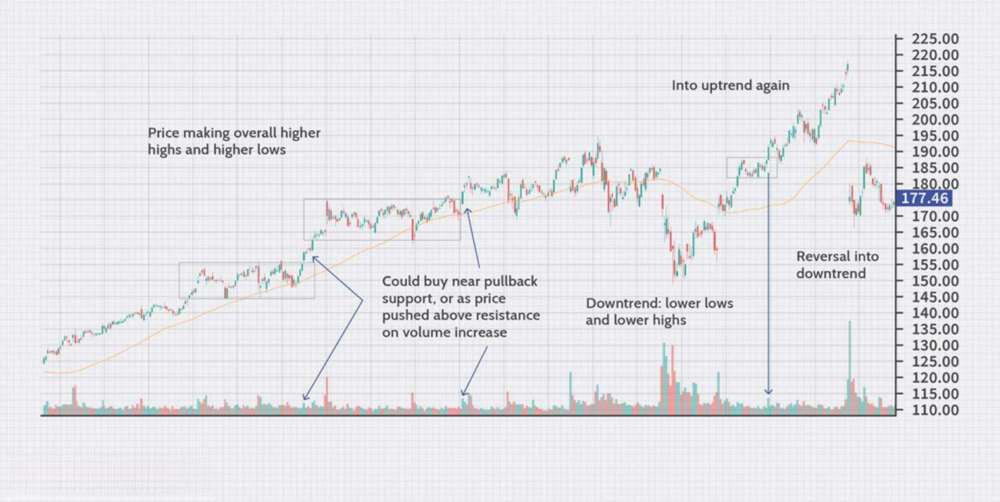

Trading strategies are essential tools that help traders and investors navigate the dynamics of financial markets. These strategies encompass a set of rules and methodologies that aim to capitalize on market movements and improve the efficiency of trades. Among these, uptrend trading is particularly significant as it focuses on identifying and riding upward trends in asset prices, potentially leading to substantial gains.

Uptrend trading is centered on the concept of buying securities that are increasing in value, characterized by rising price points. This strategy is invaluable for traders because it leverages the momentum of an asset's growth, allowing for maximum profit potential when the market conditions align favorably.



Technical analysis plays a crucial role in identifying uptrends. By studying historical price movements and patterns through various indicators, traders can predict future price actions. This method involves the use of charts and technical indicators such as moving averages, trend lines, and the Relative Strength Index (RSI), which can highlight emerging trends and guide buy or sell decisions.

In the modern trading landscape, algorithmic trading, or algo trading, has become a vital component of effective strategy implementation. This form of trading uses computer algorithms to execute trades at speeds and frequencies that are impossible for human traders. Algo trading is particularly advantageous during uptrends because it can process vast amounts of data to determine optimal entry and exit points with precision and speed.

The purpose of this article is to explore an array of trading strategies that harness both technical analysis and algorithmic trading to effectively engage in uptrends. The insights provided aim to empower traders, investors, and financial enthusiasts to refine their approaches and capitalize on positive market movements. By integrating these methodologies, readers can enhance their understanding and application of uptrend trading, ultimately improving their overall market performance.

## Table of Contents

## Understanding Uptrends in Financial Markets

An uptrend in financial markets refers to a period where the overall direction of a financial asset's price is upward. This pattern is characterized by a sequence of higher highs and higher lows, indicating positive momentum and sustained interest from buyers. The visualization of an uptrend is typically seen as a continuous rising slope on a price chart, which signifies that the market is favoring bullish movements over bearish ones.

One of the main indicators of a healthy uptrend is the repeated formation of higher highs and higher lows. These patterns suggest that successive peaks and troughs in the price of an asset are progressively higher than the previous ones. This consistent upward movement indicates strong demand and prevailing bullish sentiment among market participants.

Market psychology plays a pivotal role in fueling uptrends. As prices rise, investor sentiment often turns more optimistic, encouraging further buying. This optimism can be self-reinforcing, creating a cycle where positive sentiment drives higher prices, which, in turn, boosts sentiment. Conversely, when an uptrend wavers, market participants may begin to doubt the sustainability of the price increases, potentially leading to a shift in [momentum](/wiki/momentum).

Investor sentiment can also be monitored through various indicators, such as the Relative Strength Index (RSI), which gauges momentum by comparing recent gains to recent losses. An RSI reading above 70 is generally considered overbought, whereas a reading below 30 is seen as oversold. During an uptrend, the RSI typically remains elevated, reflecting strong buying pressure.

Throughout history, sustained uptrends have been observed across different asset classes. For instance, the bull markets in the U.S. stock market during the 1980s and 1990s featured prolonged uptrends fueled by technological advancements and robust economic growth. Similarly, the [cryptocurrency](/wiki/cryptocurrency) market witnessed a remarkable uptrend from late 2020 to early 2021, driven by increased institutional adoption and a strong influx of retail investors.

The case of commodities like gold also highlights the presence of uptrends. Gold prices experienced a significant uptrend in the 2000s, partly due to economic uncertainties and a weakening U.S. dollar. These historical examples demonstrate how uptrends can occur across various markets and are influenced by a mix of economic factors, investor sentiment, and market conditions. Understanding these patterns can provide traders with the insights needed to identify and capitalize on uptrends effectively.

## Technical Analysis Tools for Uptrend Trading

Technical analysis plays a crucial role in identifying and capitalizing on uptrends in financial markets. Traders rely on a range of indicators and tools to assess market conditions and make informed decisions. A fundamental aspect of technical analysis is understanding price trends and patterns, which are instrumental in uptrend trading.

### Moving Averages: Simple and Exponential

Moving averages are among the most widely used technical indicators for detecting trends. They smooth out price data to identify the direction of a trend by filtering out short-term fluctuations.

1. **Simple Moving Average (SMA):** The SMA is calculated by taking the arithmetic mean of a given set of prices (typically closing prices) over a specified number of periods. It provides a clear trend direction.
$$
   \text{SMA} = \frac{P_1 + P_2 + \ldots + P_n}{n}

$$

   where $P_1, P_2, \ldots, P_n$ are the closing prices for $n$ periods.

2. **Exponential Moving Average (EMA):** Unlike the SMA, the EMA gives more weight to recent prices, making it more responsive to new information. The EMA is often favored for its ability to react more quickly to price changes.
$$
   \text{EMA}_\text{today} = (\text{Price}_\text{today} \times \alpha) + (\text{EMA}_\text{yesterday} \times (1-\alpha))

$$

   where $\alpha$ is the smoothing factor, calculated as $\alpha = \frac{2}{n+1}$.

Traders use crossovers of short-term and long-term moving averages to signal potential buy or sell opportunities. For instance, a common strategy involves a short-term EMA crossing above a long-term SMA, indicating an emerging uptrend.

### Relative Strength Index (RSI)

The Relative Strength Index (RSI) is a momentum oscillator that measures the speed and change of price movements, developed to gauge the strength of an uptrend. It oscillates between 0 and 100 and is typically used to identify overbought or oversold conditions.

The RSI is calculated as follows:

$$
\text{RSI} = 100 - \left(\frac{100}{1 + \text{RS}}\right)
$$

where $\text{RS} = \frac{\text{average gain over } n \text{ periods}}{\text{average loss over } n \text{ periods}}$.

An RSI value above 70 is generally considered overbought, suggesting a potential pullback, while a value below 30 indicates oversold conditions, pointing to a possible price rise.

### Trend Lines and Channel Patterns

Trend lines are essential tools for visualizing uptrends. A trend line is drawn by connecting a series of higher lows in an uptrend, creating a support level. They help traders identify price trends and potential reversal points.

Channel patterns, formed by drawing two parallel trend lines, encapsulate price movements. The upper trend line acts as resistance, while the lower line serves as support. Price movement within these channels can indicate strong trends.

### Case Studies and Chart Examples

Consider the following Python example to visualize moving averages and RSI on a stock price chart using libraries such as `matplotlib` and `pandas`:

```python
import pandas as pd
import matplotlib.pyplot as plt

# Sample data loading
data = pd.read_csv('stock_prices.csv', parse_dates=['Date'], index_col='Date')

# Calculate moving averages
data['SMA'] = data['Close'].rolling(window=50).mean()
data['EMA'] = data['Close'].ewm(span=50, adjust=False).mean()

# Calculate RSI
delta = data['Close'].diff()
gain = (delta.where(delta > 0, 0)).rolling(window=14).mean()
loss = (-delta.where(delta < 0, 0)).rolling(window=14).mean()
data['RS'] = gain / loss
data['RSI'] = 100 - (100 / (1 + data['RS']))

# Plotting
plt.figure(figsize=(14, 7))
plt.plot(data.index, data['Close'], label='Close Price')
plt.plot(data.index, data['SMA'], label='SMA', linestyle='--')
plt.plot(data.index, data['EMA'], label='EMA', linestyle=':')
plt.title('Stock Price with Moving Averages and RSI')
plt.xlabel('Date')
plt.ylabel('Price')
plt.legend()
plt.show()
```

This code provides a foundational approach to applying technical indicators on historical stock data, illustrating how moving averages and the RSI are employed to discern uptrends and evaluate market momentum.

## Algorithmic Trading Strategies for Uptrends

Algorithmic trading has become a pivotal aspect of financial markets, offering traders enhanced speed and accuracy by utilizing automated systems for executing trades. Particularly in uptrend situations, [algorithmic trading](/wiki/algorithmic-trading) presents significant advantages, leveraging fast computational abilities to capitalize on market movements while minimizing human error.

### Simple Moving Average Crossover Strategies

A fundamental algorithmic strategy employed during uptrends is the simple moving average (SMA) crossover. This approach involves using two moving averages with different time periods. For instance, a short-term moving average (e.g., 50-day SMA) might be used alongside a longer-term moving average (e.g., 200-day SMA). A buy signal is generated when the short-term moving average surpasses the long-term moving average, indicating the potential beginning of an uptrend. Conversely, a sell signal occurs when the short-term average crosses below the long-term average, suggesting a potential trend reversal.

```python
# Simple Moving Average Crossover Strategy in Python
import pandas as pd

def compute_sma(data, window):
    return data.rolling(window=window).mean()

def sma_crossover_trading_strategy(data, short_window, long_window):
    signals = pd.DataFrame(index=data.index)
    signals['price'] = data['Close']
    signals['short_mavg'] = compute_sma(data['Close'], short_window)
    signals['long_mavg'] = compute_sma(data['Close'], long_window)
    signals['signal'] = 0.0
    signals['signal'][short_window:] = np.where(signals['short_mavg'][short_window:] > signals['long_mavg'][short_window:], 1.0, 0.0)
    signals['positions'] = signals['signal'].diff()
    return signals

# Example usage:
# data is a DataFrame with a 'Close' column containing closing prices
# signals = sma_crossover_trading_strategy(data, short_window=50, long_window=200)
```

### Momentum-based Algorithmic Strategies

Momentum-based strategies focus on the strength and direction of price trends. These strategies involve identifying assets that are exhibiting strong upward momentum and positioning trades to capitalize on continued price increases. One common indicator used in these strategies is the Relative Strength Index (RSI), which measures the speed and change of price movements. An RSI value above 70 could indicate an overbought condition, signaling potential upward momentum that algorithms can exploit.

### Backtesting and Optimization

The effectiveness of any algorithmic trading strategy is heavily reliant on rigorous [backtesting](/wiki/backtesting). This process involves using historical data to simulate how a strategy would have performed in past market conditions. Backtesting allows traders to evaluate the viability of their strategies and make necessary adjustments. Additionally, optimization techniques are employed to fine-tune parameters such as moving average durations or threshold levels for momentum indicators, helping to maximize returns and minimize risks.

```python
# Backtesting framework (simplified)
def backtest_strategy(data, strategy_function, **kwargs):
    signals = strategy_function(data, **kwargs)
    # Calculate returns
    data['returns'] = data['Close'].pct_change()
    # Compute strategy returns
    strategy_returns = signals['positions'].shift(1) * data['returns']
    cumulative_returns = (1 + strategy_returns).cumprod() - 1
    return cumulative_returns

# Example backtesting usage:
# cumulative_returns = backtest_strategy(data, sma_crossover_trading_strategy, short_window=50, long_window=200)
```

### Successful Algorithmic Strategies During Uptrends

Several algorithmic strategies have been noted for their success during uptrends. Besides moving average crossovers, [breakout](/wiki/breakout-trading) strategies, which focus on buying an asset when it breaks out of a defined resistance level, often yield positive results. Additionally, trend-following strategies, which rely on continuous adjustments to maintain a position aligned with the prevailing market trend, have proven effective. 

In summary, algorithmic trading strategies tailored for uptrends provide traders with tools to capitalize on upward market movements efficiently. By combining methods such as moving average crossovers and momentum indicators with robust backtesting, traders can significantly enhance their ability to profit from sustained market uptrends.

## Combining Technical Analysis and Algo Trading for Optimal Results

The integration of technical analysis and algorithmic trading offers significant advantages for traders seeking to capitalize on uptrends in financial markets. Combining these two approaches allows traders to leverage the analytical rigor of technical indicators and the speed and precision of algorithms, enhancing the ability to recognize and act upon market trends effectively.

**Synergy between Technical Analysis and Algorithmic Trading:**

Technical analysis provides a suite of tools for identifying price trends and patterns, which can be quantitatively analyzed and embedded into algorithmic trading systems. Algorithms execute trades based on specific signals generated by these technical indicators, reducing emotional biases and increasing the efficiency of trading operations. For instance, using a moving average crossover strategy, an algorithm can automatically execute buy and sell orders when short-term moving averages cross long-term ones, suggesting the beginning or end of an uptrend.

**Integrating Technical Indicators into Algorithmic Systems:**

1. **Indicator Selection**: The first step involves selecting appropriate technical indicators that can signal potential uptrends. Common choices include moving averages, RSI, and trend lines. These indicators can be mathematically represented and converted into algorithmic rules.

2. **Algorithm Development**: Traders can develop algorithms to monitor these indicators in real time. In Python, libraries such as Pandas and TA-Lib can be used to calculate indicators and manage data efficiently. For example:

    ```python
    import pandas as pd
    import talib as ta

    data = pd.read_csv('market_data.csv')
    data['SMA50'] = ta.SMA(data['Close'], timeperiod=50)
    data['SMA200'] = ta.SMA(data['Close'], timeperiod=200)

    # Generate trading signals
    data['Signal'] = 0
    data.loc[data['SMA50'] > data['SMA200'], 'Signal'] = 1
    ```

3. **Backtesting and Optimization**: Once developed, algorithms should be backtested against historical data to evaluate their performance. This process helps refine parameters and improve predictive accuracy. Traders might use backtesting frameworks such as Backtrader to optimize their strategies.

4. **Execution and Monitoring**: Deploy the algorithm in a live market environment and continuously monitor its performance. Adjustments may be required based on evolving market conditions to maintain effectiveness.

**Case Studies of Successful Hybrid Approaches:**

Several traders have successfully combined technical analysis with algorithmic trading. For instance, proprietary trading firms often develop hybrid systems that use technical indicators to inform high-frequency trading algorithms. These systems can quickly adapt to market trends and execute multiple trades within milliseconds, capturing profits from brief uptrends.

**Challenges and Solutions:**

- **Data Quality**: Reliable data is crucial for the success of any trading strategy. Solutions include using reputable data providers and implementing robust data cleaning procedures to ensure accuracy.

- **Overfitting**: Over-optimization of algorithms based on historical data can lead to poor out-of-sample performance. To address this, traders can use techniques such as walk-forward analysis to validate the robustness of their algorithms.

- **Market Volatility**: Sudden volatility can disrupt algorithmic strategies. Incorporating volatility indicators and ensuring diversified trade execution can mitigate these risks.

In conclusion, the fusion of technical analysis and algorithmic trading in uptrend markets provides a powerful framework for enhancing trading efficiency and effectiveness. By carefully integrating and rigorously testing these strategies, traders can improve their odds of success in dynamic financial markets.

## Real-world Examples of Successful Uptrend Trading Strategies

Successful uptrend trading strategies have been demonstrated across different asset classes. This section examines detailed real-world scenarios, profiles successful traders, and offers valuable lessons for those looking to implement similar strategies in stocks, Forex, and cryptocurrencies.

### Detailed Analysis of Real-world Trading Scenarios Involving Uptrends

In the world of stock trading, uptrends can be a source of significant profit. For instance, Tesla Inc. experienced a prolonged uptrend between 2019 and 2021, driven by increased electric vehicle adoption and strong financial performance. Investors who identified the uptrend early, using technical indicators such as moving averages and RSI, enjoyed substantial returns.

In the Forex market, currency pairs like EUR/USD provide similar opportunities. For example, during periods of economic strength in the Eurozone, traders employing trend-following strategies, such as using a simple moving average crossover, have capitalized on the uptrend. By setting buy signals when the 50-day moving average crossed above the 200-day moving average, these traders aligned with the broader market move.

Cryptocurrencies like Bitcoin also offer fertile ground for uptrend strategies. The bull market from late 2020 to early 2021 is a case in point, where technical analysis tools, including Fibonacci retracements, helped traders ride the uptrend effectively.

### Profiles of Successful Traders

Successful traders such as Paul Tudor Jones have made their mark by profiting from uptrends. Jones is renowned for using technical analysis to predict market trends and has consistently outperformed the market. His approach involves identifying macroeconomic trends and capitalizing on them using a mix of technical indicators, which allows him to time entry and [exit](/wiki/exit-strategy) points effectively.

Another example is Linda Raschke, known for her adaptive trading style which leverages both trend-following and counter-trend strategies. Her success lies in her disciplined approach to trading, which includes strict risk management and systematic application of technical analysis principles.

### Case Studies Highlighting Different Asset Classes

#### Stocks: 

The Apple Inc. uptrend from 2009 to 2020 provides a compelling case study. Traders applied a combination of exponential moving averages (EMAs) and MACD (Moving Average Convergence Divergence) to identify and ride the trend. These indicators helped in spotting momentum shifts, allowing traders to remain in the trend for extended periods.

#### Forex:

Consider the USD/JPY uptrend from late 2012 to mid-2015. Driven by Japan's economic policy shifts, traders using Ichimoku Cloud techniques identified entry points as the price remained above the cloud, signaling a bullish trend.

#### Cryptocurrencies:

Ethereum's 2021 uptrend was leveraged by traders using Bollinger Bands to capture [volatility](/wiki/volatility-trading-strategies). The strategy involved buying on dips when the price touched the lower band during a strong uptrend, thereby optimizing the risk-to-reward ratio.

### Lessons Learned and Tips for Emulating Successful Strategies

1. **Understanding Market Conditions:**
   Knowing the broader economic or sector-specific conditions that support uptrends is crucial. This helps in distinguishing genuine trends from short-term price movements.

2. **Risk Management:**
   Successful traders consistently emphasize the importance of managing risk. This includes setting stop-losses, position sizing, and diversifying across different asset classes to mitigate potential losses.

3. **Consistent Strategy Application:**
   Traders who succeed typically stick to a well-tested strategy. This may involve a combination of technical analysis tools to confirm trends and momentum.

4. **Continuous Education:**
   Markets evolve, and so do successful trading strategies. Keeping abreast of new tools and techniques allows traders to adapt to changing market dynamics.

By studying these examples and incorporating key lessons into their own trading practices, traders and investors can enhance their ability to profit from uptrends across various markets.

## Conclusion

In this exploration of uptrend trading strategies, we have examined various tools and techniques pivotal in navigating and capitalizing on rising markets. Key points covered include the identification and analysis of uptrends using technical indicators such as moving averages and the Relative Strength Index (RSI), the strategic use of trend lines and channel patterns, and the modern advantages of algorithmic trading. The integration of algorithmic strategies, including simple moving average crossover and momentum-based models, has been highlighted as a means to optimize trading outcomes during uptrends. Additionally, the synergy between technical analysis and algorithmic trading systems has been discussed, illustrating the potential for enhanced trading performance through combined approaches.

In the dynamic and often unpredictable world of finance, the ability to remain informed and adaptable is crucial. Traders must continuously engage with new information, tools, and strategies to stay ahead of market developments and volatility. This adaptability not only aids in maximizing profits during sustained uptrends but also in mitigating risks when market conditions shift.

Traders are encouraged to continue learning and refining their strategies, making the most of the wealth of resources available today. Whether through [books](/wiki/algo-trading-books), online courses, or trading communities, there is a vast array of knowledge and expertise to tap into. Constant experimentation and backtesting are vital for confirming the effectiveness of new strategies before implementation.

Finally, as a call to action, readers are urged to apply the insights gained from this article to their trading practices. By integrating both technical analysis and algorithmic trading strategies, traders can enhance their decision-making process and build a robust framework tailored to exploit uptrends effectively. Embracing both technology and analysis not only fosters better trading outcomes but also equips traders to tackle future market challenges with confidence.

## Additional Resources and Further Reading

### Recommended Books and Articles on Technical Analysis and Algo Trading

1. **"Technical Analysis of the Financial Markets" by John J. Murphy**  
   This comprehensive guide covers a wide array of technical analysis tools and techniques with practical examples. It's suitable for both novice and experienced traders who are keen on understanding market dynamics.

2. **"Algo Trading: Winning Strategies and Their Rationale" by Ernest P. Chan**  
   An insightful read into algorithmic trading, this book explores the development and application of quantitative strategies, providing readers with a deeper understanding of market behaviour.

3. **"Trading for a Living" by Dr. Alexander Elder**  
   This book integrates technical analysis, trading psychology, and money management, offering a holistic approach to trading. It is a valuable resource for traders looking to build sustainable trading strategies.

4. **Articles from the Journal of Financial Markets**  
   Scholarly articles on technical analysis and algo trading can be a rich source of current research and innovative strategies. Access through university libraries or services such as JSTOR.

### Online Courses and Tutorials for Skill Development

1. **Coursera: "Financial Markets" by Yale University**  
   This free-to-audit [course](/wiki/best-algorithmic-trading-courses) provides an overview of how financial markets operate, with insights into trading strategies and market analysis.

2. **Udemy: "Algorithmic Trading for Beginners"**  
   A beginner-friendly course offering practical knowledge on creating and implementing algorithmic trading strategies using Python.

3. **Investopedia Academy: "Technical Analysis"**  
   This course provides a comprehensive look at technical analysis, offering modules that cover a variety of technical tools and indicators useful for uptrend trading.

### Communities and Forums for Traders

1. **TradingView Community**  
   A vibrant platform where traders share charts, strategies, and insights. It's an excellent place to gain perspectives and feedback from other traders.

2. **Elite Trader**  
   This forum caters to both new and experienced traders, providing discussions on various trading topics, including strategies for uptrends.

3. **r/algotrading (Reddit)**  
   A subreddit where algorithmic traders discuss strategies, share code, and offer advice. It's a helpful resource for staying updated on trends in algo trading.

### Tools and Software for Implementing Strategies

1. **MetaTrader 4 (MT4)**  
   MT4 is a popular trading platform that offers robust technical analysis tools and supports algo trading through the use of Expert Advisors (EAs).

2. **NinjaTrader**  
   This platform offers advanced charting capabilities and market analysis tools, along with algorithmic trading features for various asset classes.

3. **QuantConnect**  
   An online platform that provides backtesting and research tools for designing algorithmic trading strategies using Python. It is ideal for those looking to test and implement complex trading strategies.

These resources offer a starting point for traders and investors aiming to enhance their understanding and application of trading strategies in uptrends, ensuring they are equipped with the latest information and tools necessary for success.

## References & Further Reading

[1]: Murphy, J. J. (1999). ["Technical Analysis of the Financial Markets."](https://archive.org/details/technicalanalysi0000murp) New York Institute of Finance.

[2]: Chan, E. P. (2013). ["Algorithmic Trading: Winning Strategies and Their Rationale."](https://github.com/ftvision/quant_trading_echan_book) Wiley.

[3]: Elder, A. (1993). ["Trading for a Living: Psychology, Trading Tactics, Money Management."](https://www.amazon.com/Trading-Living-Psychology-Tactics-Management/dp/0471592242) Wiley.

[4]: Lo, A. W., Mamaysky, H., & Wang, J. (2000). ["Foundations of Technical Analysis: Computational Algorithms, Statistical Inference, and Empirical Implementation."](https://www.nber.org/papers/w7613) The Journal of Finance, 55(4), 1705-1765.

[5]: Pring, M. J. (2002). ["Technical Analysis Explained: The Successful Investor's Guide to Spotting Investment Trends and Turning Points."](https://www.amazon.com/Technical-Analysis-Explained-Fifth-Successful/dp/0071825177) McGraw Hill.

[6]: Aronson, D. R. (2006). ["Evidence-Based Technical Analysis: Applying the Scientific Method and Statistical Inference to Trading Signals."](https://www.amazon.com/Evidence-Based-Technical-Analysis-Scientific-Statistical/dp/0470008741) Wiley.