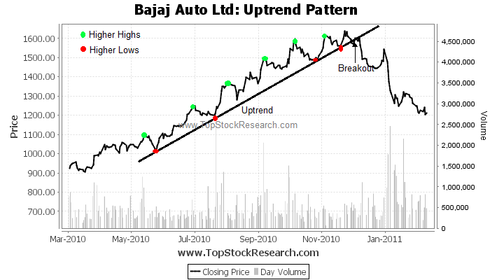

## Table of Contents

## What is an uptrend in technical analysis?

An uptrend in technical analysis is when the price of something, like a stock or a currency, keeps going up over time. You can see an uptrend on a chart when the price makes higher highs and higher lows. This means that each time the price goes up, it reaches a higher point than before, and each time it goes down, it doesn't go as low as the last time.

People who study charts and look for uptrends often use them to decide when to buy and sell. If they see an uptrend, they might think it's a good time to buy because they believe the price will keep going up. They might keep their investment until they see signs that the uptrend is ending, like when the price starts making lower highs and lower lows, which could mean the trend is changing to a downtrend.

## How can you identify an uptrend on a price chart?

To spot an uptrend on a price chart, you need to look for a pattern where the price keeps going higher over time. This means you'll see the price making what we call "higher highs" and "higher lows." A higher high is when the price reaches a new peak that's higher than the last peak. A higher low happens when the price dips but doesn't go as low as it did the last time it dipped. If you see this pattern happening again and again, it's a good sign that you're looking at an uptrend.

Another way to help identify an uptrend is by drawing trendlines. You can draw a line that connects the higher lows on the chart. If this line slopes upward, it confirms that the price is in an uptrend. People often use this method because it makes the pattern easier to see. Remember, the more times the price touches this trendline without breaking below it, the stronger the uptrend is likely to be.

## What are the basic tools used to confirm an uptrend?

To confirm an uptrend, people often use moving averages. A moving average is a line on the chart that smooths out price changes over time. If the price stays above a moving average, like the 50-day or 200-day moving average, it can show that the uptrend is strong. When the shorter-term moving average (like the 50-day) crosses above the longer-term moving average (like the 200-day), it's called a "golden cross," which many people see as a strong sign of an uptrend.

Another tool is the Relative Strength Index (RSI). The RSI measures how fast and how strong price changes are happening. It's shown as a number between 0 and 100. If the RSI stays above 50 and keeps going up, it can help confirm that the uptrend is still going strong. When the RSI is over 70, it might mean the price is getting too high too fast, but as long as it stays above 50, it supports the idea of an uptrend.

## What are some common trading strategies for capitalizing on an uptrend?

One common strategy for making money during an uptrend is called "buying the dips." This means you wait for the price to go down a bit and then buy it, expecting it to go back up. You can spot these dips by looking for times when the price pulls back but stays above the trendline or moving average. Once you buy, you can hold onto the investment until you see signs that the uptrend might be ending, like the price breaking below the trendline or the moving averages starting to slope downward.

Another strategy is using a "breakout" approach. This means you watch for the price to break above a certain level, like a past high or a resistance line. When the price breaks out and keeps going up, you buy it, hoping the uptrend will continue. To make this work, you might set a stop-loss order just below the breakout point to limit your risk if the price suddenly goes back down. Both of these strategies rely on carefully watching the price and using tools like trendlines and moving averages to make smart choices about when to buy and sell.

## How do moving averages help in identifying and trading uptrends?

Moving averages are really helpful for spotting and trading uptrends because they smooth out the ups and downs of the price, making it easier to see the overall trend. When you look at a chart, you can use a moving average to see if the price is staying above it. For example, if the price stays above the 50-day moving average, it's a sign that the uptrend might be strong. If the shorter-term moving average, like the 50-day, moves above the longer-term one, like the 200-day, it's called a "golden cross." This is a strong sign that the uptrend is getting stronger, and many traders see it as a good time to buy.

Traders often use moving averages to decide when to buy and sell during an uptrend. If you're using the "buying the dips" strategy, you might wait for the price to dip but stay above the moving average before you buy. This way, you're buying when the price is lower but still in the uptrend. When it comes time to sell, you might look for the price to start falling below the moving average, which could mean the uptrend is weakening. By using moving averages, traders can make more informed decisions about when to get into and out of trades, helping them make the most of an uptrend.

## What role do trendlines play in an uptrend analysis?

Trendlines are really important when you're trying to figure out if a price is in an uptrend. They help you see the pattern more clearly by drawing a line that connects the points where the price dips but doesn't go as low as before. These points are called "higher lows." If you draw a line that goes up and touches these higher lows, and the price keeps staying above this line, it shows that the uptrend is strong. The more times the price touches this trendline without breaking below it, the more confident you can be that the uptrend will keep going.

When you're trading, trendlines can help you decide when to buy and sell. If you see the price dip to the trendline but then start going up again, that could be a good time to buy. This is called "buying the dips." You're waiting for the price to come down to the trendline, which is still part of the uptrend, and then buying it, hoping it will keep going up. On the other hand, if the price breaks below the trendline, it might be a sign that the uptrend is ending. That could be a good time to sell or at least be careful because the trend might be changing.

## Can you explain the concept of support and resistance in the context of an uptrend?

In an uptrend, support and resistance are like invisible lines on a chart that help traders understand where the price might go next. Support is a level where the price tends to stop falling and start going up again. It's like a floor that the price bounces off of. In an uptrend, the support levels are usually getting higher because each time the price dips, it doesn't go as low as it did before. Traders look for these support levels to decide when it might be a good time to buy, hoping the price will bounce back up.

Resistance, on the other hand, is a level where the price tends to stop going up and start going down. It's like a ceiling that the price can't break through easily. In an uptrend, when the price reaches a new high, that high becomes a new resistance level. If the price keeps breaking through these resistance levels and making new highs, it shows that the uptrend is strong. Traders watch these resistance levels to see if the price can keep going up, which might be a good time to stay in their trade, or if the price can't break through, which might be a sign to sell or be careful.

## How do volume indicators enhance the reliability of an uptrend?

Volume indicators can make an uptrend seem more reliable by showing how many people are buying and selling. When the price goes up during an uptrend and the volume is high, it means a lot of people are interested in buying. This can make the uptrend seem stronger because more people believe the price will keep going up. On the other hand, if the price goes up but the volume is low, it might mean fewer people are interested, and the uptrend might not be as strong as it looks.

Traders often look at volume to confirm what they see on the price chart. For example, if the price breaks through a resistance level with high volume, it's a good sign that the uptrend is strong and likely to continue. But if the price breaks through with low volume, traders might be more cautious because it could mean the uptrend is running out of steam. By watching volume, traders can feel more confident about their decisions to buy or sell during an uptrend.

## What are some advanced technical indicators used to predict the continuation or reversal of an uptrend?

One advanced indicator that traders use to predict if an uptrend will keep going or turn around is the Moving Average Convergence Divergence (MACD). The MACD looks at the difference between two moving averages and helps show the strength and direction of a trend. If the MACD line crosses above the signal line and stays there, it's a sign that the uptrend might keep going strong. But if the MACD line starts to cross below the signal line, it could mean the uptrend is getting weaker and might reverse.

Another useful indicator is the Fibonacci retracement. This tool helps traders find levels where the price might stop falling and start going up again during an uptrend. You draw lines at certain percentages (like 38.2%, 50%, and 61.8%) from the start to the end of a recent price move. If the price bounces back up from one of these levels, it could mean the uptrend will keep going. But if the price keeps falling past these levels, it might be a sign that the uptrend is over and the price could start going down.

The Relative Strength Index (RSI) is also helpful for predicting if an uptrend will continue or reverse. The RSI measures how fast and how strong price changes are happening, and it's shown as a number between 0 and 100. If the RSI stays above 50 and keeps going up, it can help confirm that the uptrend is still strong. But if the RSI starts to go down and falls below 50, it might mean the uptrend is losing strength and could reverse soon.

## How can traders manage risk when trading during an uptrend?

When trading during an uptrend, one of the best ways to manage risk is by using stop-loss orders. A stop-loss order is like a safety net that automatically sells your investment if the price falls to a certain level. This helps limit how much money you could lose if the uptrend suddenly turns into a downtrend. For example, if you bought a stock during an uptrend, you might set a stop-loss just below the trendline or the most recent low. That way, if the price breaks the trendline, your stop-loss will kick in and sell the stock before you lose too much money.

Another way to manage risk is by not putting all your money into one trade. Instead, you can spread your money across different investments. This is called diversification. If one investment goes down, the others might still go up, which can help balance out your losses. Also, it's smart to only invest money you can afford to lose. That way, if the uptrend reverses and you lose money, it won't hurt your finances too much. By using these strategies, you can enjoy the benefits of an uptrend while keeping your risk under control.

## Can you provide real-life examples of successful trades during an uptrend?

One real-life example of a successful trade during an uptrend happened with Apple Inc. (AAPL) in early 2020. After the stock hit a low in March due to the start of the global health crisis, it started to climb back up. A trader who noticed the uptrend could have bought the stock when it was around $50 per share. They might have used a moving average, like the 50-day, to confirm the uptrend. As the stock kept making higher highs and higher lows, the trader held onto it. By the end of the year, the stock reached over $130 per share. The trader could have sold at this point, making a big profit from the uptrend.

Another example is with Tesla Inc. (TSLA) in 2020. The stock was already in an uptrend when a trader decided to buy in around $200 per share in January. They used a trendline to see that the stock was making higher highs and higher lows. The trader also watched the volume, which was high during the uptrend, showing strong interest from other buyers. By the end of the year, Tesla's stock price had soared to over $700 per share. The trader could have sold at this point, taking advantage of the strong uptrend and making a significant profit.

## What are the psychological factors traders should consider when trading an uptrend?

When trading an uptrend, one important psychological factor to consider is fear of missing out, or FOMO. When you see a stock's price going up and up, it's easy to feel like you need to jump in right away or you'll miss out on the gains. This can make you buy at a high price, which might not be the best decision. It's important to stick to your trading plan and not let FOMO push you into making quick choices you might regret later.

Another psychological factor is overconfidence. When you've made some good trades during an uptrend, you might start to feel like you can't lose. This can make you take bigger risks or ignore warning signs that the uptrend might be ending. It's important to stay humble and remember that even the strongest uptrends can reverse. Keeping a clear head and sticking to your strategy can help you avoid the pitfalls of overconfidence.

## What are the technical analysis tools used for uptrend trading?

Technical analysis plays a crucial role in identifying and capitalizing on uptrends in financial markets. Traders rely on a range of indicators and tools to assess market conditions and make informed decisions. A fundamental aspect of technical analysis is understanding price trends and patterns, which are instrumental in uptrend trading.

### Moving Averages: Simple and Exponential

Moving averages are among the most widely used technical indicators for detecting trends. They smooth out price data to identify the direction of a trend by filtering out short-term fluctuations.

1. **Simple Moving Average (SMA):** The SMA is calculated by taking the arithmetic mean of a given set of prices (typically closing prices) over a specified number of periods. It provides a clear trend direction.
$$
   \text{SMA} = \frac{P_1 + P_2 + \ldots + P_n}{n}

$$

   where $P_1, P_2, \ldots, P_n$ are the closing prices for $n$ periods.

2. **Exponential Moving Average (EMA):** Unlike the SMA, the EMA gives more weight to recent prices, making it more responsive to new information. The EMA is often favored for its ability to react more quickly to price changes.
$$
   \text{EMA}_\text{today} = (\text{Price}_\text{today} \times \alpha) + (\text{EMA}_\text{yesterday} \times (1-\alpha))

$$

   where $\alpha$ is the smoothing factor, calculated as $\alpha = \frac{2}{n+1}$.

Traders use crossovers of short-term and long-term moving averages to signal potential buy or sell opportunities. For instance, a common strategy involves a short-term EMA crossing above a long-term SMA, indicating an emerging uptrend.

### Relative Strength Index (RSI)

The Relative Strength Index (RSI) is a momentum oscillator that measures the speed and change of price movements, developed to gauge the strength of an uptrend. It oscillates between 0 and 100 and is typically used to identify overbought or oversold conditions.

The RSI is calculated as follows:

$$
\text{RSI} = 100 - \left(\frac{100}{1 + \text{RS}}\right)
$$

where $\text{RS} = \frac{\text{average gain over } n \text{ periods}}{\text{average loss over } n \text{ periods}}$.

An RSI value above 70 is generally considered overbought, suggesting a potential pullback, while a value below 30 indicates oversold conditions, pointing to a possible price rise.

### Trend Lines and Channel Patterns

Trend lines are essential tools for visualizing uptrends. A trend line is drawn by connecting a series of higher lows in an uptrend, creating a support level. They help traders identify price trends and potential reversal points.

Channel patterns, formed by drawing two parallel trend lines, encapsulate price movements. The upper trend line acts as resistance, while the lower line serves as support. Price movement within these channels can indicate strong trends.

### Case Studies and Chart Examples

Consider the following Python example to visualize moving averages and RSI on a stock price chart using libraries such as `matplotlib` and `pandas`:

```python
import pandas as pd
import matplotlib.pyplot as plt

# Sample data loading
data = pd.read_csv('stock_prices.csv', parse_dates=['Date'], index_col='Date')

# Calculate moving averages
data['SMA'] = data['Close'].rolling(window=50).mean()
data['EMA'] = data['Close'].ewm(span=50, adjust=False).mean()

# Calculate RSI
delta = data['Close'].diff()
gain = (delta.where(delta > 0, 0)).rolling(window=14).mean()
loss = (-delta.where(delta < 0, 0)).rolling(window=14).mean()
data['RS'] = gain / loss
data['RSI'] = 100 - (100 / (1 + data['RS']))

# Plotting
plt.figure(figsize=(14, 7))
plt.plot(data.index, data['Close'], label='Close Price')
plt.plot(data.index, data['SMA'], label='SMA', linestyle='--')
plt.plot(data.index, data['EMA'], label='EMA', linestyle=':')
plt.title('Stock Price with Moving Averages and RSI')
plt.xlabel('Date')
plt.ylabel('Price')
plt.legend()
plt.show()
```

This code provides a foundational approach to applying technical indicators on historical stock data, illustrating how moving averages and the RSI are employed to discern uptrends and evaluate market momentum.

## References & Further Reading

[1]: Murphy, J. J. (1999). ["Technical Analysis of the Financial Markets."](https://archive.org/details/technicalanalysi0000murp) New York Institute of Finance.

[2]: Chan, E. P. (2013). ["Algorithmic Trading: Winning Strategies and Their Rationale."](https://github.com/ftvision/quant_trading_echan_book) Wiley.

[3]: Elder, A. (1993). ["Trading for a Living: Psychology, Trading Tactics, Money Management."](https://www.amazon.com/Trading-Living-Psychology-Tactics-Management/dp/0471592242) Wiley.

[4]: Lo, A. W., Mamaysky, H., & Wang, J. (2000). ["Foundations of Technical Analysis: Computational Algorithms, Statistical Inference, and Empirical Implementation."](https://www.nber.org/papers/w7613) The Journal of Finance, 55(4), 1705-1765.

[5]: Pring, M. J. (2002). ["Technical Analysis Explained: The Successful Investor's Guide to Spotting Investment Trends and Turning Points."](https://www.amazon.com/Technical-Analysis-Explained-Fifth-Successful/dp/0071825177) McGraw Hill.

[6]: Aronson, D. R. (2006). ["Evidence-Based Technical Analysis: Applying the Scientific Method and Statistical Inference to Trading Signals."](https://www.amazon.com/Evidence-Based-Technical-Analysis-Scientific-Statistical/dp/0470008741) Wiley.