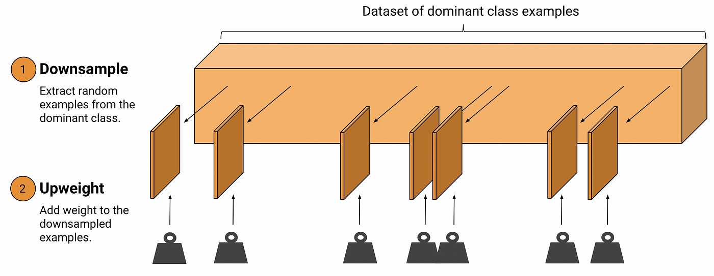

## Table of Contents

## What is upweighting in the context of machine learning?

Upweighting in machine learning is a technique used to give more importance to certain data points or samples during the training process. This is often done when some data points are more important or more difficult for the model to learn from. By increasing the weight of these samples, the model pays more attention to them, which can help improve the overall performance of the model. For example, if a model is struggling to correctly classify certain types of images, upweighting those images can help the model learn better from them.

In practice, upweighting can be implemented by adjusting the loss function. The loss function measures how well the model is doing, and by giving higher weights to certain samples, the model is encouraged to focus more on those samples. For instance, if a sample has a weight of 2, its contribution to the total loss will be doubled compared to a sample with a weight of 1. This can be represented mathematically as $$ \text{Loss} = \sum_{i=1}^n w_i \cdot \text{loss}_i $$ where $w_i$ is the weight of the $i$-th sample and $\text{loss}_i$ is the loss for that sample. By carefully choosing these weights, practitioners can guide the model to perform better on the data that matters most.

## Why is upweighting used in machine learning models?

Upweighting is used in machine learning models to make sure the model pays more attention to certain data points that are important or hard to learn from. Imagine you're teaching a child to recognize different animals. If the child keeps getting confused between cats and dogs, you might show them more pictures of cats and dogs to help them learn better. In the same way, upweighting helps the model focus more on the tricky or important data, which can make the model better at its job.

For example, if a model is having trouble identifying rare diseases in medical images, upweighting those images can help the model learn better from them. This is done by changing the loss function, which is like a scorecard that tells the model how well it's doing. If a certain image is upweighted, its score on the scorecard becomes more important. Mathematically, this can be shown as $$ \text{Loss} = \sum_{i=1}^n w_i \cdot \text{loss}_i $$ where $w_i$ is the weight of the $i$-th sample and $\text{loss}_i$ is the loss for that sample. By making some weights bigger, the model tries harder to get those samples right, which can lead to better overall performance.

## How does upweighting differ from downweighting?

Upweighting and downweighting are two sides of the same coin in [machine learning](/wiki/machine-learning). Upweighting means making some data points more important when training a model. Imagine you're learning to play a game and you keep making the same mistake. If someone tells you to focus more on that mistake, that's like upweighting. In machine learning, this is done by giving those data points a bigger weight in the loss function, which is like a scorecard for the model. If a data point has a higher weight, the model tries harder to get it right. Mathematically, this can be shown as $$ \text{Loss} = \sum_{i=1}^n w_i \cdot \text{loss}_i $$ where $w_i$ is the weight of the $i$-th sample and $\text{loss}_i$ is the loss for that sample. If $w_i$ is bigger, that sample's score on the scorecard matters more.

Downweighting, on the other hand, means making some data points less important during training. This is useful if some data points are too easy or not very important for the model to learn from. Going back to the game example, if you're really good at one part of the game, someone might tell you not to focus too much on it. In machine learning, downweighting is done by giving those data points a smaller weight in the loss function. If a data point has a lower weight, the model doesn't try as hard to get it right. Using the same formula as before, if $w_i$ is smaller, that sample's score on the scorecard matters less. Both upweighting and downweighting help the model learn better by focusing on what's most important.

## Can you explain a simple example of upweighting in a dataset?

Imagine you're teaching a computer to recognize different types of fruits. You have a dataset with pictures of apples, bananas, and strawberries. But the computer keeps getting strawberries wrong more often than the other fruits. To help the computer learn better, you decide to make the strawberry pictures more important during training. This is called upweighting. You do this by telling the computer to pay more attention to the strawberries by giving them a higher weight in the loss function, which is like a scorecard that tells the computer how well it's doing.

For example, if you have 100 pictures of apples, 100 pictures of bananas, and only 20 pictures of strawberries, you might decide to upweight the strawberries so their importance is the same as the other fruits. You can do this by setting the weight of each strawberry picture to 5, while keeping the weights of apples and bananas at 1. Mathematically, this can be shown as $$ \text{Loss} = \sum_{i=1}^n w_i \cdot \text{loss}_i $$ where $w_i$ is the weight of the $i$-th sample and $\text{loss}_i$ is the loss for that sample. By making the weight of strawberries higher, the computer tries harder to get strawberries right, which can help it learn better overall.

## What are the common scenarios where upweighting is applied?

Upweighting is often used when some data points are more important or harder for a machine learning model to learn from. Imagine you're teaching a computer to recognize different animals, but it keeps getting confused between tigers and lions. To help the computer learn better, you might show it more pictures of tigers and lions by making those pictures more important during training. This is like telling the computer to pay extra attention to these tricky animals. By doing this, the computer can improve its ability to tell tigers and lions apart, making it better at recognizing animals overall.

Another common scenario is when dealing with imbalanced datasets, where some classes have many more examples than others. For example, if you're trying to detect a rare disease in medical images, you might have far fewer images of the disease than of healthy cases. To help the model learn better from the rare disease images, you can upweight those images. This means giving them a higher weight in the loss function, which is like a scorecard that tells the model how well it's doing. Mathematically, this can be shown as $$ \text{Loss} = \sum_{i=1}^n w_i \cdot \text{loss}_i $$ where $w_i$ is the weight of the $i$-th sample and $\text{loss}_i$ is the loss for that sample. By making the weight of the rare disease images higher, the model tries harder to learn from them, which can lead to better overall performance in detecting the disease.

## How does upweighting affect the performance of a machine learning model?

Upweighting can improve the performance of a machine learning model by making it focus more on certain data points that are important or hard to learn from. Imagine you're learning to play a game, and you keep making the same mistake. If someone tells you to focus more on that mistake, you'll probably get better at the game. In the same way, when a model is struggling to recognize certain images, like rare diseases in medical scans, upweighting those images can help the model learn better from them. This is done by giving those images a higher weight in the loss function, which is like a scorecard that tells the model how well it's doing. Mathematically, this can be shown as $$ \text{Loss} = \sum_{i=1}^n w_i \cdot \text{loss}_i $$ where $w_i$ is the weight of the $i$-th sample and $\text{loss}_i$ is the loss for that sample. By making some weights bigger, the model tries harder to get those samples right, which can lead to better overall performance.

However, upweighting can also have some downsides. If you upweight too many data points or give them too much weight, the model might focus too much on those points and not learn well from the rest of the data. It's like if you only practiced one part of the game and ignored everything else. This can lead to overfitting, where the model becomes too good at recognizing the upweighted data but performs poorly on new, unseen data. So, it's important to use upweighting carefully and find the right balance to help the model learn well without overfitting.

## What are the potential risks or drawbacks of using upweighting?

Upweighting can sometimes cause a machine learning model to focus too much on certain data points, which can lead to overfitting. Overfitting is when a model becomes really good at recognizing the upweighted data but not so good at recognizing new, unseen data. Imagine you're learning to play a game and you practice one part of it a lot, but you don't practice the other parts. You might become really good at that one part, but you'll struggle with the rest of the game. In the same way, if a model focuses too much on upweighted data, it might not learn well from the rest of the data, making it perform poorly in real-world situations.

Another risk of upweighting is that it can make the training process more complicated. When you upweight certain data points, you need to carefully choose the weights to make sure the model learns well without overfitting. This can be tricky and might require a lot of trial and error. If the weights are not chosen well, the model might not improve its performance, or it might even get worse. So, while upweighting can help a model learn better from important or hard-to-learn data, it needs to be used carefully to avoid these potential drawbacks.

## How can upweighting be implemented in popular machine learning frameworks like TensorFlow or PyTorch?

In TensorFlow, upweighting can be implemented by adjusting the sample weights during the model's training process. You can pass a `sample_weight` parameter to the `fit` method of your model. For example, if you have a dataset where some samples are more important, you can create a list of weights where the important samples have higher values. When you call `fit`, TensorFlow will use these weights to calculate the loss, making the model focus more on the upweighted samples. Mathematically, this can be shown as $$ \text{Loss} = \sum_{i=1}^n w_i \cdot \text{loss}_i $$ where $w_i$ is the weight of the $i$-th sample and $\text{loss}_i$ is the loss for that sample. Here's a simple example of how you might do this in TensorFlow:

```python
import tensorflow as tf

# Assume X_train, y_train, and sample_weights are your data and weights
model = tf.keras.Sequential([...])  # Your model architecture
model.compile(optimizer='adam', loss='categorical_crossentropy', metrics=['accuracy'])
model.fit(X_train, y_train, sample_weight=sample_weights, epochs=10)
```

In PyTorch, upweighting can be implemented by modifying the loss calculation directly. You can create a tensor of weights that correspond to your samples and multiply it with the loss before backpropagating. For instance, if you have a dataset with some samples that need to be upweighted, you can create a tensor of weights and use it in your training loop. When you calculate the loss, you'll multiply it by these weights to make the model pay more attention to the upweighted samples. The formula for the loss would be the same as in TensorFlow: $$ \text{Loss} = \sum_{i=1}^n w_i \cdot \text{loss}_i $$. Here's a simple example of how you might implement upweighting in PyTorch:

```python
import torch
import torch.nn as nn

# Assume X_train, y_train, and sample_weights are your data and weights
model = nn.Sequential([...])  # Your model architecture
criterion = nn.CrossEntropyLoss(reduction='none')  # Use 'none' to get per-sample losses
optimizer = torch.optim.Adam(model.parameters())

for epoch in range(10):
    optimizer.zero_grad()
    outputs = model(X_train)
    losses = criterion(outputs, y_train)
    weighted_losses = losses * sample_weights
    loss = weighted_losses.mean()
    loss.backward()
    optimizer.step()
```

## What are the best practices for determining which samples to upweight?

When deciding which samples to upweight, it's important to look at the data and see which parts are hard for the model to learn. If your model is having trouble with certain types of data, like rare diseases in medical images, you might want to upweight those samples. You can do this by checking the model's performance on different parts of the data. If the model keeps getting some samples wrong, those are good candidates for upweighting. You can also look at the distribution of your data. If some classes are underrepresented, like in an imbalanced dataset, upweighting those samples can help the model learn better from them.

Another way to decide which samples to upweight is by using a validation set. You can train your model without upweighting, then see which samples it struggles with on the validation set. Those samples can then be upweighted in the next round of training. It's also a good idea to experiment with different weights to see what works best. You might start with small weights and increase them slowly, checking the model's performance each time. This way, you can find the right balance to help the model learn without overfitting. Mathematically, this can be shown as $$ \text{Loss} = \sum_{i=1}^n w_i \cdot \text{loss}_i $$ where $w_i$ is the weight of the $i$-th sample and $\text{loss}_i$ is the loss for that sample. By carefully choosing these weights, you can guide the model to focus on the most important data.

## How does upweighting interact with other techniques like oversampling or SMOTE?

Upweighting, oversampling, and SMOTE are all techniques used to help a machine learning model learn better from data, especially when the data is imbalanced. Upweighting means making certain data points more important during training. It's like telling the model to pay more attention to these points. Oversampling, on the other hand, means adding more copies of the underrepresented data to the dataset. SMOTE (Synthetic Minority Over-sampling Technique) is a bit different; it creates new, synthetic examples of the minority class to balance the dataset. While upweighting changes how the model learns from the data, oversampling and SMOTE change the data itself.

These techniques can be used together to improve a model's performance. For example, you might use SMOTE to create more examples of a rare disease in medical images, then upweight those new examples to make sure the model focuses on them. This can help the model learn better from the minority class without overfitting. Mathematically, upweighting can be shown as $$ \text{Loss} = \sum_{i=1}^n w_i \cdot \text{loss}_i $$ where $w_i$ is the weight of the $i$-th sample and $\text{loss}_i$ is the loss for that sample. By combining upweighting with oversampling or SMOTE, you can guide the model to focus on the most important data while also making sure there's enough of it to learn from.

## Can upweighting be used in conjunction with ensemble methods, and if so, how?

Upweighting can be used with ensemble methods to improve the overall performance of a machine learning model. Ensemble methods combine the predictions of multiple models to make better predictions. When you use upweighting with an ensemble, you can make each model in the ensemble focus more on certain data points that are hard to learn or important. For example, if you're using a random forest, you can upweight the samples that the individual trees struggle with. This can help each tree in the forest learn better from those samples, leading to a more accurate ensemble.

To implement upweighting in an ensemble, you would need to adjust the sample weights for each model in the ensemble. For instance, in a bagging ensemble where you train multiple models on different subsets of the data, you can pass the sample weights to each model during training. Mathematically, this can be shown as $$ \text{Loss} = \sum_{i=1}^n w_i \cdot \text{loss}_i $$ where $w_i$ is the weight of the $i$-th sample and $\text{loss}_i$ is the loss for that sample. By doing this, each model in the ensemble will try harder to get the upweighted samples right, which can lead to better overall performance when the models are combined.

## What advanced techniques can be used to dynamically adjust upweighting during model training?

One advanced technique for dynamically adjusting upweighting during model training is called adaptive weighting. This technique involves changing the weights of samples based on how well the model is doing as it trains. For example, if the model keeps getting certain samples wrong, their weights can be increased to make the model focus more on them. This can help the model learn better from the tricky data without overfitting. Mathematically, this can be shown as $$ \text{Loss} = \sum_{i=1}^n w_i \cdot \text{loss}_i $$ where $w_i$ is the weight of the $i$-th sample and can change during training based on the model's performance.

Another technique is called curriculum learning, which involves starting with easier samples and gradually introducing harder ones. In this approach, you can upweight the harder samples as they are introduced to help the model learn from them. This can be done by setting the weights of the harder samples higher as the training progresses. By doing this, the model can learn the basics first and then focus on the more challenging data, leading to better overall performance. Both of these techniques help the model learn more effectively by dynamically adjusting the importance of different samples during training.