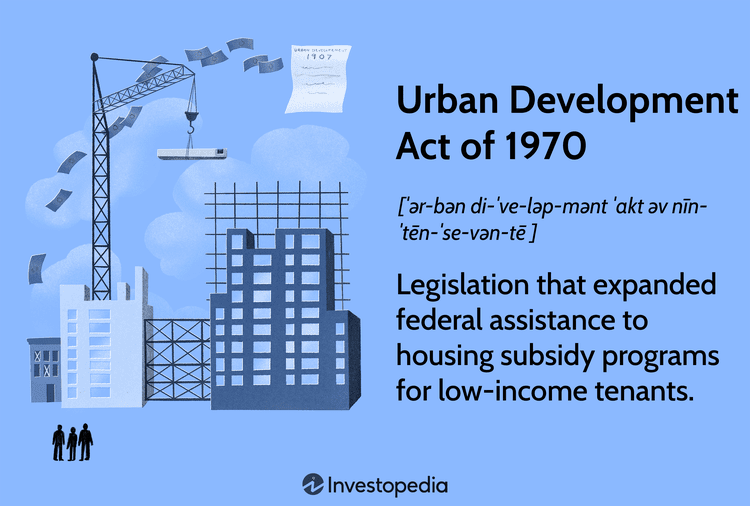

The Urban Development Act of 1970 represents a pivotal shift in American housing policy, addressing critical urban challenges that had emerged by the late 1960s. As cities faced rampant urbanization, issues such as overcrowding and decaying infrastructure became increasingly prominent, necessitating targeted legislative action. The Act aimed to promote growth and resilience in urban areas, with a distinct focus on supporting low-income communities. This legislative effort was not only about improving immediate housing conditions but also about fostering sustainable urban communities for the future.

By prioritizing federal assistance and providing housing subsidies, the Urban Development Act sought to make decent housing attainable for lower-income families. The Act's emphasis on urban renewal projects was instrumental in revitalizing blighted neighborhoods, thereby stimulating economic growth and improving quality of life. Within this legislative framework exists a less obvious intersection with contemporary algorithmic trading strategies. While traditionally unrelated, the fields of urban development and algorithmic trading can indirectly influence each other, particularly through their impact on real estate markets and investment patterns.



Understanding the implications and outcomes of the Urban Development Act provides valuable insights into the interconnectedness of housing policy and modern financial mechanisms. The exploration of these entwined fields highlights the potential for leveraging algorithmic strategies to optimize development outcomes, ensuring that future policies can adapt to evolving urban and economic landscapes.

## Table of Contents

## Historical Context of the Urban Development Act

The 1960s in the United States were marked by significant urban challenges, characterized by a swift pace of urbanization that resulted in various societal and infrastructure-related issues. Cities, growing at an unprecedented rate, struggled to accommodate the influx of people seeking economic opportunities and better living conditions. This rapid urban growth often led to overcrowding, which was compounded by aging and deteriorating infrastructure that could not effectively support the burgeoning population. Public services, such as transportation and sanitation, faced increasing strain, contributing to a decline in the quality of urban life.

During this era, civil rights movements across the U.S. brought considerable attention to the persistent and pronounced socioeconomic disparities, especially in urban settings. Activists and community leaders highlighted issues such as segregation, inadequate housing, and lack of access to essential services, which predominantly affected minority and low-income populations. These movements played a crucial role in raising awareness and rallying support for addressing these inequalities, necessitating legislative intervention to ensure equitable urban development.

The Urban Development Act of 1970 emerged as a strategic response by the federal government to tackle these pressing urban challenges. Recognizing the link between economic disparity and lack of infrastructure, the Act aimed to foster sustainable urban environments by promoting the renewal and revitalization of deteriorating areas. It sought to create a more balanced approach to urban growth, addressing the immediate needs for improved housing and infrastructure while laying the groundwork for long-term community development. The Act signified a commitment to mitigating the adverse effects of urbanization through comprehensive federal engagement, reflecting a broader trend toward active governmental participation in shaping the socioeconomic landscape of American cities.

## Key Provisions of the Urban Development Act

The Urban Development Act of 1970 was comprehensive in scope, addressing various critical aspects of urban housing and community development. At its core, the Act emphasized federal assistance aimed at tackling housing inadequacies and supporting the growth of communities, particularly those in economically disadvantaged areas. This federal assistance manifested primarily through financial support, enabling state and local governments to implement housing and community development programs effectively. 

One of the significant provisions of the Act was the introduction of housing subsidies designed to assist lower-income families in securing adequate housing. These subsidies played a crucial role in making housing more accessible and affordable for economically disadvantaged groups. By lowering the financial burden on these families, the Act sought to improve living conditions and promote social equity. Housing subsidies under this act often took the form of direct housing assistance or vouchers, which helped bridge the gap between household income and the cost of renting or owning a home.

The Urban Development Act also allocated resources for urban renewal projects, with a particular focus on revitalizing blighted areas. These projects aimed at improving the quality of life in urban settings by addressing urban decay, which was a pressing issue at the time. The act provided financial incentives and support to municipalities for the renovation and rehabilitation of deteriorating neighborhoods. This process often involved redeveloping infrastructure, improving public amenities, and attracting private investment, all of which contributed to economic growth and increased property values in these areas. By targeting blighted regions, the Act intended not only to enhance physical environments but also to stimulate local economies and foster community development.

Overall, the key provisions of the Urban Development Act of 1970 laid a foundation for more sustained community and housing development efforts, with a focus on federal assistance, housing affordability, and urban renewal. These initiatives were instrumental in addressing some of the prevalent issues of the time, promoting healthier urban environments, and paving the way for future urban policy advancements.

## Impact and Legacy of the Act

The Urban Development Act of 1970 played a pivotal role in reshaping housing conditions in the United States, notably improving the lives of low-income families through the introduction of housing subsidies. These subsidies enabled a substantial number of low-income households to afford decent housing, reducing the financial burden associated with living in urban areas. By effectively implementing these financial aids, many families could access improved housing standards, which contributed positively to their quality of life and financial stability.

Moreover, the Act spurred significant revitalization efforts across various urban areas. These endeavors were central to transforming neighborhoods that had experienced decline, fostering an environment conducive to economic growth and stability. The injection of federal funds and resources catalyzed urban renewal projects, which included renovating infrastructure and developing new housing schemes. This transformation not only enhanced the aesthetic and functional appeal of neighborhoods but also stimulated local economies by attracting businesses and creating jobs. The economic revitalization can be quantified through increased property values and higher levels of entrepreneurial activities within these renewed urban areas.

Furthermore, the Urban Development Act set a critical precedent for federal involvement in urban planning and development, shaping the trajectory of future housing and urban policies. By laying down a framework for federal participation in urban issues, the Act influenced subsequent legislation, encouraging a consistent approach to addressing urban challenges at a national level. This federal engagement underscored the importance of coordinated efforts between government levels to manage urban growth and enhance living conditions effectively. The Act's influence is evident in later policy developments that continued to address urban inequality and infrastructure improvements, demonstrating its enduring legacy in American urban policy.

## Algorithmic Trading and Urban Development

Algorithmic trading, a technological advancement in the financial sector, utilizes computer algorithms to execute stock trading decisions with optimal speed and efficiency. This method has revolutionized trading by minimizing human intervention and maximizing the use of data, patterns, and predictive analytics. The implications of [algorithmic trading](/wiki/algorithmic-trading) extend beyond stock markets, with significant potential to influence urban development and real estate investments.

Urban development traditionally involves long-term planning and significant investment. These investments are primarily driven by both public policy and private sector interests. Algorithmic trading can intersect with these sectors by influencing real estate markets through more precise and timely investment strategies. Algorithms can be designed to analyze a wide array of data, including economic indicators, demographic shifts, and urbanization trends, to inform real estate investment decisions.

Investors in real estate markets can employ algorithms to evaluate market conditions rapidly, identifying lucrative opportunities for development or redevelopment projects in urban areas. For example, algorithms can process historical real estate data, zoning laws, and population density metrics to predict future housing demand. Such predictive capabilities could lead to increased investment in underdeveloped areas, potentially accelerating urban renewal and infrastructure improvements.

Moreover, algorithmic trading can affect the [volume](/wiki/volume-trading-strategy) and velocity of capital flows into specific urban regions. By automating decision-making processes, algorithms can dynamically adjust investment portfolios in response to real-time market data. This agility allows for more strategic allocation of resources, potentially impacting housing policies by directing funds toward areas of high growth potential or in need of revitalization.

In a practical illustration, consider the Python code for a simple algorithmic trading strategy based on moving averages:

```python
def moving_average(prices, window):
    return sum(prices[-window:]) / window

def trading_signal(prices, short_window, long_window):
    short_ma = moving_average(prices, short_window)
    long_ma = moving_average(prices, long_window)
    if short_ma > long_ma:
        return "Buy"
    elif short_ma < long_ma:
        return "Sell"
    else:
        return "Hold"

prices = [100, 102, 105, 103, 107, 110]
signal = trading_signal(prices, short_window=3, long_window=5)
print(signal)
```

This code calculates simple moving averages and generates trade signals based on their interaction. Although simplistic, such algorithms can be scaled to accommodate complex datasets and decision criteria pertinent to real estate markets.

As algorithmic trading strategies evolve, their role in shaping investment patterns and urban development will likely grow. Consequently, this could necessitate new regulatory frameworks and urban policies that align with these advancements, ensuring that investment strategies contribute positively to sustainable urban growth and housing development.

## Conclusion

The Urban Development Act of 1970 was instrumental in reshaping urban housing and policy across the United States, addressing long-standing issues in urban areas and offering a framework for future developments. It laid the groundwork for federal involvement in tackling housing shortages, infrastructural decay, and socio-economic disparities, thereby supporting urban growth and regeneration. The Act’s success in these areas has had a lasting impact, setting precedents that continue to influence urban policy today.

However, as we move further into a technology-driven era, the foundational principles of the Urban Development Act have the potential to intersect with modern innovations like algorithmic trading. The power of algorithmic trading lies in its ability to process vast amounts of data and execute trades at unprecedented speeds, which can significantly alter investment patterns, including those related to real estate markets. By strategically directing investment inflows into urban areas, these algorithms could potentially reshape urban development outcomes, impacting housing supply, affordability, and economic growth.

Looking ahead, future urban policies could greatly benefit from understanding how these modern financial mechanisms intersect with traditional urban development strategies. By leveraging insights from algorithmic trading, policymakers can better anticipate market trends, optimize development plans, and ensure that initiatives are both economically viable and socially equitable. Integrating these advanced financial strategies into urban policy not only enhances the potential for sustainable development but also aligns with the evolving economic landscape, offering promising new avenues for revitalizing urban communities.

## References & Further Reading

[1]: "The New Urban History: Quantitative Explorations by American Historians" by Leo F. Schnore (University of Chicago Press, 1975)

[2]: Caraley, Demetrios. ["The Politics of Urban Development."](https://books.google.com/books/about/The_Politics_of_urban_development.html?id=r6xPAAAAMAAJ) Sage Publications, 1976.

[3]: Schill, Michael H., and Richard P. Nathan. ["Revitalizing America's Cities: Neighborhood Reinvestment and Displacement."](https://archive.org/details/revitalizingamer0000schi) State University of New York Press, 1983.

[4]: White, Lawrence J. ["Housing Policy in the United States: An Introduction."](https://www.amazon.com/Housing-Policy-United-States-Schwartz/dp/0367563916) The Urban Institute, 1981.

[5]: ["The High-Frequency Game Changer: How Automated Trading Strategies Have Revolutionized the Markets"](https://www.amazon.com/High-Frequency-Game-Changer-Revolutionized/dp/0470770384) by Paul Zubulake and Sara Farley

[6]: Shiller, Robert J. ["Irrational Exuberance."](https://www.amazon.com/Irrational-Exuberance-3rd-Robert-Shiller/dp/0691166269) Princeton University Press, 2015.

[7]: ["Urban Economics"](https://en.wikipedia.org/wiki/Urban_economics) by Arthur O'Sullivan

[8]: ["Homeownership and America's Financial Underclass"](https://www.cambridge.org/core/books/homeownership-and-americas-financial-underclass/6A57485CB703736ED229098E11A9E16E) by Mechele Dickerson

[9]: ["The Triumph of the City"](https://en.wikipedia.org/wiki/Triumph_of_the_City) by Edward Glaeser