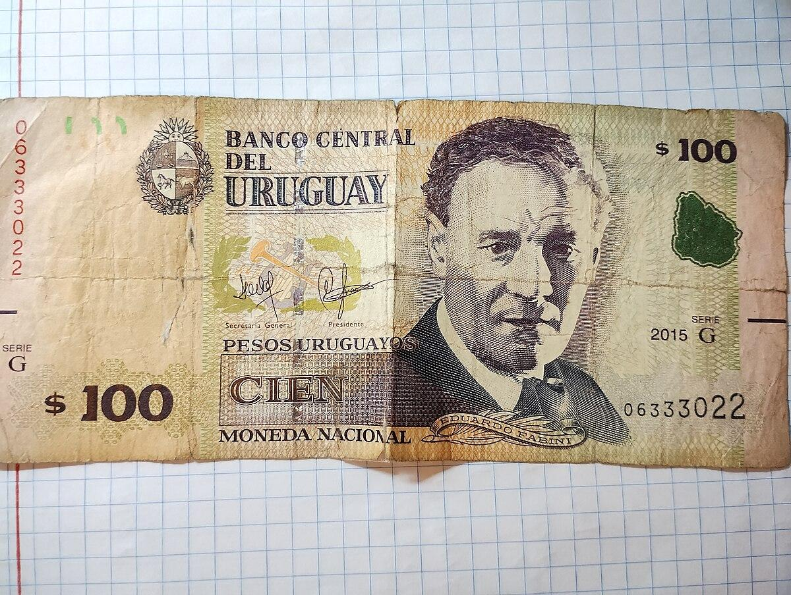

## Table of Contents

## What is the Uruguayan Peso?

The Uruguayan Peso is the official currency of Uruguay, a country in South America. It is used every day by people in Uruguay to buy things like food, clothes, and other goods. The symbol for the Uruguayan Peso is "$U" or sometimes just "UYU". 

The Uruguayan Peso has been around since 1993, but Uruguay has had different versions of its currency over the years. Before 1993, they used a different peso. The Central Bank of Uruguay is in charge of the Uruguayan Peso. They make sure there is enough money and that it stays valuable.

## How is the Uruguayan Peso abbreviated?

The Uruguayan Peso is shortened to "$U" or "UYU". These abbreviations help people quickly recognize the currency when they see it written down.

You might see "$U" used more often in Uruguay itself. "UYU" is used more when people talk about the currency in other countries or on the internet. Both mean the same thing, the money used in Uruguay.

## What is the history of the Uruguayan Peso?

The Uruguayan Peso has a long history that goes back to the 19th century. The first Uruguayan Peso was introduced in 1861, replacing the Spanish real. Over the years, Uruguay went through many changes with its money. In 1896, they introduced a new peso called the "peso fuerte," which means "strong peso." This was used until 1975 when they switched to the "nuevo peso," or "new peso." The nuevo peso was used until 1993.

In 1993, Uruguay introduced the current Uruguayan Peso, which is still used today. This change happened because the old money was losing value too quickly. The new peso was meant to be more stable and easier to use. The Central Bank of Uruguay is in charge of making sure the Uruguayan Peso stays strong and useful for people in Uruguay. Since 1993, the Uruguayan Peso has been the main money used in the country for buying things and saving.

## What are the different denominations of Uruguayan Peso banknotes and coins?

The Uruguayan Peso comes in different banknotes and coins. The banknotes are in amounts of 20, 50, 100, 200, 500, 1000, and 2000 pesos. These banknotes have pictures of important people and places from Uruguay's history. They help people pay for things that cost more money.

The coins are smaller and come in 1, 2, 5, and 10 pesos. These coins are useful for buying things that cost less money. They have different sizes and shapes, which makes it easy to tell them apart. Both the banknotes and coins are used every day by people in Uruguay to buy things they need.

## How does the Uruguayan Peso compare to other South American currencies?

The Uruguayan Peso is one of many currencies used in South America. It is different from other South American currencies like the Brazilian Real, the Argentine Peso, and the Chilean Peso. Each country has its own money, and the value of the Uruguayan Peso can change compared to these other currencies. For example, sometimes the Uruguayan Peso might be worth more than the Argentine Peso, but less than the Brazilian Real.

The value of the Uruguayan Peso can go up or down depending on many things, like how well Uruguay's economy is doing or what is happening in the world. This is true for all South American currencies. People who travel or do business between these countries need to keep an eye on these changes. It helps them know how much their money is worth when they go to another country in South America.

## What is the current exchange rate of the Uruguayan Peso to the US Dollar?

The exchange rate between the Uruguayan Peso and the US Dollar changes every day. As of today, 1 US Dollar is worth about 38 Uruguayan Pesos. This means if you have 1 US Dollar, you can get around 38 Uruguayan Pesos in exchange.

This rate can go up or down depending on many things, like how well Uruguay's economy is doing or what is happening in the world. It's a good idea to check the latest exchange rate before you travel or do any money exchanges. You can find the most up-to-date rate on financial websites or at a bank.

## How has the value of the Uruguayan Peso changed over the past decade?

Over the past decade, the value of the Uruguayan Peso has gone through some changes. In 2013, 1 US Dollar was worth about 20 Uruguayan Pesos. By 2023, the value had changed so that 1 US Dollar was worth about 38 Uruguayan Pesos. This means the Uruguayan Peso has lost value compared to the US Dollar over the last ten years. The change in value can happen because of many things, like how well Uruguay's economy is doing or what is happening in the world.

These changes can affect people in Uruguay. When the Uruguayan Peso loses value, things that are bought from other countries, like cars or electronics, can become more expensive. This is because it takes more Uruguayan Pesos to buy the same amount of foreign currency. On the other hand, if someone in Uruguay is selling things to other countries, their products might become cheaper for people in other countries to buy, which could be good for business. Keeping an eye on these changes helps people understand how their money is doing compared to other currencies.

## What economic factors influence the value of the Uruguayan Peso?

The value of the Uruguayan Peso can change because of many things happening in Uruguay's economy. One big thing is how much stuff Uruguay is selling to other countries. If Uruguay is selling a lot, like meat or soybeans, it can make the Uruguayan Peso stronger. Another thing is how much money people in Uruguay are spending. If they are spending a lot, it can make the Uruguayan Peso weaker because there might be too much money floating around. Also, if the government is spending a lot of money, it can affect the value of the Uruguayan Peso.

Another important [factor](/wiki/factor-investing) is what is happening in the world. If other countries are doing well, it can help the Uruguayan Peso. For example, if the US Dollar is strong, it can make the Uruguayan Peso weaker because people might want to use US Dollars instead. Interest rates set by the Central Bank of Uruguay also play a big role. If the interest rates go up, it can make the Uruguayan Peso stronger because people might want to keep their money in Uruguay to get more interest. All these things together can make the Uruguayan Peso go up or down in value.

## How does inflation affect the Uruguayan Peso?

Inflation is when prices for things like food, clothes, and other stuff go up over time. When inflation happens in Uruguay, it can make the Uruguayan Peso worth less. This means people need more Uruguayan Pesos to buy the same things they used to buy with less money. If inflation is high, the value of the Uruguayan Peso can go down a lot, making it harder for people to afford things.

The Central Bank of Uruguay tries to keep inflation under control to help the Uruguayan Peso stay strong. They do this by changing interest rates or other money rules. If they can keep inflation low, the Uruguayan Peso can stay more stable, and people's money can buy more. But if inflation gets out of control, it can make the Uruguayan Peso lose value quickly, which can be tough for everyone in Uruguay.

## What are the monetary policies of the Central Bank of Uruguay regarding the Peso?

The Central Bank of Uruguay has different ways to take care of the Uruguayan Peso. One big thing they do is set interest rates. When they make interest rates higher, it can make people want to keep their money in Uruguay because they can earn more from it. This can help the Uruguayan Peso stay strong. They also watch how much money is in the country. If there's too much money, it can make the Uruguayan Peso weaker, so they try to keep the right amount.

Another thing the Central Bank does is control inflation. They want to keep prices from going up too fast because that can make the Uruguayan Peso lose value. They use different tools to do this, like changing how much money banks can lend out. By keeping inflation low, they help the Uruguayan Peso stay stable. All these actions together help make sure the Uruguayan Peso is good for people to use every day.

## How do international trade and foreign investment impact the Uruguayan Peso?

International trade and foreign investment can have a big effect on the Uruguayan Peso. When Uruguay sells a lot of things like meat or soybeans to other countries, it can make the Uruguayan Peso stronger. This is because other countries need to use their money to buy Uruguayan Pesos to pay for these things. If Uruguay is doing well in trade, more people want Uruguayan Pesos, which can make it worth more. On the other hand, if Uruguay is buying a lot from other countries, it can make the Uruguayan Peso weaker because Uruguay needs to use more Uruguayan Pesos to get other currencies.

Foreign investment also plays a big role. When people from other countries want to invest in Uruguay, like building factories or buying businesses, they need to use Uruguayan Pesos. This can make the Uruguayan Peso stronger because there's more demand for it. But if foreign investors start taking their money out of Uruguay, it can make the Uruguayan Peso weaker. The Central Bank of Uruguay watches these things closely to help keep the Uruguayan Peso stable and good for everyone to use.

## What are the future predictions for the Uruguayan Peso's stability and value?

People who study money think the Uruguayan Peso might stay pretty stable in the future. This is because Uruguay's economy is doing okay, and the Central Bank is working hard to keep things steady. They watch how much money is in the country and change interest rates to make sure the Uruguayan Peso doesn't lose value too fast. If Uruguay keeps selling a lot of things like meat and soybeans to other countries, it can help the Uruguayan Peso stay strong.

But, there are also things that could make the Uruguayan Peso weaker. If prices start going up a lot, which is called inflation, it can make the Uruguayan Peso lose value. Also, if people from other countries stop wanting to invest in Uruguay, it can hurt the Uruguayan Peso. The world can change a lot, and what happens in other countries can affect Uruguay too. So, while the Uruguayan Peso might stay stable, it's important to keep an eye on these things to see how it will do in the future.

## References & Further Reading

[1]: ["The Role of Uruguay in International Trade"](https://www.trade.gov/country-commercial-guides/uruguay-trade-barriers), UNCTAD Technical Paper, 2021.

[2]: Andersen, T. G., Bollerslev, T., & Diebold, F. X. (2007). [“Roughing It Up: Including Jump Components in the Measurement, Modeling, and Forecasting of Return Volatility.”](https://public.econ.duke.edu/~boller/Published_Papers/restat_07.pdf) The Review of Economics and Statistics.

[3]: Andersson, M., & Karlsson, G. (2007). ["The Effect of Algorithmic Trading Systems on Stock Liquidity"](https://www.scirp.org/reference/referencespapers?referenceid=1268894). Research Institute of Industrial Economics Working Paper Series.

[4]: ["Advances in Financial Machine Learning"](https://www.amazon.com/Advances-Financial-Machine-Learning-Marcos/dp/1119482089) by Marcos Lopez de Prado

[5]: ["Python for Finance: Mastering Data-Driven Finance"](https://www.amazon.com/Python-Finance-Mastering-Data-Driven/dp/1492024333) by Yves Hilpisch

[6]: Pardo, R. (2008). ["The Evaluation and Optimization of Trading Strategies"](https://onlinelibrary.wiley.com/doi/book/10.1002/9781119196969). Wiley Trading.