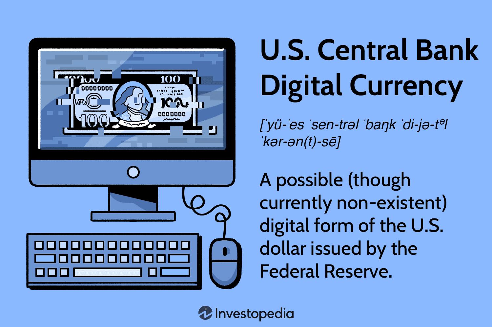

The digital economy is undergoing a significant transformation, placing digital currencies at the forefront of this evolution. In particular, the idea of a Central Bank Digital Currency (CBDC) in the United States has become a topic of substantial interest and debate. As technological advancements reshape financial systems, understanding the implications of a US CBDC is crucial. This digital currency innovation signifies a shift from conventional financial mechanisms, potentially affecting transaction processes, monetary policy, and economic stability.

One critical area of exploration is the intersection between CBDCs and algorithmic trading. Algorithmic trading, known for its rapid data analysis and transaction execution, may see transformations in strategies and operations with the introduction of a digital currency backed by the Federal Reserve. As efficiency and speed are paramount to trading algorithms, a CBDC could enhance these qualities, making it a significant development for traders and financial institutions.



Examining the potential impacts of a US CBDC on algorithmic trading provides insight into how digital finance might evolve. This exploration is necessary for financial professionals, policy makers, and investors to understand the future dynamics of trading systems and economic management. As discussions around US CBDC continue to gain traction, staying informed becomes essential for those involved in finance and technology.

## Table of Contents

## What is a CBDC?

Central Bank Digital Currency (CBDC) represents a digital form of a country's official currency, issued and regulated by the central bank. Unlike decentralized cryptocurrencies such as Bitcoin and Ethereum, CBDCs are centralized and operate under governmental oversight, ensuring they are aligned with the nation's monetary policies and financial regulations.

The primary objective of a CBDC is to provide a digital alternative to physical cash, aiming to make transactions more efficient and secure. This digital token framework not only facilitates everyday transactions but also potentially enhances the overall efficiency of payment systems, reducing the reliance on cash and streamlining interbank settlements. By leveraging digital technology, CBDCs could lower transaction costs and increase transaction speed, thus promoting financial inclusivity.

In the United States, the potential implementation of a CBDC would likely fall under the purview of the Federal Reserve. The Federal Reserve's role would involve managing the issuance, distribution, and regulation of the digital currency to ensure it complements existing financial structures. This involves maintaining the balance between technological innovation and maintaining the security and stability of the existing financial system.

Understanding CBDCs is essential to evaluating their potential impact on the broader economy and their role in modernizing financial systems. Their implementation could potentially affect various financial activities, ranging from retail transactions to monetary policy adjustments. As central banks globally explore the feasibility and implications of digital currencies, CBDCs stand at the forefront of transforming traditional monetary systems for the digital age.

## The Current State of CBDC in the United States

As of 2024, the United States has not yet implemented a Central Bank Digital Currency (CBDC), though the concept remains a point of significant exploration and debate among policymakers and financial experts. The Biden administration has underscored the significance of harnessing technological advancements in digital currencies, recognizing their potential to reshape the financial landscape. The Federal Reserve is actively engaged in researching the feasibility and implications of a US CBDC.

This exploratory phase involves a comprehensive evaluation of the safety, privacy, and operational resiliency of such a digital currency. The considerations extend to assessing how a CBDC might integrate with existing financial systems and its potential to enhance payment efficiency and security. The challenge lies in balancing the pursuit of innovation with the need to protect consumers and maintain financial stability, a task that requires careful planning and regulation.

As the dialogue continues, the development of a US CBDC carries the prospect of profound economic implications. It could influence everything from monetary policy execution to the dynamics of international financial markets. The Federal Reserve's ongoing analysis will be instrumental in determining the viability of a CBDC, and any decision will necessitate a thoughtful approach that prioritizes both technological progress and the broader interests of the economy. The future of a US CBDC remains under study, with its potential to redefine the nation's approach to digital finance and economy hanging in the balance.

## Algorithmic Trading: A Brief Overview

Algorithmic trading, frequently referred to as algo trading, involves the utilization of computer algorithms to execute trades in financial markets rapidly and efficiently. These algorithms are programmed to follow a set of pre-defined instructions for trading purposes, enabling them to [carry](/wiki/carry-trading) out buying and selling activities at speeds and frequencies that are impossible for human traders to match.

Algo trading is characterized by its speed and efficiency. The sophisticated algorithms are capable of analyzing enormous datasets within fractions of a second, allowing them to make data-driven and informed trading decisions. This ability to process information quickly helps in identifying favorable trading opportunities and executing trades at optimal prices. For example, algorithms can be programmed to recognize patterns or trends that suggest favorable trading conditions, thereby executing trades automatically once certain criteria are met.

The adoption of [algorithmic trading](/wiki/algorithmic-trading) methods is particularly prevalent among institutional investors and large trading firms. One significant reason is the potential for higher profitability. These entities often trade in large volumes where even slight improvements in execution speed and transaction costs can result in substantial financial gains. Algorithmic trading helps in minimizing market impact and reducing transaction costs, thus enhancing profitability. Additionally, the use of quantitative strategies and statistical models allows institutional investors to engineer complex trading strategies that leverage market inefficiencies.

To better understand the mechanics of algorithmic trading, consider a simple example using Python. Suppose an investor wants to create an algorithm that automatically buys a stock when its price drops by 5% and sells when the price rises by 5%. A basic Python script can illustrate this concept:

```python
def trade(stock_price, threshold=0.05):
    initial_price = stock_price[0]
    for current_price in stock_price:
        if current_price <= initial_price * (1 - threshold):
            print("Buying at price:", current_price)
            initial_price = current_price
        elif current_price >= initial_price * (1 + threshold):
            print("Selling at price:", current_price)
            initial_price = current_price

# Example stock price data
stock_price_data = [100, 95, 105, 97, 91, 100, 110, 104]
trade(stock_price_data)
```

This script demonstrates a basic trading strategy that reacts to price [volatility](/wiki/volatility-trading-strategies), a common approach in systematic trading strategies used by algo traders.

Algorithmic trading is crucial in today’s financial markets for its role in enhancing [liquidity](/wiki/liquidity-risk-premium), improving market efficiency, and reducing the need for human intervention in routine tasks. As the financial sector continues to embrace digital currencies and innovation such as Central Bank Digital Currencies (CBDCs), understanding algorithmic trading becomes vital to grasp how these new tools and technologies might interact and transform the market landscape.

## Potential Interaction Between CBDC and Algo Trading

The introduction of a U.S. Central Bank Digital Currency (CBDC) could significantly influence the domain of algorithmic trading. Fostering enhanced liquidity and curtailing transaction costs are some of the potential benefits that CBDCs might offer, which are crucial for refining algorithmic trading strategies. Algorithmic trading relies heavily on quick and efficient execution of trades, often involving high-frequency trading where milliseconds can impact profitability. A CBDC, with its potential for real-time processing and settlement, could lead to fewer intermediaries in financial transactions, thereby lowering costs and increasing liquidity.

In addition to cost and liquidity advantages, the introduction of a CBDC could also result in greater transaction speed and transparency, both important factors for optimizing algorithmic trading processes. Algorithms, designed to analyze and react to market data within microseconds, would benefit from the transparency CBDCs might provide, offering clearer visibility of market depth and transactions. This increase in transparency and speed could further enhance the efficiency of trade execution, thereby increasing potential returns for traders.

However, several regulatory challenges may arise with the integration of CBDCs into algorithmic trading. Ensuring equitable trading practices is paramount, and regulators might face hurdles related to data privacy, market manipulation, and systemic risks. As CBDCs operate under a centralized framework, they necessitate robust regulatory mechanisms to maintain fair trading environments.

Moreover, a U.S. CBDC could emerge as a prominent asset in algorithmic trading portfolios. This newfound integration would necessitate the development of novel strategies and models for traders aiming to incorporate CBDCs effectively. For instance, traders might need to develop algorithms that can dynamically adjust to the unique attributes of a CBDC, such as its potential impact on market volatility and interest rates.

To summarize, the advent of a U.S. CBDC holds the potential to reshape the landscape of algorithmic trading. The possibilities of improved liquidity, reduced transaction costs, enhanced speed, and transparency are attractive to traders. However, these benefits must be balanced with the need for robust regulation and innovative trading models to navigate the complexities introduced by a digital currency managed by the central bank.

## Challenges and Opportunities

The transition to a Central Bank Digital Currency (CBDC) in the United States presents numerous challenges and opportunities, particularly when considering its integration with algorithmic trading. One of the primary concerns is cybersecurity. As digital assets, CBDCs are susceptible to cyber threats, including hacking and data breaches. Ensuring robust security measures is crucial to protect the integrity of the digital currency system. Privacy is also a significant challenge, as the implementation of a CBDC could potentially lead to heightened government surveillance of financial transactions, raising concerns about individuals' financial privacy.

Systemic risks are another vital consideration. Introducing a CBDC might destabilize existing financial infrastructures if not managed effectively. The central bank must carefully design the CBDC to ensure that it complements, rather than disrupts, the current banking and payment systems. This involves creating a CBDC that is interoperable with existing financial technologies and ensuring its introduction does not lead to disintermediation, where traditional banks could lose their deposit base to a central digital issuer.

For algorithmic traders, the introduction of a CBDC requires adapting existing trading strategies. The digital nature of CBDCs would necessitate rethinking transaction efficiencies and cost structures. Algos would need to be recalibrated to incorporate the potential benefits of CBDCs, such as faster transaction times and lower fees. Enhanced transaction efficiency offered by CBDCs can lead to cost reductions, a crucial [factor](/wiki/factor-investing) for traders seeking to maximize profitability. The transparency and traceability inherent in digital currencies could also open new trading avenues, allowing for the development of innovative strategies based on real-time transaction data.

Financial institutions, particularly banks, must develop robust infrastructures to support the integration of CBDCs with existing systems. This includes upgrading technological platforms, ensuring cybersecurity, and training personnel to handle the peculiarities of digital currencies. Banks will face the challenge of ensuring seamless exchanges between traditional and digital financial systems, maintaining liquidity, and managing CBDC-related risks efficiently.

Navigating these challenges and opportunities will be critical to the successful implementation of a US CBDC. It requires collaboration among government agencies, financial institutions, and technology providers to create a secure, efficient, and inclusive digital currency environment that benefits the broader economy while safeguarding financial stability. As this transformation unfolds, continuous monitoring and adaptation will be necessary to address emerging issues and optimize the use of CBDCs in financial markets.

## Global Perspective on CBDCs and Algorithmic Trading

Internationally, Central Bank Digital Currencies (CBDCs) are garnering significant attention, with several countries either implementing or rigorously testing their viability. These global trials provide valuable lessons on how CBDCs might interact with technological advancements like algorithmic trading.

China is at the forefront, having launched pilot programs for its digital yuan, or e-CNY. The People's Bank of China has been actively promoting its use, particularly aiming at domestic retail payments. This initiative offers insights into how a CBDC can be seamlessly integrated into existing financial infrastructures and used to increase the velocity of money—a key metric for economic health.

Similarly, Sweden, through its Riksbank, has been conducting tests on the e-krona. Known for its reduced reliance on cash, Sweden represents an advanced case of digital currency adoption. The outcomes from these trials could help predict the impact on cashless transactions, specifically in mature financial systems.

The exploration of CBDCs goes beyond China and Sweden. The European Central Bank (ECB) is investigating the digital euro, targeting both retail usage and broader financial applications. These efforts strive to address issues like privacy, which are paramount for European regulators.

The role of algorithmic trading in these landscapes cannot be overlooked. As digital currencies potentially enhance liquidity and reduce transaction costs, they provide fertile ground for algorithmic trading systems that rely on these characteristics. Improved settlement times and reduced friction could further optimize trading strategies, allowing systems to operate with greater efficiency.

The United States can draw from these global experiments. Observing how countries manage concerns such as consumer privacy, cybersecurity, and regulatory compliance could inform U.S. approaches to both CBDC development and its subsequent interplay with algorithmic trading systems.

Adopting international learnings involves understanding local market dynamics and tailoring solutions that fit domestic economic policies. As algorithmic trading becomes increasingly sophisticated, integrating global best practices on CBDCs will be integral in shaping a robust infrastructure that enhances both digital currency usage and trading efficiency.

By learning from these international case studies, the U.S. has the opportunity to design a CBDC that harmonizes with current financial technologies and anticipates future market needs, thereby positioning itself strategically in the evolving digital economy.

## Conclusion

The potential advent of a US Central Bank Digital Currency (CBDC) signals a transformative era for digital currencies. As the United States contemplates implementing a CBDC, the repercussions for digital finance are poised to be profound. Algorithmic trading is expected to evolve as it incorporates CBDCs, reshaping trading practices with enhanced speed and efficiency. The integration of a US CBDC within algorithmic trading strategies could lead to a redefined financial landscape, facilitating rapid, transparent transactions and potentially unlocking new trading strategies and models.

However, the success of CBDC implementation is contingent upon striking a balance between innovation and regulation, alongside ensuring user privacy. As authorities consider adopting CBDCs, they must navigate complex regulatory frameworks designed to protect consumers and maintain market integrity. Managing these aspects effectively will be vital for fostering confidence and widespread adoption of CBDCs in financial transactions.

Collaboration among stakeholders—including government bodies, financial institutions, and technology providers—will be indispensable in overcoming challenges. By pooling resources and expertise, these entities can develop robust technological infrastructures, mitigate potential risks such as cybersecurity threats, and create an environment conducive to integrating CBDCs into existing financial systems.

For those involved in finance and technology sectors, staying informed about CBDC developments is crucial. As discussions and research continue, being abreast of policy changes, technological advancements, and global trends will be essential for adapting to the evolving landscape. The interplay between digital currencies like CBDCs and modern trading methodologies underscores an exciting frontier in digital finance, offering opportunities to enhance economic systems and achieve greater inclusivity and efficiency in financial services.

## FAQs

### FAQs

**What is a CBDC, and how does it differ from cryptocurrency?**  
A Central Bank Digital Currency (CBDC) is a digital form of a country's official currency issued by its central bank. Unlike cryptocurrencies such as Bitcoin or Ethereum, which are decentralized and typically operate on blockchain technology, CBDCs are centralized and regulated by the government. This centralization provides stability and aligns with national economic policies. In contrast, cryptocurrencies are often characterized by their pseudonymous nature and lack of central control, leading to higher volatility and risk.

**How could a US CBDC affect everyday financial transactions?**  
The implementation of a US CBDC could significantly impact everyday financial transactions by providing a more secure, efficient, and accessible digital currency option. It may reduce transaction times and costs associated with traditional currency exchange and banking fees, enhance payment systems by enabling real-time settlements, and increase financial inclusion by offering digital financial services to unbanked or underbanked populations. Furthermore, a US CBDC could simplify domestic and international transactions, potentially reducing reliance on cash and enhancing the overall resilience of the financial system.

**What are the risks associated with algorithmic trading and CBDCs?**  
Algorithmic trading and the use of CBDCs present several risks, including cybersecurity threats, potential systemic risks, and operational vulnerabilities. Algos designed to trade CBDCs could be susceptible to hacking or technical failures that disrupt markets. Furthermore, algorithmic trading can lead to market manipulation or exacerbate volatility, especially if CBDC-related regulations are not clearly defined. Proper oversight and robust encryption would be crucial to mitigate these risks and ensure fair trading practices.

**How are other countries managing the integration of CBDCs in their financial systems?**  
Various countries are at different stages of integrating CBDCs into their financial systems. China has been a frontrunner with its digital yuan, extensively tested and implemented in several cities. Sweden's Riksbank is developing the e-krona, focusing on user security and operational resilience. Similarly, the Bahamas has launched the Sand Dollar to improve economic inclusivity on its remote islands. These countries are addressing integration challenges by engaging in pilot projects, forming regulatory frameworks, and leveraging existing financial infrastructure.

**What role does the Federal Reserve play in managing a potential US CBDC?**  
In the United States, the Federal Reserve would be responsible for overseeing the management and issuance of a CBDC, ensuring compliance with monetary policy and financial stability objectives. This involves research into the CBDC's design, security, and functionality, along with managing public consultations to address privacy concerns and operational resiliency. The Federal Reserve's role would encompass setting guidelines for CBDC circulation, integrating it with existing payment systems, and directing regulatory measures to balance innovation with consumer protection.

## References & Further Reading

[1]: Boar, C., & Wehrli, A. (2021). ["Ready, steady, go? – Results of the third BIS survey on central bank digital currency."](https://www.bis.org/publ/bppdf/bispap114.pdf) Bank for International Settlements.

[2]: Kiff, J., Alwazir, J., Davidovic, S., Farias, A., Khan, A., Khiaonarong, T., Malaika, M., Monroe, H., Sugimoto, N., Tourpe, H., & Zhou, P. (2020). ["A Survey of Research on Retail Central Bank Digital Currency."](https://www.imf.org/en/Publications/WP/Issues/2020/06/26/A-Survey-of-Research-on-Retail-Central-Bank-Digital-Currency-49517) International Monetary Fund.

[3]: Brainard, L. (2020). ["An Update on Digital Currencies."](https://www.federalreserve.gov/newsevents/speech/brainard20200813a.htm) Board of Governors of the Federal Reserve System.

[4]: Barontini, C., & Holden, H. (2019). ["Proceeding with caution – a survey on central bank digital currency."](https://www.bis.org/publ/bppdf/bispap101.pdf) Bank for International Settlements.

[5]: Narula, N. (2018). ["The Technology of a Cashless Society."](https://dci.mit.edu/neha-narula) Journal of Economic Perspectives, 32(1), 157-188.

[6]: Aronson, D. R. (2007). ["Evidence-Based Technical Analysis: Applying the Scientific Method and Statistical Inference to Trading Signals."](https://onlinelibrary.wiley.com/doi/book/10.1002/9781118268315) Wiley.

[7]: Lopez de Prado, M. (2018). ["Advances in Financial Machine Learning."](https://www.amazon.com/Advances-Financial-Machine-Learning-Marcos/dp/1119482089) Wiley.

[8]: Chan, E. P. (2009). ["Quantitative Trading: How to Build Your Own Algorithmic Trading Business."](https://github.com/ftvision/quant_trading_echan_book) Wiley.

[9]: Jansen, S. (2018). ["Machine Learning for Algorithmic Trading."](https://github.com/stefan-jansen/machine-learning-for-trading) Packt Publishing.