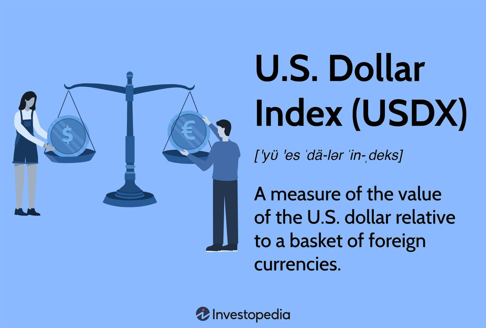

## Table of Contents

## What is the U.S. Dollar Index (USDX)?

The U.S. Dollar Index, often called USDX, is a measure of the value of the U.S. dollar compared to a basket of other major world currencies. It helps people understand how strong or weak the dollar is on the global stage. The basket includes currencies like the Euro, Japanese Yen, British Pound, Canadian Dollar, Swedish Krona, and Swiss Franc. Each of these currencies has a specific weight in the index, with the Euro having the highest weight because it is the most traded currency against the dollar.

The USDX is important for many reasons. Traders and investors use it to make decisions about buying and selling currencies. If the USDX goes up, it means the U.S. dollar is getting stronger compared to the other currencies in the basket. This can affect things like international trade, as a stronger dollar might make U.S. exports more expensive for other countries. On the other hand, if the USDX goes down, the dollar is weakening, which could make U.S. goods cheaper abroad. The index is updated in real-time, so it's a useful tool for anyone interested in the global economy.

## What currencies are included in the USDX?

The U.S. Dollar Index, or USDX, includes six major world currencies. These are the Euro, Japanese Yen, British Pound, Canadian Dollar, Swedish Krona, and Swiss Franc. Each of these currencies is part of a basket that helps measure how strong or weak the U.S. dollar is compared to them.

The Euro has the biggest part in this basket, which means it affects the USDX the most. The other currencies also have their own shares, but they are smaller than the Euro's. This mix of currencies helps give a good picture of the U.S. dollar's value around the world.

## How is the USDX calculated?

The USDX is calculated using a special formula that compares the U.S. dollar to a group of other important currencies. This group includes the Euro, Japanese Yen, British Pound, Canadian Dollar, Swedish Krona, and Swiss Franc. Each of these currencies has a different importance in the calculation, with the Euro being the most important because it is used the most in trading with the U.S. dollar. The formula uses something called a geometric weighted average, which means it takes into account how much each currency affects the index.

To calculate the USDX, you start with a base value of 100 from a certain date in the past, usually 1973. Then, you look at how the exchange rates between the U.S. dollar and the other currencies have changed since that date. You multiply the current exchange rates by the weights of each currency in the basket, and then you do some math to figure out the new value of the index. If the number goes up, it means the U.S. dollar is getting stronger compared to the other currencies. If it goes down, the dollar is getting weaker.

## What is the historical performance of the USDX?

The U.S. Dollar Index, or USDX, has had ups and downs over the years. Since it started in 1973, the index has gone through many changes. In the late 1970s and early 1980s, the USDX rose a lot because the U.S. had high interest rates to fight inflation. It reached a high point in 1985. After that, the dollar weakened for a while because other countries started to work together to make their currencies stronger. By the early 1990s, the USDX was much lower than its peak.

From the mid-1990s to the early 2000s, the USDX went up again. This was because the U.S. economy was doing well and people from other countries wanted to invest in the U.S. But then, from 2002 to 2008, the index fell as the U.S. faced economic problems like the housing bubble. After the 2008 financial crisis, the USDX had some big swings. It went up during times of global uncertainty because people saw the U.S. dollar as a safe place to put their money. In recent years, the USDX has continued to change, affected by things like U.S. interest rates, global trade, and economic policies around the world.

## What factors influence the value of the USDX?

The value of the USDX can change because of many things. One big thing is the interest rates set by the U.S. Federal Reserve. If the Fed raises interest rates, it can make the U.S. dollar stronger because people want to invest in the U.S. to get higher returns. On the other hand, if the Fed lowers interest rates, the dollar might get weaker. Another thing that can affect the USDX is how well the U.S. economy is doing. If the U.S. economy is strong, with lots of jobs and growth, the dollar can get stronger. But if the economy is weak, the dollar might lose value.

Global events and trade also play a big role in the USDX. If there's a lot of uncertainty in the world, like during a financial crisis or a big political event, people might want to put their money in the U.S. dollar because it's seen as a safe place. This can make the dollar stronger. Also, how much the U.S. trades with other countries can affect the USDX. If the U.S. exports a lot, and other countries want to buy U.S. goods, the dollar can get stronger. But if the U.S. imports more than it exports, the dollar might weaken.

Lastly, the value of other currencies in the USDX basket can influence the index. If the Euro, which has the biggest weight in the basket, gets weaker, the USDX can go up even if nothing changes with the U.S. dollar itself. The same goes for the other currencies like the Japanese Yen or the British Pound. If they get stronger, the USDX might go down. So, the value of the USDX is not just about what happens in the U.S., but also about what's happening in other parts of the world.

## How can beginners start trading the USDX?

If you're new to trading and want to start with the USDX, the first thing you should do is learn about how it works. The USDX measures the strength of the U.S. dollar against other major currencies like the Euro and the Japanese Yen. You can start by reading about what affects the USDX, like interest rates, the U.S. economy, and global events. There are many websites and [books](/wiki/algo-trading-books) that can help you understand these things better. It's also a good idea to practice trading without real money first. Many online platforms offer demo accounts where you can trade the USDX and see how it goes without risking your own money.

Once you feel ready, you can open an account with a broker that lets you trade the USDX. Make sure to choose a broker that is trusted and has good reviews. When you start trading, it's important to start small. Don't put all your money into one trade. Instead, try to spread it out so you don't lose everything if one trade goes wrong. Also, always keep an eye on the news and economic reports because they can change the value of the USDX quickly. Trading can be exciting, but it's also risky, so take your time and learn as you go.

## What are the common trading strategies for the USDX?

One common way to trade the USDX is to use a trend-following strategy. This means you look at the direction the USDX is moving and try to trade in the same direction. If the USDX is going up, you might buy it, hoping it will keep going up so you can sell it later for more money. If it's going down, you might sell it or even short it, which means you borrow the USDX and sell it, hoping to buy it back later at a lower price to make a profit. To do this, you can use tools like moving averages to help you see the trend more clearly.

Another strategy is called range trading. This is when you see that the USDX is moving up and down between two levels without going too far in either direction. You can buy the USDX when it's near the bottom of the range and sell it when it's near the top. This way, you can make money from the small ups and downs. To do this, you need to watch the USDX closely and know where those levels are.

A third strategy is news trading. This involves watching for big news events that can move the USDX a lot. Things like [interest rate](/wiki/interest-rate-trading-strategies) changes by the Federal Reserve or important economic reports can make the USDX jump up or down. If you think a news event will make the USDX go up, you can buy it before the news comes out. If you think it will go down, you can sell it or short it. This strategy can be riskier because the market can react in unexpected ways, but it can also be very rewarding if you get it right.

## How does the USDX impact global trade and economies?

The USDX can have a big effect on global trade and economies. When the USDX goes up, it means the U.S. dollar is getting stronger compared to other currencies. This can make U.S. goods more expensive for other countries to buy. So, if a company in Japan wants to buy something from the U.S., they will have to pay more yen for it because the dollar is worth more. This can make U.S. exports go down because other countries might not want to buy as much. On the other hand, a stronger dollar can make it cheaper for the U.S. to buy things from other countries, which can help U.S. companies that need to import materials or goods.

A weaker U.S. dollar, which means the USDX is going down, can help U.S. exports. When the dollar is weaker, U.S. goods become cheaper for other countries to buy. This can make more people want to buy things from the U.S., which can help U.S. companies sell more abroad. But, a weaker dollar can also make it more expensive for the U.S. to buy things from other countries. This can affect U.S. companies that rely on imports. So, the value of the USDX can change how much countries trade with each other and can have a big impact on the world economy.

## What are the technical analysis tools used for USDX trading?

When people trade the USDX, they often use something called technical analysis to help them make decisions. This means they look at charts and use special tools to see patterns and trends in how the USDX is moving. One common tool is the moving average, which is a line on the chart that shows the average price of the USDX over a certain time. Traders use moving averages to see if the USDX is going up or down. If the price of the USDX is above the moving average, it might be a good time to buy. If it's below, it might be a good time to sell or short it.

Another tool traders use is the Relative Strength Index (RSI). This tool helps them see if the USDX is being bought or sold too much. If the RSI is over 70, it means the USDX might be overbought, and it could go down soon. If it's under 30, it might be oversold, and it could go up. Traders also use support and resistance levels. These are like invisible lines on the chart where the USDX often stops going up or down. If the USDX keeps bouncing off a certain level, that level is called support if it's below the current price, and resistance if it's above. Knowing these levels can help traders decide when to buy or sell.

## How do macroeconomic indicators affect the USDX?

Macroeconomic indicators are big pieces of information about an economy that can change the value of the USDX. Things like the unemployment rate, inflation rate, and gross domestic product (GDP) are important. If the U.S. unemployment rate goes down, it means more people have jobs, and this can make the U.S. economy look strong. A strong economy can make the U.S. dollar stronger, so the USDX might go up. On the other hand, if inflation is high, it means prices are going up a lot, and this can make the U.S. dollar weaker, causing the USDX to go down. The Federal Reserve looks at these indicators to decide on interest rates, which also affect the USDX.

Another big indicator is the trade balance, which shows if the U.S. is exporting more than it's importing. If the U.S. has a trade surplus, it means more countries are buying U.S. goods, which can make the dollar stronger and push the USDX up. But if the U.S. has a trade deficit, it's buying more from other countries than it's selling, and this can make the dollar weaker, causing the USDX to go down. Also, big reports like the Non-Farm Payroll, which shows how many jobs were added or lost in the U.S., can move the USDX a lot. If the report is better than expected, the USDX might go up because it shows a strong economy. If it's worse than expected, the USDX might go down because it shows a weak economy.

## What are the risks associated with trading the USDX?

Trading the USDX can be risky because the value of the U.S. dollar can change a lot. Things like interest rates, the U.S. economy, and big news events can make the USDX go up or down quickly. If you're not careful, you might lose money if the USDX moves in a way you didn't expect. For example, if you think the USDX will go up and you buy it, but it goes down instead, you could lose the money you spent on it. Also, trading with borrowed money, which is called leverage, can make these risks even bigger because you could lose more than you put in.

Another risk is that the USDX can be hard to predict. Even if you use tools like charts and moving averages, the USDX can still do something unexpected. This is because many things can affect it, like what's happening in other countries or sudden changes in the U.S. economy. If you're new to trading, it can be hard to understand all these factors and make good decisions. It's important to learn as much as you can and maybe start with a small amount of money until you get better at it.

## How can advanced traders use algorithmic trading strategies for the USDX?

Advanced traders can use algorithmic trading strategies to trade the USDX by setting up computer programs that follow specific rules to buy and sell. These programs can look at lots of information very quickly, like the price of the USDX, moving averages, and other technical indicators. They can also keep an eye on news and economic reports that might affect the USDX. This way, the computer can make trades automatically, without the trader having to watch the market all the time. For example, if the program sees that the USDX is going up and it's above a certain moving average, it might buy more USDX. If it sees the USDX going down and it's below another moving average, it might sell or short the USDX.

Using algorithmic trading can help advanced traders because it can take away some of the emotions that can mess up trading decisions. When people trade, they can get scared or too excited and make bad choices. But a computer program just follows the rules it's given, so it can stick to a plan better. Also, these programs can trade much faster than a person can, which can be important when the USDX is moving quickly. But, setting up these programs can be hard and takes a lot of knowledge about both trading and computer programming. Traders need to make sure their algorithms work well and keep testing them to make sure they're still good as the market changes.

## What is the U.S. Dollar Index (USDX) and how is it understood?

The U.S. Dollar Index (USDX) is a crucial financial instrument that provides a metric for the international value of the U.S. Dollar (USD). The USDX is a weighted geometric mean of the dollar's value relative to a basket of six major currencies. These currencies include the Euro (EUR), Japanese Yen (JPY), British Pound (GBP), Canadian Dollar (CAD), Swedish Krona (SEK), and Swiss Franc (CHF). Each currency has a fixed weight, with the Euro holding the largest, reflecting its significant role in the index.

Historically, the U.S. Dollar Index was established in March 1973, after the Bretton Woods Agreement dissolved, leading to floating exchange rates. Since then, the USDX has served as a reliable benchmark for gauging the dollar's strength or weakness in the global [forex](/wiki/forex-system) market. Its fluctuations provide insights into macroeconomic trends and investor sentiment. 

The calculation of the USDX involves a geometric weighted formula:

$$
USDX = 50.14348112 \times (EUR/USD)^{-0.576} \times (USD/JPY)^{0.136} \times (GBP/USD)^{-0.119} \times (USD/CAD)^{0.091} \times (USD/SEK)^{0.042} \times (USD/CHF)^{0.036}
$$

This formula captures the relative change in each currency pair's value, weighted according to its significance. Traders and investors monitor these movements to anticipate shifts in economic conditions, adjust risk exposure, and inform currency hedging strategies.

The importance of the U.S. Dollar Index cannot be overstated, especially for market participants involved in forex trading. A rising USDX suggests strengthening of the USD against its peers, indicating potential shifts in U.S. monetary policy or changes in global economic conditions. Conversely, a declining index points to dollar depreciation, altering import-export dynamics and influencing commodity prices, as many are traded in USD. 

For investors, the USDX offers a straightforward indicator to manage currency risk, inform investment in foreign assets, and align with macroeconomic strategies. Understanding its dynamics is essential for making informed financial decisions in an interconnected global market.

 to Algorithmic Trading

Algorithmic trading, often referred to as algo trading, involves the use of computer algorithms to manage trading orders in an automated manner. These algorithms are designed to execute pre-set instructions, which determine factors such as timing, price, and [volume](/wiki/volume-trading-strategy) of orders, with minimal human intervention. The evolution of [algorithmic trading](/wiki/algorithmic-trading) can be traced back to the late 20th century, when technological advancements enabled the automation of simple trading tasks. With the advent of faster computing power and increased access to market data, algorithmic trading has since evolved into a sophisticated tool used by traders worldwide.

The benefits of using algorithms in trading strategies are manifold. Firstly, algorithms can process vast amounts of data far more quickly and accurately than human traders, allowing for rapid execution of trades and potentially capturing opportunities that might be missed in manual trading. Additionally, algorithms eliminate the impact of human emotions on trading decisions, thereby avoiding emotionally driven errors that can impair trading performance. Furthermore, algorithmic trading facilitates a high level of precision and can execute complex strategies that might be cumbersome for humans to manage in real-time.

Common tools and platforms for algo trading include MetaTrader, [Interactive Brokers](/wiki/interactive-brokers-api), and NinjaTrader, among others. These platforms provide traders with the necessary infrastructure to deploy algorithmic strategies, including access to various financial markets, real-time data feeds, and execution capabilities. Many platforms also offer development environments that allow traders to program their algorithms using languages like Python and C++, providing flexibility and customization options.

The role of technology and data analytics in algorithmic trading cannot be understated. Modern algo trading relies heavily on advanced technologies such as high-frequency trading and [machine learning](/wiki/machine-learning) algorithms to exploit short-lived market inefficiencies. Data analytics, combined with vast historical and real-time data, enables the development of sophisticated models that can predict market movements with greater accuracy. Techniques like statistical [arbitrage](/wiki/arbitrage), sentiment analysis, and natural language processing help traders identify patterns and trends, thereby enhancing decision-making processes.

Despite its benefits, traders face several challenges when implementing algorithmic strategies. Developing robust algorithms that perform consistently across varied market conditions requires considerable expertise in both financial markets and programming. Furthermore, the need for continuous monitoring and fine-tuning of algorithms to adapt to changing market dynamics presents an ongoing challenge. Traders must also be mindful of the risks associated with algo trading, such as technical glitches or unexpected market events that can lead to significant losses. As a result, rigorous [backtesting](/wiki/backtesting) and risk management protocols are essential components of successful algorithmic trading strategies.

## References & Further Reading

[1]: ["Advances in Financial Machine Learning"](https://www.amazon.com/Advances-Financial-Machine-Learning-Marcos/dp/1119482089) by Marcos Lopez de Prado

[2]: Bergstra, J., Bardenet, R., Bengio, Y., & Kégl, B. (2011). ["Algorithms for Hyper-Parameter Optimization."](https://dl.acm.org/doi/10.5555/2986459.2986743) Advances in Neural Information Processing Systems 24.

[3]: ["Evidence-Based Technical Analysis: Applying the Scientific Method and Statistical Inference to Trading Signals"](https://www.amazon.com/Evidence-Based-Technical-Analysis-Scientific-Statistical/dp/0470008741) by David Aronson

[4]: ["Machine Learning for Algorithmic Trading"](https://github.com/stefan-jansen/machine-learning-for-trading) by Stefan Jansen

[5]: ["Quantitative Trading: How to Build Your Own Algorithmic Trading Business"](https://books.google.com/books/about/Quantitative_Trading.html?id=j70yEAAAQBAJ) by Ernest P. Chan