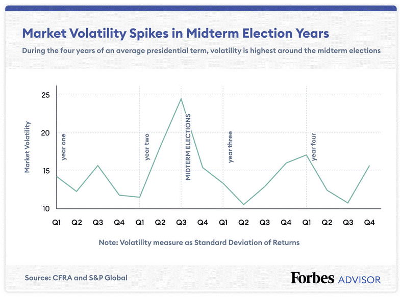

Understanding inflation in the U.S. economic landscape is crucial, given its profound impact on everyday life and broader economic policies. Inflation reflects the rate at which the general level of prices for goods and services rises, eroding purchasing power. It is a key indicator of economic health and influences both individual decisions and national strategies. Historically, managing inflation has been a central focus for U.S. presidents, each of whom has faced unique economic challenges and implemented distinct policy responses. These efforts have been shaped by a myriad of factors including technological advancements, global events, and domestic economic conditions.

This article examines historical inflation rates during various U.S. presidential administrations, highlighting how economic policies have been crafted to combat inflationary pressures and stabilize the economy. Presidential influence is seen in fiscal measures, tax policies, and regulatory decisions that aim to maintain economic equilibrium. Additionally, external factors like wars, oil crises, and financial meltdowns often compel presidents to adapt their approaches to managing inflation.

In the modern era, the rise of algorithmic trading presents new dynamics in understanding market operations. Algorithmic trading, which involves using automated systems to execute trades at high speeds, can affect market liquidity and efficiency, thereby impacting inflation indirectly. While these technologies offer benefits such as increased market access and reduced transaction costs, they can also introduce risks like flash crashes, challenging market stability.

By analyzing these elements, the article provides a comprehensive view of how inflation interacts with policy-making and technological evolution in the U.S. economy. As the landscape continues to evolve, understanding these intersections remains vital for policymakers, businesses, and individuals trying to navigate an increasingly complex economic environment.

## Table of Contents

## Historical U.S. Inflation Rates and Presidential Influence

### Historical U.S. Inflation Rates and Presidential Influence

From the mid-20th century onwards, U.S. presidents have contended with fluctuating inflation rates, influenced by domestic policies and external events. This period highlights the intertwined nature of political leadership, economic policies, and global dynamics.

**Eisenhower to Johnson: Post-War Stability and the Great Society**

During President Dwight D. Eisenhower's tenure (1953–1961), inflation remained relatively low, averaging around 1.5% annually. This was a period marked by post-war economic expansion, where fiscal restraint and moderate growth were emphasized. Eisenhower's administration focused on balancing budgets and infrastructure investment, maintaining price stability without significant inflationary pressures.

President John F. Kennedy (1961–1963) and Lyndon B. Johnson (1963–1969) saw moderate inflation but faced increasing pressure from fiscal expansion aimed at boosting economic growth and funding social programs like the Great Society. The Vietnam War further strained economic resources. Johnson's "guns and butter" approach led to modest inflationary pressures as government spending increased without corresponding tax hikes.

**Nixon and Ford: The Stagflation Challenge**

The 1970s, under Presidents Richard Nixon (1969–1974) and Gerald Ford (1974–1977), presented significant economic challenges, particularly stagflation—a rare combination of stagnant economic growth and high inflation. Inflation spiked due to several factors, including the OPEC oil embargo in 1973, which quadrupled oil prices, and expansive fiscal policies designed to boost employment. Nixon's administration tried wage and price controls to curb inflation, but these measures largely failed, leading to further economic distortions.

**Carter: Persistent Inflation**

President Jimmy Carter (1977–1981) inherited stagflation from his predecessors. Inflation rates soared, peaking at over 13% in 1980. Carter's policies focused on energy conservation and deregulation, hoping to tackle structural issues within the economy. Despite these efforts, inflation remained a persistent problem, exacerbated by the Iranian Revolution and subsequent oil crisis, which further stressed energy prices.

**Reagan: The Reduction of Inflation**

Ronald Reagan (1981–1989) addressed inflation aggressively by supporting Federal Reserve Chairman Paul Volcker's stringent monetary policies, which included high interest rates to curb money supply growth. These actions were initially painful, inducing a deep recession but ultimately successful in reducing inflation significantly by the mid-1980s. Reagan's economic policy, known as "Reaganomics," emphasized tax cuts, deregulation, and reduced government spending.

**Bush and Clinton: Economic Balancing Act**

Under President George H.W. Bush (1989–1993), inflation remained subdued, averaging around 4.3%. His administration faced a mild recession in the early 1990s, leading to fiscal challenges.

Bill Clinton (1993–2001) continued to enjoy low inflation, largely due to technological advancements and globalization, which contributed to increased productivity and price stability. Clinton's policies focused on fiscal discipline, balancing the federal budget, and fostering an environment conducive to economic growth without igniting inflation.

**Bush to Obama: Crisis and Recovery**

George W. Bush (2001–2009) experienced moderate inflation, but the 2008 financial crisis shifted policy focus towards economic recovery, necessitating fiscal and monetary stimulus. Inflation remained low as recessionary pressures dominated.

Barack Obama (2009–2017) dealt with the aftermath of the financial crisis, using expansionary fiscal policy and quantitative easing to stimulate recovery. Inflation stayed below 2%, as slack in the economy kept price pressures in check.

**Trump to Biden: Recent Trends**

President Donald Trump (2017–2021) pursued tax cuts and deregulation, resulting in economic growth with low inflation until the COVID-19 pandemic disrupted global markets, leading to economic contraction and inflation [volatility](/wiki/volatility-trading-strategies).

Under President Joe Biden (2021–present), inflation has resurfaced amidst post-pandemic recovery efforts, supply chain disruptions, and fiscal stimuli. The administration's challenge is navigating these inflationary pressures while supporting ongoing economic recovery.

**Election Strategies and Political Significance**

Presidential candidates often emphasize inflation control during campaigns, reflecting its significance in economic well-being and electoral success. Policy proposals generally target price stability as a priority for economic health and voter confidence. Historically, candidates' stances on inflation have influenced their appeal to voters, especially during periods of significant economic anxiety.

Understanding these dynamics enhances an appreciation for the complex relationship between U.S. presidential policies and inflation rates, with external factors like war, global crises, and economic shocks further complicating policy effectiveness.

## Presidential Economics: Policy Responses and Challenges

Throughout U.S. history, presidents have encountered diverse economic challenges that have shaped their policy responses, particularly concerning inflation. This analysis examines key presidencies and their distinctive approaches to managing inflationary pressures through fiscal and monetary strategies.

### Eisenhower's Surplus Goals

President Dwight D. Eisenhower served from 1953 to 1961, a period marked by post-war economic adjustment. Eisenhower aimed to achieve budget surpluses to counteract inflation, drawing on conservative fiscal policies. His administration prioritized balancing the federal budget, reducing government spending, and maintaining low taxes. These measures helped maintain moderate inflation levels but also limited government investment in domestic programs, curbing economic growth potential [Eisenhower Library](https://www.eisenhowerlibrary.gov/).

### Reaganomics

President Ronald Reagan's tenure from 1981 to 1989 introduced "Reaganomics," characterized by supply-side economic policies. These included significant tax cuts, deregulation, and reductions in government spending on social programs. The Economic Recovery Tax Act of 1981 sought to stimulate growth by increasing disposable income and investment. While initial years saw high inflation, partly a legacy of the 1970s oil crises, the Federal Reserve, under Paul Volcker, implemented tight monetary policy. By the mid-1980s, inflation rates significantly declined, demonstrating the successful synergy of fiscal discipline and monetary tightening in controlling inflation [Reagan Foundation](https://www.reaganfoundation.org/).

### Clintonomics

During President Bill Clinton's administration (1993-2001), economic policy focused on fiscal responsibility coupled with social investment. Clintonomics is noted for tax increases on higher incomes and spending cuts, which helped transform the U.S. budget deficit into a surplus. The reduction in deficit spending lessened government pressure on interest rates, which, alongside a tech-driven economic expansion, helped maintain low inflation rates. Clinton's era underscored the importance of balanced budgets in promoting economic stability without sacrificing growth [Clinton Foundation](https://www.clintonfoundation.org/).

### Bidenomics

President Joe Biden's economic strategy, termed "Bidenomics," has grappled with the economic fallout of the COVID-19 pandemic. Key components include substantial fiscal stimulus packages, such as the American Rescue Plan, aimed at revitalizing the economy. These measures have been instrumental in recovering jobs and stabilizing demand. However, they have also raised concerns about potential inflationary effects, prompting debates about the balance between immediate economic support and long-term inflation control [White House](https://www.whitehouse.gov/).

### Global Events and Inflation

Presidential economic policies do not exist in a vacuum. Global events like the Gulf War in 1990, the subsequent oil price shocks, and the Savings & Loan Crisis of the late 1980s influenced U.S. inflation. Each required nuanced policy responses, emphasizing energy independence and financial sector reforms. Recently, the COVID-19 pandemic has introduced unprecedented fiscal challenges, with global supply chain disruptions leading to inflationary pressures, complicating the fiscal landscape for contemporary administrations.

### Managing Economic Growth and Inflation

Fiscal policies, tax cuts, and government spending play critical roles in shaping economic growth and inflation. Notably, presidents must carefully balance these tools to avoid stagflation or deflation. For example, a strategic mix of tax policies and controlled government expenditure can sustain growth without overheating the economy. Similarly, monetary policies, primarily through the Federal Reserve, are crucial in managing inflation expectations and interest rates.

In conclusion, U.S. presidents face complex decisions in managing inflation and economic growth. By examining past presidencies, policymakers can draw valuable lessons in balancing economic stimulus with inflation control to maintain stability in ever-evolving economic landscapes.

## The Role of the Federal Reserve and Monetary Policy

The Federal Reserve, established in 1913, plays a pivotal role in managing inflation and ensuring economic stability in the United States. Its primary tools for controlling inflation include setting interest rates, regulating the money supply, and using open market operations. By adjusting interest rates, the Federal Reserve influences borrowing and spending behaviors, which in turn impacts inflation levels.

The Federal Reserve has set a target inflation rate of 2%, which is deemed optimal for maintaining economic balance. This target aims to provide a buffer against deflation, support price stability, and foster employment growth. A sustained inflation rate around this target encourages consistent economic growth, as it mitigates the risks associated with volatile price fluctuations.

Analyzing the effectiveness of past interventions reveals mixed outcomes. For instance, in the late 1970s and early 1980s, the Federal Reserve, led by Chairman Paul Volcker, significantly raised interest rates to combat the double-digit inflation rates, a move largely credited with stabilizing prices albeit at the cost of a recession. Conversely, during the 2008 financial crisis, the Federal Reserve slashed interest rates to near-zero levels to spur economic activity, illustrating the adaptability of its monetary policy tools in varying economic contexts.

The Federal Reserve's relationship with presidential administrations is nuanced, shaped by both economic needs and political dynamics. While the Federal Reserve operates independently, its decisions can align or conflict with presidential economic strategies. For example, during the Trump administration, there was notable tension as President Trump advocated for lower interest rates to boost economic growth, whereas the Federal Reserve, under Chair Jerome Powell, aimed to normalize rates post-financial crisis to prevent overheating.

Recently, during the Biden administration, [interest rate](/wiki/interest-rate-trading-strategies) hikes have been employed as inflationary pressures surged, partly due to supply chain disruptions and fiscal stimulus measures. The Federal Reserve's decision to increase rates reflects its commitment to curbing inflation and signals its proactive stance in addressing economic challenges that evolve over time.

In summary, the Federal Reserve remains a cornerstone of U.S. economic management, wielding significant influence through its monetary policy decisions. Its ability to maintain price stability and support economic growth is pivotal, especially in an era marked by rapid technological advances and global economic interconnectivity.

## Impact of Algorithmic Trading on Inflation and Market Stability

Algorithmic trading, defined as the use of computer algorithms to execute trading strategies with minimal human intervention, has become a dominant force in financial markets. Its emergence and growing influence are transforming how markets operate, influencing [liquidity](/wiki/liquidity-risk-premium), efficiency, and potentially inflation indirectly.

### Market Liquidity and Efficiency

Algorithmic trading enhances market liquidity and efficiency by executing trades at high speed and [volume](/wiki/volume-trading-strategy). By providing continuous buy and sell quotes, algorithms help narrow bid-ask spreads, thus reducing transaction costs for traders. This increased liquidity facilitates smoother market operations and can lead to more accurate price discovery. Enhanced market efficiency can indirectly affect inflation by ensuring that prices reflect fundamental economic conditions, reducing the likelihood of mispricing that could disrupt economic stability.

### Risks and Market Volatility

While [algorithmic trading](/wiki/algorithmic-trading) improves efficiency, it also introduces risks, such as flash crashes—rapid, deep market dives followed by a quick recovery. Such events can arise from algorithms reacting to erroneous inputs or engaging in feedback loops, causing severe market volatility. This heightened volatility can affect inflation expectations by disturbing the stability of financial markets, leading to uncertainty in investment and consumption decisions. Consequently, the interplay between unexpected algorithmic behavior and market stability is a growing area of concern for regulators.

### Regulatory Environment

The regulation of algorithmic trading aims to mitigate risks and ensure market stability. Key regulatory approaches include circuit breakers, which halt trading in the event of severe price movements, and pre-trade risk controls that limit the impact of erroneous trades. Regulations, such as the Markets in Financial Instruments Directive II (MiFID II) in Europe and the Consolidated Audit Trail (CAT) in the U.S., enhance market transparency and facilitate monitoring of algorithmic activities. These regulatory measures are designed to safeguard financial markets from the adverse effects of algorithmic trading.

### Future Trends and Economic Policy

The future of algorithmic trading is likely shaped by advancements in [artificial intelligence](/wiki/ai-artificial-intelligence) and [machine learning](/wiki/machine-learning). These technologies promise to create more sophisticated algorithms capable of executing complex trading strategies. However, their integration into financial markets poses challenges, potentially exacerbating volatility or introducing new systemic risks. Economic policy will need to adapt to these developments by fostering innovation while ensuring adequate controls to preserve market stability. 

Economic policymakers and financial institutions must be vigilant and proactive in their approach, balancing the benefits of technological advancement with the need to maintain a stable, transparent, and fair trading environment. This ongoing evolution in algorithmic trading underscores the critical intersection of technology and economic policy in shaping future financial markets.

## Conclusion

Understanding the dynamics of U.S. inflation rates and the corresponding presidential policies reveals critical insights into the nation's economic landscape. Historically, inflation management has varied significantly across different administrations, with each president facing unique economic challenges. This article has highlighted the persistent interplay between government policy and economic conditions, underscoring the complexity of presidential roles in managing inflation. The integration of technological advancements, such as algorithmic trading, adds further layers to the intricacies faced by policymakers.

The significance of effective policymaking in combating inflation remains paramount. Presidents must navigate complex scenarios, balancing the demands of economic growth and stability while responding to global and domestic pressures. The judicious application of fiscal and monetary tools is vital in steering the economy toward sustained prosperity. In this context, the Federal Reserve's monetary policies and interest rate adjustments have historically played critical roles in modulating inflationary pressures.

Looking forward, future economic challenges will likely require a keen understanding of past experiences paired with innovative solutions. Lessons from previous administrations offer valuable guidance in crafting policies capable of addressing new economic realities. Continued emphasis on technological integration, exemplified by the growing influence of algorithmic trading, is crucial for ensuring market efficiency and stability.

For individuals and communities alike, staying informed about economic policies and technological trends is essential for building resilience against economic fluctuations. As economic landscapes evolve, informed citizens can better advocate for policies that drive collective economic prosperity. Staying attuned to both historical insights and future innovations will be critical for fostering enduring economic stability in the United States.

## References & Further Reading

[1]: Federal Reserve Bank of St. Louis. ["FRED Economic Data."](https://fred.stlouisfed.org/) Explore a comprehensive collection of U.S. economic data, including inflation rates.

[2]: Volcker, Paul A., & Gyohten, T. (1992). "Changing Fortunes: The World's Money and the Threat to American Leadership." Times Books. A detailed exploration of monetary policies and their impacts during Volcker's tenure at the Federal Reserve.

[3]: Shiller, R.J. (1993). "Macro Markets: Creating Institutions for Managing Society's Largest Economic Risks." Oxford University Press. Discusses the management of economic risks, including inflation, through innovative financial instruments.

[4]: Greenspan, A. (2007). "The Age of Turbulence: Adventures in a New World." Penguin Books. Offers insights into the economic policies shaping the landscape during Greenspan's era at the Federal Reserve.

[5]: Malkiel, B.G. (2011). "A Random Walk Down Wall Street: The Time-Tested Strategy for Successful Investing." W. W. Norton & Company. Discusses efficient market hypothesis and the impact of technology on markets, including algorithmic trading.

[6]: Bernanke, B.S. (2013). "The Federal Reserve and the Financial Crisis." Princeton University Press. Provides an analysis of the Federal Reserve's role during financial crises and its impact on inflation.

[7]: Clinton Presidential Library. ["Economic Policy of the Clinton Administration."](https://en.wikipedia.org/wiki/Economic_policy_of_the_Bill_Clinton_administration) Details the economic strategies and their impacts on inflation and fiscal policy during the Clinton administration.

[8]: The White House. ["The Biden Administration’s Approach to the Economic Recovery."](https://www.whitehouse.gov/briefing-room/statements-releases/2024/08/13/fact-sheet-biden-harris-administration-takes-new-actions-to-lower-housing-costs-by-cutting-red-tape-to-build-more-housing/) An overview of President Biden's economic policies in response to the COVID-19 pandemic.

[9]: Hendershott, T., Jones, C.M., & Menkveld, A.J. (2011). "Does Algorithmic Trading Improve Liquidity?" Journal of Finance. Analyzes the effects of algorithmic trading on market liquidity, efficiency, and potential risks associated with it.