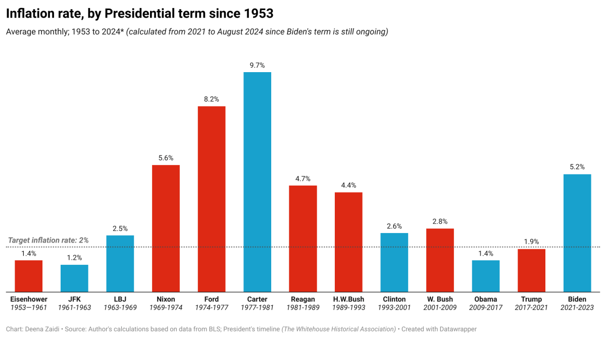

## Table of Contents

## What is inflation and how is it measured?

Inflation is when the prices of things we buy, like food and clothes, go up over time. It means that the money we have can buy less than it could before. Imagine if a candy bar cost $1 last year, but this year it costs $1.10. That's inflation. It happens because the amount of money in the economy grows faster than the number of goods and services available.

To measure inflation, economists use something called the Consumer Price Index, or CPI. The CPI looks at the prices of a big group of things that people commonly buy, like groceries, gas, and rent. They compare these prices over time to see how much they've gone up. If the CPI goes up by 2% in a year, that means, on average, prices have gone up by 2%. This helps us understand how fast inflation is happening and how it affects our daily lives.

## How does the U.S. presidency influence inflation rates?

The U.S. presidency can affect inflation rates through the policies and decisions made by the president and their administration. For example, if the president pushes for more government spending or tax cuts, it can increase the amount of money people have to spend. When people have more money, they might buy more things, which can drive up prices and lead to inflation. On the other hand, if the president supports policies that aim to control spending or raise taxes, it might slow down the economy and help keep inflation in check.

The president also appoints people to the Federal Reserve, which is in charge of setting interest rates. Interest rates can influence how much it costs to borrow money. If the Federal Reserve raises interest rates, borrowing becomes more expensive, and people might spend less, which can help lower inflation. If they lower interest rates, borrowing becomes cheaper, and people might spend more, which can push inflation up. So, the president's choices in who runs the Federal Reserve can indirectly affect inflation rates.

## What was the average inflation rate during the presidencies from 1953 to 2021?

From 1953 to 2021, the average inflation rate in the United States varied a lot depending on which president was in office. During this time, there were times when inflation was really high, like in the 1970s and early 1980s, and times when it was pretty low, like in the 1950s and 2000s. Overall, the average inflation rate across all these years was about 3.5% per year. This means that, on average, prices went up by about 3.5% every year during this period.

Different presidents had different impacts on inflation. For example, during Dwight D. Eisenhower's presidency from 1953 to 1961, the average inflation rate was around 1.3%. In contrast, during Jimmy Carter's term from 1977 to 1981, inflation was much higher, averaging about 11.2%. More recently, during Barack Obama's presidency from 2009 to 2017, the average inflation rate was about 1.7%. These differences show how economic policies and global events can affect inflation rates during different presidencies.

## Which U.S. president from 1953 to 2021 had the highest inflation rate during their term?

The U.S. president from 1953 to 2021 who had the highest inflation rate during their term was Jimmy Carter. He was president from 1977 to 1981, and during his time in office, the average inflation rate was about 11.2%. This was a time when prices were going up a lot, and it was hard for people because their money didn't go as far as it used to.

The high inflation during Carter's presidency was caused by many things. There were big increases in oil prices because of events in the Middle East, and the U.S. economy was growing fast, which made demand for goods and services go up. The government was also spending a lot of money, which added to the problem. All these things together made inflation go up a lot during Carter's term.

## Which U.S. president from 1953 to 2021 had the lowest inflation rate during their term?

The U.S. president from 1953 to 2021 who had the lowest inflation rate during their term was Dwight D. Eisenhower. He was president from 1953 to 1961, and during his time in office, the average inflation rate was about 1.3%. This means that prices didn't go up very much during those years, so people's money could buy almost the same amount of things from year to year.

Eisenhower's time in office was a period of relative economic stability. The U.S. was recovering from World War II, and the economy was growing steadily without big jumps in prices. Eisenhower's policies focused on keeping the economy balanced, which helped keep inflation low. This made life easier for people because their money kept its value better during his presidency.

## How did inflation rates vary across different decades from 1953 to 2021?

From 1953 to 1960s, inflation rates were pretty low. In the 1950s, the average inflation rate was around 2%. This was a time when the U.S. was still recovering from World War II, and the economy was growing steadily without big price jumps. The 1960s saw a bit more inflation, with an average rate of about 2.5%. Prices were going up a little faster, but it was still pretty manageable for most people.

The 1970s and early 1980s were a different story. Inflation got really high during these years. In the 1970s, the average inflation rate was around 7%, and it went up to about 10% in the early 1980s. This was because of things like oil price shocks and a lot of government spending. People felt the pinch because their money couldn't buy as much as before. But then, in the late 1980s and 1990s, inflation started to come down again. The average rate was about 3.5% in the 1980s and dropped to around 2.5% in the 1990s. This was a relief for people because prices weren't going up as fast.

From the 2000s to 2021, inflation rates stayed pretty low. In the 2000s, the average inflation rate was about 2.5%, and it went down to around 1.8% in the 2010s. This was a time when the economy was more stable, and the Federal Reserve worked hard to keep inflation in check. Even though there were some ups and downs, like during the financial crisis in 2008, overall, prices didn't go up too much during these years.

## What were the major economic policies implemented by presidents that affected inflation rates?

Presidents have used different economic policies to try to control inflation. For example, during the 1970s, President Richard Nixon tried to fight high inflation by putting controls on prices and wages. He thought that if he could stop prices from going up too fast, it would help keep inflation down. But these controls didn't work well and made things more confusing for businesses and people. Later, President Ronald Reagan took a different approach. He focused on cutting taxes and reducing government spending to slow down the economy and bring inflation under control. His policies helped lower inflation, but they also led to higher unemployment for a while.

More recently, presidents have worked with the Federal Reserve to manage inflation. For instance, during the 1990s, President Bill Clinton worked with the Federal Reserve to keep inflation low while the economy grew. They did this by keeping interest rates steady and not letting the economy grow too fast. This helped keep prices stable and made life easier for people. In the 2000s and 2010s, Presidents George W. Bush and Barack Obama faced different challenges. They had to deal with the financial crisis in 2008, which led to low inflation. They used policies like stimulus spending to help the economy recover, but they also had to be careful not to let inflation get out of control.

## How did global events impact U.S. inflation rates during these presidencies?

Global events had a big impact on U.S. inflation rates during these presidencies. For example, in the 1970s, oil prices went up a lot because of problems in the Middle East. This made everything more expensive because oil is used to make and move a lot of things. During President Jimmy Carter's time, this led to really high inflation. People had to pay more for gas, which made other prices go up too. Another big event was the financial crisis in 2008, which happened during President George W. Bush's term. It made the economy slow down a lot, and prices didn't go up as much as before. This kept inflation low for a while.

In the 1980s, global events also played a role in inflation. President Ronald Reagan's time saw the end of the high inflation from the 1970s, partly because the world economy started to recover. Countries started trading more with each other, which helped keep prices stable. During the 1990s, under President Bill Clinton, the world economy was doing well, and this helped keep U.S. inflation low. Global trade and technology made things cheaper to produce and buy, which helped keep prices from going up too fast. So, what happened around the world often had a big effect on how much prices went up in the U.S. during these years.

## What are the differences in inflation measurement methods used over the period from 1953 to 2021?

From 1953 to 2021, the main way to measure inflation in the U.S. has been the Consumer Price Index (CPI). The CPI looks at the prices of a big group of things that people commonly buy, like food, gas, and rent. Over the years, the way the CPI is calculated has changed a bit. In the early years, the CPI used a fixed basket of goods, which means it looked at the same things every time. But as time went on, the CPI started to use a more flexible basket that changes to reflect what people are actually buying. This makes the CPI a better measure of inflation because it can keep up with changes in how people spend their money.

Another change in measuring inflation came with the introduction of the Personal Consumption Expenditures Price Index (PCE) in the 1970s. The PCE is another way to measure inflation, and it's used by the Federal Reserve. The PCE looks at a wider range of spending, including things that the CPI might not cover, like spending by nonprofits and government. It also uses a different way to weigh the importance of different items, which can sometimes give a different picture of inflation than the CPI. Over time, the PCE has become an important tool for understanding inflation, especially because it can show how changes in consumer behavior affect prices.

## How did the Federal Reserve's policies interact with presidential policies to affect inflation?

The Federal Reserve and the president both have a big say in what happens with inflation, but they do different things. The Federal Reserve sets interest rates, which can make borrowing money more or less expensive. If the Fed raises interest rates, it can slow down the economy and help keep inflation in check. If they lower interest rates, it can make the economy grow faster, but it might also make prices go up more. Presidents, on the other hand, can affect inflation through their policies on spending and taxes. If a president pushes for more spending or tax cuts, it can put more money in people's pockets, which might make them spend more and push prices up. If they focus on cutting spending or raising taxes, it can slow down the economy and help keep inflation down.

The way the Federal Reserve and the president work together can really affect inflation. For example, during the 1980s, President Ronald Reagan wanted to cut taxes and spending to fight high inflation. The Federal Reserve, led by Paul Volcker, raised interest rates a lot to help with this. Together, these policies helped bring inflation down, but it was tough on the economy for a while. More recently, during the 2000s and 2010s, Presidents George W. Bush and Barack Obama had to deal with the financial crisis. They worked with the Federal Reserve to use stimulus spending to help the economy recover, but they also had to be careful not to let inflation get out of control. The Federal Reserve kept interest rates low to help the economy grow, which worked well to keep inflation stable during those years.

## What are the long-term economic impacts of high and low inflation rates during these presidencies?

High inflation during presidencies like Jimmy Carter's in the late 1970s and early 1980s had big effects on the economy. When prices go up a lot, people's money doesn't go as far, so they can't buy as much. This makes life harder for everyone, especially people who don't have a lot of money. Businesses also have a hard time because they don't know what prices will be in the future, so they might not want to invest or grow. High inflation can also make interest rates go up, which makes it more expensive to borrow money. This can slow down the economy and make it harder for people to buy houses or start businesses. But, after a while, the government and the Federal Reserve worked together to bring inflation down, which helped the economy get back on track.

Low inflation, like during the presidencies of Dwight D. Eisenhower in the 1950s and Barack Obama in the 2000s and 2010s, had different effects. When prices don't go up very much, people's money keeps its value better, so they can buy more things over time. This makes life easier for everyone because they don't have to worry as much about prices going up. Businesses also like low inflation because it's easier to plan for the future when prices are stable. Low inflation can help the economy grow steadily without big ups and downs. But if inflation is too low for too long, it can be a problem too, because people might not spend as much, and the economy might not grow as fast as it could. So, keeping inflation just right is important for a healthy economy.

## How can historical inflation data from 1953 to 2021 inform current and future economic policy?

Historical inflation data from 1953 to 2021 can help us make better economic policies today and in the future. By looking at the past, we can see what worked and what didn't. For example, we know that high inflation, like in the 1970s, can make life hard for people and slow down the economy. So, if we see inflation starting to go up a lot, we can use policies like raising interest rates or cutting government spending to keep it under control. On the other hand, we also know that too low inflation can make people not want to spend, which can slow down the economy too. So, if inflation is too low, we might need to do things like lowering interest rates or increasing government spending to get it back up to a healthy level.

Looking at how different presidents and the Federal Reserve worked together in the past can also help us make better decisions now. For instance, during Ronald Reagan's time, the Federal Reserve raised interest rates a lot to fight high inflation, and it worked, but it was tough on the economy for a while. This tells us that fighting inflation can be hard, but it's important to do it the right way. Also, during the financial crisis in 2008, the government and the Federal Reserve used stimulus spending and low interest rates to help the economy recover without letting inflation get out of control. This shows us that working together and using the right tools at the right time can help keep the economy stable and inflation in check.

## References & Further Reading

[1]: Federal Reserve Bank of St. Louis. ["FRED Economic Data."](https://fred.stlouisfed.org/) Explore a comprehensive collection of U.S. economic data, including inflation rates.

[2]: Volcker, Paul A., & Gyohten, T. (1992). "Changing Fortunes: The World's Money and the Threat to American Leadership." Times Books. A detailed exploration of monetary policies and their impacts during Volcker's tenure at the Federal Reserve.

[3]: Shiller, R.J. (1993). "Macro Markets: Creating Institutions for Managing Society's Largest Economic Risks." Oxford University Press. Discusses the management of economic risks, including inflation, through innovative financial instruments.

[4]: Greenspan, A. (2007). "The Age of Turbulence: Adventures in a New World." Penguin Books. Offers insights into the economic policies shaping the landscape during Greenspan's era at the Federal Reserve.

[5]: Malkiel, B.G. (2011). "A Random Walk Down Wall Street: The Time-Tested Strategy for Successful Investing." W. W. Norton & Company. Discusses efficient market hypothesis and the impact of technology on markets, including algorithmic trading.

[6]: Bernanke, B.S. (2013). "The Federal Reserve and the Financial Crisis." Princeton University Press. Provides an analysis of the Federal Reserve's role during financial crises and its impact on inflation.

[7]: Clinton Presidential Library. ["Economic Policy of the Clinton Administration."](https://en.wikipedia.org/wiki/Economic_policy_of_the_Bill_Clinton_administration) Details the economic strategies and their impacts on inflation and fiscal policy during the Clinton administration.

[8]: The White House. ["The Biden Administration’s Approach to the Economic Recovery."](https://www.whitehouse.gov/briefing-room/statements-releases/2024/08/13/fact-sheet-biden-harris-administration-takes-new-actions-to-lower-housing-costs-by-cutting-red-tape-to-build-more-housing/) An overview of President Biden's economic policies in response to the COVID-19 pandemic.

[9]: Hendershott, T., Jones, C.M., & Menkveld, A.J. (2011). "Does Algorithmic Trading Improve Liquidity?" Journal of Finance. Analyzes the effects of algorithmic trading on market liquidity, efficiency, and potential risks associated with it.