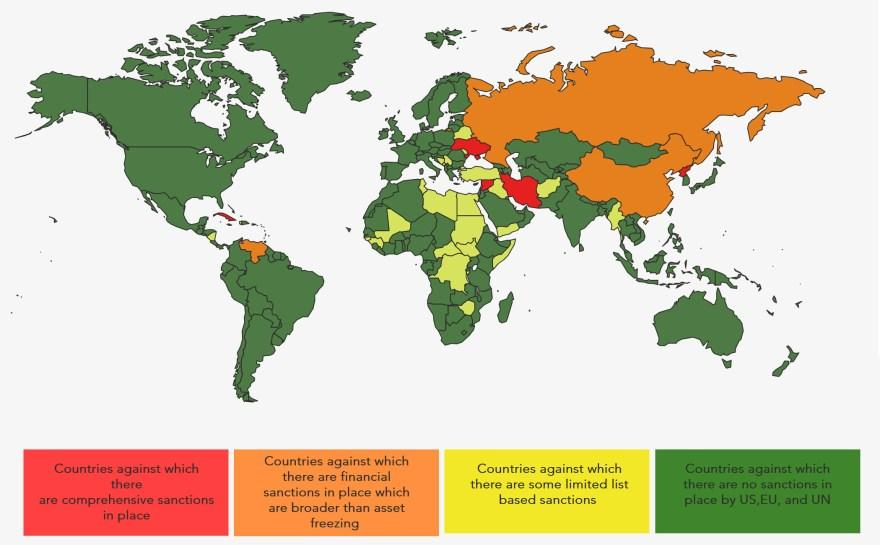

Economic sanctions serve as a crucial instrument in the arsenal of U.S. foreign policy, showcasing their profound impact on international relations. These measures are typically employed to exert pressure on nations, individuals, or entities to alter behavior perceived as threatening to global stability or American interests. Historically, U.S. sanctions have been pivotal in deterring nuclear proliferation, combating terrorism, and promoting human rights. The strategic deployment of economic sanctions emphasizes their importance as a non-military method to advance diplomatic objectives and influence geopolitical dynamics.

In contemporary settings, the importance of economic sanctions is underscored by their prevalence. Governments, particularly that of the United States, utilize these sanctions as a tool to impede financial transactions, restrict trade, and freeze assets, bringing about targeted disruption without resorting to armed conflict. The global nature of trade and interconnected financial networks ensures that sanctions can inhibit access to crucial resources and international markets, prompting reconsideration of policies by sanctioned entities. However, the effectiveness of sanctions remains a topic of debate, contingent on the specific geopolitical context and the resilience of the targeted entities.



Digital transformation in finance, exemplified by the rise of algorithmic trading, introduces new complexities to the landscape influenced by sanctions. Algorithmic trading, characterized by the use of automation and quantitative models for executing trades, can magnify the effects of sanctions in unpredictable ways. These trading systems can rapidly process and act on vast amounts of data, including real-time geopolitical developments, to optimize trading strategies. Consequently, the intersection of sanctions and algorithmic trading presents unique challenges, such as ensuring compliance with regulatory requirements and assessing the potential for automated systems to both evade and enforce sanctions.

This article aims to explore the dynamic interplay between U.S. sanctions and algorithmic trading. Through a comprehensive analysis, readers will gain insights into how sanctions are conceptualized and implemented, their role and impact on international diplomacy, and the implications for financial markets increasingly driven by algorithmic trading. Additionally, the article will address the ethical considerations and compliance challenges that arise when automated systems operate within a framework shaped by economic sanctions. As the world of global finance continues to evolve, understanding the confluence of these powerful tools becomes imperative for policymakers, financial institutions, and technology developers alike.

## Table of Contents

## Understanding U.S. Sanctions

Economic sanctions are deliberate, government-imposed restrictions against nations, entities, or individuals to hinder specific economic or political behaviors. Typically, these measures aim to compel a change in policy, curtail undesirable actions, or achieve foreign policy objectives without resorting to military intervention.

**Historical Context of U.S. Sanctions**

The United States has a storied history of utilizing sanctions, serving as both a strategic tool and an influential instrument in its foreign policy arsenal. The practice dates back to the early 19th century, notably with the Embargo Act of 1807, intending to pressure British and French powers during the Napoleonic Wars. Over the years, the U.S. has increasingly leveraged sanctions, evolving to address broader themes such as human rights, counter-terrorism, and nuclear non-proliferation. Prominent historical sanctions include those against the Soviet Union during the Cold War, Iran following the 1979 revolution, and South Africa during the apartheid era.

**Types of U.S. Sanctions**

The U.S. imposes a variety of sanctions, tailored to address specific objectives:

1. **Financial Sanctions**: These restrict access to financial markets and services. An example is the freezing of assets belonging to targeted entities or individuals.

2. **Trade Sanctions**: Such sanctions limit or prohibit trade with certain countries or entities. The Cuban embargo, initiated in 1960 and still partially in effect today, exemplifies this type.

3. **Individual Sanctions**: These target specific individuals, often through travel bans or asset freezes, to exert pressure on key figures within a regime or organization.

**Key Government Bodies Involved**

Several U.S. government agencies are pivotal in the design, implementation, and enforcement of sanctions:

- **U.S. Department of the Treasury**: Specifically, the Office of Foreign Assets Control (OFAC) administers and enforces economic and trade sanctions.

- **U.S. State Department**: It plays a crucial role in shaping foreign policy and often determines the strategic direction and scope of sanctions.

- **U.S. Department of Commerce**: Through its Bureau of Industry and Security (BIS), it controls exports that may be subject to trade sanctions.

**Recent Examples of U.S. Sanctions and Their Intended Impact**

In recent years, U.S. sanctions have adapted to contemporary geopolitical challenges. For instance, in response to geopolitical conflict and alleged cyber activities, the U.S. imposed significant sanctions on Russia. These measures were designed to weaken Russia's economic stability and deter further aggressive actions. Sanctions against Iran, particularly targeting its oil exports, have aimed to compel reconsideration of its nuclear ambitions. Additionally, the U.S. has sanctioned Chinese technology firms, reflecting concerns over national security and intellectual property rights.

In conclusion, U.S. sanctions have become a staple of international diplomacy, wielded as a tactical measure to influence global affairs. Understanding these sanctions' complexity is crucial for comprehending their profound implications on international relations and global economic landscapes.

## The Role of Economic Sanctions in International Relations

Economic sanctions have long been leveraged as a critical diplomatic tool within international relations, functioning as mechanisms to coerce, deter, constrain, or signal. The imposition of such measures by the United States exerts significant influence on both bilateral and multilateral relationships. By restricting access to financial markets and limiting trade, sanctions serve as a means of expressing disapproval or exerting leverage without direct military intervention[^1^].

### How Sanctions Are Used as a Diplomatic Tool

Sanctions are often employed to compel a change in behavior without escalating to military conflict. They can serve various goals, including the promotion of human rights, the deterrence of nuclear proliferation, and the weakening of hostile governments. The application of sanctions can be tailored, targeting specific individuals or entities, thereby minimizing harm to broader populations while maximizing pressure on decision-makers.

### Influence of U.S. Sanctions on Bilateral and Multilateral Relationships

U.S. sanctions have a substantial effect on both bilateral relations and multilateral diplomacy. Countries subjected to sanctions may experience strained relationships with the U.S., impacting everything from economic ties to security alliances. Multilaterally, U.S. sanctions can shape the policies of international bodies like the United Nations, as other member states may align with or oppose U.S. sanctions, affecting global diplomatic alignments.

### Impact of Sanctions on Global Trade and International Businesses

Sanctions disrupt global trade by creating barriers that limit market access. They can lead to supply chain interruptions, where sanctioned goods and services become scarce. International businesses may face fines or restrictions if they inadvertently engage with sanctioned entities. Consequently, sanctions can result in significant economic losses and shifts in global market dynamics.

### Limitations and Criticisms of Using Sanctions in Diplomacy

While sanctions can be powerful, they are not without limitations and criticisms. One major limitation is the potential for humanitarian issues, as sanctions may inadvertently harm civilian populations more than the intended governmental or corporate targets. Critics also argue that sanctions may not always achieve their objectives, citing prolonged sanctions with little change in the target’s behavior. Additionally, there is the risk of pushing the sanctioned entity towards resistance and further entrenchment of existing policies.

### Case Studies Showing the Efficacy and Shortcomings of Sanctions

1. **Iran Nuclear Deal**: Sanctions were pivotal in bringing Iran to negotiation over its nuclear program, leading to the Joint Comprehensive Plan of Action (JCPOA) in 2015. This exemplifies sanctions' effectiveness in achieving diplomatic goals when paired with engagement[^2^].

2. **North Korea**: Despite extensive sanctions, North Korea has continued its weapons development programs. This highlights the limitations of sanctions when lacking comprehensive international support and enforcement.

3. **Cuba**: The long-standing U.S. embargo against Cuba has had limited success in influencing political change, illustrating how prolonged sanctions can fail to meet objectives yet deeply affect civilian life and economic conditions[^3^].

In conclusion, while economic sanctions remain a key component of international diplomacy, their effectiveness varies considerably by context. Their successful deployment relies on clear objectives, international cooperation, and minimizing unintended consequences on civilian populations.

[^1^]: Hufbauer, G. C., Schott, J. J., & Elliott, K. A. (1990). *Economic Sanctions Reconsidered: History and Current Policy*.
[^2^]: Parsi, T. (2017). *Losing an Enemy: Obama, Iran, and the Triumph of Diplomacy*.
[^3^]: Peters, P. (2000). "Sanctions: Neither War Nor Peace," *World Policy Journal*.

## The Rise of Algorithmic Trading

Algorithmic trading, a method of executing orders using automated pre-programmed trading instructions, has become a cornerstone of modern financial markets. It involves the use of complex algorithms to make trading decisions at speeds and frequencies that are impossible for human traders. This approach to trading surged in popularity due to its ability to enhance efficiency and execution, reducing the occurrence of human error and emotional decision-making.

Technological advancements have been pivotal in the expansion of [algorithmic trading](/wiki/algorithmic-trading). Innovations in computing power, data analysis, and [machine learning](/wiki/machine-learning) have vastly increased the complexity and efficiency of trading algorithms. High-frequency trading ([HFT](/wiki/high-frequency-trading-strategies)), a subset of algorithmic trading, utilizes cutting-edge technology to execute a large number of orders at extremely fast speeds, often in the span of milliseconds. This rapid execution relies on advancements in hardware, such as field-programmable gate arrays (FPGAs), and software optimization to minimize latency.

Algorithms improve trading efficiency by analyzing vast datasets to detect patterns, trends, and signals that can be translated into actionable trading strategies. Algorithmic trading systems efficiently process information from multiple sources including historical data, current market conditions, and news articles to generate buy or sell decisions. They are also capable of executing complex trading strategies that can incorporate multiple dimensions, such as pairing trades to hedge risk or executing large volumes without significantly impacting market prices, commonly referred to as "iceberg" orders.

However, algorithmic trading is not without challenges and risks. One major risk is the potential for algorithmic anomalies or programming errors, which can result in significant financial losses, as demonstrated by the 2010 Flash Crash. Additionally, the competitive nature of high-frequency trading has led to concerns about market fairness, where sophisticated traders with advanced technology have an advantage over traditional investors. These challenges necessitate rigorous testing, robust risk management, and continuous monitoring of algorithmic systems.

Algorithmic trading is integrated into modern financial systems through various channels. It transacts across multiple asset classes, including equities, [forex](/wiki/forex-system), commodities, and derivatives. Many financial institutions, such as hedge funds and investment banks, employ dedicated teams to develop and maintain proprietary trading algorithms. Furthermore, exchanges and trading platforms offer co-location services, allowing traders to place their servers close to exchange systems to reduce latency.

The integration and prevalence of algorithmic trading have transformed financial markets. It has increased market [liquidity](/wiki/liquidity-risk-premium), reduced bid-ask spreads, and contributed to more efficient price discovery. Despite its challenges, the widespread adoption of algorithmic trading is a testament to technological progress ensuring that financial markets are more robust and dynamic than ever before.

## Intersection of Sanctions and Algorithmic Trading

Economic sanctions are potent tools used by countries to influence political or economic outcomes. With the rise of algorithmic trading, there is a significant intersection between sanctions and these trading strategies. Algorithmic trading, which uses computer algorithms to execute trades at high speed and [volume](/wiki/volume-trading-strategy), can be intricately affected by such sanctions.

### Effect of Sanctions on Algorithmic Trading Strategies

Sanctions can create unpredictability in markets, making traditional trading models reliant on historical data less effective. When a country imposes sanctions, the economic state of the targeted nation can shift, affecting the markets or companies linked to those economies. For example, sanctions on a major oil-producing country might lead to increased [volatility](/wiki/volatility-trading-strategies) in oil futures markets, requiring traders to adjust their algorithms to manage risks associated with such volatility.

Algorithmic trading systems might need to incorporate political risk factors into their models. This requires integrating geopolitical data and sentiment analysis into their trading strategies to predict market movements following new sanctions or geopolitical events.

### Regulatory Considerations for Algorithmic Trading

Regulatory compliance is essential for companies involved in financial markets, and algorithmic trading is no different. Sanctions complicate compliance for algorithmic traders, who must ensure that their trades do not violate any sanction laws. For instance, the U.S. Office of Foreign Assets Control (OFAC) enforces compliance with U.S. sanctions, and violating these can result in substantial fines and penalties.

Traders must incorporate sanction lists into their algorithms to ensure that no transactions involve blacklisted entities or individuals. This involves dynamic updating of entities data in algorithms to remain aligned with the latest regulatory frameworks.

### Potential for Algorithmic Trading to Circumvent Sanctions

While algorithmic trading can potentially circumvent sanctions by exploiting regulatory loopholes, this is fraught with legal and ethical issues. Algorithms could theoretically be designed to route trades through neutral countries, indirectly engaging with sanctioned entities. However, such circumvention is typically illegal and subject to stringent penalties.

Furthermore, modern compliance systems and international cooperation amongst regulatory bodies make it increasingly difficult for traders to exploit such loopholes without detection. Algorithms need robust checks and compliance measures to ensure they adhere to international laws.

### Impact of Geopolitical Events on Trading Algorithms

Geopolitical events can significantly impact market conditions, requiring algorithms to adapt quickly. For example, the imposition of sanctions on Russia in 2014, after the annexation of Crimea, led to immediate impacts on the Russian ruble and associated securities. The algorithms needed rapid recalibration to manage the accompanying currency volatility and market changes.

Programmers must build algorithms that incorporate feedback mechanisms and machine learning models capable of learning from these events, thus predicting potential impacts more accurately. This dynamic approach allows algorithms to respond proactively to political developments.

### Examples of Algorithmic Trading Responses to Sanctions Announcements

When sanctions are announced, there are often substantial market reactions. For instance, following a sanctions announcement, you might see a surge in the trading volume of commodities or securities connected to the affected country.

An example of algorithmic trading response could be the incorporation of event-driven strategies. Trading systems are designed to react to real-time news feeds and execute specific trades based on the key terms related to sanctions. For instance:

```python
import time
from newsapi import NewsApiClient

def check_sanction_news(api_key):
    newsapi = NewsApiClient(api_key=api_key)
    articles = newsapi.get_everything(q='sanctions', language='en', sort_by='publishedAt', page_size=5)

    for article in articles['articles']:
        print(f"Title: {article['title']}")
        print(f"Description: {article['description']}\n")
        # Implement trading strategy adjustment based on specific keywords or sentiment

# Call the function with your News API key
check_sanction_news('your_news_api_key')
```

This script utilizes a news API to continuously monitor for news about sanctions and could be extended to implement real-time adjustments to an algorithmic trading strategy. Such advanced trading systems ensure they are positioned to react promptly to any sanctions-related developments, minimizing potential losses or capitalizing on opportunities.

## Challenges and Ethical Considerations

The application of algorithmic trading within environments subject to U.S. sanctions presents a range of challenges and ethical considerations, affecting both the financial institutions that employ these technologies and the broader international system. At the core of these considerations is the potential for algorithms to inadvertently or deliberately facilitate transactions that contravene sanctions, thereby undermining the objectives of such measures. 

One primary challenge faced by financial institutions is ensuring compliance with the complex legal frameworks governing sanctioned environments. Algorithmic trading systems, which operate at high speeds and involve massive data sets, necessitate robust compliance mechanisms to prevent violations. The integration of compliance protocols into these systems can be arduous, requiring constant updates to reflect evolving legal stipulations. Real-time monitoring and adjustments are essential to ensure that trading algorithms do not inadvertently engage with sanctioned entities. 

The risks associated with unforeseen consequences are heightened by the autonomous nature of algorithmic trading. Algorithms designed to optimize financial returns may exploit loopholes or engage in trades with unintended geopolitical ramifications. Such actions can inadvertently breach compliance protocols, leading to severe legal and financial repercussions for implicated entities. This underscores the need for carefully crafted algorithms and comprehensive testing to anticipate and mitigate potential breaches.

Moral implications arise in discussions about the deployment of automated trading strategies in politically sensitive markets. The abstraction inherent in algorithmic processes can obscure the human impact of trading decisions, leading to ethically questionable outcomes. Debates persist over whether the use of algorithms in these contexts aligns with the broader goals of fairness and justice in international trade. Proponents argue for technological neutrality, while critics highlight the ethical responsibility of institutions to consider the human impact of automated trades.

Looking to the future, the ethical landscape of algorithmic trading in relation to international sanctions is likely to remain complex. As regulatory frameworks tighten in response to these challenges, financial institutions must balance the pursuit of economic efficiency with their ethical and compliance obligations. Developments in machine learning and [artificial intelligence](/wiki/ai-artificial-intelligence) may offer improved oversight and compliance capabilities, but they also introduce new dimensions of ethical responsibility. In conclusion, the evolution of algorithmic trading within sanctioned contexts will require ongoing reflection and adaptation to ensure alignment with international legal and ethical standards.

## Conclusion

In conclusion, this article has explored the multifaceted relationship between U.S. sanctions, international relations, and the world of algorithmic trading. U.S. sanctions play a critical role in global diplomacy, acting as both deterrents and tools for influencing international behavior. This complex intersection shapes not only nation-state interactions but also impacts global markets. Algorithmic trading, characterized by speed and efficiency, faces unique challenges and opportunities in navigating the landscape of economic sanctions. 

The significance of understanding this dynamic lies in the potential for algorithmic strategies to adapt or be hindered by geopolitical developments. Traders and financial institutions must remain vigilant in adhering to regulatory frameworks and ethical considerations, particularly in politically sensitive and sanctioned environments. The rise of technology in financial markets demands a prudent approach to mitigate risks associated with automated decision-making.

As global economic strategies continue to evolve, policymakers and financial entities must grapple with the implications of these interactions. The ongoing integration of technology in trade necessitates a thoughtful examination of future policies to balance innovation with regulatory oversight. Understanding the ripple effects of sanctions on algorithmic trading strategies could lead to more robust compliance mechanisms and ethical guidelines.

Future research can explore the nuanced impact of specific sanctions on trading algorithms and analyze the role of machine learning in predicting potential geopolitical risks. Additionally, there is a need to better understand how these technologies can support compliance efforts, ensuring that automated processes do not inadvertently breach international regulations. Continued examination of these intersections will inform both regulatory bodies and market participants as they navigate this complex global landscape.

## References & Further Reading

[1]: Hufbauer, G. C., Schott, J. J., & Elliott, K. A. (1990). *Economic Sanctions Reconsidered: History and Current Policy*. Peterson Institute for International Economics. 

[2]: Parsi, T. (2017). *Losing an Enemy: Obama, Iran, and the Triumph of Diplomacy*. Yale University Press.

[3]: Peters, P. (2000). "Sanctions: Neither War Nor Peace," *World Policy Journal*. [Available here](https://www.researchgate.net/publication/4981681_Sanctions_Neither_War_nor_Peace)

[4]: Lopez de Prado, M. (2018). *Advances in Financial Machine Learning*. Wiley.

[5]: Jansen, S. (2020). *Machine Learning for Algorithmic Trading: Predictive models to extract signals from market and alternative data*. Packt Publishing.

[6]: Chan, E. P. (2008). *Quantitative Trading: How to Build Your Own Algorithmic Trading Business*. Wiley.

[7]: Aronson, D. R. (2007). *Evidence-Based Technical Analysis: Applying the Scientific Method and Statistical Inference to Trading Signals*. Wiley. 

[8]: News API. [API for real-time monitoring of sanctions news](https://publicapis.io/opensanctions-api).