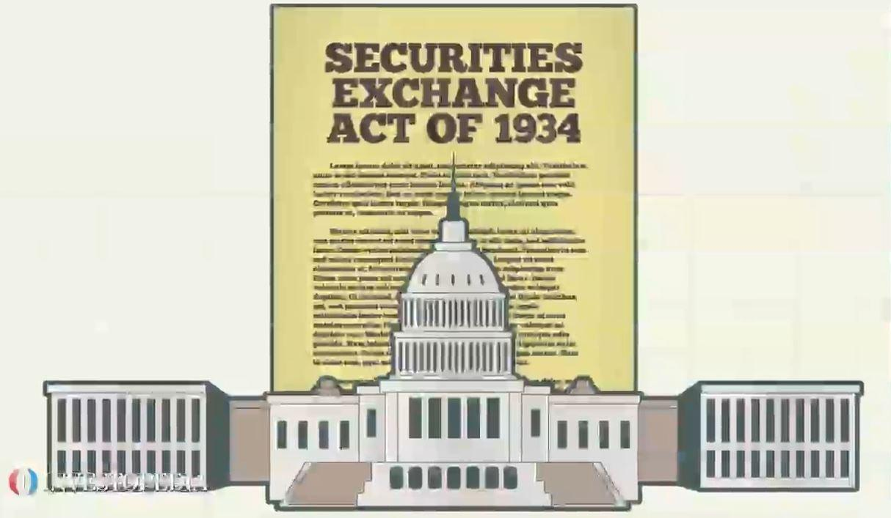

Financial markets are an integral part of the global economy, acting as conduits for the flow of capital and resources across national and international boundaries. These markets enable the buying and selling of financial assets, which are vital for investment and economic growth. Securities such as stocks, bonds, and derivatives play a central role in this process, offering investors vehicles for risk management and investment opportunities, while providing issuers with necessary capital.

Regulatory bodies play a crucial role in maintaining the integrity and stability of financial markets. In the United States, the U.S. Securities and Exchange Commission (SEC) stands as a pivotal institution in this regard. Established in response to the stock market crash of 1929 and the subsequent Great Depression, the SEC's primary mission is to protect investors, maintain fair and efficient markets, and facilitate capital formation. It achieves these goals through a variety of means, including enforcing securities laws, requiring periodic financial disclosures from public companies, and overseeing significant market participants like brokerage firms and exchanges.

The advent of algorithmic trading—where computer algorithms execute trades at speeds and volumes unmanageable by human traders—has introduced new complexities to financial markets. Algorithmic trading has fundamentally transformed the landscape of securities trading, offering increased liquidity and efficiency but also presenting unique challenges, such as market manipulation risks and flash crashes. As trading strategies grow in complexity, the need for effective regulation and oversight becomes paramount. The SEC has responded by adapting its regulatory framework to address these challenges, ensuring that the evolution of trading technologies does not compromise market stability or investor protection.

This article examines the interplay between financial regulation, the SEC, securities, and algorithmic trading, along with their combined role in ensuring market stability and investor protection. By understanding this relationship, we can appreciate the regulated structure that underpins modern financial markets and the ongoing efforts to adapt regulatory approaches to the nuances of contemporary trading environments.

## Table of Contents

## Understanding the Role of the SEC

The U.S. Securities and Exchange Commission (SEC) is a fundamental regulatory body within the United States that plays an essential role in the financial markets. Established in 1934 by the Securities Exchange Act, the SEC was created in response to the stock market crash of 1929 and the subsequent Great Depression. Its primary mission is to maintain fair, orderly, and efficient markets, foster capital formation, and protect investors from fraudulent practices.

The SEC oversees the securities markets, including stocks, bonds, and other financial instruments. One of its critical functions is the enforcement of federal securities laws, which are designed to ensure orderly market conduct and require that all market participants have access to essential and accurate information. By doing so, the SEC helps to prevent deceptive practices, such as insider trading and securities fraud, thereby safeguarding the interests of investors.

A pivotal aspect of the SEC's role involves mandating transparency and regular disclosure from public companies. This requirement compels companies to provide periodic reports that detail their financial standing and operational results, such as Form 10-K (annual reports) and Form 10-Q (quarterly reports). These disclosures are publicly accessible, allowing investors to make informed decisions based on the financial health and prospects of the company.

The SEC is also instrumental in facilitating capital formation. By ensuring investor confidence through strong regulatory practices, it creates an environment that encourages individuals and institutions to participate in the markets. This, in turn, helps businesses raise funds efficiently through the sale of securities, contributing to economic growth.

To effectively [carry](/wiki/carry-trading) out its mission, the SEC has a broad range of regulatory tools at its disposal, including rulemaking, inspections, and enforcement actions. It frequently collaborates with other regulatory agencies, both domestic and international, to address the challenges presented by increasingly complex global markets.

In summary, the SEC's efforts in regulating securities markets, ensuring transparency, and protecting investors are vital components of its role in maintaining market integrity. The agency's ongoing commitment to curbing market abuses and its adaptability to the evolving financial landscape underpin its status as a cornerstone of financial regulation in the United States.

 to Securities

Securities are financial instruments that represent an ownership position in a publicly-traded corporation via stocks, a creditor relationship with a governmental body or a corporation represented by the owning of bonds, or rights to ownership as represented by options. These assets can be traded on financial markets, facilitating the flow of capital and resources that underpin economic activity.

Securities play a crucial role in enabling both investment and financing within the economy. For investors, securities offer an opportunity to generate returns through dividends, interest payments, or the appreciation of asset values. For issuers, such as corporations and governments, securities provide a mechanism to raise funds for a multitude of purposes, including business expansion, infrastructure development, and debt financing.

The trading of these instruments is subject to stringent regulation intended to maintain confidence and integrity in the financial markets. Regulatory frameworks are designed to create a fair and competitive environment where market participants have equal access to information and a transparent view of market operations. In the United States, the Securities and Exchange Commission (SEC) is the primary agency responsible for enforcing the laws governing securities trading.

One of the primary objectives of the SEC is to protect investors from fraudulent practices that could jeopardize the integrity of financial markets. This involves the oversight of the securities markets to ensure that issuers provide full and accurate financial information. The SEC mandates that companies disclose material information that could affect investment decisions through regular reporting requirements, such as annual (Form 10-K) and quarterly (Form 10-Q) financial reports, as well as the disclosure of significant events (Form 8-K).

By regulating securities markets, the SEC helps in establishing a level playing field where informed decisions can be made by all market participants. This regulatory oversight not only helps to maintain market efficiency but also aims to boost investor confidence, which is essential for the smooth functioning of financial markets and overall economic growth.

## The Rise of Algorithmic Trading

Algorithmic trading refers to the use of computer programs to automate and execute trades at high speed and [volume](/wiki/volume-trading-strategy). This technological innovation has significantly altered the trading landscape, enabling rapid decision-making and execution beyond the capabilities of human traders. Its rise can be attributed to advancements in computing power, data availability, and sophisticated mathematical models that drive trading decisions.

### Growth and Impact

The proliferation of [algorithmic trading](/wiki/algorithmic-trading) has been marked by its rapid growth across global financial markets. This mode of trading now accounts for a substantial portion of market transactions, especially in liquid markets such as equities and foreign exchange. A key component of algorithmic trading is high-frequency trading ([HFT](/wiki/high-frequency-trading-strategies)), which focuses on executing a large number of orders within extremely short timeframes. HFT strategies exploit minute price discrepancies across various markets, thereby enhancing market [liquidity](/wiki/liquidity-risk-premium) by narrowing bid-ask spreads.

### Benefits and Challenges

Algorithmic trading offers numerous benefits, primarily through enhanced efficiency and speed of transactions. It allows for the execution of complex strategies that can respond to market conditions in microseconds, optimizing profit outcomes and minimizing risk exposure. However, these advantages come with distinct challenges. The fast-paced nature of algorithmic trading can introduce systemic risks, such as flash crashes, where drastic price drops occur within extremely short periods. These events are often exacerbated by the interconnectedness of automated systems quickly reacting to price signals without human intervention.

### Regulatory Imperative

Given the risks associated with algorithmic trading, regulatory oversight is crucial to ensure market stability and prevent manipulation. For instance, latency [arbitrage](/wiki/arbitrage), a form of HFT, exploits delays in the dissemination of market information, potentially resulting in an uneven playing field. Regulating such practices requires a combination of technological and policy measures to detect and mitigate unfair advantages.

The need for robust regulation is underscored by past market disturbances linked to algorithmic trading. These events have prompted calls for transparency in algorithmic strategies and the implementation of mechanisms such as circuit breakers to curtail extreme market movements. Effective safeguards and controls, aligned with technological advancements, are essential to fostering a fair and stable trading environment.

### Modern Considerations

As algorithmic trading continues its upward trajectory, new technological paradigms like [machine learning](/wiki/machine-learning) and [artificial intelligence](/wiki/ai-artificial-intelligence) are increasingly being integrated into trading algorithms. This evolution demands that regulatory frameworks adapt to address novel challenges these technologies may present. Properly balancing innovation with risk management will be key to harnessing the full potential of algorithmic trading while safeguarding market integrity.

## Regulating Algorithmic Trading: The SEC's Approach

The U.S. Securities and Exchange Commission (SEC) has implemented a comprehensive regulatory framework to address the challenges and risks posed by algorithmic trading. This framework emphasizes several key areas to ensure market integrity and stability. 

A primary focus of the SEC's regulatory efforts is to ensure robust supervision and control practices within firms that engage in algorithmic trading. These practices are essential to manage the risks associated with complex algorithmic strategies. To this end, the SEC mandates that firms implement stringent testing and validation processes for their trading algorithms. This involves stress testing these algorithms under a variety of market conditions to identify potential failures or vulnerabilities. The goal is to ensure that the algorithms behave as expected and do not inadvertently disrupt market stability. 

Moreover, the SEC places significant emphasis on fostering effective communication between a firm's compliance staff and its algorithm developers. This communication ensures that compliance considerations are integrated into the algorithm development process from the outset. The SEC's requirements include establishing protocols for timely updates and adjustments to trading algorithms in response to regulatory changes or identified risks.

The SEC also requires that firms maintain detailed documentation and records of their algorithms, including any modifications or adaptations made to the algorithms. This transparency is crucial for both internal audits and external regulatory reviews, allowing for accountability and traceability in trading operations.

Furthermore, the SEC's rules are designed to mitigate the adverse impacts algorithmic trading could have on market and firm stability. The regulations include provisions for real-time monitoring and rapid response capabilities to address any unintended consequences of algorithmic trading. By setting these standards, the SEC aims to create a secure trading environment that both leverages the efficiencies of algorithmic trading and safeguards against potential systemic risks.

Ultimately, the SEC's regulatory approach recognizes the need for a balanced framework that supports technological innovation in trading while ensuring robust safeguards are in place to protect market participants and maintain overall market confidence.

## Conclusion

Financial regulation is instrumental in ensuring the stability and security of global securities markets. The U.S. Securities and Exchange Commission (SEC) occupies a central position in this regulatory framework, adeptly managing the challenges and complexities brought about by modern trading technologies, particularly algorithmic trading. As these technologies evolve, especially with the dynamic nature of algorithmic trading, the necessity for continual adaptation in regulatory strategies becomes evident. 

The SEC's proactive regulatory measures are designed to uphold market integrity and protect investors from potential malpractices. By implementing rules and guidelines that address the intricacies of electronic and algorithmic trading, the SEC fosters a secure trading environment that mitigates risks such as market manipulation and systemic failures. This involves not only imposing regulations but also ensuring that they are flexible enough to accommodate new developments in trading technologies. 

In a financial world characterized by rapid technological advancements, the SEC’s role remains indispensable. Its ability to adapt regulatory frameworks in response to emerging trading trends ensures that the financial markets operate smoothly, fairly, and efficiently. As trading strategies and technologies continue to advance, the SEC's ongoing commitment to refining its regulatory approach is crucial for maintaining trust and stability in the financial markets.

## References & Further Reading

[1]: Malkiel, B. G. (2019). ["A Random Walk Down Wall Street: The Time-Tested Strategy for Successful Investing."](https://www.amazon.com/Random-Walk-Down-Wall-Street/dp/0393358380) W.W. Norton & Company.

[2]: Lopez de Prado, M. (2018). ["Advances in Financial Machine Learning."](https://www.amazon.com/Advances-Financial-Machine-Learning-Marcos/dp/1119482089) Wiley.

[3]: Aldridge, I. (2013). ["High-Frequency Trading: A Practical Guide to Algorithmic Strategies and Trading Systems."](https://www.wiley.com/en-us/High+Frequency+Trading%3A+A+Practical+Guide+to+Algorithmic+Strategies+and+Trading+Systems-p-9780470579770) Wiley.

[4]: Securities and Exchange Commission. ["The Investor's Advocate: How the SEC Protects Investors, Maintains Market Integrity, and Facilitates Capital Formation."](https://www.sec.gov/news/studies/2009/oig-509/exhibit-0356.pdf)

[5]: SEC Staff Report on Algorithmic Trading. ["U.S. Equity Market Structure Literature Review Part II: High Frequency Trading."](https://www.sec.gov/about/reports-publications/algo_trading_report_2020)

[6]: Hasbrouck, J., & Saar, G. (2013). ["Low-Latency Trading."](https://www.sciencedirect.com/science/article/abs/pii/S1386418113000165) The Review of Financial Studies, 26(9), 2585-2627.

[7]: Hendershott, T., Jones, C. M., & Menkveld, A. J. (2011). ["Does Algorithmic Trading Improve Liquidity?"](https://onlinelibrary.wiley.com/doi/full/10.1111/j.1540-6261.2010.01624.x) The Journal of Finance, 66(1), 1-33.

[8]: Securities and Exchange Commission. ["SEC Rulemaking: Individual Rules."](https://www.sec.gov/rules-regulations)