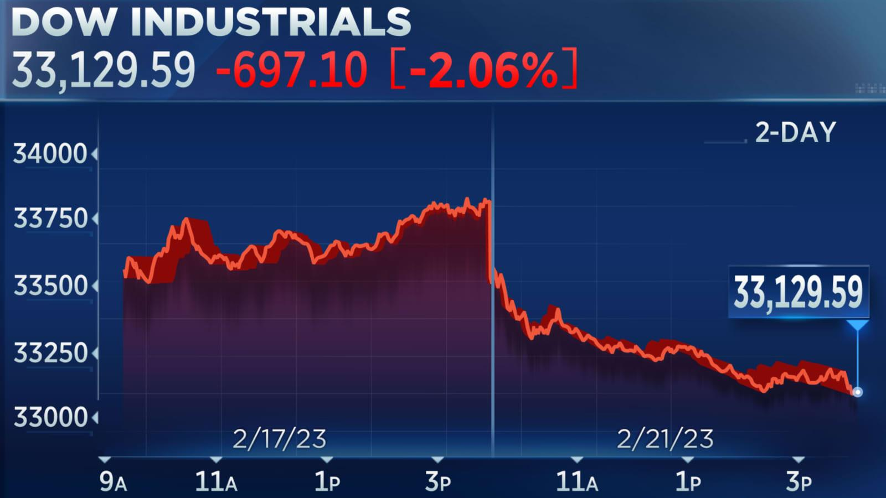

Algorithmic trading has fundamentally reshaped trade execution in the US stock market by utilizing computer algorithms to automate trading decisions and operations. This shift has been facilitated by rapid technological advancements, which have significantly increased the need for access to both real-time and historical US stock market data. This data is essential for executing trades effectively, as it allows traders to make informed and timely decisions based on market conditions and trends.

The use of algorithmic trading in the US stock market has grown extensively, and its impact is evident in the substantial portion of trade volume it represents. A critical aspect of algorithmic trading is the ability to analyze data to predict market behavior, optimize trading strategies, and achieve efficient trade execution. Thus, the significance of comprehensive and accurate market data cannot be overstated.



In this article, we will explore how data supports algorithmic trading strategies and discuss innovative solutions that enhance access to this critical resource. The focus is on evaluating how real-time market data, in conjunction with historical analyses, forms the backbone of modern algorithmic trading, enabling professional traders to keep pace with an ever-evolving market landscape.

## Table of Contents

## Overview of Algorithmic Trading

Algorithmic trading employs sophisticated algorithms to automate the execution of trades, substantially reducing the need for human intervention. This method involves traders inputting pre-determined instructions that guide the execution of trades according to specific market conditions. These predefined criteria can include various factors such as price levels, timing, and trading [volume](/wiki/volume-trading-strategy).

One significant advantage of [algorithmic trading](/wiki/algorithmic-trading) is the ability to process vast amounts of data with speed and precision. This capability allows traders to execute orders more efficiently than would be possible through manual trading. Trades can be executed at optimal prices, ensuring better returns on investment due to the capability to quickly respond to market fluctuations.

The impact of algorithmic trading is particularly pronounced in the US stock market, where it accounts for an estimated 60-75% of the total trading volume. This dominance underscores the prominence and reliability of algorithm-driven strategies in navigating the complexities of modern financial markets. These algorithms have become integral to the market structure, influencing everything from price formation to [liquidity](/wiki/liquidity-risk-premium) provision.

Algorithmic strategies range from high-frequency trading, which executes a large number of orders at extremely high speeds, to strategies that focus on statistical [arbitrage](/wiki/arbitrage). The versatility of algorithmic trading supports diverse trading goals, from risk management to [market making](/wiki/market-making), catering to both institutional and individual traders.

Overall, the emergence and growth of algorithmic trading have revolutionized the landscape of the US stock market, offering enhanced efficiency, increased accuracy, and significant scalability in executing trades. This advancement reflects a broader trend of technological integration within financial markets, facilitating a more dynamic and competitive trading environment.

## The Importance of US Stock Market Data

The importance of US stock market data in algorithmic trading cannot be overstated, as timely and accurate information serves as the backbone for informed decision-making processes. Such data sets offer crucial insights into historical trends, present market conditions, and potential future movements, all of which are essential for constructing effective trading strategies.

Having access to real-time market data allows traders to respond promptly to market fluctuations, making milliseconds count in the execution of trades. This immediacy is particularly important in high-frequency trading, where speed is paramount. On the other hand, historical market data is indispensable for [backtesting](/wiki/backtesting) trading algorithms. By analyzing past market performances, traders can evaluate the efficacy of their strategies, refine their algorithms, and optimize their performance for future trades. Backtesting involves applying trading algorithms to historical data to see how they would have performed in past market conditions before deploying them in real-world scenarios. This process helps in identifying potential pitfalls and making necessary adjustments to strategies.

Moreover, comprehensive market data provides a more holistic view of stock performance. Apart from price and volume, datasets may include additional indicators such as moving averages, Bollinger bands, and RSI (Relative Strength Index), which can be crucial in predicting market trends. For example, a basic moving average (MA) can be calculated as follows:

$$
\text{MA} = \frac{\sum_{i=1}^{n} P_i}{n}
$$

where $P_i$ represents the price at time $i$ and $n$ denotes the number of data points in the period being analyzed.

Python, a widely used programming language in algorithmic trading, offers various libraries, including Pandas and NumPy, that facilitate the analysis and manipulation of market data. For instance, calculating a moving average in Python can be as straightforward as:

```python
import pandas as pd

# Assume 'data' is a Pandas DataFrame with a 'Close' column representing closing prices
data['Moving_Average'] = data['Close'].rolling(window=20).mean()
```

In conclusion, the utility of US stock market data spans real-time decision-making, historical analysis for backtesting, and the application of technical indicators, all contributing to the enhancement of algorithmic trading strategies. As such, ensuring access to precise and comprehensive market data is a vital component for traders aiming to achieve success in the dynamic environment of algorithmic trading.

## Types of Stock Market Data

Stock market data is an integral component for executing effective algorithmic trading strategies. Among the various forms of stock market data, three types stand out as particularly essential: real-time data, historical data, and corporate actions data.

**Real-time Data:** Access to live data streams is fundamental for executing high-frequency trades, where orders are placed within fractions of a second. This type of data includes up-to-the-moment information on stock prices, bid/ask prices, and trade volumes. The immediacy of real-time data enables traders to respond swiftly to market movements, capturing arbitrage opportunities and optimizing order execution. Platforms providing access to such data often use APIs to deliver information with minimal latency, crucial for high-speed trading algorithms.

**Historical Data:** Historical market data comprises past information on stock prices, indices, and trading volumes over various periods. By analyzing historical data, traders can identify patterns, trends, and anomalies that inform the development and backtesting of trading strategies. For instance, historical price data is frequently used to compute technical indicators like moving averages, which can inform buy or sell signals. Additionally, historical data supports machine learning models that predict future prices based on past trends.

**Corporate Actions:** Corporate actions refer to events initiated by a company that impact its stockholders. These can include stock splits, dividends, mergers, and acquisitions. Understanding corporate actions is vital for evaluating a stock's performance over time. For example, a stock split changes the number of shares outstanding, affecting the share price proportionally, which traders must adjust for in their algorithms to maintain accurate pricing models. Corporate actions data ensures that the valuation metrics used in algorithmic strategies are comprehensive and reflect true market conditions.

In conclusion, real-time, historical, and corporate actions data collectively facilitate a robust trading environment. By seamlessly integrating these data types, traders can craft algorithms that are both reactive to current market conditions and reflective of historical market dynamics, thus enhancing their trading performance.

## Innovative Solutions for Data Access

Databento provides a robust platform designed for seamless access to live, historical, and raw market data through Application Programming Interfaces (APIs). These APIs are pivotal for traders seeking efficient data retrieval methods, crucial for executing algorithmic trading strategies in dynamic market conditions. By incorporating diverse asset classes such as equities, options, and futures, Databento enhances the breadth of opportunities available to traders. The platform's commitment to offering diverse asset classes supports traders in creating multifaceted trading strategies that can adapt to various market conditions.

A key advantage of Databento's services lies in its dedicated connectivity options prioritizing low latency. Low latency is critical for algorithmic trading, where the speed of data delivery can significantly impact trade execution outcomes. Fast data delivery enables traders to respond promptly to market fluctuations, enhancing the likelihood of capturing favorable trading opportunities.

Databento's Equities Basic service stands out with several notable features. It offers zero distribution license fees, which can reduce overall costs for trading firms and individual traders by eliminating recurring charges associated with data distribution licenses. This financial benefit allows users to allocate resources to other critical areas, such as strategy development and technology infrastructure.

Moreover, the platform provides real-time data sourced from multiple venues. Access to real-time data from numerous venues allows traders to integrate various data streams, offering a comprehensive view of market conditions across different trading platforms. Such integration is crucial for executing informed trading decisions and capitalizing on market inefficiencies.

Furthermore, Databento presents a versatile pricing model. This flexibility ensures that traders can access data solutions tailored to their specific needs and trading volumes, making it an appealing choice for both small-scale traders and large institutional firms. By accommodating various trading profiles, Databento democratizes access to high-quality market data, empowering a broader range of market participants.

In conclusion, Databento's innovative solutions in market data access underscore its role as a critical facilitator in algorithmic trading. By offering low-latency connectivity, diverse asset classes, and adaptable pricing structures, the platform addresses the core needs of contemporary traders in the rapidly evolving US stock market.

## Benefits of Databento Services

Databento provides real-time and historical data that is essential for supporting algorithmic trading on a large scale. One of the key advantages of using Databento's services is the ability to access comprehensive and diverse data sets through their advanced API. This API enables traders to seamlessly integrate necessary market data into their trading algorithms, facilitating efficient and precise trade executions. By ensuring smooth integration, traders are able to minimize latency and enhance the speed at which trades are executed, which is crucial for high-frequency trading strategies.

An additional benefit is the flexibility in Databento's pricing structures. This allows traders to access data cost-effectively, catering to different trading volumes and specific needs. Such flexibility ensures that users only pay for what they require, avoiding unnecessary expenditure on data services. As the necessity for accurate and fast market data grows, Databento’s scalable solutions offer a significant advantage for traders aiming to optimize their algorithmic trading operations.

## Conclusion

The integration of comprehensive market data plays a pivotal role in ensuring the efficacy of algorithmic trading strategies. With an influx of complex algorithms and the need for precision timing, access to high-quality market data enhances the accuracy of trade execution and strategy formulation. Platforms such as Databento demonstrate a commitment to innovation by providing robust data solutions that assist traders in navigating these complexities. Databento's services enable algorithmic traders to leverage real-time and historical data efficiently, offering a combination of speed, accuracy, and cost-effectiveness.

The continued advancement of technology promises significant enhancements in market data dissemination. These improvements are anticipated to further support algorithmic trading by fostering quicker and more reliable data transfers, reducing latency, and broadening the accessibility of diverse data sets. As a result, algorithmic trading strategies are expected to become increasingly sophisticated, harnessing emerging technologies to gain a competitive advantage in the US stock market. This trajectory suggests that platforms which prioritize innovation and responsiveness to market needs will remain integral to the evolving landscape of algorithmic trading.

## References & Further Reading

[1]: Bergstra, J., Bardenet, R., Bengio, Y., & Kégl, B. (2011). ["Algorithms for Hyper-Parameter Optimization."](https://papers.nips.cc/paper/4443-algorithms-for-hyper-parameter-optimization) Advances in Neural Information Processing Systems 24.

[2]: ["Advances in Financial Machine Learning"](https://www.amazon.com/Advances-Financial-Machine-Learning-Marcos/dp/1119482089) by Marcos Lopez de Prado

[3]: ["Evidence-Based Technical Analysis: Applying the Scientific Method and Statistical Inference to Trading Signals"](https://www.amazon.com/Evidence-Based-Technical-Analysis-Scientific-Statistical/dp/0470008741) by David Aronson

[4]: ["Machine Learning for Algorithmic Trading"](https://github.com/stefan-jansen/machine-learning-for-trading) by Stefan Jansen

[5]: ["Quantitative Trading: How to Build Your Own Algorithmic Trading Business"](https://books.google.com/books/about/Quantitative_Trading.html?id=j70yEAAAQBAJ) by Ernest P. Chan