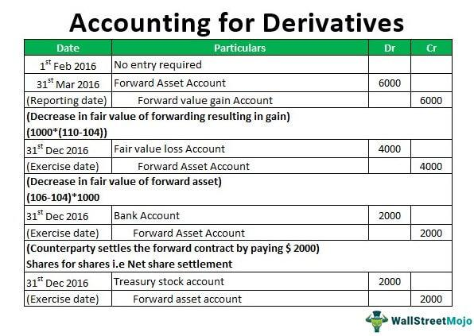

The financial landscape continually transforms as market participants seek innovative ways to generate income and manage risk. Among these innovations, derivatives have played a pivotal role in reshaping income strategies and offering unprecedented flexibility and precision. Derivatives are financial instruments whose value is based on underlying assets such as stocks, commodities, or currencies. These versatile tools allow for diverse strategies, ranging from hedging to speculative trading, making them indispensable in modern finance.

When derivatives are paired with algorithmic trading, their potential is significantly augmented. Algorithmic trading utilizes computer programs to execute trades based on predefined criteria, such as price, timing, or volume. This method enhances trading efficiency by executing orders at speeds and scales that surpass human capabilities. As a result, traders can optimize their strategies to capitalize on market movements, enhance liquidity, and reduce transaction costs.



This exploration embarks on a comprehensive journey into how derivatives are utilized for income generation. It highlights the synergy between derivatives and algorithmic trading, an intersection that opens new avenues for maximizing returns while effectively managing risks. By integrating advanced trading algorithms with the diverse array of derivatives, traders and investors are equipped with sophisticated tools to navigate the complexities of financial markets.

For traders and investors aiming to harness these instruments, understanding their mechanics and potential implications on income generation strategies is crucial. This guide seeks to provide valuable insights into how derivatives, supported by algorithmic trading, can be leveraged to achieve consistent income. It emphasizes the importance of staying informed and adaptable to new developments to succeed in an environment where technology and finance are inexorably linked.

## Table of Contents

## Understanding Derivatives

Derivatives are sophisticated financial instruments whose value is intrinsically linked to an underlying asset, which can range from stocks and bonds to commodities like oil or gold, and currencies such as the euro or yen. This intrinsic linkage allows derivatives to mirror the price movements of these assets, providing investors with opportunities for speculation, hedging, and arbitrage without requiring direct ownership.

Several types of derivatives are widely utilized in financial markets, each designed to meet specific investment strategies and risk management needs:

1. **Options**: Options are contracts that give the holder the right, but not the obligation, to buy or sell an underlying asset at a predetermined price, known as the strike price, on or before a specific date. The most common types of options are call options, which allow the purchase of the asset, and put options, which allow the sale. Options are frequently used to hedge against price fluctuations or to speculate on future price directions.

2. **Futures**: Futures contracts obligate the buyer to purchase, or the seller to sell, an asset at a predetermined future date and price. Unlike options, futures contracts require the transaction to occur at the expiry date, making them a binding commitment. Futures are widely used in commodities markets to hedge against price changes, such as agricultural products or crude oil.

3. **Forwards**: Forwards are similar to futures in that they involve the agreement to buy or sell an asset at a predetermined price at a future date. However, forwards are over-the-counter (OTC) contracts, meaning they are privately negotiated and customized, whereas futures are standardized and traded on exchanges. This customization allows for tailored risk management solutions but typically involves higher counterparty risk.

4. **Swaps**: Swaps involve the exchange of cash flows between two parties and are often used for managing interest rate exposure or currency exchange risks. The most common types are interest rate swaps, where parties exchange fixed-rate payments for floating-rate payments, and currency swaps, where principal and interest payments in different currencies are exchanged.

The pivotal role of derivatives in financial markets stems from their ability to provide mechanisms for hedging risks, such as commodity price [volatility](/wiki/volatility-trading-strategies) or [interest rate](/wiki/interest-rate-trading-strategies) fluctuations, and to capitalize on market inefficiencies. For example, a corporate treasurer might use futures contracts to lock in the cost of raw materials, while a portfolio manager might write covered call options to generate additional income from holding a stock.

Understanding the characteristics and functionalities of derivatives is critical for effectively leveraging them in income generation strategies. Derivatives can serve as powerful tools when used judiciously; however, they also [carry](/wiki/carry-trading) significant risks, including leverage and counterparty risk. The potential for both substantial gains and losses necessitates a comprehensive understanding of these instruments to optimize their use in various financial applications.

## Income Generation through Derivatives

Derivatives offer a variety of strategies for generating income, notably through the selling or "writing" of options. This method involves writing options to capture premiums, effectively using the price movements of underlying assets to gain returns. One of the most popular options strategies is the covered call, where an investor holds a long position in an asset while simultaneously selling call options on the same asset. This approach can yield additional income through the premium collected from the call option, reducing the overall cost basis of the owned stock. The covered call strategy is particularly beneficial in a neutral or slightly bullish market, where the underlying asset is not expected to experience significant price surges.

Options income funds also utilize a similar mechanism, focusing on premium collection while managing risks. These funds systematically implement options strategies across a diversified portfolio, aiming to generate consistent income streams for investors. They make use of put options as well, where investors are paid a premium to buy securities at pre-set prices, further enhancing income opportunities.

Beyond options, futures and swaps provide additional opportunities for income generation. Futures contracts obligate the parties to buy or sell an asset at a predetermined future date and price, which can be utilized to anticipate market trends and secure cash flows. For instance, using interest rate futures, investors can lock in yields and hedge against potential rate changes. Similarly, swaps—particularly interest rate swaps—offer a mechanism for institutions to manage and optimize their cash flows. By swapping floating rate payments for fixed rate payments or vice versa, firms can enhance their [liquidity](/wiki/liquidity-risk-premium) or protect against interest rate volatilities.

Understanding market conditions is critical when employing these strategies, as derivatives are sensitive to changes in volatility, interest rates, and asset prices. Successfully navigating these factors involves assessing the risk-reward profiles of derivative instruments and aligning them with financial goals. For instance, options strategies often rely on implied volatility, a measure of the market's anticipated future volatility, which can significantly impact an option's premium. Thus, effective implementation requires constant market analysis and adjustment of strategies to maximize potential returns while mitigating risks.

Incorporating these derivatives practices into diversified income strategies allows investors to exploit different aspects of market movements. By balancing options, futures, and swaps within an overarching strategy, investors can achieve a stabilized income stream that complements traditional investment vehicles like equities and bonds. This diversified approach not only enhances potential returns but also spreads risk across various asset classes and market conditions, contributing to a more resilient investment portfolio.

## Algorithmic Trading in Derivatives

Algorithmic trading represents a transformative advancement in the derivatives market, employing sophisticated computer programs to execute trades with remarkable speed and precision. This technology leverages complex algorithms capable of processing vast arrays of data, identifying patterns, and generating trading signals that inform decision-making processes.

The algorithms employed in this trading technique utilize various mathematical models, [machine learning](/wiki/machine-learning), and statistical methods to forecast market trends and optimize trade execution. For example, they might use time series analysis or stochastic calculus to predict price movements. An essential function of these algorithms is to recognize [arbitrage](/wiki/arbitrage) opportunities or inefficiencies within the market that can be exploited for profit. A common strategy involves the implementation of mean-reversion models, where algorithms predict the likelihood of a price reverting to its historical average.

Python, widely used in [algorithmic trading](/wiki/algorithmic-trading), offers numerous libraries such as NumPy, pandas, and scikit-learn for data analysis, making it a preferred language for developing trading models. A simple example of a trading signal based on moving averages can be created using Python:

```python
import numpy as np
import pandas as pd

# Example data: closing prices
data = {'Close': [100, 102, 101, 104, 107, 109]}
df = pd.DataFrame(data)

# Calculate short-term and long-term moving averages
df['Short_MA'] = df['Close'].rolling(window=2).mean()
df['Long_MA'] = df['Close'].rolling(window=3).mean()

# Generate trading signals
df['Signal'] = np.where(df['Short_MA'] > df['Long_MA'], 'Buy', 'Sell')
print(df)
```

This example showcases basic signal generation, detecting buy and sell opportunities when a short-term moving average crosses a long-term moving average.

Incorporating algorithmic trading into derivatives strategies allows for significant advantages. Automated trading systems reduce human errors and biases, improve trading efficiency by executing trades at optimal moments, and are particularly effective in high-frequency trading environments where market conditions change rapidly. Furthermore, they democratize access to complex trading strategies, enabling both retail and institutional traders to participate in the derivatives market with sophisticated tools.

As algorithmic trading technologies continue to evolve, their integration with derivatives strategies enhances potential for income generation. These advanced systems can implement complex strategies such as delta hedging or volatility arbitrage with precision, adapting swiftly to changing market conditions.

Furthermore, algorithmic trading has significantly impacted modern financial markets by increasing liquidity and contributing to the market's overall efficiency. However, the increased speed and complexity also require stringent risk management and monitoring to mitigate potential systemic risks.

Algorithm-driven trading remains a dynamic and vital component of financial markets, pushing the frontier of what's possible in income generation and risk management through derivatives. As technological innovation continues, its role in derivatives trading is poised to expand, presenting both challenges and opportunities for market participants.

## Risks and Challenges in Derivatives Trading

Trading derivatives presents significant opportunities for income generation, yet it is imbued with inherent risks that must be astutely managed to safeguard investments and ensure sustainable profitability. At the heart of these risks are leverage and market volatility, which can exponentially amplify both gains and losses. Leverage, a defining characteristic of derivatives, allows traders to control larger positions with a relatively small amount of capital. However, this magnification of one's exposure also means that adverse price movements can quickly erode equity, necessitating a thorough understanding and prudent management.

Market volatility is another critical [factor](/wiki/factor-investing), often unpredictably affecting derivative prices. Volatility can result in substantial price swings that might deviate from expected movements, posing threats to trading strategies, particularly those employing high leverage. Therefore, developing and adhering to effective risk management strategies is crucial. This can include setting strict stop-loss orders to limit potential losses, diversifying positions to spread risk, and maintaining sufficient margin levels to withstand market fluctuations.

In addition to financial risks, the technological landscape of derivatives trading introduces operational and cybersecurity challenges. As trading platforms increasingly rely on sophisticated technologies, the potential for system failures or cyberattacks becomes a significant concern. Such events can disrupt trading activities, cause financial losses, and erode trust in trading systems. It is, therefore, essential to implement robust operational protocols and cybersecurity measures to mitigate these risks.

Organizations and individual traders alike must develop comprehensive risk management frameworks that address both financial and operational threats. These frameworks should include regular stress testing of trading strategies under various market scenarios, continuous monitoring of technology infrastructures for potential vulnerabilities, and adherence to regulatory requirements that govern derivatives trading.

For those involved in derivatives trading, it is imperative to understand the complex interplay of these risks and the strategies available to mitigate them. By doing so, market participants can harness the power of derivatives while protecting their assets and ensuring long-term viability in the trading landscape.

## Future Trends and Technological Innovations

The future of derivatives trading and income generation is heavily influenced by technological advancements. Emerging technologies such as blockchain and the Internet of Things (IoT) offer significant potential to enhance transparency and efficiency in the derivatives markets. Blockchain technology, renowned for its secure and decentralized nature, can provide a robust infrastructure for tracking derivative transactions, reducing counterparty risk, and ensuring the integrity of contract execution. Smart contracts, an application of blockchain, can automate settlement processes, thereby decreasing the time and costs associated with trading derivatives.

The IoT, by facilitating real-time data collection and transmission, can improve decision-making in derivatives trading. For instance, IoT devices can provide data inputs for commodity derivatives by tracking supply chain metrics, weather patterns, or real-time usage [statistics](/wiki/bayesian-statistics). This data can improve the accuracy of pricing models and risk assessments, leading to more informed trading strategies.

Quantum computing represents another frontier in the future of derivatives, particularly in pricing and risk management. The immense computational power of quantum computers can potentially solve complex mathematical problems much faster than classical computers. This capability could transform derivative pricing algorithms and enable more precise risk assessments. For example, quantum algorithms might optimize Monte Carlo simulations, which are often used to model the behavior of financial markets and evaluate the risk and pricing of derivatives.

To stay competitive, traders and institutions must continuously adapt to these technological trends. Incorporating these innovations requires not only technological proficiency but also an openness to revising traditional trading strategies. As markets evolve, the ability to harness these technological tools will be critical in maintaining efficiency, reducing risk, and unlocking new opportunities for income generation.

In conclusion, the convergence of derivatives trading and technological innovation presents a dynamic future. The integration of blockchain, IoT, and quantum computing with trading strategies not only enhances efficiency and transparency but also offers new paradigms for income generation. By staying ahead of these advancements, market participants can position themselves at the forefront of the evolving financial landscape.

## Conclusion

Derivatives and algorithmic trading are at the forefront of innovative financial strategies, significantly influencing the landscape of income generation. The potential of these instruments lies in their complexity and adaptability, allowing both individual investors and large institutions to manage portfolios more efficiently. However, success with derivatives requires a comprehensive understanding of their mechanics. This includes familiarity with underlying assets, contract specifications, and the associated leverage risks that can amplify both gains and losses. Market participants must also be well-versed in evaluating the role of volatility and liquidity, as these factors critically impact derivatives pricing and trading execution.

As technological advances continue to redefine financial markets, new opportunities and challenges present themselves. Investors are required to stay informed about emerging technologies such as machine learning, [artificial intelligence](/wiki/ai-artificial-intelligence), and blockchain. These technologies not only enhance trading capabilities but also introduce complexities that necessitate strategic adaptability and foresight. For instance, machine learning algorithms can provide predictive analytics for market trends, while blockchain promises greater transaction transparency and security.

Embracing these innovations allows investors to refine their strategies and optimize the use of derivatives for consistent income. One effective approach could involve the use of automated trading systems that integrate machine learning models for market prediction, thus optimizing trade execution speed and reducing human error. For instance, a simple Python script using libraries like NumPy and pandas can process historical data to identify patterns:

```python
import numpy as np
import pandas as pd

# Sample code for calculating a moving average
def moving_average(data, window_size):
    return data.rolling(window=window_size).mean()

# Assume `data` is a pandas DataFrame with historical price data
window_size = 20
data['Moving Average'] = moving_average(data['Price'], window_size)
```

The synthesis of technological tools and financial acumen is essential for unlocking future potential in derivatives markets. Investors who integrate these elements into their strategies can leverage derivatives not just for risk management, but as powerful tools for sustaining income in increasingly dynamic markets. Keeping pace with technological innovation and maintaining a robust understanding of the underlying financial instruments will be key in navigating the evolving terrain of derivatives and algorithmic trading. This balanced approach promises pathways to solid and sustained income opportunities in the ever-shifting financial landscape.

## References & Further Reading

[1]: Hull, J. C. (2015). ["Options, Futures, and Other Derivatives"](https://www.amazon.com/Options-Futures-Other-Derivatives-10th/dp/013447208X). Pearson Education.

[2]: Johnson, R. A., & Hazen, S. M. (1994). ["Derivatives: A Practitioner’s Guide."](https://law-store.wolterskluwer.com/s/product/derivatives-regulation3mo-subvitallaw-3r/01t0f00000NY7Z8AAL) Probus Professional Pub.

[3]: Jurek, J. W., & Yang, L. (2007). ["Dynamic Trading and Asset Prices: Endogenous Derivatives Trading in a Consumption-Based Model."](https://papers.ssrn.com/sol3/papers.cfm?abstract_id=882536) The Journal of Finance.

[4]: Aldridge, I. (2013). ["High-Frequency Trading: A Practical Guide to Algorithmic Strategies and Trading Systems (Vol. 604)."](https://www.amazon.com/High-Frequency-Trading-Practical-Algorithmic-Strategies/dp/1118343506) John Wiley & Sons.

[5]: Narang, R. K. (2013). ["Inside the Black Box: The Simple Truth About Quantitative Trading."](https://www.amazon.com/Inside-Black-Box-Quantitative-Trading/dp/0470432063) John Wiley & Sons.

[6]: Cartea, Á., Jaimungal, S., & Penalva, J. (2015). ["Algorithmic and High-Frequency Trading."](https://assets.cambridge.org/97811070/91146/frontmatter/9781107091146_frontmatter.pdf) Cambridge University Press.