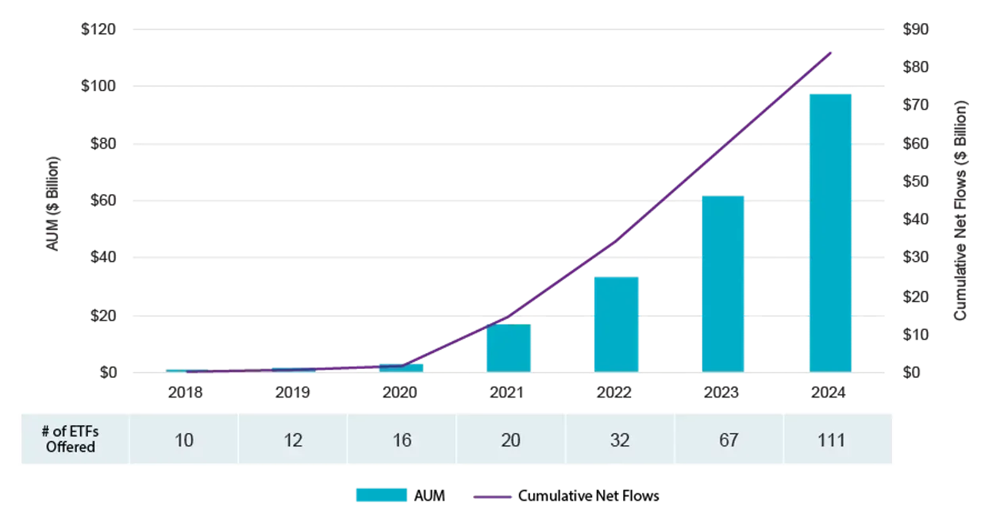

## Table of Contents

## What are derivatives and how do they work?

Derivatives are financial instruments whose value is based on the value of an underlying asset, like stocks, bonds, commodities, or currencies. They are called derivatives because their value is derived from something else. Common types of derivatives include futures, options, and swaps. People use derivatives to hedge against risks, speculate on price movements, or gain access to assets they might not otherwise be able to afford.

Imagine you want to buy a house, but you're worried that the price might go up before you can afford it. You could use a derivative, like an option, to lock in the current price. If the price goes up, you can buy the house at the lower price you agreed on. If the price goes down, you can choose not to buy it and only lose the small fee you paid for the option. This is how derivatives help manage risk.

Derivatives can be complex and risky if not used carefully. They are often traded on exchanges or over-the-counter (OTC) between private parties. The value of a derivative can change quickly, and if the market moves against you, you could lose more money than you initially invested. That's why it's important to understand them well before using them.

## What are the different types of derivatives used for income generation?

One type of derivative used for income generation is an option. Options give you the right, but not the obligation, to buy or sell an asset at a set price before a certain date. You can sell options to other people and earn money from the fees they pay you. If the price of the asset stays where you expect it to, you keep the money. But if the price moves a lot, you might have to buy or sell the asset at a loss.

Another type is a futures contract. Futures are agreements to buy or sell an asset at a future date for a price you agree on now. You can make money by buying futures when you think the price will go up and selling them when the price does go up. Or, you can sell futures when you think the price will go down and buy them back later at a lower price. This can be risky because if the price moves against you, you could lose money.

Swaps are another kind of derivative used for income. Swaps are agreements between two parties to exchange cash flows or other financial instruments. For example, you might agree to swap interest payments with someone else. If you think interest rates will go up, you can make money by receiving higher interest payments. But if rates go down, you might end up paying more than you get. Swaps can be complex, but they can also provide a steady income if used correctly.

## How can beginners start using derivatives to generate income?

For beginners interested in using derivatives to generate income, it's important to start with a basic understanding of what derivatives are and how they work. A good first step is to learn about options, which are a type of derivative that gives you the right to buy or sell an asset at a set price. You can sell options to other people and earn money from the fees they pay you. This is called selling options premiums. If you think the price of a stock won't move much, you can sell an option and keep the money if the price stays stable. It's a good idea to start with small amounts and practice with a simulated trading account before using real money.

Once you feel comfortable with options, you can explore other types of derivatives like futures and swaps. Futures are agreements to buy or sell an asset at a future date for a price you agree on now. You can make money by buying futures when you think the price will go up and selling them when the price does go up. Swaps are agreements to exchange cash flows or other financial instruments. For example, you might agree to swap interest payments with someone else. These can be more complex, so it's important to do a lot of research and maybe even talk to a financial advisor before you start using them. Remember, derivatives can be risky, so it's crucial to only invest money you can afford to lose.

## What are the risks associated with using derivatives for income?

Using derivatives for income can be risky. One big risk is that the price of the asset you're betting on might move against you. If you sell an option and the price of the stock goes up a lot, you might have to buy the stock at a higher price than you expected. This can lead to big losses. Another risk is that derivatives can be hard to understand. If you don't know how they work, you might make bad choices and lose money.

Another risk is that derivatives can be very volatile. This means their value can change a lot in a short time. If you're not careful, you could lose more money than you put in. Also, some derivatives are traded over-the-counter (OTC), which means they're not on a public exchange. This can make them harder to sell if you need to get out of a bad position quickly. It's important to start small and learn as much as you can before using derivatives for income.

## What are some common strategies for generating income with derivatives?

One common strategy for generating income with derivatives is selling options. When you sell an option, you get money from the person who buys it. If you think the price of a stock won't move much, you can sell an option and keep the money if the price stays stable. This is called selling options premiums. It's a good way to make money if you're right about the stock price not moving too much. But if the price does move a lot, you might have to buy or sell the stock at a loss.

Another strategy is using futures contracts. Futures are agreements to buy or sell an asset at a future date for a price you agree on now. You can make money by buying futures when you think the price will go up and selling them when the price does go up. Or, you can sell futures when you think the price will go down and buy them back later at a lower price. This can be risky because if the price moves against you, you could lose money. But if you're right, you can make a good profit.

Swaps are another way to generate income with derivatives. Swaps are agreements between two parties to exchange cash flows or other financial instruments. For example, you might agree to swap interest payments with someone else. If you think interest rates will go up, you can make money by receiving higher interest payments. But if rates go down, you might end up paying more than you get. Swaps can be complex, but they can also provide a steady income if used correctly.

## How do options and futures differ in terms of income generation?

Options and futures are both derivatives, but they work differently when it comes to making money. With options, you can sell them to other people and get money from the fees they pay you. This is called selling options premiums. If you think the price of a stock won't move much, you can sell an option and keep the money if the price stays stable. But if the price moves a lot, you might have to buy or sell the stock at a loss. Options give you the right, but not the obligation, to buy or sell an asset at a set price before a certain date. This means you can choose not to do anything if the price moves against you, but you'll lose the money you got from selling the option.

Futures, on the other hand, are agreements to buy or sell an asset at a future date for a price you agree on now. You can make money by buying futures when you think the price will go up and selling them when the price does go up. Or, you can sell futures when you think the price will go down and buy them back later at a lower price. Unlike options, futures come with an obligation to buy or sell the asset at the agreed price, no matter what happens to the market. This can be riskier because if the price moves against you, you could lose more money than you put in. But if you're right about the price movement, you can make a good profit.

## What is the role of leverage in derivative income strategies?

Leverage is like borrowing money to make a bigger bet. When you use derivatives, you can control a lot more of an asset than you could if you paid for it all yourself. For example, if you buy a futures contract, you might only need to put down a small amount of money to control a big amount of the asset. This can help you make more money if the price goes the way you expect. But it's also riskier because if the price goes the wrong way, you could lose a lot more than you put in.

Using leverage in derivative income strategies can make your gains bigger, but it can also make your losses bigger. If you sell options, you can use leverage to get more money from the premiums. But if the price of the asset moves a lot, you might have to pay a lot more than you expected. It's important to understand how much risk you're taking on when you use leverage. Always start small and learn as much as you can before you use a lot of leverage in your strategies.

## How can advanced traders use complex derivative strategies like iron condors or straddles for income?

Advanced traders can use complex derivative strategies like iron condors to generate income by selling options with different strike prices but the same expiration date. An iron condor involves selling an out-of-the-money call and an out-of-the-money put while also buying a further out-of-the-money call and put to limit risk. The goal is to keep the money from selling the options if the price of the stock stays within a certain range. If the stock price moves too much in either direction, the trader might lose money, but the bought options help limit how much they can lose. This strategy works well in a market that isn't moving a lot, and it can provide a steady income if used correctly.

Straddles are another complex strategy that advanced traders use to make money. A straddle involves buying both a call option and a put option on the same stock with the same strike price and expiration date. This strategy is good if you think the stock price will move a lot but you're not sure which way. If the stock price goes up a lot, the call option will make money. If it goes down a lot, the put option will make money. The downside is that you need the stock to move a lot to cover the cost of both options. If the stock price doesn't move much, you could lose the money you spent on the options.

## What are the tax implications of income generated from derivatives?

The tax rules for money you make from derivatives can be tricky. In the United States, the IRS treats income from derivatives like options, futures, and swaps as capital gains or losses. If you hold a derivative for less than a year before selling it, any profit you make is considered a short-term capital gain. Short-term gains are taxed at your regular income tax rate, which can be as high as 37%. If you hold it for more than a year, it's a long-term capital gain, which is taxed at a lower rate, usually 0%, 15%, or 20%, depending on your income.

It's also important to know that if you use derivatives to hedge other investments, the tax treatment might be different. For example, if you use options to protect against losses in your stock portfolio, the gains or losses from those options might be treated as part of your overall investment strategy. This can affect how you report your taxes and what rates apply. It's a good idea to talk to a tax professional to make sure you're doing everything right and taking advantage of any tax benefits you can.

## How do market conditions affect the effectiveness of derivative income strategies?

Market conditions can really change how well your derivative income strategies work. If the market is calm and prices don't move much, strategies like selling options or using iron condors can be good because you can keep the money from selling the options if the price stays in a certain range. But if the market is very up and down, these strategies can be risky. Big price swings can make you lose more money than you expected, especially if you're selling options and the price moves a lot against you.

On the other hand, if the market is moving a lot, strategies like straddles can be good. A straddle works well when you think the price will move a lot but you're not sure which way. If the price goes up a lot, the call option makes money. If it goes down a lot, the put option makes money. But if the market is calm and the price doesn't move much, you might lose the money you spent on the options. So, it's important to pick the right strategy based on what the market is doing.

## What are the regulatory considerations when trading derivatives for income?

When you trade derivatives for income, you need to know about the rules that govern them. In the United States, the Commodity Futures Trading Commission (CFTC) and the Securities and Exchange Commission (SEC) are the main groups that make sure trading is fair and safe. They set rules about who can trade, how much money you need to start trading, and what information you need to share. If you don't follow these rules, you could get in trouble or lose money. It's a good idea to learn about these rules before you start trading.

Different countries have different rules about derivatives. For example, in Europe, the European Securities and Markets Authority (ESMA) helps make sure trading is safe. They might have different rules about how much you can trade or what kinds of derivatives you can use. It's important to know the rules in your country or where you're trading. If you're not sure, talking to a financial advisor or lawyer can help you understand what you need to do to stay on the right side of the law.

## How can one evaluate the performance of their derivative income strategy over time?

To evaluate the performance of your derivative income strategy over time, you need to keep track of how much money you're making or losing. Start by looking at your total profits and losses from each trade. You can use a spreadsheet or a trading journal to write down the details of every trade, like when you bought or sold, how much you paid, and how much you got back. Over time, you can see if you're making more money than you're losing. It's also helpful to compare your returns to a benchmark, like the stock market, to see if your strategy is doing better or worse than just investing in stocks.

Another way to evaluate your strategy is to look at how well it's working in different market conditions. If the market is calm, are you making money from selling options or using strategies like iron condors? If the market is moving a lot, are strategies like straddles helping you make money? You can also look at how much risk you're taking. Are you losing more money than you expected when the market moves against you? By looking at these things, you can see if your strategy is working well and if you need to make any changes to do better in the future.

## References & Further Reading

[1]: Hull, J. C. (2015). ["Options, Futures, and Other Derivatives"](https://www.amazon.com/Options-Futures-Other-Derivatives-10th/dp/013447208X). Pearson Education.

[2]: Johnson, R. A., & Hazen, S. M. (1994). ["Derivatives: A Practitioner’s Guide."](https://law-store.wolterskluwer.com/s/product/derivatives-regulation3mo-subvitallaw-3r/01t0f00000NY7Z8AAL) Probus Professional Pub.

[3]: Jurek, J. W., & Yang, L. (2007). ["Dynamic Trading and Asset Prices: Endogenous Derivatives Trading in a Consumption-Based Model."](https://papers.ssrn.com/sol3/papers.cfm?abstract_id=882536) The Journal of Finance.

[4]: Aldridge, I. (2013). ["High-Frequency Trading: A Practical Guide to Algorithmic Strategies and Trading Systems (Vol. 604)."](https://www.amazon.com/High-Frequency-Trading-Practical-Algorithmic-Strategies/dp/1118343506) John Wiley & Sons.

[5]: Narang, R. K. (2013). ["Inside the Black Box: The Simple Truth About Quantitative Trading."](https://www.amazon.com/Inside-Black-Box-Quantitative-Trading/dp/0470432063) John Wiley & Sons.

[6]: Cartea, Á., Jaimungal, S., & Penalva, J. (2015). ["Algorithmic and High-Frequency Trading."](https://assets.cambridge.org/97811070/91146/frontmatter/9781107091146_frontmatter.pdf) Cambridge University Press.