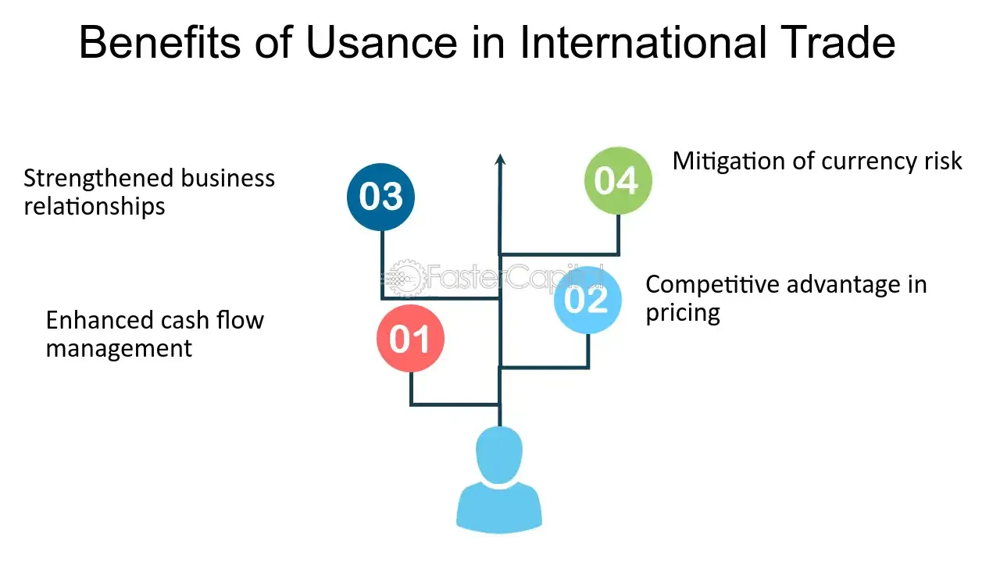

## Table of Contents

## What is usance in international trade?

Usance in international trade refers to the period of time allowed for the payment of goods after they have been delivered. It is essentially a credit term agreed upon by the buyer and seller, where the buyer does not have to pay immediately upon receiving the goods but is given a certain number of days or months to make the payment. This period can vary depending on the agreement between the parties involved and can range from a few days to several months.

Usance is important because it helps businesses manage their cash flow more effectively. For example, a buyer might need time to sell the goods before they can pay the seller. By agreeing on a usance period, the buyer can receive the goods, sell them, and then use the proceeds to pay the seller. This arrangement can make international trade smoother and more accessible, especially for businesses that might not have immediate funds available to pay for large shipments.

## How does usance differ from other payment terms?

Usance is different from other payment terms because it gives the buyer time to pay after getting the goods. With usance, the buyer doesn't have to pay right away. They can wait for a certain number of days or months before paying. This is helpful for buyers who need time to sell the goods and then use that money to pay the seller.

Other payment terms, like cash in advance, require the buyer to pay before they get the goods. This can be hard for buyers because they have to pay without seeing the goods first. Another term is cash on delivery, where the buyer pays as soon as they get the goods. This is quicker than usance but still requires immediate payment. Usance gives more flexibility and helps with cash flow, making it a good choice for many businesses in international trade.

## What are the benefits of using usance for importers?

Using usance helps importers by giving them more time to pay for the goods they buy. This means they don't have to pay right away when the goods arrive. Instead, they can wait for a certain number of days or months. This extra time can be very helpful because it lets importers sell the goods first and then use the money they make to pay the seller. This can make it easier for importers to manage their money and not have to pay large amounts all at once.

Another benefit of usance for importers is that it can help them grow their business. When importers don't have to pay immediately, they can use their money for other important things, like buying more goods or investing in their business. This can help them buy more products and sell more, which can lead to more profits. Usance can also make it easier for importers to work with new suppliers because they can agree on payment terms that work well for both sides.

## What are the risks for exporters when offering usance?

When exporters offer usance, they take on the risk that the importer might not pay on time or at all. This can be a big problem because the exporter has already sent the goods and is waiting for payment. If the importer delays payment or can't pay, the exporter might lose money and have trouble paying their own bills. This risk is higher if the importer is in a different country, where it can be hard to enforce payment.

Another risk for exporters is that they might not have enough cash to keep their business running smoothly. When they offer usance, they have to wait longer to get paid. This means they might not have enough money to buy more materials or pay their workers. If many importers are slow to pay, the exporter could run into serious cash flow problems. To manage these risks, exporters often use tools like letters of credit or export credit insurance to make sure they get paid even if the importer has trouble paying.

## How is the usance period typically determined?

The usance period is usually decided by the buyer and seller when they make their trade agreement. They talk about how long the buyer will have to pay after getting the goods. This time can be different depending on what the buyer and seller agree on. It might be a few days, a few weeks, or even a few months. They think about things like how long it will take the buyer to sell the goods and how much time the seller can wait for payment.

Sometimes, the usance period is also affected by what is normal in the industry or the country where the trade is happening. For example, some places might usually give 30 days to pay, while others might give 90 days. The buyer and seller also look at how well they trust each other and how much risk they are willing to take. If they have worked together before and trust each other, they might agree on a longer usance period.

## What role do banks play in usance transactions?

Banks play a big role in usance transactions by helping both the buyer and the seller feel safe. When a seller offers usance, they let the buyer pay later. But the seller might worry about not getting paid. Banks can help by using something called a letter of credit. This is a promise from the bank that the buyer will pay. If the buyer can't pay, the bank will pay the seller instead. This makes the seller feel more secure about offering usance.

Banks also help with something called export credit insurance. This is like a safety net for the seller. If the buyer doesn't pay, the insurance will cover the loss. This way, the seller can offer usance without worrying too much about not getting paid. Banks make usance transactions smoother and safer for everyone involved.

## Can you explain the process of a usance letter of credit?

A usance letter of credit is a way for banks to help with usance transactions. When a buyer and seller agree on usance, the buyer asks their bank to issue a letter of credit. This letter promises that the bank will pay the seller if the buyer can't pay on time. The seller sends the goods to the buyer and waits for payment. The bank keeps the money safe until the usance period is over. If the buyer pays on time, the bank gives the money to the seller. If the buyer can't pay, the bank pays the seller instead.

This process makes both the buyer and seller feel safer. The seller knows they will get paid because the bank is backing the payment. The buyer gets more time to pay for the goods, which can help them manage their money better. The usance letter of credit is a useful tool in international trade because it helps businesses work together even when they are in different countries and need to trust each other.

## How does usance impact cash flow for both importers and exporters?

Usance helps importers manage their cash flow better. When importers buy goods, they don't have to pay right away. They can wait until the usance period is over, which gives them time to sell the goods and use that money to pay the seller. This means importers can keep their money longer and use it for other important things, like buying more goods or growing their business. It makes it easier for them to handle their money and not have to pay large amounts all at once.

For exporters, offering usance can make their cash flow more difficult. When they send goods to importers, they have to wait longer to get paid. This can be a problem because they might need that money to buy more materials or pay their workers. If many importers are slow to pay, the exporter could run into cash flow problems. To help with this, exporters might use tools like letters of credit or export credit insurance to make sure they get paid even if the importer has trouble paying.

## What are the common usance periods used in different industries?

Different industries often have their own common usance periods. In the textile industry, a common usance period might be 30 to 60 days. This gives clothing stores time to sell the clothes before they have to pay for them. In the electronics industry, the usance period might be shorter, around 30 days, because electronics can become outdated quickly. The food industry might use a usance period of 14 to 30 days because food can spoil, so it needs to be sold fast.

In the machinery and equipment industry, a longer usance period of 90 to 180 days is common. This is because big machines are expensive and take time to install and start using. The automotive industry might use a usance period of 60 to 90 days, giving car dealers time to sell the cars before paying the manufacturer. Each industry decides on a usance period that works best for their type of goods and how quickly they need to be sold.

## How do international trade laws and regulations affect usance?

International trade laws and regulations can affect usance by setting rules about how long buyers can take to pay for goods. Different countries have different rules, so buyers and sellers need to know these rules when they agree on a usance period. For example, some countries might have laws that limit how long a usance period can be. This means that even if a buyer and seller want a long usance period, they might have to follow the shorter time set by the law. Also, some countries might have rules about using letters of credit or other payment methods, which can change how usance works.

These laws and regulations are important because they help make trade fair and safe for everyone. They can protect sellers from buyers who don't pay on time and help buyers know what to expect. If a country changes its trade laws, it can affect how usance is used in that country. For example, if a new law makes it easier to use letters of credit, more sellers might be willing to offer usance. On the other hand, if a law makes it harder to get paid on time, sellers might be less likely to offer usance. So, understanding these laws is key for anyone involved in international trade.

## What are the alternatives to usance in international trade finance?

One alternative to usance in international trade finance is cash in advance. This means the buyer pays the seller before the goods are sent. It's good for the seller because they get their money right away and don't have to worry about not getting paid. But it can be hard for the buyer because they have to pay without seeing the goods first. This can be risky if the goods don't arrive or are not what the buyer expected.

Another option is cash on delivery (COD). With COD, the buyer pays the seller as soon as the goods arrive. This is quicker than usance but still requires immediate payment. It's safer for the buyer because they can check the goods before paying. But it can be hard for the seller because they have to wait until the goods are delivered to get paid. This can affect their cash flow if they need money sooner.

A third alternative is using a letter of credit, but without a usance period. This means the bank promises to pay the seller as soon as the goods are shipped, not after a certain time like with usance. The buyer's bank pays the seller right away, and then the buyer pays the bank. This can be good for both sides because the seller gets paid quickly, and the buyer knows the goods are on the way before they have to pay.

## How can technology and fintech solutions enhance the management of usance transactions?

Technology and fintech solutions can make usance transactions easier and safer. They can help by using digital platforms where buyers and sellers can agree on usance terms and track payments. These platforms can send reminders about when payments are due, so no one forgets. They can also use smart contracts, which are like digital agreements that automatically do things when certain conditions are met. For example, a smart contract can release payment to the seller as soon as the usance period is over, without needing a bank to do it manually. This makes the process faster and reduces the chance of mistakes or fraud.

Fintech solutions can also help with better risk management. They can use data and analytics to predict if a buyer might have trouble paying on time. This helps sellers decide if they should offer usance to a particular buyer. Also, fintech companies can offer new types of financing, like supply chain finance, where a third party pays the seller early and then collects from the buyer later. This can help sellers get their money faster and make usance more attractive. Overall, technology and fintech make usance transactions smoother, safer, and more efficient for everyone involved.

## References & Further Reading

[1]: Berger, P., & Udell, G. F. (1994). ["Lines of credit and relationship lending in small firm finance."](https://www.jstor.org/stable/2353332)90040-X) Journal of Financial Economics, 37(3), 350-382.

[2]: Hull, J. (2018). ["Options, Futures, and Other Derivatives."](https://www.amazon.com/Options-Futures-Other-Derivatives-9th/dp/0133456315) Pearson.

[3]: Murphy, J. J. (1999). ["Technical Analysis of the Financial Markets."](https://archive.org/details/technicalanalysi0000murp) New York Institute of Finance.

[4]: Narang, R. K. (2013). ["Inside the Black Box: A Simple Guide to Quantitative and High-Frequency Trading."](https://onlinelibrary.wiley.com/doi/book/10.1002/9781118662717) Wiley.

[5]: Leinweber, D. (2009). ["Nerds on Wall Street: Math, Machines and Wired Markets."](https://archive.org/details/nerdsonwallstree0000lein) Wiley.