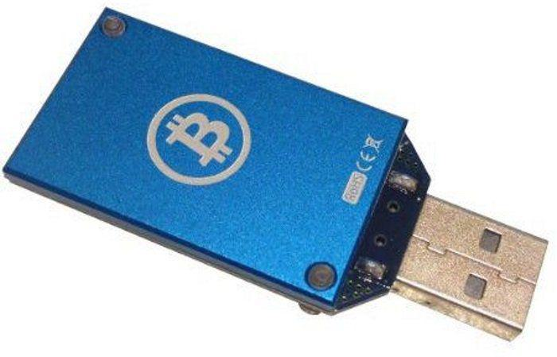

Bitcoin mining represents a pivotal component of the cryptocurrency ecosystem, serving as the backbone for transaction validation and network security. This process involves the verification of transactions on the Bitcoin blockchain through the solving of complex cryptographic puzzles. These puzzles are essential for ensuring that the blockchain— a decentralized ledger of all Bitcoin transactions—remains secure and tamper-proof. In return for this computational effort, miners are rewarded with newly created bitcoins, thus providing an incentive for participation and maintaining the integrity of the network.

Historically, Bitcoin mining has transitioned from the use of basic personal computer setups to more specialized and powerful hardware solutions. This shift has been driven by the increasing difficulty of mining puzzles and the growing scale of the Bitcoin network. Traditional mining setups typically involved powerful CPUs and GPUs, but with the increase in difficulty, Field Programmable Gate Arrays (FPGAs) and Application-Specific Integrated Circuits (ASICs) have become the standard due to their superior efficiency and hashing power.



However, not all mining involves large-scale, industrial operations. A niche but growing segment of the market includes compact and cost-effective solutions such as USB Bitcoin miners. These devices offer a wallet-friendly alternative for those interested in cryptocurrency mining without significant capital investment. Although USB miners typically provide lower hashing power and consequently lower profitability, they serve as an accessible entry point for hobbyists and small-scale miners.

In parallel with these technological advancements, algorithmic trading, which employs computer algorithms to execute trading strategies, has emerged in the cryptocurrency space. In the context of Bitcoin mining, algorithmic trading can play a crucial role in optimizing profitability. By leveraging data analysis and automated trading tools, miners can enhance their returns through strategic market positioning and exploitation of market inefficiencies.

The fundamental principle of Bitcoin mining is rooted in its decentralized nature, which is integral to the security and operation of the Bitcoin network. Each miner contributes to this decentralized system, where computational power is used to protect the network from attacks and ensure the legitimacy of transactions. This decentralization not only bolsters network security but also embodies the democratic ethos that underpins Bitcoin and many other cryptocurrencies.

In essence, Bitcoin mining is indispensable to the functioning and sustainability of the Bitcoin blockchain. The evolution of mining technology, alongside the rise of algorithmic trading, continues to shape the landscape of cryptocurrency, influencing both mainstream adoption and individual participation.

## Table of Contents

## What is Bitcoin Mining?

Bitcoin mining is the process through which transactions are validated and added to the public ledger known as the blockchain. The core of this process involves solving complex mathematical puzzles, which ensures that transactions are processed securely and prevents fraudulent activities. This cryptographic puzzle-solving is known as Proof of Work (PoW).

In Bitcoin mining, these puzzles require significant computational power, and miners compete to be the first to solve them. The solution involves finding a nonce (a random number) that, when hashed along with the block data, results in a hash value that satisfies a specific difficulty level. This hash must begin with a predefined number of zeros. The difficulty of this task adjusts approximately every two weeks to ensure that blocks are mined at a consistent rate, roughly every 10 minutes.

Miners who successfully solve these puzzles are rewarded with new bitcoins, a process referred to as block rewards. This serves as an incentive for miners to channel computational resources towards maintaining the network's integrity and security. Currently, the reward stands at 6.25 bitcoins per block, but this amount is halved approximately every four years in an event known as the Bitcoin halving, which helps control the supply of Bitcoin and simulates a deflationary asset.

The act of mining not only verifies transaction records but also plays an essential role in preventing double-spending—a potential problem in digital currencies—and ensuring decentralization. Each mined block is linked to the previous one, forming a chain of blocks (hence the term blockchain), thereby making the system difficult to attack.

Here's an example of how this computational task is executed in Python using the hashlib library:

```python
import hashlib

def generate_hash(block_data, nonce):
    return hashlib.sha256(f"{block_data}{nonce}".encode()).hexdigest()

def mine_block(block_data, difficulty):
    prefix = '0' * difficulty
    nonce = 0
    while True:
        hash_value = generate_hash(block_data, nonce)
        if hash_value.startswith(prefix):
            print(f"Block mined with nonce: {nonce}")
            print(f"Hash: {hash_value}")
            return nonce
        nonce += 1

block_data = "Sample block data"
difficulty = 4
mine_block(block_data, difficulty)
```

The above script simulates the mining process by continuously hashing block data with an incrementing nonce until the hash meets the difficulty requirement (a hash starting with a given number of zeroes).

Mining ensures the robustness and reliability of the Bitcoin network. It decentralizes currency creation and provides a controlled monetary supply flow through its self-regulating supply mechanism and competitive validation process. Thus, Bitcoin mining is integral to the functionality and sustainability of the Bitcoin ecosystem.

## Cryptocurrency Mining Devices: A Quick Overview

Cryptocurrency mining involves using computational power to validate and secure transactions on a blockchain network, with Bitcoin mining being the most well-known application. The devices used for this purpose have evolved significantly over time, improving in efficiency, power, and size.

Initially, Bitcoin miners relied on Central Processing Units (CPUs). These general-purpose processors are widely available and inexpensive, making them an accessible entry point for early adopters. However, CPUs are not optimized for the specialized calculations required for mining, leading to inefficiencies. As the mining network grew, the need for more powerful hardware became apparent.

Graphics Processing Units (GPUs) soon became the preferred choice for many miners. Designed for parallel data processing, GPUs excel at the repetitive and parallelizable tasks inherent in mining algorithms like SHA-256, which Bitcoin uses. A significant advantage of GPUs over CPUs is their ability to perform many calculations simultaneously, dramatically increasing the mining speed. A downside, however, is their higher cost and power consumption.

Field Programmable Gate Arrays (FPGAs) introduced the concept of hardware customization for mining purposes. These programmable chips can be tailored to execute specific algorithms with high efficiency. FPGAs offer better performance and power efficiency than GPUs, but their complexity and programming requirements pose a barrier to entry for most users.

Application-Specific Integrated Circuits (ASICs) represent the pinnacle of mining hardware development. These chips are designed specifically for Bitcoin mining, focusing on maximizing the number of computations (hashes) they can perform while minimizing power consumption. Although ASICs deliver superior performance and energy efficiency, their primary disadvantage is the lack of versatility—an ASIC designed for Bitcoin mining cannot be repurposed for different algorithms or [cryptocurrency](/wiki/cryptocurrency) networks.

The trajectory of mining hardware has also seen progress in miniaturization and affordability, evident in the development of USB Bitcoin miners. These compact devices plug directly into a computer's USB port, offering a low-cost and portable solution for enthusiasts and hobbyists. While USB miners are not designed for competition with more powerful mining rigs, they serve as an educational tool and a way for individuals to participate in Bitcoin mining without significant financial investment.

In summary, the evolution of cryptocurrency mining devices has been driven by the quest for higher efficiency and performance, from CPUs to specialized ASICs. The introduction of USB miners caters to a niche market, focusing on accessibility and education over profitability. Each type of mining hardware presents its own set of advantages and challenges, with considerations such as cost, power consumption, and ease of use playing vital roles in their adoption and impact on overall mining efficiency.

## Understanding USB Bitcoin Miners

USB Bitcoin miners are compact devices designed to facilitate Bitcoin mining by plugging directly into a computer’s USB port. These devices house an Application-Specific Integrated Circuit (ASIC), a microchip specifically designed to perform transactions at high speed and consume less power, tailored for the Bitcoin mining process.

### How USB Bitcoin Miners Work

At the core of a USB Bitcoin miner is its ASIC, which efficiently performs the specific calculations necessary for mining Bitcoin. Bitcoin mining involves verifying Bitcoin transactions and adding them to the blockchain ledger. This process requires solving complex mathematical problems, a purpose for which ASICs are optimized. By connecting through a USB port, these miners leverage the host computer for power and internet connectivity, only consuming a fraction of the computer's processing power and electric cost.

### Advantages of USB Bitcoin Miners

USB Bitcoin miners offer several benefits, making them an attractive option for amateur and hobbyist miners:

- **Portability**: USB miners are small and lightweight, allowing for easy transport and setup. This mobility makes them perfect for users who want to mine Bitcoin across different locations.
- **Ease of Use**: They are extremely user-friendly. Simply plugging the miner into a USB port and running mining software can start the mining process.
- **Low Power Consumption**: One of the primary advantages is their minimal power usage. This feature makes them suitable in environments where energy efficiency is a major concern.

### Challenges and Limitations

Despite their benefits, USB Bitcoin miners face notable limitations:

- **Lower Hashing Power**: Compared to larger ASIC mining rigs, USB miners offer significantly reduced hashing power. This lower computational strength translates to a reduced probability of solving the cryptographic puzzles necessary to earn Bitcoin.
- **Profitability Concerns**: Given the lower hashing power, the financial returns from USB miners are minimal. They are often not profitable when factoring in the electricity costs associated with their operation.

### USB Miners in the Broader Context of Bitcoin Mining

In the larger Bitcoin mining ecosystem, USB Bitcoin miners are most suitable for educational purposes or as a starting point for beginners looking to understand the mechanics of mining. Due to their constraints in hashing power and profitability, they are not typically used in professional mining operations. Instead, USB miners can serve as an initial stepping stone into more significant investments in professional-grade mining hardware.

Overall, USB Bitcoin miners represent an accessible and low-barrier entry point into Bitcoin mining, providing enthusiasts with a taste of the mining process while being limited by their reduced efficiency and profitability.

## Profitability and Functionality of USB Bitcoin Miners

USB Bitcoin miners have emerged as a popular choice among cryptocurrency enthusiasts, owing largely to their affordability and ease of use. However, their profitability is a subject of considerable debate.

### Cost vs. Benefit Analysis

USB Bitcoin miners are relatively inexpensive, often priced between $20 to $100 per unit. This low entry cost makes them attractive to hobbyists who wish to experiment with Bitcoin mining without investing in costly, high-performance hardware. However, their hashing power, which typically ranges from 5 to 15 GH/s, is significantly lower than that of more advanced mining equipment like ASICs (Application-Specific Integrated Circuits). Given the current Bitcoin network difficulty and mining competition, USB miners produce a negligible amount of Bitcoin, which often does not cover the electricity costs incurred.

The profitability equation for mining can be expressed as:

$$
\text{Profit} = (\text{BTC\_mined} \times \text{BTC\_price}) - \text{(costs\_associated)}
$$

Here, BTC_mined with USB miners is typically too low to offer substantial returns, especially given the high difficulty level of Bitcoin mining.

### Popularity Among Hobbyists

Despite limited profitability, USB miners remain popular among hobbyists. This popularity can be attributed to several factors:

1. **Educational Value:** Newcomers to Bitcoin mining find USB miners a practical tool to learn about the mining process without significant financial risks.

2. **Community Engagement:** Many hobbyists are drawn to USB miners because they serve as entry points into broader cryptocurrency communities where enthusiasts share knowledge and strategies.

3. **Ease of Access and Use:** USB miners do not require complex setups, additional cooling solutions, or large power supplies, making them user-friendly.

### Collective Mining Approach

One strategy enthusiasts employ to boost their mining output is the collective mining approach, which involves using multiple USB miners concurrently. By using a USB hub, miners can connect several devices to a single system, thus aggregating their hashing power. While this does not equate the power of professional mining rigs, it incrementally increases the total hashing power and potential Bitcoin yield. However, the electricity consumption of such setups must be carefully managed to ensure it does not exceed the revenue generated.

### Current USB Miner Models and Specifications

Here are examples of current USB miner models and their technical specifications:

1. **GekkoScience Compac F:** Known for its superior build, this model can achieve a hashing power of up to 15 GH/s with power draw roughly around 5 watts.

2. **Bitmain Antrouter R1:** Though primarily a router, this device includes mining capabilities, offering approximately 5.5 GH/s of hashing power with low energy consumption.

3. **FutureBit Moonlander 2:** Offers around 3 to 5 MH/s and is preferred for its ease of overclocking, making it versatile for users experimenting with mining settings.

In summary, while USB Bitcoin miners are not a viable option for serious profit-making due to their limited hashing capabilities, they present an accessible and educational avenue for individuals interested in Bitcoin mining. The collective approach offers slight enhancements, and new models continue to emerge with improved efficiency and specifications tailored to meet hobbyists' needs.

## Algorithmic Trading and Bitcoin Mining

Algorithmic trading, also known as algo trading, refers to the use of computer algorithms to execute trading orders at speeds and frequencies that a human trader cannot achieve. In the context of cryptocurrency, [algorithmic trading](/wiki/algorithmic-trading) employs predefined criteria such as timing, price, or quantity to automate and optimize trading decisions. Its integration into Bitcoin mining operations is becoming increasingly significant.

### Technical Requirements and Benefits

Integrating algorithmic trading with Bitcoin mining requires appropriate technical infrastructure, including robust computing power, reliable data feeds, and efficient trading platforms. Miners can benefit by using algorithmic strategies to optimize the sale of mined bitcoins, potentially increasing profitability. This integration allows for the automation of buy-and-sell strategies based on market data, removing emotional decision-making and enhancing the efficiency of trading decisions.

### Tools and Strategies

Various tools and strategies are used to enhance mining profitability through algo trading. Some popular strategies include [market making](/wiki/market-making), [arbitrage](/wiki/arbitrage), and trend-following. Market making involves placing trades to profit from the bid-ask spread, while arbitrage exploits price differences across exchanges. Trend-following strategies leverage market [momentum](/wiki/momentum) to turn profits. Python, with libraries like Pandas for data manipulation and Backtrader for strategy [backtesting](/wiki/backtesting), is widely used in developing and testing these strategies.

Example Python code for a simple moving average crossover strategy might look like this:

```python
import pandas as pd
import backtrader as bt

class SMACross(bt.SignalStrategy):
    def __init__(self):
        sma1, sma2 = bt.ind.SMA(period=10), bt.ind.SMA(period=50)
        self.signal_add(bt.SIGNAL_LONG, bt.ind.CrossOver(sma1, sma2))

data = bt.feeds.YahooFinanceData(dataname='BTC-USD', fromdate='2020-01-01', todate='2021-01-01')
cerebro = bt.Cerebro()
cerebro.adddata(data)
cerebro.addstrategy(SMACross)
cerebro.run()
```

### Real-World Applications and Case Studies

There are practical examples where algorithmic trading has significantly benefitted Bitcoin miners. For instance, some mining pools and operations incorporate algo trading to hedge against bitcoin price [volatility](/wiki/volatility-trading-strategies), ensuring a more stable revenue stream. These organizations often employ complex platforms that integrate [machine learning](/wiki/machine-learning) algorithms to predict market trends and execute trades accordingly.

One case study involves a mining operation that used algorithmic trading to manage its cash flow, significantly reducing exposure to price crashes and consequently improving overall profitability. By automatically converting a portion of mined coins to fiat currencies upon hitting certain price thresholds, the operation managed to assert more control over its financial planning.

In summary, algorithmic trading provides Bitcoin miners with advanced tools and strategies to optimize their operations, enhance profitability, and mitigate risks associated with market volatility. Its successful implementation requires technical acumen and a deep understanding of both trading strategies and the cryptocurrency market.

## The Future of Bitcoin Mining Devices

Bitcoin mining devices are constantly evolving, driven by the need for greater efficiency and profitability in an increasingly competitive environment. Recent trends in Bitcoin mining technology suggest a focus on enhancing performance while minimizing environmental impact.

**Trends in Bitcoin Mining Technology**

The past several years have witnessed significant advancements in mining hardware, resulting in more powerful and efficient devices. Current developments in application-specific integrated circuits (ASICs) play a pivotal role in this evolution. These circuits are designed specifically for mining cryptocurrencies, providing superior performance compared to general-purpose CPUs and GPUs. The continuous improvement in ASIC design is expected to yield devices that offer higher hash rates—measures of computational power per second—with lower energy consumption.

For example, modern ASICs often integrate sophisticated cooling mechanisms and power optimization techniques to boost mining efficiency. As a result, these devices are becoming more compact and energy-efficient, reducing operational costs for miners.

**Expected Shifts in Mining Profitability and Efficiency**

As mining technology progresses, one can anticipate shifts in profitability and efficiency. The advent of more efficient hardware is likely to reduce the cost per hash, potentially increasing the profitability of mining operations. However, as the Bitcoin network adjusts its difficulty in response to the total hash rate, only miners using the most advanced equipment may continue to reap substantial rewards.

Moreover, the halving events, which occur approximately every four years and reduce the block reward miners receive, have a profound impact on profitability. Miners will need to continuously upgrade to the latest hardware to remain competitive and offset the decreased rewards.

**Environmental and Technological Considerations**

Bitcoin mining's significant energy consumption has drawn considerable criticism, prompting the push for more sustainable practices. Future mining strategies are likely to focus on curbing the environmental footprint of mining operations. This can include transitioning to renewable energy sources such as solar or wind power to energize mining farms, as well as improving the energy efficiency of mining equipment.

In addition, technological innovations such as immersion cooling—where hardware operates in a thermally conductive but electrically insulating liquid—are being explored to improve cooling efficiency and reduce operational costs. These advancements not only enhance the performance of mining devices but also align with growing environmental conservation efforts.

**Decentralized and Home-Based Mining**

The shift towards decentralization remains a key theme in Bitcoin's development ethos. With technological improvements, home-based and small-scale mining operations could become more viable. USB miners and compact devices designed for personal use capitalize on this trend by offering accessible entry points for hobbyists and small investors.

Decentralized mining contributes to the security and resilience of the Bitcoin network by reducing reliance on centralized mining farms. It encourages greater participation in the network, preserving the decentralization that is central to Bitcoin's original vision.

In conclusion, as Bitcoin mining technology continues to evolve, it will likely prioritize efficiency and sustainability, alongside embracing the decentralized nature of cryptocurrency. This shifts not only reflect an adaptation to growing environmental concerns but also bolster the resilience and inclusivity of the Bitcoin mining ecosystem.

## Conclusion

Bitcoin mining devices, ranging from ASICs to USB miners, play a crucial role in maintaining the Bitcoin network by validating transactions and securing the blockchain. Each type of device offers a unique balance between cost, efficiency, and accessibility, catering to both large-scale operators and individual hobbyists.

USB Bitcoin miners represent a particularly interesting segment of this landscape. Despite their limited hashing power and profitability, they offer unparalleled accessibility and ease of use. These devices cater to hobbyists who appreciate the simplicity and portability while providing an entry point into Bitcoin mining without significant financial investment.

Algorithmic trading has emerged as a powerful tool for maximizing mining returns. By leveraging algorithms to analyze market data and execute orders at optimal times, miners can enhance their profitability and navigate market fluctuations more efficiently. This integration of algo trading into mining strategies underscores the technological advancements shaping the future of cryptocurrency mining.

The evolving mining landscape presents opportunities for both seasoned investors and newcomers. With continual advancements in mining technology and network dynamics, understanding the balance between cost, efficiency, and accessibility becomes paramount. As decentralized and home-based mining gain traction, driven by technological innovations and environmental considerations, the ecosystem offers boundless potential for exploration and growth.

Thus, enthusiasts and potential investors are encouraged to engage with this dynamic domain, recognizing that cryptocurrency mining is not only about processing power and energy efficiency but also about strategic decisions and innovations that can redefine personal and collective financial futures.

## References & Further Reading

[1]: Antonopoulos, A. M. (2017). ["Mastering Bitcoin: Unlocking Digital Cryptocurrencies."](https://books.google.com/books/about/Mastering_Bitcoin.html?id=IXmrBQAAQBAJ) O'Reilly Media.

[2]: Van Wirdum, A. (2016). ["The Evolution of Bitcoin Hardware."](https://ieeexplore.ieee.org/abstract/document/8048662) Bitcoin Magazine.

[3]: Narayanan, A., Bonneau, J., Felten, E., Miller, A., & Goldfeder, S. (2016). ["Bitcoin and Cryptocurrency Technologies: A Comprehensive Introduction."](https://press.princeton.edu/books/hardcover/9780691171692/bitcoin-and-cryptocurrency-technologies) Princeton University Press.

[4]: Judmayer, A., Stifter, N., Zamyatin, A., & Weippl, E. (2017). ["Bitcoin Mining Analysis: Statistical Data for the PC Industry's Architectures Future Sustainability on the Blockchain."](https://www.semanticscholar.org/paper/Blocks-and-Chains%3A-Introduction-to-Bitcoin%2C-and-Judmayer-Stifter/e8303d9b1e837687d8677a60d220c469c06ec525) SBA Research.

[5]: Taylor, M. B. (2017). ["The Evolution of Bitcoin Hardware."](https://michaeltaylor.org/papers/Taylor_Bitcoin_IEEE_Computer_2017.pdf) Computer, IEEE, 50(9), 58-66.