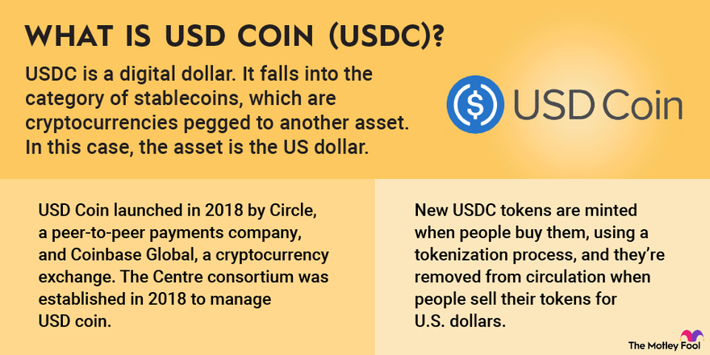

## Table of Contents

## What is USD Coin (USDC) and what is its primary purpose?

USD Coin (USDC) is a type of cryptocurrency called a stablecoin. This means it's designed to keep a steady value, unlike other cryptocurrencies like Bitcoin, which can go up and down a lot. USDC is tied to the US dollar, so one USDC is always worth one US dollar. It's made by a company called Circle, along with Coinbase, another big company in the crypto world.

The main purpose of USDC is to make it easier and faster to move money around the world using cryptocurrency. Because it's tied to the US dollar, people can use it without worrying about big price changes. This makes it useful for things like sending money to family in another country, paying for things online, or trading other cryptocurrencies. It combines the benefits of digital money, like speed and low cost, with the stability of the US dollar.

## How does USDC maintain its peg to the US dollar?

USDC keeps its value the same as the US dollar by having real US dollars in a bank for every USDC that's out there. This is called being "fully backed" by the US dollar. The company that makes USDC, Circle, puts the money in special bank accounts that are checked by other companies to make sure the money is really there. This way, people can trust that their USDC is worth a real US dollar.

If someone wants to change their USDC back into US dollars, they can do it easily. Circle will give them the US dollars that were set aside for their USDC. This makes sure that the value of USDC stays the same as the US dollar. By doing this, USDC can be used like regular money but with the speed and ease of cryptocurrency.

## Who issues and manages USDC?

USDC is issued and managed by a company called Circle. Circle works together with Coinbase, another big company in the world of cryptocurrency, to make sure everything runs smoothly. They are the ones who create new USDC and take care of the system that keeps it working.

Circle makes sure that for every USDC out there, there is a real US dollar kept in a bank. They use special bank accounts that are checked by other companies to make sure the money is really there. This way, people can trust that their USDC is always worth one US dollar.

## What are the benefits of using USDC over traditional USD?

Using USDC has some cool advantages over regular US dollars. One big plus is that it's super fast and cheap to send USDC anywhere in the world. If you want to send money to another country with regular dollars, it can take days and cost a lot in fees. But with USDC, you can do it almost instantly and it usually costs less. This makes it really handy for things like sending money to family in another country or paying for stuff online.

Another benefit is that USDC works 24/7, even on weekends and holidays. Banks and regular money systems have times when they're closed, but USDC never sleeps. This means you can move your money or make payments whenever you need to, without waiting. Plus, because USDC is a digital currency, you can use it in lots of different apps and services that might not accept regular dollars. This makes it more flexible and useful in the world of online and digital payments.

## How can someone acquire USDC?

You can get USDC in a few easy ways. One way is to buy it on a cryptocurrency exchange. These are websites where you can trade regular money, like US dollars, for cryptocurrencies like USDC. You just need to sign up for an account, put some money in, and then you can buy USDC. Some popular exchanges where you can do this are Coinbase, Binance, and Kraken.

Another way to get USDC is by using a service that lets you swap regular money for USDC directly. Companies like Circle, who make USDC, have services where you can send them US dollars and they'll give you USDC in return. This can be a bit simpler than using an exchange because you're dealing directly with the people who make the currency. Once you have your USDC, you can keep it in a digital wallet, which is like a bank account for cryptocurrencies, and use it to send money or make payments.

## What are the common use cases for USDC in the cryptocurrency ecosystem?

One common way people use USDC is for trading on cryptocurrency exchanges. When you want to buy or sell other cryptocurrencies like Bitcoin or Ethereum, you can use USDC as a stable way to do it. Because USDC keeps the same value as the US dollar, it's a safe choice to hold onto while you're waiting to buy or sell other cryptocurrencies that can go up and down a lot. This makes trading easier and less risky.

Another use for USDC is sending money to other people, especially across different countries. It's fast and usually cheaper than using regular banks or money transfer services. If you need to send money to family or friends in another country, you can use USDC to do it quickly and easily. Plus, because USDC works 24/7, you can send money whenever you need to, without waiting for banks to open.

USDC is also used for paying for things online. Some websites and apps accept USDC as a way to pay for goods and services. This can be handy if you want to use your cryptocurrency to buy things without having to change it back into regular money first. It's like using digital dollars to shop online, but with the speed and convenience of cryptocurrency.

## How is the transparency of USDC reserves ensured?

The transparency of USDC reserves is ensured by Circle, the company that issues USDC. They keep real US dollars in special bank accounts for every USDC that's out there. These bank accounts are checked by other companies, called auditors, to make sure the money is really there. The auditors look at the accounts and make reports to show that Circle is telling the truth about how much money they have.

Circle also shares these reports with everyone so people can see for themselves that their USDC is backed by real US dollars. They do this by putting the reports on their website and sometimes in other places too. This way, anyone who uses USDC can feel sure that it's worth a real US dollar because they can check the reports and see the money is there.

## What are the risks associated with holding or using USDC?

Holding or using USDC comes with some risks. One big risk is that even though USDC is supposed to be worth one US dollar, there's a small chance something could go wrong. For example, if Circle, the company that makes USDC, has problems or if the banks where they keep the money have issues, it could affect the value of USDC. Also, if lots of people want to change their USDC back into US dollars at the same time, it might be hard for Circle to give everyone their money right away.

Another risk is that USDC is a digital currency, so it depends on technology. If there's a problem with the internet or the systems that USDC uses, it could make it hard to use or move your USDC. Plus, like any digital money, there's a risk of losing your USDC if you don't keep it safe. If someone hacks into your digital wallet or if you lose the keys to your wallet, you could lose your USDC and not be able to get it back.

## How does USDC interact with decentralized finance (DeFi) platforms?

USDC plays a big role in the world of decentralized finance, or DeFi. DeFi platforms are like online banks and financial services that work without a central company in charge. They use smart contracts, which are like digital agreements that automatically do what they're supposed to do. USDC is popular in DeFi because it's a stablecoin, meaning its value stays the same as the US dollar. This makes it a safe choice for people to use on these platforms. They can use USDC to lend money, borrow money, or trade it for other cryptocurrencies without worrying about big price changes.

In DeFi, USDC is often used in something called liquidity pools. These are like big pots of money where people can put their USDC to help others trade or borrow. In return, they get a small piece of the fees that come from these transactions. USDC is also used in yield farming, where people can earn more USDC by lending it out or using it in different ways on DeFi platforms. Because USDC is stable and backed by real US dollars, it's a trusted choice for these activities. This makes it easier for people to use DeFi to grow their money or get loans without dealing with the ups and downs of other cryptocurrencies.

## What is the process for redeeming USDC for USD?

To redeem USDC for USD, you need to send your USDC back to Circle, the company that makes it. You can do this through their website or app. First, you'll need to sign up for an account with Circle if you don't already have one. Once you're signed up, you can send your USDC to the address Circle gives you. After they get your USDC, they'll check everything to make sure it's all good.

Once Circle has checked your USDC, they'll give you the same amount of money in US dollars. They'll put the money into your bank account, which you'll need to have set up with them beforehand. It might take a few days for the money to show up in your account, but after that, you'll have your US dollars. This way, you can be sure that your USDC is always worth a real US dollar because you can change it back whenever you want.

## How does the valuation of USDC work in different market conditions?

USDC is designed to always be worth one US dollar, no matter what's happening in the market. This is because for every USDC out there, Circle, the company that makes it, keeps a real US dollar in a bank. This means that even if the prices of other cryptocurrencies like Bitcoin or Ethereum go up and down a lot, USDC stays the same. It's like having a digital version of the US dollar that you can use in the world of cryptocurrency.

In different market conditions, like when the economy is doing well or not so well, USDC keeps its value because it's tied to the US dollar. If the market is going crazy and other cryptocurrencies are losing value, people might move their money into USDC to keep it safe. And if the market is doing great, people might still use USDC to trade or buy other cryptocurrencies because it's easy to use and always worth a US dollar. This makes USDC a stable choice no matter what's happening in the market.

## What are the future prospects and potential developments for USDC?

USDC has a bright future ahead because more and more people are using it. As more people and businesses start to use cryptocurrencies, USDC could become even more popular. It's already used a lot in things like sending money to other countries and trading on cryptocurrency exchanges. In the future, we might see even more places where you can use USDC to buy things or pay for services. This could make it easier for people all over the world to use digital money without worrying about big price changes.

Another big thing for USDC could be its role in decentralized finance, or DeFi. DeFi is growing fast, and USDC is a big part of it because it's a stablecoin. People use USDC to lend, borrow, and earn money on DeFi platforms. As DeFi keeps growing, USDC might be used in even more ways, like new kinds of financial products or services. This could make USDC even more important in the world of digital money and help more people use it to manage their finances in new and exciting ways.

## References & Further Reading

[1]: Griffin, J. M., & Shams, A. (2020). ["Is Bitcoin Really Un-Tethered?"](https://onlinelibrary.wiley.com/doi/full/10.1111/jofi.12903) Review of Financial Studies, 34(6), 2603–2644.

[2]: ["USD Coin (USDC)."](https://coinmarketcap.com/currencies/usd-coin/) Circle.

[3]: Schär, F. (2021). ["Decentralized Finance: On Blockchain- and Smart Contract-Based Financial Markets."](https://papers.ssrn.com/sol3/papers.cfm?abstract_id=3571335) Journal of Economic Perspectives, 35(3), 207-230.

[4]: Chen, Y., & Bellavitis, C. (2020). ["Decentralized Finance: Blockchain Technology and the Quest for an Open Financial System."](https://papers.ssrn.com/sol3/papers.cfm?abstract_id=3483608) Journal of Management Science, 7, 56-70.

[5]: ["Algorithmic Trading: Practice and Developments"](https://www.investopedia.com/articles/active-trading/101014/basics-algorithmic-trading-concepts-and-examples.asp) by Jarrod Wilkinson.

[6]: Nakamoto, S. (2008). ["Bitcoin: A Peer-to-Peer Electronic Cash System."](https://nakamotoinstitute.org/library/bitcoin/) 

[7]: Zohar, A. (2015). ["Bitcoin: under the hood."](https://dl.acm.org/doi/10.1145/2701411) Data Mining and Knowledge Discovery, 29(1), 146-176.

[8]: ["Stablecoins: Risks, Potential and Regulation"](https://www.bis.org/publ/work905.htm) Bank for International Settlements. 

[9]: Lyons, R., & Viswanath-Natraj, G. (2020). ["What Keeps Stablecoins Stable?"](https://www.nber.org/system/files/working_papers/w27136/w27136.pdf) National Bureau of Economic Research.