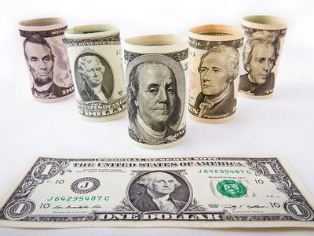

The U.S. Dollar, abbreviated as USD, serves as the official currency of the United States and is the most widely used currency in global trade and financial markets. Its dominance is underscored by its role as the primary reserve currency held by central banks around the world. The USD's widespread acceptance and liquidity make it a central player in the forex market, where it stands as the most traded currency, consistently maintaining a high trading volume.

As trading landscapes evolve, algorithmic trading has emerged as a significant advancement in financial markets, revolutionizing interactions with currencies like the USD. Algorithmic trading, also known as algo trading, utilizes advanced software to execute trading strategies with minimal human intervention, often at high frequencies. This method leverages algorithms capable of processing vast amounts of market data in real-time, optimizing trading decisions and efficiencies. By minimizing human emotions and biases in trading, algo trading enhances the precision and speed of executing trades.



This article focuses on the intersection of the U.S. Dollar and algorithmic trading. It examines the pivotal role the USD plays in algorithmic trading and considers the benefits and challenges that arise from this integration. As algo trading continues to reshape global financial markets, understanding the involvement of the USD is essential for traders and investors seeking to navigate this dynamic environment successfully.

## Table of Contents

## Understanding the USD

The U.S. Dollar (USD) stands as one of the most recognized and influential currencies globally. Its significance is underscored by its status as the primary reserve currency held by central banks and financial institutions around the world. This widespread acceptance is a testament to its perceived stability and reliability.

Globally, approximately 60% of foreign exchange reserves are held in U.S. Dollars, far surpassing other currencies. This dominance is due in part to the United States' economic size and strength, as well as the liquidity of the dollar markets. The USD's role as a key reserve currency enables countries to stabilize their own currencies and manage inflation by holding substantial dollar reserves.

In forex markets, the USD is the most actively traded currency, facilitating an average daily trading volume that often exceeds $6 trillion. This immense level of trading is due not only to the volume of trade in USD but also to its role as the "vehicle currency" in which other currencies are typically quoted. More than 80% of foreign exchange transactions involve the U.S. Dollar, either as the base or the quote currency.

The USD's dominance in global transactions and currency reserves is further supported by major international agreements and institutions, such as the International Monetary Fund (IMF) and the World Bank, which often conduct transactions and hold reserves primarily in U.S. Dollars. This further cements the currency's pivotal role in international finance and trade.

The robustness and [liquidity](/wiki/liquidity-risk-premium) associated with the U.S. Dollar make it a preferred choice in international trade and finance, and its influence continues to be paramount in shaping global economic policies.

## Historical Perspective of the USD

The United States Dollar (USD) has a rich history marked by significant transformations that have shaped its current status as a free-floating fiat currency. The USD was first introduced in 1785, becoming the official currency of the United States. Initially, the dollar was defined by the Coinage Act of 1792, which set the U.S. dollar against a specific amount of gold and silver, effectively establishing a bimetallic standard. This linkage was aimed at providing stability and trust in the new nation's currency system.

Over time, the relationship between the USD and precious metals underwent several shifts. The Gold Standard Act of 1900 solidified the dollar's tie to gold, with the promise that the dollar was redeemable in a fixed amount of gold. This gold standard was intended to curb inflation and stabilize the currency. However, the economic strains of the Great Depression led to significant changes. In 1933, the government suspended the gold standard, prohibiting the redemption of currency for gold domestically, although international exchanges continued under a modified standard.

The most pivotal shift occurred in 1971 under President Richard Nixon, commonly referred to as the "Nixon Shock." This series of economic measures effectively ended the Bretton Woods system, which had pegged major global currencies to the USD, which was in turn pegged to gold. By ending the convertibility of the dollar into gold, the USD transitioned to a free-floating currency system where its value was determined by the foreign exchange market rather than a fixed exchange rate.

Since then, the USD has functioned as a fiat currency, backed by the full faith and credit of the U.S. government rather than a physical commodity like gold. This transition allowed for greater flexibility in monetary policy, enabling the U.S. Federal Reserve to better manage economic variables such as inflation and unemployment. The shift to a fiat system also entrenched the dollar's role as the world's primary reserve currency, used extensively in global trade and finance.

Thus, the historical trajectory of the USD reflects a broader evolution from constrained systems tied to precious metals to a flexible, market-driven monetary structure. This transformation has been integral in establishing the USD's current position in the global financial system.

## What is Algorithmic Trading?

Algorithmic trading, commonly referred to as algo trading, is a method of executing trades using pre-defined, automated strategies through computer programs. These software-driven approaches are designed to leverage high-speed data analysis, sophisticated computational algorithms, and rapid order execution across various markets. The primary objective of [algorithmic trading](/wiki/algorithmic-trading) is to execute trades at the most advantageous pace and price, often faster than a human trader could achieve manually.

Algo trading is particularly effective for high-frequency trading ([HFT](/wiki/high-frequency-trading-strategies)). HFT is a subset of algorithmic trading characterized by the rapid execution of a large number of orders to capitalize on small price discrepancies in a short timeframe. Through this method, trades can be executed in fractions of a second, reducing the duration during which securities are held and thus minimizing market exposure.

An integral component of algo trading is the deployment of algorithms that assess multiple market variables simultaneously. These algorithms utilize vast datasets, analyzing elements like price movements, market trends, and [volume](/wiki/volume-trading-strategy) changes in real-time to make informed trading decisions. The algorithms are coded with specific rules and instructions that dictate when to place buy or sell orders, the size of these orders, and at what price levels.

In practical terms, algo trading can be implemented using programming languages such as Python, which offers various libraries and tools for constructing and executing trading algorithms. A simple example in Python might look like this:

```python
import numpy as np

# Example of a moving average crossover strategy
def moving_average_crossover(prices, short_window, long_window):
    short_mavg = np.convolve(prices, np.ones(short_window)/short_window, mode='valid')
    long_mavg = np.convolve(prices, np.ones(long_window)/long_window, mode='valid')
    buy_signals = short_mavg > long_mavg
    sell_signals = short_mavg < long_mavg
    return buy_signals, sell_signals

# Simulated price data
prices = np.array([100, 101, 102, 103, 104, 98, 99, 100, 97, 96])

# Using the moving average crossover strategy
buy_signals, sell_signals = moving_average_crossover(prices, 3, 5)
print("Buy Signals:", buy_signals)
print("Sell Signals:", sell_signals)
```

In this snippet, a basic moving average crossover strategy is implemented. The strategy generates buy and sell signals based on the crossover of short-term and long-term moving averages of price data.

In summary, algorithmic trading promotes efficiency by minimizing human error and emotional bias in decision-making. Algorithms can swiftly adapt to changing market conditions and execute complex strategies that involve several variables and statistical models, ensuring optimized trade execution and enhancing market liquidity.

## The Role of USD in Algo Trading

USD's prominence in the [forex](/wiki/forex-system) market designates it as a core element in algorithmic trading strategies. The sheer volume and liquidity associated with USD make it an attractive option for algorithmic systems seeking reliable execution and minimal market impact. Algorithmic trading, which relies on complex sequences of rules and computations to determine optimal trading actions, often involves pairing USD with major currencies such as the euro (EUR), Japanese yen (JPY), and British pound (GBP) to capitalize on market inefficiencies.

In an algorithmic trading context, USD serves as a critical benchmark, given its role in over 80% of forex transactions globally. This extensive involvement implies that the currency has relatively stable patterns of [volatility](/wiki/volatility-trading-strategies) and liquidity, essential for the effectiveness of automated trading systems. For example, the stability of USD allows trading algorithms to predict price movements more accurately and execute transactions with a higher degree of confidence.

A common practice in algorithmic trading strategies is to exploit market [arbitrage](/wiki/arbitrage) opportunities using USD. Algorithms scan the market for pricing disparities between USD and other currencies, executing trades to profit from these anomalies. These systems are designed to consider factors such as [interest rate](/wiki/interest-rate-trading-strategies) differentials, economic indicators, and geopolitical events that could influence currency pairs.

The reliability and predictability of USD facilitate high-frequency trading (HFT) operations. HFT systems perform numerous transactions in fractions of a second, benefiting from USD's liquidity as it reduces the risk of slippage — the difference between the expected price of a trade and the actual price. For instance, if an algorithm anticipates a price increase based on economic news, it can rapidly execute trades before the market adjusts, thereby securing advantageous positions.

Traders also integrate [machine learning](/wiki/machine-learning) models with algorithmic strategies to enhance decision-making processes involving USD. Through techniques like regression analysis and neural networks, trading systems can identify patterns and forecast future price movements more effectively. By continually learning from historical data and real-time market conditions, algorithms can refine their strategies and adapt to evolving USD market dynamics.

In summary, the USD’s liquidity, stability, and extensive reach affirm its role as a cornerstone in algorithmic trading strategies. By leveraging USD's characteristics, automated trading systems can efficiently execute a multitude of trades, optimize performance, and ultimately, seek to achieve higher returns.

## Advantages of Using USD in Algo Trading

The U.S. Dollar (USD) plays a critical role in algorithmic trading due to several inherent advantages that align with the operational requirements of automated trading systems. Firstly, USD provides a stable and reliable trading benchmark. As the most widely recognized currency, USD's broad acceptance ensures it remains a constant reference point in global trading activities. Its stability aids in reducing exchange rate fluctuations, offering predictability crucial for algorithmic models reliant on historical data analysis and pattern recognition.

Additionally, the high liquidity of USD currency pairs is a significant advantage for algorithmic traders. Liquidity refers to the ease with which an asset or security can be converted into cash without affecting its market price. High liquidity in USD pairs ensures rapid trade execution with minimal slippage, even in large volumes. This is particularly important in algorithmic trading, where the speed of trade execution is paramount to capitalize on minute market movements. The USD’s liquidity facilitates efficient market entry and [exit](/wiki/exit-strategy), reducing the risks associated with price changes between order placement and execution.

Furthermore, the wide acceptance of USD enhances algorithmic trading opportunities across various markets. As a primary currency in global forex trades, the USD maintains significant influence over international trade agreements and financial transactions. Its extensive use allows algorithmic traders to deploy strategies across diverse geographical markets with uniform currency denomination, streamlining the complexity of cross-currency transactions. This wide acceptance presents an opportunity for deploying high-frequency trading algorithms that require consistent access to liquid and active trading environments.

These advantages underscore why USD remains a preferred choice for algorithmic traders seeking to optimize performance and maximize returns in an increasingly competitive market environment.

## Challenges of USD Algo Trading

High volatility due to global economic events poses significant challenges for algorithmic trading involving the U.S. Dollar (USD). As the most traded currency globally, USD is sensitive to a variety of economic indicators and geopolitical developments. Events such as interest rate decisions by the Federal Reserve, employment reports, and international trade conflicts can lead to rapid price fluctuations in USD. These fluctuations can disrupt algorithmic trading strategies that depend on price stability to function optimally. Volatility can result in increased transaction costs, slippage, and deviations from expected trade outcomes.

Technical issues within trading algorithms present another challenge in USD algorithmic trading. Algorithms rely on complex software and hardware systems to execute trades based on predefined criteria. Despite rigorous testing and optimization, these systems can face technical glitches, such as latency issues, data feed interruptions, or bugs in the algorithm's logic. Such issues can lead to unintended large-scale trades that may not align with the trader's strategy, resulting in financial losses. Ensuring robust system architecture and regular maintenance is crucial to mitigate these risks.

Regulatory changes also impact USD trading practices, posing challenges for algorithmic traders. The foreign exchange market is subject to regulations that can vary across jurisdictions and may evolve over time. Rule changes by regulatory bodies, such as the U.S. Commodity Futures Trading Commission (CFTC) or the European Securities and Markets Authority (ESMA), can affect USD trading by altering compliance requirements or trading protocols. Algorithmic traders must remain informed about regulatory developments and adapt their systems accordingly to ensure compliance and optimize performance.

In summary, the challenges of USD algorithmic trading stem from the currency's inherent volatility, the technical complexities of trading algorithms, and the evolving regulatory landscape. Addressing these challenges requires a combination of strategic foresight, technological robustness, and regulatory awareness to ensure successful trading outcomes.

## USD Index and Its Impact

The U.S. Dollar Index (USDX) provides a quantitative measure of the U.S. Dollar's value relative to a basket of six major world currencies: the Euro (EUR), Japanese Yen (JPY), British Pound (GBP), Canadian Dollar (CAD), Swedish Krona (SEK), and Swiss Franc (CHF). The index is a critical tool for traders seeking to evaluate the market conditions influencing the USD.

The index is weighted, with the Euro holding the highest weight, accounting for approximately 57.6% of the index. The weights were established based on trade flows and other economic interactions between the United States and its major trading partners. Hence, when the USDX rises, it indicates that the U.S. Dollar is strengthening against these currencies, and conversely, a falling index suggests a decline in the dollar's strength.

Algorithmic trading strategies rely on the U.S. Dollar Index as a central indicator to gauge the currency's comparative strength, which can influence trading decisions and market timing. Since algorithmic trading involves using algorithms to perform trading decisions at high speeds and frequencies, access to real-time information such as changes in the USDX is paramount. The index can affect strategies by signaling potential currency trends, alerting traders to an optimal buy or sell time for USD pairs.

Here's a simplified Python script to fetch the current value of the USDX using an API service:

```python
import requests

def get_usd_index():
    url = 'https://api.example.com/usdx'  # Replace with a real API endpoint
    response = requests.get(url)
    data = response.json()

    return data['value']

usd_index_value = get_usd_index()
print(f"Current USD Index value: {usd_index_value}")
```

Notably, fluctuations in the U.S. Dollar Index can lead to revisions in algorithmic trading strategies. For instance, if the index indicates a strengthening USD, an algorithm might adjust its parameters to capitalize on an expected upward trend in USD pairs. Conversely, a weakening dollar according to the index might drive an algorithm to pivot toward more protective arrangements, such as stop-loss orders, to mitigate potential losses.

Overall, the U.S. Dollar Index serves as a fundamental resource for traders by providing insights into the USD's strength and by extension, influencing the strategic deployment of algorithmic trading systems. Changes in USDX assist traders in anticipating shifts in market conditions and adjusting their algorithms' logic to maintain competitive performance in the forex market.

## Conclusion

The U.S. Dollar (USD) remains a pivotal entity in the landscape of algorithmic trading because of its substantial influence and extensive use in global finance. As the preeminent reserve currency and most traded fiat in the foreign exchange markets, its involvement in algorithmic trading is both extensive and essential. This prominence facilitates the creation and execution of trading strategies that leverage USD's stability and liquidity.

Continuous advancements in trading technology promise to further embed the USD into sophisticated trading algorithms. The evolution of algorithmic systems, incorporating elements like machine learning and [artificial intelligence](/wiki/ai-artificial-intelligence), offers enhanced data analysis and responsiveness to market shifts. These innovations can result in more precise trading decisions, positioning USD as an even more integral element within these frameworks.

However, a comprehensive understanding of USD's function in algorithmic trading systems is essential for traders and investors globally. Awareness of the challenges, such as potential volatility and regulatory changes, is crucial. Acknowledging these factors enables market participants to better navigate the complexities associated with USD trading strategies. Ultimately, the USD’s central role in financial markets ensures its continued dominance and relevance, making it indispensable for effective algorithmic trading.

## FAQs About USD and Algo Trading

### What makes USD vital in global trading?

The U.S. Dollar (USD) plays a crucial role in global trading for several reasons. Firstly, it serves as the world's primary reserve currency, meaning central banks hold a significant portion of their foreign exchange reserves in USD. This status ensures constant demand and reinforces its global dominance. Secondly, USD is used in approximately 88% of all foreign exchange transactions, according to the Bank for International Settlements (BIS). This widespread use provides liquidity, which is essential for executing large trades without significantly affecting the market price.

Additionally, many international commodities, such as oil, are priced in USD, ensuring its utility in global trade. The currency's stability and the size of the U.S. economy further contribute to its reliability as a global trading currency. Financial markets worldwide also benchmark their activities against the USD due to its consistent value and trust in U.S. economic policies.

### How does algo trading utilize USD effectively?

Algorithmic trading, or algo trading, leverages the USD's characteristics to execute efficient trading strategies. Its high liquidity ensures that trades can be made rapidly, reducing the risk of slippage—the difference between the estimated transaction cost and the final price. In currency pairs like EUR/USD or USD/JPY, algorithms can quickly open and close positions based on real-time data analysis, capitalizing on short-term price movements.

Algorithms can incorporate economic indicators and news related to USD, such as U.S. Federal Reserve announcements, to predict market movements. Automated systems can manage positions without human intervention, evaluating large datasets to identify profitable opportunities and execute strategies precisely. This capability allows traders to operate at high frequencies, processing thousands or even millions of trades per second.

### What are the key risks of USD algorithmic trading?

Despite its advantages, algorithmic trading in USD is not without risks. High volatility, especially during significant economic events like Federal Reserve meetings or geopolitical tensions, can disrupt algorithmic strategies. For instance, rapid price fluctuations might lead to losses if algorithms fail to adapt swiftly.

Technical issues pose another risk. Malfunctions or bugs in trading software can result in unintended large-scale trades or misinterpretations of market signals. Such issues can lead to costly errors or exacerbate market volatility.

Regulatory changes also impact algorithmic trading. Compliance with evolving financial regulations can be challenging, requiring constant updates to trading algorithms to ensure legality and avoid penalties. Moreover, market conditions are subject to change, necessitating continual refinement of algorithms to maintain their effectiveness.

## References & Further Reading

[1]: ["Advances in Financial Machine Learning"](https://www.amazon.com/Advances-Financial-Machine-Learning-Marcos/dp/1119482089) by Marcos Lopez de Prado

[2]: ["Evidence-Based Technical Analysis: Applying the Scientific Method and Statistical Inference to Trading Signals"](https://www.amazon.com/Evidence-Based-Technical-Analysis-Scientific-Statistical/dp/0470008741) by David Aronson

[3]: ["Machine Learning for Algorithmic Trading"](https://github.com/stefan-jansen/machine-learning-for-trading) by Stefan Jansen

[4]: ["Quantitative Trading: How to Build Your Own Algorithmic Trading Business"](https://www.amazon.com/Quantitative-Trading-Build-Algorithmic-Business/dp/1119800064) by Ernest P. Chan

[5]: ["Forex Analysis and Trading: Effective Top-Down Strategies Combining Fundamental, Position, and Technical Analyses"](https://archive.org/details/forexanalysistra0000mart) by T. J. Marta and Joseph Brusuelas