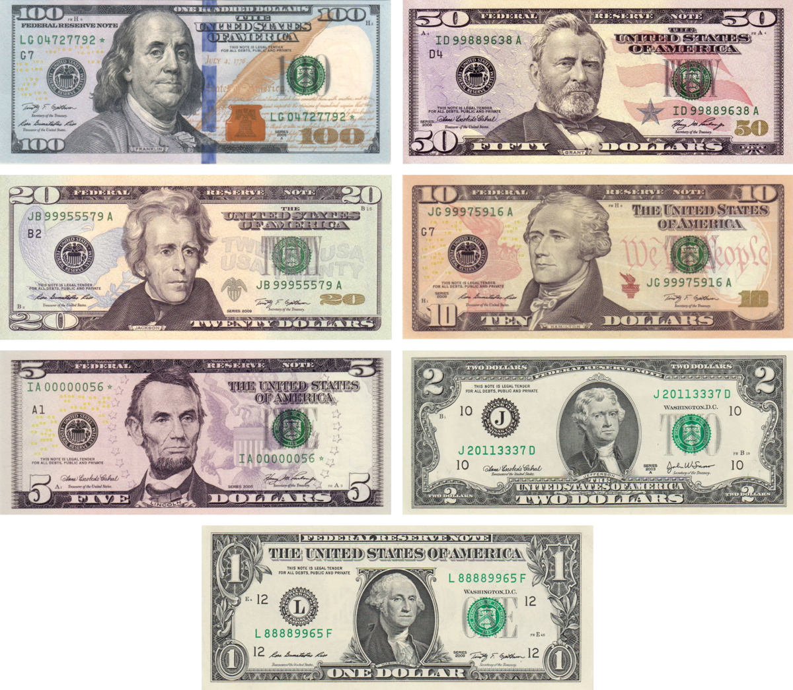

## Table of Contents

## What does USD stand for?

USD stands for United States Dollar. It is the official currency used in the United States and its territories. People often use the symbol $ or US$ to show amounts in USD. It is one of the most widely used currencies around the world.

The USD is important for international trade and is often used as a reserve currency by other countries. This means that many countries keep a supply of USD to use in global transactions. The value of the USD can affect the economies of other countries, making it a key player in the world's financial system.

## Why is the U.S. Dollar abbreviated as USD?

The U.S. Dollar is abbreviated as USD because it stands for "United States Dollar." This abbreviation helps people quickly understand that the currency is from the United States. It is used in financial markets, on banknotes, and in international trade to avoid confusion with other currencies that might also use the dollar symbol, like the Canadian Dollar or the Australian Dollar.

Using "USD" makes it clear and simple for everyone around the world. It is part of a system called ISO 4217, which gives a unique three-letter code to every currency. This system helps in banking, trading, and when people travel to different countries. By using USD, people know exactly which dollar they are talking about, making global transactions smoother and easier to understand.

## How is the USD symbolized?

The USD is symbolized by the dollar sign, which looks like this: $. Sometimes, to make it clear that it's the U.S. Dollar, people write it as US$. This symbol is used on money, in stores, and when people talk about prices in the United States.

In other countries, to avoid confusion with their own dollars, they might use the full abbreviation "USD" instead of just the symbol. This helps everyone know they are talking about the U.S. Dollar. So, you might see prices written as "USD 100" to show it's in U.S. Dollars.

## In which countries is the USD the official currency?

The USD is the official currency of the United States of America. This means that people in the U.S. use dollars to buy things, pay bills, and save money. The U.S. includes places like New York, California, and Texas. The USD is also used in some places that are part of the U.S. but not in the main part of the country, like Puerto Rico and Guam.

Besides the U.S., the USD is the official currency in a few other countries. These countries are Ecuador, El Salvador, and Panama. In these places, people use U.S. dollars every day, just like people in the United States do. This can make it easier for them to trade with the U.S. and other countries that use dollars.

## What is the history behind the USD?

The history of the USD goes back to the late 1700s. After the United States became a country, it needed its own money. In 1792, the U.S. government made the Coinage Act. This law said that the country would use dollars as its money. The first U.S. coins were made that year, and they were made of silver and gold. The dollar was based on the Spanish dollar, which was used a lot in the Americas at that time. The U.S. dollar became the main money in the country, and people started using it to buy things and pay for stuff.

Over time, the USD changed a lot. In the 1860s, during the Civil War, the U.S. started using paper money called "greenbacks." These were different from coins because they were made of paper and had pictures on them. Later, in the 20th century, the U.S. made the Federal Reserve to help control the money. The Federal Reserve made more paper money and also started using coins made of different metals. Today, the USD is used all over the world, not just in the U.S. It's important for buying and selling things between countries, and many people keep USD as a way to save money safely.

## How does the value of the USD fluctuate?

The value of the USD goes up and down because of many things. One big reason is how much people want to buy and sell the USD. If more people want to buy it, the value goes up. If more people want to sell it, the value goes down. Another reason is what's happening in the U.S. economy. If the economy is doing well, with lots of jobs and people buying things, the USD usually gets stronger. But if the economy is not doing well, with fewer jobs and people not buying as much, the USD can get weaker.

The value of the USD also changes because of what other countries are doing. If other countries' economies are doing better than the U.S., their money might get stronger, making the USD weaker. Also, if the U.S. government changes interest rates, that can affect the USD. Higher interest rates can make the USD stronger because people want to save money in the U.S. to get more interest. Lower interest rates can make the USD weaker because people might take their money to other countries for better interest. All these things together make the value of the USD go up and down every day.

## What are the major factors affecting the USD exchange rate?

The value of the USD compared to other currencies changes because of many things. One big thing is how the U.S. economy is doing. If the U.S. has lots of jobs and people are buying things, the USD usually gets stronger. But if the economy is not doing well, with fewer jobs and people not buying as much, the USD can get weaker. Another thing is what the U.S. government does with interest rates. If they make interest rates higher, the USD can get stronger because people want to save money in the U.S. to get more interest. If they make interest rates lower, the USD can get weaker because people might take their money to other countries for better interest.

Another [factor](/wiki/factor-investing) is what's happening in other countries. If other countries' economies are doing better than the U.S., their money might get stronger, making the USD weaker. Also, if other countries want to buy more U.S. things, like cars or computers, the USD can get stronger. But if they want to buy less, the USD can get weaker. Political things can also change the USD value. If people think the U.S. government is doing a good job, the USD might get stronger. If they think the government is not doing well, the USD might get weaker. All these things together make the USD go up and down every day.

## How is the USD used in international trade?

The USD is very important in international trade because many countries use it to buy and sell things with each other. When a country wants to buy something from another country, they often use USD to pay for it. This is because the USD is seen as a strong and stable currency. For example, if Japan wants to buy oil from Saudi Arabia, they might use USD to make the payment. This makes it easier for everyone because they don't have to worry about changing their own money into another country's money.

The USD is also used as a reserve currency by many countries. This means that countries keep a supply of USD in their banks to use when they need to buy things from other countries. Having USD as a reserve helps countries feel more secure because they know they can use it to trade with anyone. It also makes the USD very important in the world's financial system. When the value of the USD changes, it can affect how much things cost in international trade, making it a key player in the global economy.

## What role does the USD play in global finance?

The USD plays a big role in global finance. It is used a lot in international trade because many countries see it as a strong and stable currency. When countries buy and sell things with each other, they often use USD to make payments. This makes trading easier because countries don't have to change their own money into another country's money. The USD is also used as a reserve currency, which means countries keep a supply of it in their banks to use when they need to buy things from other countries. This helps countries feel more secure in their trade.

The value of the USD can affect the whole world's economy. If the USD gets stronger, it can make things more expensive for other countries to buy from the U.S. If it gets weaker, things can become cheaper. This is important because it can change how much countries want to trade with each other. Also, many big financial deals, like loans and investments, are made in USD. This makes the USD a key part of the world's financial system, influencing how money moves around the globe.

## How does the Federal Reserve influence the USD?

The Federal Reserve, often called the Fed, is like the boss of money in the United States. It can change how much the USD is worth by doing things like changing interest rates. If the Fed makes interest rates higher, it can make the USD stronger. This is because people want to save their money in the U.S. to get more interest. But if the Fed makes interest rates lower, the USD can get weaker because people might take their money to other countries for better interest.

The Fed also controls how much money is out there by buying or selling U.S. government bonds. If the Fed buys bonds, it puts more money into the economy, which can make the USD weaker. If it sells bonds, it takes money out of the economy, which can make the USD stronger. These actions help the Fed keep the economy stable and can affect how much the USD is worth compared to other countries' money.

## What are the different denominations of USD?

The USD comes in different sizes of money, called denominations. For paper money, you have $1, $2, $5, $10, $20, $50, and $100 bills. The $1 bill is the smallest paper money, and the $100 bill is the biggest. People use these bills every day to buy things, pay for stuff, and save money. The $2 bill is not used as much as the others, but it's still around.

For coins, you have the penny, which is worth 1 cent, the nickel, worth 5 cents, the dime, worth 10 cents, and the quarter, worth 25 cents. There are also bigger coins like the half dollar, worth 50 cents, and the dollar coin, worth $1. People use coins for smaller purchases or to make change. All these different sizes of money help people use the USD easily in their daily lives.

## How can one invest in the USD and what are the risks involved?

One way to invest in the USD is by buying U.S. dollars if you live in another country. You can do this by exchanging your own country's money for USD. Another way is to buy U.S. Treasury bonds, which are like loans you give to the U.S. government. They pay you back with interest over time. You can also invest in U.S. stocks or mutual funds that are based in the U.S. This means you're buying pieces of American companies, and if those companies do well, your investment can grow.

Investing in the USD comes with some risks. The value of the USD can go up and down because of things like the U.S. economy, interest rates, and what's happening in other countries. If the USD gets weaker, the money you invested might be worth less when you want to change it back to your own country's money. Also, if you invest in U.S. stocks or bonds, those can lose value if the companies or the U.S. economy don't do well. It's important to think about these risks and maybe talk to someone who knows about money before you decide to invest in the USD.

## References & Further Reading

[1]: ["Advances in Financial Machine Learning"](https://www.amazon.com/Advances-Financial-Machine-Learning-Marcos/dp/1119482089) by Marcos Lopez de Prado

[2]: ["Evidence-Based Technical Analysis: Applying the Scientific Method and Statistical Inference to Trading Signals"](https://www.amazon.com/Evidence-Based-Technical-Analysis-Scientific-Statistical/dp/0470008741) by David Aronson

[3]: ["Machine Learning for Algorithmic Trading"](https://github.com/stefan-jansen/machine-learning-for-trading) by Stefan Jansen

[4]: ["Quantitative Trading: How to Build Your Own Algorithmic Trading Business"](https://www.amazon.com/Quantitative-Trading-Build-Algorithmic-Business/dp/1119800064) by Ernest P. Chan

[5]: ["Forex Analysis and Trading: Effective Top-Down Strategies Combining Fundamental, Position, and Technical Analyses"](https://archive.org/details/forexanalysistra0000mart) by T. J. Marta and Joseph Brusuelas