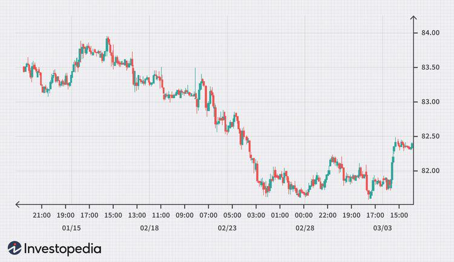

The foreign exchange market, commonly known as the forex market, is the largest and most liquid financial market in the world. It operates as a decentralized network of financial institutions, corporations, and individual traders involved in buying, selling, and exchanging currencies at prevailing market prices. The daily trading volume in the forex market exceeds $6 trillion, which highlights its vastness and pivotal role in the global economy. The forex market is crucial for international trade and investment, affecting everything from currency valuation to economic policies.

At the core of forex trading lies the concept of currency pairs, which are essentially the quotation of two different currencies, with the value of one currency being quoted against the other. For example, in the currency pair EUR/USD, the Euro (EUR) is the base currency and the U.S. dollar (USD) is the quote currency. The value of currency pairs provides insights into the relative strength of currencies and helps traders to understand the exchange rate dynamics.



The USD/JPY currency pair, which involves the U.S. dollar and the Japanese yen, is one of the major and most traded pairs in the forex market. This pair represents the value of one U.S. dollar in terms of Japanese yen. It holds significant historical and economic importance as both the U.S. and Japan are leading global economies with substantial influence on the international stage. Their currencies play a critical role in international finance, making USD/JPY a focus for traders seeking to understand geopolitical and economic developments.

Algorithmic trading has become increasingly prominent in the context of forex trading, offering significant advantages such as speed, precision, and data processing capabilities that human traders find difficult to match. Algorithms can analyze market conditions and execute trades at high speeds and volumes, often using predefined criteria and sophisticated models. The role of algorithmic trading in the forex market underscores its potential to influence trading outcomes and highlights the importance of technology in modern financial markets.

This article will explore the essence of the USD/JPY currency pair within the forex market and examine how algorithmic trading is implemented to optimize trading strategies. By understanding these concepts, traders and stakeholders can better navigate the complexities of the forex market and leverage algorithmic trading techniques for enhanced performance.

## Table of Contents

## Understanding the USD/JPY Currency Pair

A currency pair in forex trading is a quotation of two different currencies, where one currency is quoted against the other. The first currency in the pair is known as the base currency, and the second currency is the quote currency. Currency pairs are the focal point of forex trading as they represent how much of the quote currency is needed to purchase one unit of the base currency. For example, in the USD/JPY pair, USD is the base currency, and JPY is the quote currency.

The USD/JPY pair consists of the U.S. dollar (USD) and the Japanese yen (JPY). This pair is one of the most traded currency pairs in the foreign exchange market, indicating its global importance and [liquidity](/wiki/liquidity-risk-premium). The U.S. dollar, as a global reserve currency, plays a central role in international finance, while the Japanese yen is a significant currency due to Japan's economic stature as one of the largest global economies.

Historically, the USD/JPY has been pivotal in financial exchanges between the U.S. and Japan, reflecting the economic relationship and trade activity between the two countries. Due to the substantial economic size and output of both the U.S. and Japan, the pair is a major focus for traders and policymakers alike. The exchange rate direction has often mirrored economic policy shifts and international trade dynamics.

Several factors influence the exchange rates of the USD/JPY currency pair:

1. **Interest Rate Differentials**: The difference in interest rates set by the Bank of Japan and the U.S. Federal Reserve directly affects the USD/JPY exchange rate. Higher interest rates in the U.S. compared to Japan typically lead to a strengthening of the USD against the JPY as investors seek higher returns.

2. **Economic Indicators**: Macroeconomic indicators such as GDP growth, employment figures, trade balances, and inflation indices from both the U.S. and Japan profoundly impact the pair's exchange rate. Positive economic data in the U.S. can drive demand for USD, while robust Japanese economic performance can bolster the JPY.

3. **Geopolitical Stability**: Political stability in both countries and the broader geopolitical scenario can affect investor sentiment, influencing the currency markets. Events such as political elections, international trade negotiations, or natural disasters can lead to fluctuations in the USD/JPY pair.

4. **Monetary Policies**: Decisions regarding monetary policies, such as quantitative easing or tightening, have substantial implications for the USD/JPY. For instance, expansive monetary policies generally lead to a depreciation of the domestic currency, altering exchange rate dynamics.

The USD/JPY is not just a representation of the transactional relationship between two of the world's leading economies, but also a key element for investors looking to exploit [interest rate](/wiki/interest-rate-trading-strategies) movements and economic changes. Understanding these influences is crucial for traders aiming to predict future movements in the currency pair's exchange rate.

## Factors Influencing the USD/JPY Exchange Rate

The exchange rate of the USD/JPY currency pair is subject to a multitude of influences, with interest rate differentials being one of the most prominent factors. Interest rates, set by central banks, directly affect currency values. When interest rates in the United States increase relative to those in Japan, it typically results in a stronger USD relative to the JPY, making USD-denominated assets more attractive to investors. This is due to the potential for higher returns on investments in the country with the higher interest rate. Conversely, if Japanese interest rates rise relative to U.S. rates, the yen may appreciate.

Mathematically, the relationship between exchange rates and interest rate differentials can be expressed through the Interest Rate Parity (IRP) theory, which states that:

$$
F = S \left(\frac{1 + i_{dom}}{1 + i_{for}}\right)
$$

Where:
- $F$ is the forward exchange rate,
- $S$ is the spot exchange rate,
- $i_{dom}$ is the domestic interest rate (U.S.),
- $i_{for}$ is the foreign interest rate (Japan).

Beyond interest rates, government policies, including fiscal stimulus or austerity measures, significantly affect USD/JPY rates. Monetary policies, particularly those announced by the Federal Reserve and the Bank of Japan, have substantial impacts. For instance, the introduction of quantitative easing by a central bank can lead to currency depreciation. Geopolitical events, such as trade disputes or military tensions, can create uncertainty, affecting investor confidence and thus influencing the USD/JPY exchange rate.

Market sentiment plays a crucial role as well. Investor behavior often reflects broader economic expectations, which are influenced by news reports, economic data releases, and market rumors. These can lead to speculative trading that moves USD/JPY outside fundamentally justified levels. 

Historical examples underline these dynamics. The Asian financial crisis of 1997–1998 saw massive yen devaluation as investors retreated from Asian assets. More recently, the COVID-19 pandemic initially strengthened the yen due to its status as a safe-haven asset, before unprecedented monetary policy actions by both the Bank of Japan and the Federal Reserve normalized the exchange rate. 

These factors make the USD/JPY rate a complex interplay of economic indicators, policies, and market psychology, all of which [forex](/wiki/forex-system) traders must consider.

 to Algorithmic Trading

Algorithmic trading, often referred to as algo trading, is a method of executing trades using pre-programmed instructions that account for various variables such as time, price, and [volume](/wiki/volume-trading-strategy). By leveraging advanced computational techniques and algorithms, traders can execute orders at speeds and frequencies that would be impossible for human traders. This approach is particularly discerning in the forex market, where minute-to-minute changes can have significant implications.

One of the primary advantages of [algorithmic trading](/wiki/algorithmic-trading) in forex is its speed and efficiency. Algorithms can process and analyze large sets of data in microseconds, thereby allowing trades to be executed with minimal latency. This rapid processing capability enables traders to capitalize on fleeting [arbitrage](/wiki/arbitrage) opportunities and market inefficiencies. Moreover, algorithms mitigate the emotional component of trading, which can often lead to irrational decision-making. By adhering strictly to predefined parameters, algorithms ensure disciplined trading.

There are various types of algorithms used in trading currency pairs such as USD/JPY. One common type is the trend-following algorithm, which seeks to exploit patterns and trends in the market data to make trading decisions. Statistical arbitrage algorithms apply statistical models to identify and exploit price inefficiencies between currency pairs. Mean reversion algorithms, on the other hand, operate under the premise that asset prices will revert to their historical mean over time, and they make trading decisions based on deviations from this mean.

Despite its advantages, algorithmic trading is not without its risks and challenges. A significant hurdle in algo trading is the dependence on technology and data accuracy. Trading algorithms rely on real-time data feeds; any disruption or error in this data can lead to incorrect trading decisions and potentially substantial losses. Additionally, algo trading introduces a layer of systemic risk, as a malfunction or unexpected behavior by the algorithm could trigger a chain reaction affecting the broader market.

Moreover, high-frequency trading algorithms that operate on moving in and out of trades in fractions of a second can contribute to market [volatility](/wiki/volatility-trading-strategies) and liquidity issues. Regulatory challenges also arise, as authorities seek to establish guidelines that prevent market manipulation and ensure fair trading practices. Consequently, traders must strike a balance between the advantages offered by algorithmic trading and the inherent risks, often involving thorough testing and monitoring to optimize the performance of these complex systems.

## Implementing Algorithmic Trading for USD/JPY

Implementing algorithmic trading for the USD/JPY currency pair involves several critical steps, each of which plays a crucial role in establishing an effective trading strategy. This section provides a concise walkthrough of setting up algorithmic trading, from selecting suitable platforms to optimizing algorithms for enhanced performance.

### Selecting Trading Platforms and Tools

Choosing the right trading platform is the foundational step in implementing algorithmic trading for the USD/JPY pair. Platforms such as MetaTrader 4 and 5, cTrader, and NinjaTrader are popular choices due to their comprehensive features and robust support for automated trading. These platforms offer APIs (Application Programming Interfaces) that allow traders to programmatically execute trades, access market data, and develop trading algorithms. 

**Platforms to Consider:**
- **MetaTrader 4/5**: Known for its wide range of tools for technical analysis and support for Expert Advisors (EAs).
- **cTrader**: Offers intuitive interface and algorithmic trading via cAlgo.
- **NinjaTrader**: Provides advanced charting and supports C# for developing trading algorithms.

### Key Indicators and Signals

Successful USD/JPY algorithmic trading often relies on various technical indicators and signals. These indicators help algorithms identify trading opportunities by analyzing market data patterns.

**Fundamental Indicators:**
- **Moving Averages (MA)**: Used to identify trends by smoothing price data over a specified period.
- **Relative Strength Index (RSI)**: Measures the magnitude of price changes to evaluate overbought or oversold conditions.
- **Bollinger Bands**: Utilize standard deviations to predict volatility and price breakouts.
- **MACD (Moving Average Convergence Divergence)**: Highlights changes in strength, direction, momentum, and duration of a trend.

Combining these indicators can enhance decision-making and improve the accuracy of trade executions.

### Strategies for Backtesting and Optimizing Trading Algorithms

Backtesting is a critical step to ensure that the trading algorithm performs well under historical market conditions. It involves running the algorithm through past data to analyze its effectiveness and risk profile.

**Backtesting Process:**
1. **Historical Data Collection**: Obtain quality historical price data for the USD/JPY pair from reliable data providers.
2. **Setup and Test**: Use the trading platform's backtesting environment to run the algorithm on historical data.
3. **Performance Metrics**: Analyze key performance metrics such as win rate, profit factor, drawdown, and Sharpe ratio to assess the strategy's performance.

**Python Example for Backtesting:**
```python
import pandas as pd
import backtrader as bt

# Load historical data
data = pd.read_csv('usdjpy_data.csv', parse_dates=True, index_col='Date')

# Create a custom strategy
class USDJPYStrategy(bt.Strategy):
    def __init__(self):
        self.ma = bt.indicators.SimpleMovingAverage(self.data.close, period=15)

    def next(self):
        if self.data.close > self.ma:
            self.buy()
        elif self.data.close < self.ma:
            self.sell()

# Create cerebro instance and add strategy
cerebro = bt.Cerebro()
cerebro.addstrategy(USDJPYStrategy)

# Feed data to the cerebro
data_feed = bt.feeds.PandasData(dataname=data)
cerebro.adddata(data_feed)

# Run backtest
cerebro.run()
```

### Optimization Techniques

Optimization refines algorithm parameters to enhance performance under varying market conditions. Traders can use platforms that support parameter optimization to adjust various aspects of the algorithm, such as time frames, indicator parameters, and risk management settings.

**Optimization Tips:**
- **Parameter Tuning**: Experiment with different indicator periods and thresholds.
- **Walk-Forward Analysis**: Test the algorithm over different time periods to check its adaptability.
- **Risk Management**: Incorporate stop-loss and take-profit levels to manage risk effectively.

By thoroughly testing and optimizing trading algorithms, traders can improve their efficiency and gain a competitive edge in algorithmic trading of the USD/JPY currency pair.

## Monitoring and Adapting Trading Algorithms

Real-time monitoring is essential in algorithmic trading to ensure optimal performance and profitability. This process involves continuously tracking the performance of trading algorithms and making necessary adjustments to adapt to ever-changing market conditions. By doing so, traders can minimize risks and ensure that strategies remain relevant and effective.

To adjust trading strategies based on market conditions, traders can employ several techniques. One common approach is to utilize trend indicators that help identify the underlying market direction. If the market trends shift from bullish to bearish or vice versa, algorithms should be flexible enough to adjust their buy and sell signals accordingly. Another method involves the use of volatility indicators, such as the Average True Range (ATR), to modify position sizes or set stop-loss levels dynamically.

Successful algorithmic strategies for trading the USD/JPY pair often incorporate a combination of trend-following and mean-reversion techniques. For instance, a strategy might involve using Moving Averages (MA) to capture [momentum](/wiki/momentum) while employing Bollinger Bands to exploit price reversals. This dual approach can balance capturing gains in trending markets and taking advantage of temporary price corrections.

To illustrate an algorithmic strategy, consider the following simple Python example using the Moving Average Crossover strategy:

```python
import pandas as pd

# Load historical price data for USD/JPY
data = pd.read_csv('usdjpy_data.csv')

# Calculate short-term and long-term moving averages
data['short_ma'] = data['Close'].rolling(window=50).mean()
data['long_ma'] = data['Close'].rolling(window=200).mean()

# Generate trading signals
data['signal'] = 0
data['signal'][50:] = np.where(data['short_ma'][50:] > data['long_ma'][50:], 1, -1)

# Implement strategy logic
data['position'] = data['signal'].shift()
```

In this script, the trading signals are generated based on a simple moving average crossover. An upward crossover, where the short-term moving average surpasses the long-term moving average, generates a buy signal. Conversely, a downward crossover triggers a sell signal.

Keeping algorithms effective requires ongoing technology and software updates. Algorithmic traders should regularly update their trading platforms and use modern statistical and analytical tools for optimal performance. This may include integrating [machine learning](/wiki/machine-learning) techniques, such as regression analysis or neural networks, to enhance predictive capabilities. Furthermore, cloud-based solutions and high-performance computing can offer scalability and faster execution times, crucial for maintaining an edge in the competitive forex market.

In conclusion, by emphasizing real-time monitoring, adapting strategies through various indicators, and embracing technological advancements, traders can ensure their trading algorithms for USD/JPY remain effective and profitable.

## Conclusion

The USD/JPY currency pair holds a pivotal position in the forex market due to its liquidity and the economic significance of both the United States and Japan. As one of the most traded currency pairs, USD/JPY serves as a barometer for gauging economic interactions between these two powerhouse economies. This significance is further underscored by its sensitivity to interest rate differentials, government policies, and geopolitical events, making it an attractive target for traders seeking to capitalize on market movements.

Algorithmic trading offers a suite of advantages that can enhance the trading of USD/JPY. By leveraging algorithms, traders can achieve increased speed and efficiency, execute trades at optimal prices, and manage orders in a systematic manner. The ability to backtest algorithms using historical data allows for the refinement of trading strategies, while real-time monitoring facilitates swift adaptation to market changes, ensuring that trading strategies remain effective in dynamic conditions.

Ongoing learning and adaptation are crucial in currency trading. The forex market is constantly evolving, influenced by new economic data, policy shifts, and technological advancements. Traders must continually update their knowledge and refine their strategies to remain competitive. This ongoing adaptation is particularly pertinent with algorithmic trading, where technology and software updates can provide significant advantages in performance.

Looking ahead, the future trends in algorithmic trading for USD/JPY and other currency pairs suggest an increasing reliance on machine learning and [artificial intelligence](/wiki/ai-artificial-intelligence). These technologies have the potential to further optimize trading algorithms, offering insights that were previously unattainable. As data analytics and computational power continue to grow, algorithms will likely become more sophisticated, providing traders with even greater opportunities for profit.

Therefore, traders are encouraged to explore algorithmic trading as a means to augment their trading performance. While the transition to algo trading requires an initial investment of time and resources, the potential benefits, such as improved accuracy, efficiency, and profit margins, are significant. Embracing algorithmic trading can lead to a more structured and informed approach to navigating the complexities of the USD/JPY market, and the forex market at large.

## References & Further Reading

[1]: Bergstra, J., Bardenet, R., Bengio, Y., & Kégl, B. (2011). ["Algorithms for Hyper-Parameter Optimization."](https://dl.acm.org/doi/10.5555/2986459.2986743) Advances in Neural Information Processing Systems 24.

[2]: ["Advances in Financial Machine Learning"](https://www.amazon.com/Advances-Financial-Machine-Learning-Marcos/dp/1119482089) by Marcos Lopez de Prado

[3]: ["Evidence-Based Technical Analysis: Applying the Scientific Method and Statistical Inference to Trading Signals"](https://www.amazon.com/Evidence-Based-Technical-Analysis-Scientific-Statistical/dp/B01FIZ8X7I) by David Aronson

[4]: ["Machine Learning for Algorithmic Trading"](https://github.com/stefan-jansen/machine-learning-for-trading) by Stefan Jansen

[5]: ["Quantitative Trading: How to Build Your Own Algorithmic Trading Business"](https://github.com/LucindaYa/quant-resources/blob/master/Quantitative%20Trading%20How%20to%20Build%20Your%20Own%20Algorithmic%20Trading%20Business.pdf) by Ernest P. Chan