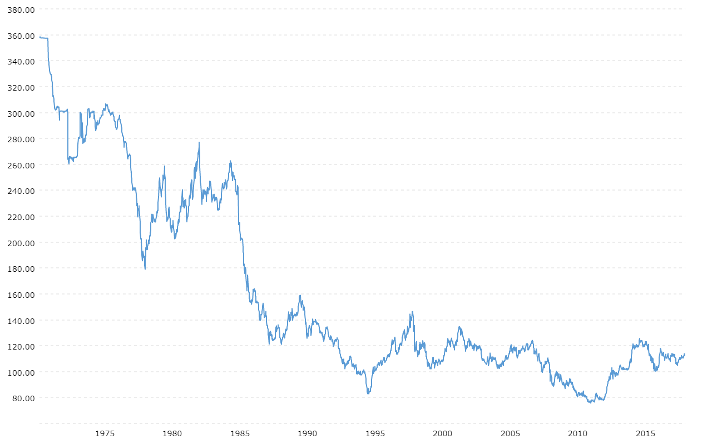

## Table of Contents

## What is the USD/JPY exchange rate?

The USD/JPY exchange rate tells you how many Japanese yen (JPY) you can get for one US dollar (USD). This rate changes every day because of things like how well the economies of the US and Japan are doing, what's happening in the world, and what people think will happen in the future. You can find the current rate on financial news websites or by using a currency converter online.

For example, if the exchange rate is 150 JPY per USD, it means you can get 150 yen for every dollar you have. This rate is important for people who travel between the US and Japan, businesses that trade between the two countries, and investors who want to make money from changes in the exchange rate. Keeping an eye on this rate can help you understand how the value of the dollar and the yen are changing over time.

## How is the USD/JPY exchange rate determined?

The USD/JPY exchange rate is decided by how much people want to buy and sell US dollars and Japanese yen. It's like a big market where everyone is trying to trade their money. If more people want to buy dollars with their yen, the value of the dollar goes up and the exchange rate goes up too. On the other hand, if more people want to sell dollars to get yen, the value of the dollar goes down, and so does the exchange rate.

Lots of things can affect how much people want to trade these currencies. For example, if the US economy is doing well, more people might want to invest there and buy dollars, which makes the dollar stronger. If Japan's economy is doing better, then more people might want to buy yen instead. Also, big events like changes in interest rates, political news, or natural disasters can make people want to buy or sell one currency more than the other, which changes the exchange rate.

## What factors influence the USD/JPY exchange rate?

The USD/JPY exchange rate is affected by many things. One big factor is how well the economies of the US and Japan are doing. If the US economy is strong, more people might want to buy dollars to invest there, which makes the dollar stronger and the exchange rate go up. On the other hand, if Japan's economy is doing better, more people might want to buy yen, making the yen stronger and the exchange rate go down. Another factor is the interest rates set by the central banks in each country. If the US Federal Reserve raises interest rates, it can attract more investors to the US, pushing the dollar's value up. If Japan's central bank, the Bank of Japan, changes its interest rates, it can have the opposite effect on the yen.

Political events and news can also play a big role in the exchange rate. If there's uncertainty or bad news in the US, like a political crisis or a natural disaster, people might want to sell dollars and buy yen, which is often seen as a safe currency. This can make the dollar weaker. On the other hand, if there's good news or stability in the US, people might want to buy more dollars, making it stronger. The same goes for Japan; good or bad news can make people want to buy or sell yen, affecting the exchange rate.

Lastly, market sentiment and speculation can influence the USD/JPY rate. Traders and investors often try to predict where the exchange rate is going and buy or sell currencies based on their guesses. If many people think the dollar will get stronger, they might buy more dollars, which can actually make the dollar stronger. This can create a cycle where the exchange rate moves based on what people think will happen, not just on the real economic conditions. Keeping an eye on these factors can help you understand why the USD/JPY exchange rate changes.

## How has the USD/JPY exchange rate historically performed?

The USD/JPY exchange rate has changed a lot over time. In the 1970s, the rate was around 300 yen per dollar. This was because Japan was still recovering from World War II and its economy was not as strong as the US. Over the next few decades, Japan's economy grew a lot, and by the late 1980s, the exchange rate dropped to around 120 yen per dollar. This was partly because of the Plaza Accord, where big countries agreed to let the dollar get weaker to help balance trade.

From the 1990s to the 2000s, the exchange rate moved up and down a lot. Japan went through a long period of slow growth called the "Lost Decade," and the yen got weaker at times. By the early 2000s, the rate was around 100 yen per dollar. In the 2010s, Japan tried to make its economy grow by keeping interest rates very low, which made the yen weaker. The exchange rate went up to around 120-130 yen per dollar. More recently, the rate has been around 140-150 yen per dollar, showing how the US economy has been doing better than Japan's.

Overall, the USD/JPY exchange rate has gone through big changes over the years. These changes show how the economies of the US and Japan have grown and changed, and how big events and policies have affected the value of their currencies.

## What are the key economic indicators to watch for USD/JPY?

To understand what might happen with the USD/JPY exchange rate, you should keep an eye on some key economic indicators from both the US and Japan. For the US, watch the Gross Domestic Product (GDP) growth rate, which shows how fast the economy is growing. If the US GDP is growing a lot, the dollar might get stronger. Also, look at the US unemployment rate; if fewer people are out of work, it can mean the economy is doing well, which can make the dollar stronger too. The Federal Reserve's interest rate decisions are super important too. If they raise interest rates, it can attract more money to the US, making the dollar stronger.

For Japan, you should pay attention to their GDP growth rate as well. If Japan's economy is growing, the yen might get stronger. The unemployment rate in Japan is another thing to watch; if it goes down, it could mean the economy is doing better, which might make the yen stronger. The Bank of Japan's interest rate policies are also key. Japan often keeps interest rates very low to help its economy grow, which can make the yen weaker. Lastly, keep an eye on Japan's trade balance, which shows if the country is exporting more than it's importing. If Japan is exporting a lot, it can make the yen stronger.

These indicators can help you guess what might happen with the USD/JPY exchange rate. But remember, lots of other things can affect the rate too, like big news events or what people think will happen in the future. So, it's good to look at all these things together to get a better idea of where the exchange rate might be going.

## How does the Bank of Japan's monetary policy affect the USD/JPY rate?

The Bank of Japan's monetary policy can have a big impact on the USD/JPY exchange rate. When the Bank of Japan decides to keep interest rates very low, it can make the yen weaker compared to the dollar. Low interest rates mean that people who want to invest their money might not choose Japan because they can get better returns elsewhere, like in the US. This makes more people want to sell yen and buy dollars, pushing the USD/JPY exchange rate higher.

On the other hand, if the Bank of Japan decides to raise interest rates, it can make the yen stronger. Higher interest rates can attract more investors to Japan because they can earn more on their investments there. This can make more people want to buy yen, which can lower the USD/JPY exchange rate. But Japan has often kept its interest rates low for a long time to help its economy grow, so changes in the Bank of Japan's policy can really shake things up and affect how the yen does against the dollar.

## What role does the Federal Reserve play in the USD/JPY exchange rate?

The Federal Reserve, which is like the boss of money in the US, can really change how the USD/JPY exchange rate works. When the Federal Reserve decides to make interest rates higher, it can make the US dollar stronger. This happens because more people want to put their money in the US to get better returns on their savings or investments. So, if the Federal Reserve raises interest rates, more people might want to buy dollars with their yen, making the USD/JPY exchange rate go up.

On the flip side, if the Federal Reserve decides to lower interest rates, it can make the US dollar weaker. Lower interest rates might make people want to take their money out of the US and put it somewhere else where they can earn more. This means more people might want to sell their dollars and buy yen, which can make the USD/JPY exchange rate go down. So, what the Federal Reserve does with interest rates is a big deal for the exchange rate between the US dollar and the Japanese yen.

## How do geopolitical events impact the USD/JPY exchange rate?

Geopolitical events can really shake up the USD/JPY exchange rate. If there's a big political problem or a crisis in the US, like a war or a big election that's hard to predict, people might start to worry. They might think the US isn't a safe place to keep their money anymore, so they sell dollars and buy yen instead. The yen is often seen as a safe place to put money during tough times, so this can make the yen stronger and the USD/JPY exchange rate go down.

On the other hand, if there's trouble in Japan or somewhere close to it, people might start to worry about the yen. They might sell their yen and buy dollars, making the dollar stronger and the USD/JPY exchange rate go up. Big events like natural disasters, trade wars, or changes in how countries get along can all make people change their minds about where to keep their money. So, watching what's happening around the world can help you understand why the USD/JPY exchange rate might be moving.

## What are common trading strategies for the USD/JPY pair?

One common trading strategy for the USD/JPY pair is called carry trading. This strategy works because usually, the interest rates in the US are higher than in Japan. Traders borrow money in yen, where interest rates are low, and then use that money to buy US dollars, where they can earn more interest. If the exchange rate stays the same or the dollar gets stronger, traders can make a profit from the difference in interest rates. But, this strategy can be risky if the yen suddenly gets stronger, because then traders might lose money when they change their dollars back to yen.

Another strategy is trend following. Traders who use this strategy watch the USD/JPY exchange rate over time to see if it's going up or down. If they see the rate is going up, they might buy dollars hoping the trend will keep going and they can sell the dollars later for more yen. If they see the rate is going down, they might sell dollars and buy yen, hoping to buy dollars back later at a lower price. This strategy needs traders to be good at spotting trends and knowing when they might change, which can be tricky but can also lead to good profits if done right.

A third strategy is called range trading. This works well when the USD/JPY rate stays within a certain range and doesn't move too much. Traders buy dollars when the rate is at the low end of the range and sell them when it gets to the high end. They keep doing this, making small profits each time the rate moves within the range. This strategy is less risky than others but needs patience and a good understanding of where the range might be. If the rate suddenly breaks out of the range, traders need to be ready to change their plans quickly.

## How can one hedge against fluctuations in the USD/JPY exchange rate?

One way to hedge against fluctuations in the USD/JPY exchange rate is by using forward contracts. A forward contract lets you agree to buy or sell a certain amount of currency at a set price on a future date. For example, if you know you'll need to change dollars to yen in a few months, you can use a forward contract to lock in today's exchange rate. This way, even if the yen gets stronger and the exchange rate changes, you'll still get the rate you agreed on. It's like a safety net that protects you from sudden changes in the exchange rate.

Another way to hedge is by using currency options. Currency options give you the right, but not the obligation, to buy or sell currency at a set price before a certain date. If you think the yen might get stronger, you can buy an option to sell dollars and buy yen at today's rate. If the yen does get stronger, you can use the option and save money. But if the yen stays the same or gets weaker, you don't have to use the option and you only lose the small fee you paid for it. This can be a good way to protect yourself without locking into a fixed rate.

Lastly, you can also hedge by diversifying your investments. If you have money in both dollars and yen, changes in the exchange rate won't affect you as much. For example, if you own stocks or bonds in both the US and Japan, a drop in the value of the dollar might be balanced out by a rise in the value of your yen investments. This way, you spread out the risk and don't rely too much on one currency. It's like not putting all your eggs in one basket, which can help keep your money safer no matter what happens with the USD/JPY exchange rate.

## What technical analysis tools are most effective for predicting USD/JPY movements?

One of the most effective technical analysis tools for predicting movements in the USD/JPY exchange rate is the moving average. A moving average smooths out price data to create a single flowing line, which makes it easier to spot trends. Traders often use two moving averages, like a 50-day and a 200-day moving average, to see if the USD/JPY rate is trending up or down. When the shorter moving average crosses above the longer one, it's called a "golden cross" and can signal that the rate might keep going up. On the other hand, if the shorter moving average crosses below the longer one, it's called a "death cross" and can mean the rate might go down. Watching these moving averages can help traders guess where the USD/JPY rate might be headed next.

Another useful tool is the Relative Strength Index (RSI). The RSI measures how fast and how much the USD/JPY rate is moving, which can show if it's overbought or oversold. If the RSI goes above 70, it might mean the rate has gone up too fast and could soon go down. If it drops below 30, it might mean the rate has gone down too fast and could soon go up. Traders use the RSI to find good times to buy or sell the USD/JPY pair. By combining the RSI with moving averages, traders can get a better idea of when to make their moves and try to predict what the exchange rate will do next.

## How do interest rate differentials between the US and Japan influence the USD/JPY rate?

Interest rate differentials between the US and Japan play a big role in the USD/JPY exchange rate. When the interest rates in the US are higher than in Japan, it can make the US dollar stronger. This happens because more people want to put their money in the US to earn more interest. They might borrow money in yen, where interest rates are low, and then use that money to buy US dollars. If the exchange rate stays the same or the dollar gets stronger, they can make a profit from the difference in interest rates. This strategy is called carry trading, and it's popular with the USD/JPY pair because of the big difference in interest rates between the two countries.

On the other hand, if the interest rates in Japan go up or the rates in the US go down, the yen might get stronger. When Japan's interest rates are higher, more people might want to keep their money in Japan to earn more interest. This can make more people want to buy yen, which can make the yen stronger and the USD/JPY exchange rate go down. But, because Japan often keeps its interest rates low to help its economy grow, the US usually has higher interest rates, which keeps the dollar stronger against the yen most of the time. So, watching how interest rates change in both countries can help you guess what might happen with the USD/JPY exchange rate.

## What factors influence the USD/JPY exchange rate?

The exchange rate of the USD/JPY currency pair is subject to a multitude of influences, with interest rate differentials being one of the most prominent factors. Interest rates, set by central banks, directly affect currency values. When interest rates in the United States increase relative to those in Japan, it typically results in a stronger USD relative to the JPY, making USD-denominated assets more attractive to investors. This is due to the potential for higher returns on investments in the country with the higher interest rate. Conversely, if Japanese interest rates rise relative to U.S. rates, the yen may appreciate.

Mathematically, the relationship between exchange rates and interest rate differentials can be expressed through the Interest Rate Parity (IRP) theory, which states that:

$$
F = S \left(\frac{1 + i_{dom}}{1 + i_{for}}\right)
$$

Where:
- $F$ is the forward exchange rate,
- $S$ is the spot exchange rate,
- $i_{dom}$ is the domestic interest rate (U.S.),
- $i_{for}$ is the foreign interest rate (Japan).

Beyond interest rates, government policies, including fiscal stimulus or austerity measures, significantly affect USD/JPY rates. Monetary policies, particularly those announced by the Federal Reserve and the Bank of Japan, have substantial impacts. For instance, the introduction of quantitative easing by a central bank can lead to currency depreciation. Geopolitical events, such as trade disputes or military tensions, can create uncertainty, affecting investor confidence and thus influencing the USD/JPY exchange rate.

Market sentiment plays a crucial role as well. Investor behavior often reflects broader economic expectations, which are influenced by news reports, economic data releases, and market rumors. These can lead to speculative trading that moves USD/JPY outside fundamentally justified levels. 

Historical examples underline these dynamics. The Asian financial crisis of 1997–1998 saw massive yen devaluation as investors retreated from Asian assets. More recently, the COVID-19 pandemic initially strengthened the yen due to its status as a safe-haven asset, before unprecedented monetary policy actions by both the Bank of Japan and the Federal Reserve normalized the exchange rate. 

These factors make the USD/JPY rate a complex interplay of economic indicators, policies, and market psychology, all of which [forex](/wiki/forex-system) traders must consider.

 to Algorithmic Trading

Algorithmic trading, often referred to as algo trading, is a method of executing trades using pre-programmed instructions that account for various variables such as time, price, and [volume](/wiki/volume-trading-strategy). By leveraging advanced computational techniques and algorithms, traders can execute orders at speeds and frequencies that would be impossible for human traders. This approach is particularly discerning in the forex market, where minute-to-minute changes can have significant implications.

One of the primary advantages of [algorithmic trading](/wiki/algorithmic-trading) in forex is its speed and efficiency. Algorithms can process and analyze large sets of data in microseconds, thereby allowing trades to be executed with minimal latency. This rapid processing capability enables traders to capitalize on fleeting [arbitrage](/wiki/arbitrage) opportunities and market inefficiencies. Moreover, algorithms mitigate the emotional component of trading, which can often lead to irrational decision-making. By adhering strictly to predefined parameters, algorithms ensure disciplined trading.

There are various types of algorithms used in trading currency pairs such as USD/JPY. One common type is the trend-following algorithm, which seeks to exploit patterns and trends in the market data to make trading decisions. Statistical arbitrage algorithms apply statistical models to identify and exploit price inefficiencies between currency pairs. Mean reversion algorithms, on the other hand, operate under the premise that asset prices will revert to their historical mean over time, and they make trading decisions based on deviations from this mean.

Despite its advantages, algorithmic trading is not without its risks and challenges. A significant hurdle in algo trading is the dependence on technology and data accuracy. Trading algorithms rely on real-time data feeds; any disruption or error in this data can lead to incorrect trading decisions and potentially substantial losses. Additionally, algo trading introduces a layer of systemic risk, as a malfunction or unexpected behavior by the algorithm could trigger a chain reaction affecting the broader market.

Moreover, high-frequency trading algorithms that operate on moving in and out of trades in fractions of a second can contribute to market [volatility](/wiki/volatility-trading-strategies) and liquidity issues. Regulatory challenges also arise, as authorities seek to establish guidelines that prevent market manipulation and ensure fair trading practices. Consequently, traders must strike a balance between the advantages offered by algorithmic trading and the inherent risks, often involving thorough testing and monitoring to optimize the performance of these complex systems.

## References & Further Reading

[1]: Bergstra, J., Bardenet, R., Bengio, Y., & Kégl, B. (2011). ["Algorithms for Hyper-Parameter Optimization."](https://dl.acm.org/doi/10.5555/2986459.2986743) Advances in Neural Information Processing Systems 24.

[2]: ["Advances in Financial Machine Learning"](https://www.amazon.com/Advances-Financial-Machine-Learning-Marcos/dp/1119482089) by Marcos Lopez de Prado

[3]: ["Evidence-Based Technical Analysis: Applying the Scientific Method and Statistical Inference to Trading Signals"](https://www.amazon.com/Evidence-Based-Technical-Analysis-Scientific-Statistical/dp/B01FIZ8X7I) by David Aronson

[4]: ["Machine Learning for Algorithmic Trading"](https://github.com/stefan-jansen/machine-learning-for-trading) by Stefan Jansen

[5]: ["Quantitative Trading: How to Build Your Own Algorithmic Trading Business"](https://github.com/LucindaYa/quant-resources/blob/master/Quantitative%20Trading%20How%20to%20Build%20Your%20Own%20Algorithmic%20Trading%20Business.pdf) by Ernest P. Chan