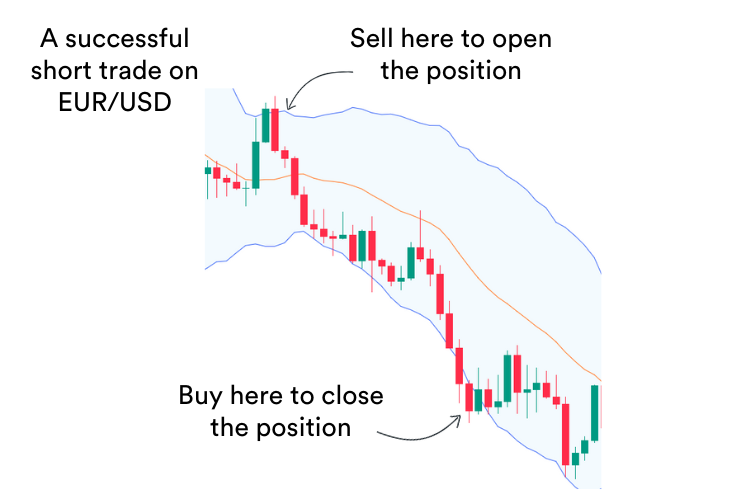

## Table of Contents

## What is a USD short position in currency trading?

A USD short position in currency trading means you are betting that the value of the US dollar will go down compared to another currency. When you take a short position, you sell US dollars now, hoping to buy them back later at a lower price. This is done in the foreign exchange market, where currencies are traded in pairs, like USD/EUR or USD/JPY.

For example, if you think the US dollar will weaken against the Euro, you might sell USD and buy EUR. If the exchange rate moves in your favor and the US dollar does weaken, you can then buy back the US dollars at a lower rate, making a profit from the difference. However, if the US dollar strengthens instead, you will lose money because you will have to buy back the dollars at a higher rate than you sold them.

## Why might someone take a short position on the USD?

Someone might take a short position on the USD if they believe the US dollar will lose value compared to other currencies. This belief could come from many things, like economic news, changes in interest rates, or even political events. For example, if the US economy is not doing well, people might think the dollar will go down. Or if another country's economy is doing better, people might want to switch to that country's currency, making the USD weaker.

Another reason could be if the US Federal Reserve decides to lower interest rates. When interest rates go down, it can make the US dollar less attractive to investors looking for good returns. So, if someone thinks this will happen, they might short the USD to make money from the expected drop in its value. It's all about trying to predict what will happen and making a move based on that prediction.

## How does one initiate a short position on the USD?

To start a short position on the USD, you need to use a trading platform where you can trade currencies. You'll look for a currency pair where the USD is the first currency, like USD/EUR or USD/JPY. When you see a pair like USD/EUR, it means you're trading US dollars for Euros. To short the USD, you'll sell this pair. That means you're selling US dollars and buying the other currency, like Euros, hoping the US dollar will go down in value.

Once you decide to short the USD, you'll enter your trade on the platform. You'll choose how many US dollars you want to sell and at what price. If the US dollar does go down compared to the other currency, you can buy back the same amount of US dollars later at a lower price. The difference between the price you sold at and the price you bought back at is your profit. But remember, if the US dollar goes up instead, you'll lose money because you'll have to buy it back at a higher price.

## What are the risks associated with shorting the USD?

Shorting the USD can be risky. The biggest risk is that the US dollar might go up in value instead of going down. If this happens, you will lose money because you have to buy back the US dollars at a higher price than you sold them. This can lead to big losses, especially if the dollar goes up a lot.

Another risk is that currency markets can be very unpredictable. Things like news, economic reports, or even unexpected events can make the value of the USD change quickly. If you're not ready for these changes, you could lose money fast. It's important to keep an eye on what's happening and be ready to act if things don't go as planned.

## What economic indicators should be monitored when shorting the USD?

When you're thinking about shorting the USD, you should keep an eye on a few important economic indicators. One big one is the [interest rate](/wiki/interest-rate-trading-strategies) set by the US Federal Reserve. If they lower the interest rate, it might make the US dollar less attractive to investors, which could make its value go down. Another thing to watch is the US employment data, like the unemployment rate and job growth numbers. If these numbers are not good, it might mean the US economy is slowing down, which could also make the USD weaker.

Also, you should look at the Gross Domestic Product (GDP) of the US. If the GDP growth is slow or negative, it might mean the economy is not doing well, which could lead to a weaker USD. Another important indicator is the Consumer Price Index (CPI), which shows inflation. If inflation is high, it might make the US dollar less valuable. Keeping an eye on these indicators can help you make better decisions about when to short the USD.

## How do interest rates affect the decision to short the USD?

Interest rates set by the US Federal Reserve can really affect whether you should short the USD. If the Fed decides to lower interest rates, it makes the US dollar less attractive to people who want to invest their money. When interest rates are low, people might move their money to other countries where they can get better returns. This can make the value of the USD go down. So, if you think the Fed is going to lower rates, it might be a good time to short the USD because you expect its value to drop.

On the other hand, if the Fed raises interest rates, it can make the US dollar more attractive. Higher interest rates mean better returns for people who invest in the US, which can make more people want to buy US dollars. This can make the value of the USD go up. If you think the Fed is going to raise rates, it might not be a good time to short the USD because its value could go up instead of down. Keeping an eye on what the Fed is doing with interest rates can help you decide when to short the USD.

## What are some common strategies for managing a USD short position?

One common strategy for managing a USD short position is setting a stop-loss order. This means you decide on a price where you will automatically close your position if the USD starts to go up instead of down. This helps limit how much money you could lose if things don't go as planned. Another strategy is to keep an eye on economic news and indicators, like interest rates and employment data. If you see signs that the USD might go up, you might want to close your position early to avoid losing money.

Another strategy is to use a take-profit order. This means you set a price where you will automatically close your position if the USD goes down to that level, locking in your profit. This can help you make sure you don't miss out on gains if the USD drops quickly. It's also a good idea to not put all your money into one trade. By spreading your money across different trades, you can reduce the risk of losing a lot if the USD doesn't go down like you thought it would.

## How does global economic stability influence USD short positions?

Global economic stability can really affect whether you should short the USD. If the world economy is doing well, people might want to invest in other countries where they can get good returns. This can make the US dollar weaker because fewer people want to hold onto it. So, if you think the global economy is going to be stable or get better, it might be a good time to short the USD because you expect its value to go down compared to other currencies.

On the other hand, if the global economy is not doing well, people might see the US dollar as a safe place to keep their money. This can make the USD stronger because more people want to buy it. If you think the world economy is going to be unstable or get worse, it might not be a good time to short the USD because its value could go up instead of down. Keeping an eye on what's happening around the world can help you decide when to short the USD.

## What role do geopolitical events play in deciding to short the USD?

Geopolitical events can have a big impact on whether you should short the USD. If there's a lot of uncertainty or trouble in the world, like wars or big political changes, people might see the US dollar as a safe place to keep their money. This can make the USD stronger because more people want to buy it. So, if you think there will be a lot of geopolitical trouble, it might not be a good time to short the USD because its value could go up.

On the other hand, if things are calm and stable around the world, people might want to invest in other countries where they can get good returns. This can make the US dollar weaker because fewer people want to hold onto it. So, if you think the world will be peaceful and stable, it might be a good time to short the USD because you expect its value to go down compared to other currencies. Keeping an eye on what's happening around the world can help you decide when to short the USD.

## How can technical analysis be used to optimize entry and exit points for a USD short position?

Technical analysis can help you find the best times to start and end a USD short position by looking at charts and patterns. You can use tools like moving averages, which smooth out price changes over time, to see if the USD is trending down. If the short-term moving average crosses below the long-term moving average, it might be a good time to start your short position. You can also look at support and resistance levels, which are like floors and ceilings for the price. If the USD breaks below a support level, it could be a sign to short the USD.

Another way to use technical analysis is by looking at indicators like the Relative Strength Index (RSI) or the Moving Average Convergence Divergence (MACD). The RSI can tell you if the USD is overbought or oversold, which might mean it's time to short or close your position. If the RSI is above 70, the USD might be overbought and ready to go down, so you could start your short position. If it's below 30, it might be oversold and ready to go up, so you might want to close your short position. The MACD can show you when the trend might be changing, helping you decide when to enter or [exit](/wiki/exit-strategy) your trade. By using these tools, you can make better choices about when to short the USD and when to take your profits or cut your losses.

## What are the tax implications of profits from shorting the USD?

When you make money from shorting the USD, you have to think about taxes. In the United States, the money you make from trading currencies is usually seen as regular income. This means you'll pay taxes on it at the same rate as your other income, like money from your job. The exact amount of tax you'll pay depends on how much money you make in total and what tax bracket you're in. It's a good idea to keep good records of all your trades so you can report your earnings correctly when you do your taxes.

If you live outside the United States, the tax rules can be different. In some countries, profits from currency trading might be taxed as capital gains instead of regular income. This can mean you pay a lower tax rate on your profits. But, you'll need to check the tax laws in your country to know for sure. No matter where you live, it's smart to talk to a tax professional who can help you understand how to handle your taxes when you make money from shorting the USD.

## How do advanced traders use options and futures to hedge or leverage their USD short positions?

Advanced traders often use options and futures to either protect their USD short positions or to make them bigger. When they want to protect their position, they might buy options. Options give them the right, but not the obligation, to buy or sell the USD at a certain price in the future. If the USD goes up instead of down, the trader can use the option to limit their losses. For example, if they short the USD and it starts to rise, they can use a call option to buy the USD back at the price they set, which helps them not lose as much money.

On the other hand, if traders want to make their USD short position bigger, they might use futures. Futures are contracts to buy or sell the USD at a set price on a specific date in the future. By using futures, traders can control a larger amount of USD with less money upfront. This can make their potential profits bigger if the USD goes down like they expect. But it also means their potential losses can be bigger if the USD goes up instead. So, using futures can be a way to try to make more money, but it comes with more risk.

## References & Further Reading

[1]: Bergstra, J., Bardenet, R., Bengio, Y., & Kégl, B. (2011). ["Algorithms for Hyper-Parameter Optimization."](https://dl.acm.org/doi/10.5555/2986459.2986743) Advances in Neural Information Processing Systems 24.

[2]: ["Advances in Financial Machine Learning"](https://www.amazon.com/Advances-Financial-Machine-Learning-Marcos/dp/1119482089) by Marcos Lopez de Prado

[3]: ["Evidence-Based Technical Analysis: Applying the Scientific Method and Statistical Inference to Trading Signals"](https://www.amazon.com/Evidence-Based-Technical-Analysis-Scientific-Statistical/dp/0470008741) by David Aronson

[4]: ["Machine Learning for Algorithmic Trading"](https://github.com/stefan-jansen/machine-learning-for-trading) by Stefan Jansen

[5]: ["Quantitative Trading: How to Build Your Own Algorithmic Trading Business"](https://www.amazon.com/Quantitative-Trading-Build-Algorithmic-Business/dp/1119800064) by Ernest P. Chan