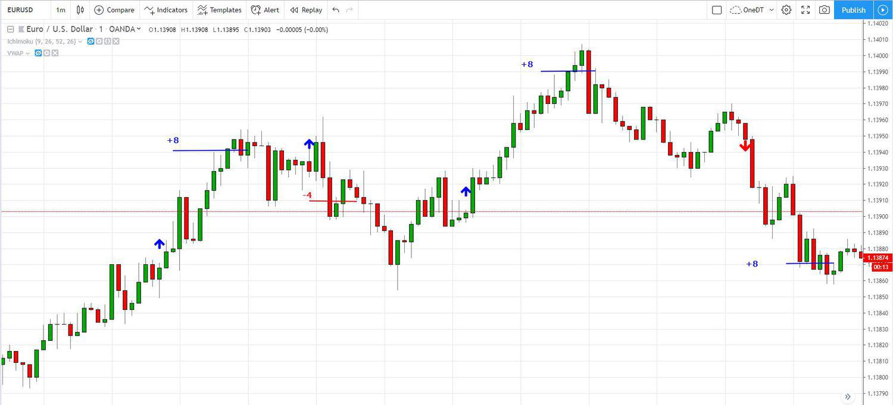

Foreign exchange currency trading, commonly referred to as forex trading, is the act of buying and selling currencies within a highly dynamic, global marketplace that remains decentralized and functions continuously, 24 hours a day. This vast market, where currencies are priced relative to one another, plays a crucial role in global economics by determining exchange rates and enabling international trade and investment.

In recent years, USD shorts have garnered significant attention among traders. This strategy involves selling the U.S. dollar against other currencies, reflecting a broader expectation of a decline in its value. Such anticipation can stem from various factors, including changes in economic indicators like inflation rates, interest rates, and geopolitical developments.



Simultaneously, algorithmic trading, often abbreviated as algo trading, is increasingly transforming forex trading. By utilizing computer algorithms, trades can be executed with unmatched efficiency and precision. These algorithms are designed to process vast amounts of market data rapidly, identify trading signals, and execute trades without human intervention. This process minimizes the emotional biases that often lead to irrational trading decisions and maximizes the opportunities across different trading conditions.

This article explores the intersection of USD short strategies with forex algo trading, encompassing the technical mechanics behind these strategies, the benefits they can offer, and potential challenges traders might face. This convergence signifies a strategic shift in forex markets, offering new pathways for traders seeking to capitalize on currency movements with accuracy and speed. As forex trading evolves, understanding and leveraging these strategies can profoundly impact financial outcomes.

## Table of Contents

## Understanding USD Shorts in Forex

USD shorts involve selling the U.S. dollar (USD) against other currencies, a strategy employed by traders who predict a depreciation in the value of the dollar. This approach is executed through short selling, which is a method used to capitalize on the anticipated decline in the price of an asset—in this case, the USD.

**Short Selling Mechanics**: Short selling in forex involves borrowing a currency pair and selling it at the current market price with the intention of buying it back later at a lower price, thereby making a profit from the difference. The concept is straightforward but requires careful analysis and precise execution. 

**Currency Pair Dynamics**: In forex markets, currencies are always traded in pairs, such as EUR/USD or GBP/USD. The first currency in the pair is the base currency, and the second is the quote currency. When traders short the USD, they sell a currency pair where USD is the quote currency, such as EUR/USD. A short position on EUR/USD would involve selling USD in anticipation of its decline relative to the Euro.

**Influencing Factors**: The value of the U.S. dollar is influenced by various economic indicators and monetary policies. Key indicators include:

1. **Interest Rates**: Changes in interest rates by the Federal Reserve can impact the USD's value. Higher interest rates typically attract foreign investments, increasing demand for USD, and vice versa.

2. **Inflation Rates**: Inflation differences between the U.S. and other countries can affect the USD's purchasing power, influencing its value relative to other currencies.

3. **Economic Data**: Indicators such as GDP growth rates, employment figures, and manufacturing output provide insights into the economy's health, impacting investor sentiment and the USD's strength or weakness.

4. **Current Account Deficits**: A substantial deficit indicates that a country is spending more on foreign trade than it is earning, leading to borrowing foreign capital to make up the difference, which can devalue the currency.

5. **Geopolitical Stability and Confidence**: Political stability and economic policy consistency can have significant effects on the U.S. dollar's value.

Understanding these components helps traders anticipate movements in the USD's value and strategically position themselves in the market. While USD shorts can present substantial opportunities, they also come with risks due to factors like market [volatility](/wiki/volatility-trading-strategies) and unforeseen economic changes that can lead to currency appreciation against traders' expectations. Therefore, a deep understanding of both market mechanics and economic indicators is essential for effectively implementing USD short strategies in the [forex](/wiki/forex-system) market.

## What is Forex Algo Trading?

Forex algo trading is the use of sophisticated computer algorithms to automate the execution of foreign exchange trades based on predefined criteria. This innovative approach leverages computational power, enabling the swift processing of market data to pinpoint trading opportunities and execute trades with minimal human intervention. 

The primary advantage of forex algo trading lies in its speed and efficiency. Algorithms can analyze vast quantities of market data in fractions of a second, identifying patterns and trends that may not be immediately apparent to human traders. Once a trading signal is generated based on the criteria set within the algorithm, the trade is executed automatically. This automation significantly reduces the influence of human emotions, such as fear and greed, which can often lead to suboptimal trading decisions.

The increased prevalence of [machine learning](/wiki/machine-learning) and [artificial intelligence](/wiki/ai-artificial-intelligence) in financial markets has further enhanced the capabilities of [algorithmic trading](/wiki/algorithmic-trading) systems. Through machine learning algorithms, these systems can adapt to changing market conditions and improve over time by learning from past trading data. This adaptability makes algo trading particularly attractive to both institutional and individual traders seeking a competitive edge in the forex market.

The accessibility of forex algo trading to individual traders has grown with advancements in technology and trading platforms. Retail traders can now utilize platforms that support algorithmic trading, such as MetaTrader or cTrader, to develop and deploy their own trading strategies. These platforms often provide users with tools to create and backtest algorithms, enabling traders to evaluate the performance of their strategies before committing to live trading.

In essence, forex algo trading combines the analytical power of computers with strategic trading insights, offering a method that is both fast and devoid of emotional biases. As technology continues to evolve, the scope and potential of algorithmic trading in the forex market are likely to expand further, offering new opportunities for traders at all levels.

## Benefits of Combining USD Shorts with Algo Trading

Combining USD short strategies with algo trading empowers traders to access and respond to market opportunities with unprecedented speed and efficiency. Algorithms can rapidly process vast amounts of forex market data, enabling them to identify trading opportunities that might elude human traders due to the sheer complexity and [volume](/wiki/volume-trading-strategy) of available information. These algorithms can execute trades in fractions of a second, capitalizing on minor price movements that are often too fleeting for manual intervention.

A key advantage of using algorithmic trading for USD shorts is its ability to minimize the role of human emotions in trading decisions. Emotional biases, such as fear and greed, can lead to suboptimal trading outcomes. By relying on predefined criteria and automated processes, algo traders can avoid the pitfalls associated with emotional decision-making. This is particularly beneficial in rapidly fluctuating markets where emotional responses might lead to panic selling or the reluctance to [exit](/wiki/exit-strategy) a losing trade.

Furthermore, algorithmic trading can be particularly effective in exploiting [arbitrage](/wiki/arbitrage) opportunities. In a highly liquid market like forex, small discrepancies in currency prices across different markets can be swiftly identified and acted upon by algorithms. This capability allows traders to gain an edge in executing USD short strategies more successfully.

Overall, combining USD shorts with algo trading can significantly enhance the precision and timing of trades, translating into improved profitability and reduced risk. However, traders must ensure that their algorithms are robust and well-tested in various market conditions to fully harness these benefits.

## Challenges and Risks of Forex Algo Trading

Forex algorithmic trading presents unique challenges and risks that traders must navigate to ensure successful execution. A key challenge arises from market volatility, which can hinder the effectiveness of algorithms. Algorithms typically rely on historical data to predict future market movements. However, markets are dynamic, and past conditions may not accurately reflect future scenarios. This underscores the risk of overfitting—when an algorithm is excessively tailored to historical data and fails to perform under real-time market conditions.

Overfitting can lead to erroneous trading decisions as the algorithm may misinterpret data patterns that do not recur. The predictive model may excel in a backtest but falter when faced with unforeseen events or structural market changes. To mitigate this, it is crucial to incorporate models that account for a range of market conditions, potentially using techniques such as regularization to prevent overfitting.

Technical and infrastructure challenges also pose significant risks. Algo trading relies heavily on robust systems and uninterrupted network connections. Any technical failure, whether due to server crashes, power outages, or network disruptions, can lead to substantial financial losses. For example, if an algorithm is unable to access real-time data, its trading decisions may quickly become obsolete. 

To address these issues, traders can implement several strategies. Regular system maintenance, redundant backups, and failover protocols ensure that trading systems remain operational despite failures. Additionally, utilizing cloud-based infrastructure can provide scalability and reliability, reducing the likelihood of system downtimes. 

Python provides a rich set of libraries, such as `scikit-learn`, which can aid in developing more adaptive models and in conducting rigorous [backtesting](/wiki/backtesting) to identify potential vulnerabilities. Here is a basic example of how to implement a train-test split to assess an algorithm's performance:

```python
import pandas as pd
from sklearn.model_selection import train_test_split
from sklearn.linear_model import LinearRegression
from sklearn.metrics import mean_squared_error

# Sample data
data = pd.read_csv('forex_data.csv')
X = data[['feature1', 'feature2']]
y = data['target']

# Split data into training and testing sets
X_train, X_test, y_train, y_test = train_test_split(X, y, test_size=0.2, random_state=42)

# Train a simple linear regression model
model = LinearRegression()
model.fit(X_train, y_train)

# Predict and evaluate the model
predictions = model.predict(X_test)
mse = mean_squared_error(y_test, predictions)
print(f'Mean Squared Error: {mse}')
```

This model provides a baseline for understanding market behavior, but risk management measures must always accompany algorithm deployment. Traders need continuous evaluation and adaptation of strategies to align with ever-evolving market conditions.

## How to Implement a USD Shorts Algo Trading Strategy

To implement a USD shorts algorithmic trading strategy, traders must begin by crafting a robust forex trading plan specifically centered around short-selling the U.S. dollar, which is based on market predictions that suggest a depreciation of the USD. This involves understanding the intricate dynamics of forex markets and the factors affecting currency movements, such as economic indicators, geopolitical events, and monetary policies.

Selecting the appropriate trading platform is vital. Platforms like MetaTrader 4 or 5, cTrader, and other specialized algorithmic trading platforms are popular choices. These platforms support algorithmic trading and offer a variety of features, including advanced charting tools, automated trading capabilities through custom scripts (Expert Advisors or cBots), and compatibility with numerous forex brokers. For example, in MetaTrader, traders can develop automated strategies using MQL4 or MQL5 scripting languages, while cTrader uses its own C# based language, cAlgo.

The process of backtesting is critical in ensuring the effectiveness of an algorithm before deploying it in live trading environments. Backtesting involves running the algorithm through historical market data to evaluate its performance and refine it accordingly. This helps identify potential flaws and optimize the strategy for various market conditions. An example of a simple backtesting procedure using Python with a library like Backtrader can be illustrated as follows:

```python
import backtrader as bt

class USDShortStrategy(bt.Strategy):
    def __init__(self):
        self.sma = bt.indicators.SimpleMovingAverage(self.data.close, period=20)

    def next(self):
        if self.data.close[0] < self.sma[0]:
            self.sell(size=10)  # Short position
        elif self.data.close[0] > self.sma[0]:
            self.close()  # Exit position

if __name__ == '__main__':
    data = bt.feeds.YahooFinanceData(dataname='EURUSD=X', fromdate=datetime(2020, 1, 1),
                                     todate=datetime(2021, 1, 1))
    cerebro = bt.Cerebro()
    cerebro.addstrategy(USDShortStrategy)
    cerebro.adddata(data)
    cerebro.run()
    cerebro.plot()
```

This script defines a simple strategy where the algorithm initiates short positions if the closing price of the currency pair is below the 20-period simple moving average, and exits when it moves above. Such strategies can be complexified and tailored to include more sophisticated indicators and risk management protocols.

Moreover, refining the strategy through rigorous testing and adjustments is necessary to ensure it adapitates to various conditions, reducing risks associated with overfitting to past market data. Thus, traders need to continuously monitor and update their algorithms based on real-time market feedback and ensure robust technical infrastructure to mitigate potential disruptions during trading operations. By following these steps, traders can effectively deploy a USD shorts algorithmic trading strategy that capitalizes on predicted downturns of the US dollar.

## Conclusion

USD shorts in forex trading can be effectively executed through algo trading, providing a strategic edge in a fast-paced market environment. Algo trading facilitates swift decision-making and execution, minimizing the lag usually associated with manual trading. This capability is especially crucial when dealing with volatile currency pairs, where the U.S. dollar might sharply depreciate. By employing algorithms, traders can systematically implement USD short strategies, capitalizing on brief price fluctuations which are often imperceptible to human traders.

Despite these advantages in speed and emotion-free execution, traders must remain vigilant about the inherent challenges of forex algo trading. Algorithms are only as robust as their design allows. If not continually refined, they may fail to adapt to unforeseen market conditions or anomalies. This susceptibility necessitates regular updates and optimizations, alongside vigilant monitoring to ensure performance consistency in various market environments.

Additionally, success in combining USD shorts with algo trading hinges on proper education and risk management. Understanding the intricacies of algorithm design, coupled with sound risk management practices, can significantly enhance trading outcomes. Educational resources and simulation platforms can aid traders in honing their skills and strategies without the financial risks of live trading.

In conclusion, the convergence of USD shorts with algo trading presents a potent opportunity for forex traders aiming to achieve their financial objectives. By leveraging technology, maintaining discipline in strategy refinement, and applying rigorous risk management, traders can harness these tools effectively to navigate the complexities of the forex market.

## References & Further Reading

[1]: Bergstra, J., Bardenet, R., Bengio, Y., & Kégl, B. (2011). ["Algorithms for Hyper-Parameter Optimization."](https://dl.acm.org/doi/10.5555/2986459.2986743) Advances in Neural Information Processing Systems 24.

[2]: ["Advances in Financial Machine Learning"](https://www.amazon.com/Advances-Financial-Machine-Learning-Marcos/dp/1119482089) by Marcos Lopez de Prado

[3]: ["Evidence-Based Technical Analysis: Applying the Scientific Method and Statistical Inference to Trading Signals"](https://www.amazon.com/Evidence-Based-Technical-Analysis-Scientific-Statistical/dp/0470008741) by David Aronson

[4]: ["Machine Learning for Algorithmic Trading"](https://github.com/stefan-jansen/machine-learning-for-trading) by Stefan Jansen

[5]: ["Quantitative Trading: How to Build Your Own Algorithmic Trading Business"](https://www.amazon.com/Quantitative-Trading-Build-Algorithmic-Business/dp/1119800064) by Ernest P. Chan